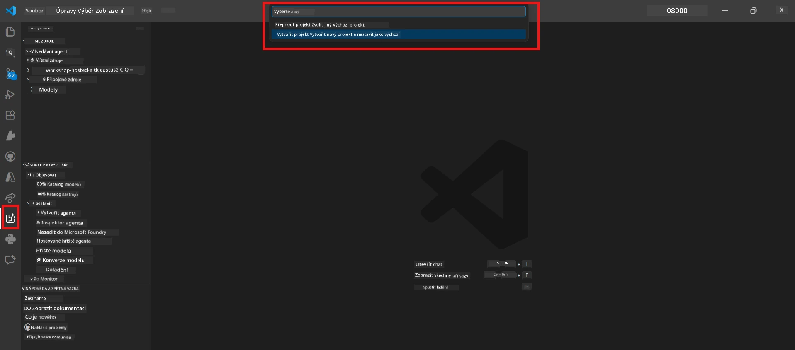
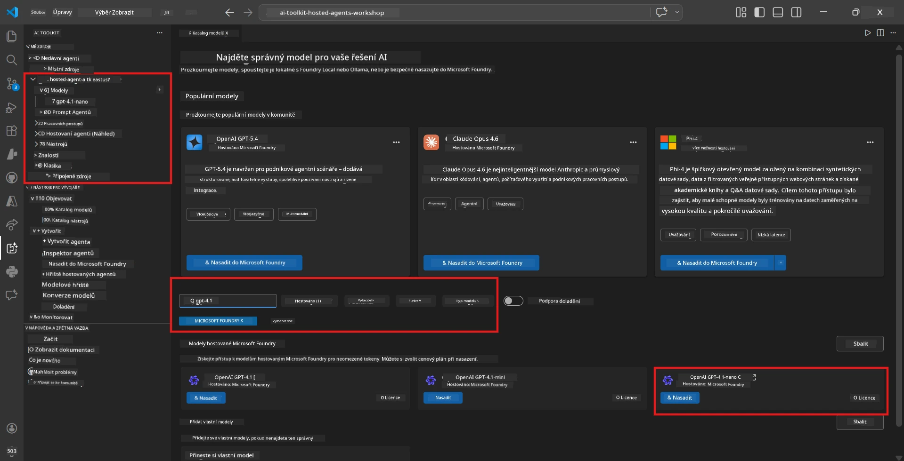
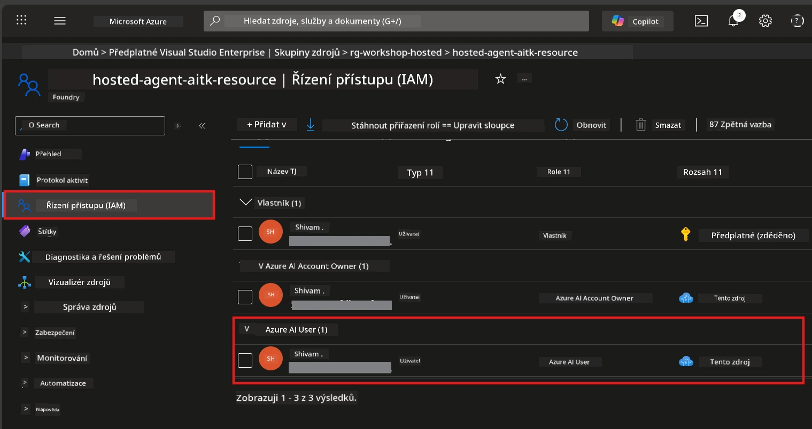

# Module 2 - Vytvoření projektu Foundry a nasazení modelu

V tomto modulu vytvoříte (nebo vyberete) Microsoft Foundry projekt a nasadíte model, který váš agent bude používat. Každý krok je napsán explicitně – postupujte podle nich v pořadí.

> Pokud již máte Foundry projekt s nasazeným modelem, přejděte na [Modul 3](03-create-hosted-agent.md).

---

## Krok 1: Vytvoření Foundry projektu ve VS Code

Použijete rozšíření Microsoft Foundry k vytvoření projektu, aniž byste opustili VS Code.

1. Stiskněte `Ctrl+Shift+P` pro otevření **Příkazové palety**.
2. Napište: **Microsoft Foundry: Create Project** a vyberte ji.
3. Zobrazí se rozbalovací nabídka – vyberte vaši **Azure subscription** ze seznamu.
4. Budete požádáni o výběr nebo vytvoření **resource group**:
   - Pro vytvoření nové: napište název (např. `rg-hosted-agents-workshop`) a stiskněte Enter.
   - Pro použití existující: vyberte ji z rozbalovacího seznamu.
5. Vyberte **region**. **Důležité:** Zvolte region, který podporuje hostované agenty. Zkontrolujte [dostupnost regionů](https://learn.microsoft.com/azure/foundry/agents/concepts/hosted-agents#region-availability) – běžné volby jsou `East US`, `West US 2` nebo `Sweden Central`.
6. Zadejte **název** projektu Foundry (např. `workshop-agents`).
7. Stiskněte Enter a počkejte na dokončení poskytování.

> **Poskytování trvá 2-5 minut.** V pravém dolním rohu VS Code se zobrazí oznámení o postupu. Během poskytování VS Code nezavírejte.

8. Po dokončení se v postranním panelu **Microsoft Foundry** zobrazí váš nový projekt pod **Resources**.
9. Klikněte na název projektu pro rozbalení a ověřte, že obsahuje sekce jako **Models + endpoints** a **Agents**.



### Alternativa: Vytvoření přes Foundry portál

Pokud preferujete práci přes prohlížeč:

1. Otevřete [https://ai.azure.com](https://ai.azure.com) a přihlaste se.
2. Na úvodní stránce klikněte na **Create project**.
3. Zadejte název projektu, vyberte subscription, resource group a region.
4. Klikněte na **Create** a počkejte na dokončení poskytování.
5. Po vytvoření se vraťte do VS Code – projekt by se měl po obnovení (klikněte na ikonu obnovit) objevit v postranním panelu Foundry.

---

## Krok 2: Nasazení modelu

Váš [hostovaný agent](https://learn.microsoft.com/azure/foundry/agents/concepts/hosted-agents) potřebuje Azure OpenAI model k generování odpovědí. Nyní [jeden nasadíte](https://learn.microsoft.com/azure/ai-foundry/openai/how-to/create-resource#deploy-a-model).

1. Stiskněte `Ctrl+Shift+P` pro otevření **Příkazové palety**.
2. Napište: **Microsoft Foundry: Open [Model Catalog](https://learn.microsoft.com/azure/ai-foundry/openai/concepts/models)** a vyberte ji.
3. Zobrazí se pohled Katalogu modelů ve VS Code. Procházejte nebo použijte vyhledávací panel k nalezení **gpt-4.1**.
4. Klikněte na kartu modelu **gpt-4.1** (nebo `gpt-4.1-mini`, pokud chcete nižší náklady).
5. Klikněte na **Deploy**.


6. V konfiguraci nasazení:
   - **Deployment name**: Nechte výchozí (např. `gpt-4.1`) nebo zadejte vlastní název. **Zapamatujte si tento název** – budete ho potřebovat v Modulu 4.
   - **Target**: Vyberte **Deploy to Microsoft Foundry** a zvolte právě vytvořený projekt.
7. Klikněte na **Deploy** a počkejte na dokončení nasazení (1-3 minuty).

### Výběr modelu

| Model | Nejvhodnější pro | Cena | Poznámky |
|-------|------------------|------|----------|
| `gpt-4.1` | Vysoce kvalitní, nuance odpovědí | Vyšší | Nejlepší výsledky, doporučeno pro finální testování |
| `gpt-4.1-mini` | Rychlé iterace, nižší cena | Nižší | Dobré pro vývoj workshopu a rychlé testování |
| `gpt-4.1-nano` | Lehká úkoly | Nejnižší | Nejefektivnější z hlediska nákladů, ale jednodušší odpovědi |

> **Doporučení pro tento workshop:** Používejte `gpt-4.1-mini` pro vývoj a testování. Je rychlý, levný a poskytuje dobré výsledky pro cvičení.

### Ověření nasazení modelu

1. V postranním panelu **Microsoft Foundry** rozbalte váš projekt.
2. Podívejte se do sekce **Models + endpoints** (nebo podobné).
3. Měli byste vidět nasazený model (např. `gpt-4.1-mini`) s stavem **Succeeded** nebo **Active**.
4. Klikněte na nasazení modelu pro zobrazení detailů.
5. **Poznamenejte si** tyto dvě hodnoty – budete je potřebovat v Modulu 4:

   | Nastavení | Kde je najít | Příklad hodnoty |
   |-----------|--------------|-----------------|
   | **Project endpoint** | Klikněte na název projektu v postranním panelu Foundry. URL endpointu je zobrazena v detailech. | `https://<account>.services.ai.azure.com/api/projects/<project>` |
   | **Model deployment name** | Název zobrazený vedle nasazeného modelu. | `gpt-4.1-mini` |

---

## Krok 3: Přiřazení potřebných RBAC rolí

Toto je **nejčastěji opomenutý krok**. Bez správných rolí nasazení v Modulu 6 selže s chybou oprávnění.

### 3.1 Přiřaďte si roli Azure AI User

1. Otevřete prohlížeč a přejděte na [https://portal.azure.com](https://portal.azure.com).
2. Do horního vyhledávacího pole napište název vašeho **Foundry projektu** a klikněte na něj ve výsledcích.
   - **Důležité:** Navigujte na **projektový** zdroj (typ: "Microsoft Foundry project"), **nikoli** na nadřazený účet/hub.
3. V levém menu projektu klikněte na **Access control (IAM)**.
4. Klikněte na tlačítko **+ Add** nahoře → vyberte **Add role assignment**.
5. Na kartě **Role** vyhledejte [**Azure AI User**](https://learn.microsoft.com/azure/foundry/concepts/rbac-foundry#built-in-roles) a vyberte jej. Klikněte na **Next**.
6. Na kartě **Members**:
   - Vyberte **User, group, or service principal**.
   - Klikněte na **+ Select members**.
   - Vyhledejte své jméno nebo e-mail, vyberte sebe a klikněte na **Select**.
7. Klikněte na **Review + assign** → poté znovu klikněte na **Review + assign** pro potvrzení.



### 3.2 (Volitelné) Přiřaďte roli Azure AI Developer

Pokud potřebujete vytvářet další zdroje v rámci projektu nebo spravovat nasazení programově:

1. Opakujte výše uvedené kroky, ale v kroku 5 vyberte **Azure AI Developer**.
2. Přiřaďte tuto roli na úrovni **Foundry resource (account)**, nikoli jen na úrovni projektu.

### 3.3 Ověření přiřazení rolí

1. Na stránce **Access control (IAM)** projektu klikněte na záložku **Role assignments**.
2. Vyhledejte své jméno.
3. Měli byste vidět minimálně roli **Azure AI User** přiřazenou v rozsahu projektu.

> **Proč je to důležité:** Role [`Azure AI User`](https://learn.microsoft.com/azure/foundry/concepts/rbac-foundry#built-in-roles) umožňuje akci dat `Microsoft.CognitiveServices/accounts/AIServices/agents/write`. Bez ní během nasazení uvidíte tuto chybu:
>
> ```
> Error: lacks the required data action 
> Microsoft.CognitiveServices/accounts/AIServices/agents/write 
> to perform POST /api/projects/{projectName}/assistants operation.
> ```
>
> Podrobnosti naleznete v [Modulu 8 - Odstraňování problémů](08-troubleshooting.md).

---

### Kontrolní seznam

- [ ] Projekt Foundry existuje a je viditelný v postranním panelu Microsoft Foundry ve VS Code
- [ ] Je nasazen alespoň jeden model (např. `gpt-4.1-mini`) se stavem **Succeeded**
- [ ] Poznamenali jste si URL **project endpoint** a **model deployment name**
- [ ] Máte přiřazenou roli **Azure AI User** na úrovni **projektu** (ověřte v Azure Portálu → IAM → Role assignments)
- [ ] Projekt je v [podporovaném regionu](https://learn.microsoft.com/azure/foundry/agents/concepts/hosted-agents#region-availability) pro hostované agenty

---

**Předchozí:** [01 - Instalace Foundry Toolkit](01-install-foundry-toolkit.md) · **Další:** [03 - Vytvoření hostovaného agenta →](03-create-hosted-agent.md)

---

<!-- CO-OP TRANSLATOR DISCLAIMER START -->
**Prohlášení o vyloučení odpovědnosti**:
Tento dokument byl přeložen pomocí AI překladatelské služby [Co-op Translator](https://github.com/Azure/co-op-translator). I když usilujeme o přesnost, mějte prosím na paměti, že automatické překlady mohou obsahovat chyby či nepřesnosti. Původní dokument v jeho mateřském jazyce by měl být považován za autoritativní zdroj. Pro kritické informace se doporučuje profesionální lidský překlad. Nejsme odpovědní za jakékoli nedorozumění nebo mylné výklady vyplývající z použití tohoto překladu.
<!-- CO-OP TRANSLATOR DISCLAIMER END -->