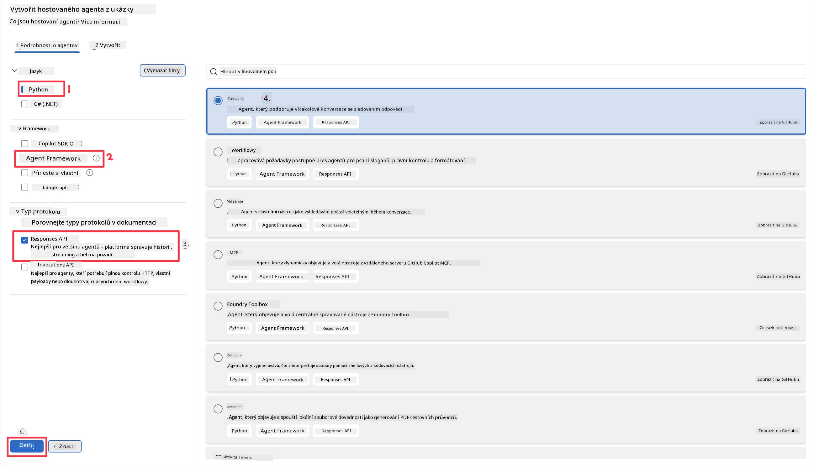
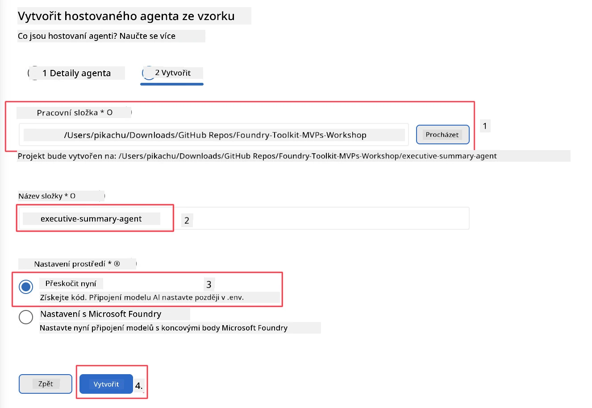

# Modul 2 - Vytvoření nového hostovaného agenta

⏱️ ~5 minut

V tomto modulu použijete Foundry Toolkit k **vytvoření projektu hostovaného agenta**. Scaffold vygeneruje celou strukturu projektu - `agent.yaml`, `main.py`, `Dockerfile`, `requirements.txt` a konfigurační soubor ladění pro VS Code - abyste se mohli zaměřit na přizpůsobení chování agenta.

> **Klíčový koncept:** Složka `agent/` v tomto labu je příkladem toho, co Foundry Toolkit generuje. Tyto soubory nemusíte psát od nuly.

### Průběh průvodce scaffoldingem

```mermaid
flowchart LR
    A["Command Palette:
    Create new Hosted Agent"] --> B["Language:
    Python"]
    B --> C["API type:
    Response API"]
    C --> D["Template:
    Basic - Agent Framework"]
    D --> E["Vybrat model"]
    E --> F["Workspace folder
    & agent name"]
    F --> G["Vygenerovaný projekt"]

    style A fill:#4A90D9,color:#fff
    style B fill:#7B68EE,color:#fff
    style C fill:#7B68EE,color:#fff
    style D fill:#7B68EE,color:#fff
    style E fill:#7B68EE,color:#fff
    style F fill:#7B68EE,color:#fff
    style G fill:#27AE60,color:#fff
```



---

## Krok 1: Otevřete průvodce Create Hosted Agent

1. Stiskněte `Ctrl+Shift+P` pro otevření **Command Palette**.
2. Napište: **Foundry Toolkit: Create new Hosted Agent** a vyberte ho.

> **Alternativa: Vytvoření přes Foundry Portal**
> Pokud preferujete prohlížeč, můžete svůj projekt vytvořit na [https://ai.azure.com](https://ai.azure.com). Jakmile bude projekt zprovozněn, vraťte se do VS Code a použijte postranní panel **Foundry Toolkit** pro připojení.

> **Alternativa:** Klikněte na ikonu **+** vedle **Hosted Agents (Preview)** v postranním panelu Foundry Toolkit.

## Krok 2: Vyberte nastavení



1. V levé navigaci/možnostech vyberte následující:

| Menu | Výběr | Poznámky |
|--------|-----------|-------|
| **Language** | Python | Podporován je také C# |
| **Framework** | Agent Framework | Jednoduchý výchozí bod pomocí Agent Framework SDK |
| **API type** | Response API | `POST /responses` - konverzační, s historií spravovanou platformou |
| **Template** | Basic | Jednoduchý výchozí bod pomocí Agent Framework SDK |

2. Po výběru klikněte na **Next**



3. V dalším okně vyberte následující:

| Menu | Výběr | Poznámky |
|--------|-----------|-------|
| **Workspace folder** | Vyberte cílovou složku | např. `/workspace/Foundry_Toolkit_for_VSCode_Lab/` nebo podsložka v tomto repozitáři |
| **Agent name** | Zadejte název | např. `executive-summary-agent` |
| **Environment Setup** | přeskočte nastavení prozatím |  |

Klikněte na **create** pro vytvoření agenta. Vytvoří se nová složka s názvem hostovaného agenta.

## Krok 3: Prohlédněte si vygenerovaný projekt

Po dokončení scaffoldu zkontrolujte, že v Průzkumníku (`Ctrl+Shift+E`) vidíte tyto soubory:

```
📂 my-agent/
├── .env                ← Environment variables (placeholders)
├── .vscode/
│   ├── launch.json     ← Debug config (F5 → run + Agent Inspector)
│   └── tasks.json      ← VS Code task definitions
├── agent.yaml          ← Agent definition (kind: hosted)
├── Dockerfile          ← Container config for deployment
├── main.py             ← Agent entry point (your main code)
└── requirements.txt    ← Python dependencies
```

### Vysvětlení klíčových souborů

| Soubor | Účel |
|------|---------|
| `agent.yaml` | Deklaruje agenta jako `kind: hosted`, mapuje proměnné prostředí, definuje protokol `/responses` |
| `main.py` | Vytváří `FoundryChatClient` → zabalí ho do `Agent` s instrukcemi → poskytuje přes `ResponsesHostServer` na portu 8088 |
| `Dockerfile` | Používá `python:3.12-slim`, instaluje závislosti, vystavuje port 8088, spouští `main.py` |
| `requirements.txt` | `agent-framework-foundry`, `agent-framework-foundry-hosting`, `mcp`, `debugpy` |

> **Důležité:** Otevřete vygenerovanou složku agenta přímo ve VS Code (složku `agent/` samotnou), aby `.vscode/launch.json` a `tasks.json` správně fungovaly pro ladění pomocí F5.

---

### ✅ Kontrolní bod

- [ ] Scaffoldovaný projekt vytvořen se všemi očekávanými soubory
- [ ] `agent.yaml` ukazuje `kind: hosted` a `protocol: responses`
- [ ] `main.py` importuje `Agent`, `FoundryChatClient`, `ResponsesHostServer`
- [ ] Složka agenta je otevřena ve VS Code jako kořen pracovního prostoru

---

**Předchozí:** [01 - Nastavení](01-setup.md) · **Další:** [03 - Konfigurace & Kódování →](03-configure-and-code.md)

---

<!-- CO-OP TRANSLATOR DISCLAIMER START -->
**Prohlášení o omezení odpovědnosti**:
Tento dokument byl přeložen pomocí AI překladatelské služby [Co-op Translator](https://github.com/Azure/co-op-translator). Přestože usilujeme o co největší přesnost, mějte prosím na paměti, že automatizované překlady mohou obsahovat chyby nebo nepřesnosti. Originální dokument v jeho mateřském jazyce by měl být považován za autoritativní zdroj. Pro kritické informace se doporučuje profesionální lidský překlad. Nejsme odpovědní za jakékoli nedorozumění nebo nesprávné interpretace vzniklé použitím tohoto překladu.
<!-- CO-OP TRANSLATOR DISCLAIMER END -->