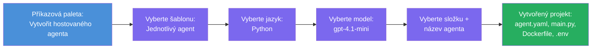

# Modul 3 - Vytvoření nového hostovaného agenta (automaticky vytvořeno rozšířením Foundry)

V tomto modulu použijete rozšíření Microsoft Foundry k **vytvoření nového projektu [hostovaného agenta](https://learn.microsoft.com/azure/foundry/agents/concepts/hosted-agents)**. Rozšíření pro vás vygeneruje celou strukturu projektu - včetně `agent.yaml`, `main.py`, `Dockerfile`, `requirements.txt`, souboru `.env` a konfigurace ladění ve VS Code. Po vytvoření kostry přizpůsobíte tyto soubory podle instrukcí, nástrojů a konfigurace svého agenta.

> **Klíčový koncept:** Složka `agent/` v tomto laboratorním cvičení je příkladem toho, co rozšíření Foundry vygeneruje, když spustíte příkaz pro vytvoření kostry. Tyto soubory nepíšete sami od začátku – rozšíření je vytvoří a vy je pak upravíte.

### Průběh průvodce vytvořením kostry


---

## Krok 1: Otevření průvodce Vytvořit hostovaného agenta

1. Stiskněte `Ctrl+Shift+P` pro otevření **Příkazové palety**.
2. Napište: **Microsoft Foundry: Create a New Hosted Agent** a vyberte tento příkaz.
3. Otevře se průvodce vytvořením hostovaného agenta.

> **Alternativní cesta:** Tento průvodce můžete také spustit z postranního panelu Microsoft Foundry → kliknutím na ikonu **+** vedle **Agents** nebo pravým kliknutím a výběrem **Create New Hosted Agent**.

---

## Krok 2: Výběr šablony

Průvodce si vyžádá výběr šablony. Uvidíte možnosti jako:

| Šablona | Popis | Kdy použít |
|----------|-------------|-------------|
| **Single Agent** | Jeden agent s vlastním modelem, instrukcemi a volitelnými nástroji | Toto cvičení (Lab 01) |
| **Multi-Agent Workflow** | Více agentů spolupracujících v posloupnosti | Lab 02 |

1. Vyberte **Single Agent**.
2. Klikněte na **Další** (nebo výběr proběhne automaticky).

---

## Krok 3: Výběr programovacího jazyka

1. Vyberte **Python** (doporučeno pro toto cvičení).
2. Klikněte na **Další**.

> **Podporováno je také C#**, pokud dáváte přednost .NET. Struktura kostry je podobná (místo `main.py` používá `Program.cs`).

---

## Krok 4: Výběr modelu

1. Průvodce ukáže modely nasazené ve vašem projektu Foundry (z Modulu 2).
2. Vyberte model, který jste nasadili – např. **gpt-4.1-mini**.
3. Klikněte na **Další**.

> Pokud nevidíte žádné modely, vraťte se k [Modulu 2](02-create-foundry-project.md) a nejprve jeden nasadíte.

---

## Krok 5: Výběr umístění složky a jména agenta

1. Otevře se dialogové okno pro výběr souboru – vyberte **cílovou složku**, kam se projekt vytvoří. Pro toto cvičení:
   - Pokud začínáte zcela nové: vyberte libovolnou složku (např. `C:\Projects\my-agent`)
   - Pokud pracujete uvnitř repozitáře workshopu: vytvořte novou podsložku pod `workshop/lab01-single-agent/agent/`
2. Zadejte **jméno** hostovaného agenta (např. `executive-summary-agent` nebo `my-first-agent`).
3. Klikněte na **Vytvořit** (nebo stiskněte Enter).

---

## Krok 6: Počkejte na dokončení tvorby kostry

1. VS Code otevře **nové okno** s vytvořeným projektem.
2. Počkejte několik vteřin, než se projekt plně načte.
3. V panelu Průzkumníka (`Ctrl+Shift+E`) byste měli vidět následující soubory:

```
📂 my-first-agent/
├── .env                ← Environment variables (auto-generated with placeholders)
├── .vscode/
│   └── launch.json     ← Debug configuration (F5 to run + Agent Inspector)
├── agent.yaml          ← Agent definition (kind: hosted)
├── Dockerfile          ← Container configuration for deployment
├── main.py             ← Agent entry point (your main code file)
└── requirements.txt    ← Python dependencies
```

> **Toto je stejná struktura jako složka `agent/`** v tomto cvičení. Rozšíření Foundry tyto soubory generuje automaticky – nemusíte je vytvářet ručně.

> **Poznámka k workshopu:** Ve struktuře tohoto repozitáře je složka `.vscode/` umístěna v **kořeni pracovní plochy** (nikoliv uvnitř každého projektu). Obsahuje sdílené `launch.json` a `tasks.json` se dvěma konfiguracemi ladění – **"Lab01 - Single Agent"** a **"Lab02 - Multi-Agent"** – každá ukazuje na správné pracovní adresáře příslušných laboratoří. Když stisknete F5, vyberte si konfiguraci odpovídající laboratoři, na které pracujete.

---

## Krok 7: Pochopení každého vygenerovaného souboru

Zastavte se na chvíli a prohlédněte si každý soubor, který průvodce vytvořil. Jejich pochopení je důležité pro Modul 4 (přizpůsobení).

### 7.1 `agent.yaml` - Definice agenta

Otevřete `agent.yaml`. Vypadá takto:

```yaml
# yaml-language-server: $schema=https://raw.githubusercontent.com/microsoft/AgentSchema/refs/heads/main/schemas/v1.0/ContainerAgent.yaml

kind: hosted
name: my-first-agent
description: >
  A hosted agent deployed to Microsoft Foundry Agent Service.
metadata:
  authors:
    - Microsoft
  tags:
    - Azure AI AgentServer
    - Microsoft Agent Framework
    - Hosted Agent
protocols:
  - protocol: responses
    version: v1
environment_variables:
  - name: AZURE_AI_PROJECT_ENDPOINT
    value: ${PROJECT_ENDPOINT}
  - name: AZURE_AI_MODEL_DEPLOYMENT_NAME
    value: ${MODEL_DEPLOYMENT_NAME}
dockerfile_path: Dockerfile
resources:
  cpu: '0.25'
  memory: 0.5Gi
```

**Klíčová pole:**

| Pole | Účel |
|-------|---------|
| `kind: hosted` | Označuje, že jde o hostovaného agenta (běžícího v kontejneru, nasazeného do [Foundry Agent Service](https://learn.microsoft.com/azure/foundry/agents/overview)) |
| `protocols: responses v1` | Agent vystavuje HTTP endpoint `/responses` kompatibilní s OpenAI |
| `environment_variables` | Mapování hodnot `.env` na proměnné prostředí kontejneru při nasazení |
| `dockerfile_path` | Ukazuje na Dockerfile, který se používá pro vytvoření kontejnerového obrazu |
| `resources` | Přidělení CPU a paměti kontejneru (0.25 CPU, 0.5Gi paměti) |

### 7.2 `main.py` - Vstupní bod agenta

Otevřete `main.py`. Toto je hlavní Python soubor, kde je logika vašeho agenta. Kostra obsahuje:

```python
from agent_framework.azure import AzureAIAgentClient
from azure.ai.agentserver.agentframework import from_agent_framework
from azure.identity.aio import DefaultAzureCredential
```

**Klíčové importy:**

| Import | Účel |
|--------|--------|
| `AzureAIAgentClient` | Připojuje se k vašemu Foundry projektu a vytváří agenty přes `.as_agent()` |
| [`DefaultAzureCredential`](https://learn.microsoft.com/azure/developer/python/sdk/authentication/credential-chains#defaultazurecredential-overview) | Zajišťuje autentizaci (Azure CLI, přihlášení ve VS Code, spravovaná identita nebo servisní účet) |
| `from_agent_framework` | Balí agent jako HTTP server, který vystavuje endpoint `/responses` |

Hlavní tok je:
1. Vytvoření přihlašovacích údajů → vytvoření klienta → zavolání `.as_agent()` pro získání agenta (asynchronní správce kontextu) → zabalení do serveru → spuštění

### 7.3 `Dockerfile` - Obrázek kontejneru

```dockerfile
FROM python:3.14-slim

WORKDIR /app

COPY ./ .

RUN pip install --upgrade pip && \
    if [ -f requirements.txt ]; then \
        pip install -r requirements.txt; \
    else \
        echo "No requirements.txt found" >&2; exit 1; \
    fi

EXPOSE 8088

CMD ["python", "main.py"]
```

**Klíčové detaily:**
- Používá základní obraz `python:3.14-slim`.
- Kopíruje všechny soubory projektu do `/app`.
- Aktualizuje `pip`, instaluje závislosti ze souboru `requirements.txt` a v případě chybějícího souboru se ihned zastaví.
- **Otevírá port 8088** - toto je povinný port pro hostované agenty. Neměňte ho.
- Spouští agenta příkazem `python main.py`.

### 7.4 `requirements.txt` - Závislosti

```
agent-framework-azure-ai==1.0.0rc3
agent-framework-core==1.0.0rc3
azure-ai-agentserver-agentframework==1.0.0b16
azure-ai-agentserver-core==1.0.0b16
debugpy
agent-dev-cli
```

| Balíček | Účel |
|---------|---------|
| `agent-framework-azure-ai` | Integrace Azure AI do Microsoft Agent Framework |
| `agent-framework-core` | Jádro runtime pro tvorbu agentů (obsahuje `python-dotenv`) |
| `azure-ai-agentserver-agentframework` | Runtime serveru hostovaného agenta pro Foundry Agent Service |
| `azure-ai-agentserver-core` | Základní abstrakce serveru agenta |
| `debugpy` | Podpora ladění Pythonu (umožňuje ladění pomocí F5 ve VS Code) |
| `agent-dev-cli` | Lokální vývojové rozhraní pro testování agentů (používáno v ladicích/spouštěcích konfiguracích) |

---

## Porozumění protokolu agenta

Hostovaní agenti komunikují pomocí protokolu **OpenAI Responses API**. Při běhu (lokálně nebo v cloudu) agent vystavuje jediný HTTP endpoint:

```
POST http://localhost:8088/responses
Content-Type: application/json

{
  "input": "Your prompt here",
  "stream": false
}
```

Foundry Agent Service volá tento endpoint, aby posílal uživatelské požadavky a přijímal odpovědi agenta. Tento stejný protokol používá OpenAI API, takže váš agent je kompatibilní s libovolným klientem, který umí komunikovat ve formátu OpenAI Responses.

---

### Kontrolní bod

- [ ] Průvodce tvorbou kostry proběhl úspěšně a otevřelo se **nové okno VS Code**
- [ ] Vidíte všech 5 souborů: `agent.yaml`, `main.py`, `Dockerfile`, `requirements.txt`, `.env`
- [ ] Soubor `.vscode/launch.json` existuje (umožňuje ladění F5 - v tomto workshopu je v kořeni workspace s konfiguračními sazbami pro konkrétní laboratoře)
- [ ] Pročetli jste každý soubor a rozumíte jeho účelu
- [ ] Rozumíte, že port `8088` je povinný a endpoint `/responses` je protokol

---

**Předchozí:** [02 - Vytvořit Foundry projekt](02-create-foundry-project.md) · **Další:** [04 - Konfigurace a kódování →](04-configure-and-code.md)

---

<!-- CO-OP TRANSLATOR DISCLAIMER START -->
**Prohlášení o vyloučení odpovědnosti**:
Tento dokument byl přeložen pomocí AI překladatelské služby [Co-op Translator](https://github.com/Azure/co-op-translator). Přestože usilujeme o přesnost, vezměte prosím na vědomí, že automatické překlady mohou obsahovat chyby nebo nepřesnosti. Originální dokument v jeho mateřském jazyce by měl být považován za autoritativní zdroj. Pro kritické informace se doporučuje profesionální lidský překlad. Nejsme odpovědní za jakékoliv nedorozumění nebo nesprávné interpretace vyplývající z použití tohoto překladu.
<!-- CO-OP TRANSLATOR DISCLAIMER END -->