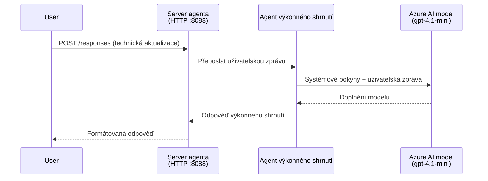
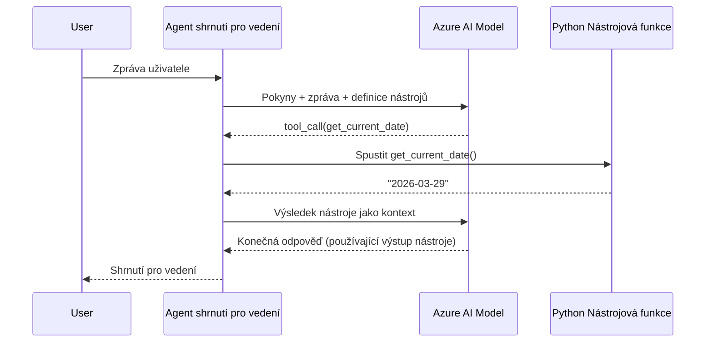

# Modul 4 - Konfigurace instrukcí, prostředí a instalace závislostí

V tomto modulu si přizpůsobíte automaticky vygenerované soubory agenta z Modulu 3. Zde přeměníte generický základ na **váš** agenta - tím, že napíšete instrukce, nastavíte proměnné prostředí, volitelně přidáte nástroje a nainstalujete závislosti.

> **Připomenutí:** Rozšíření Foundry automaticky vygenerovalo soubory vašeho projektu. Nyní je upravujete. Kompletní funkční příklad přizpůsobeného agenta najdete ve složce [`agent/`](../../../../../workshop/lab01-single-agent/agent).

---

## Jak komponenty spolupracují

### Životní cyklus požadavku (jeden agent)


> **S nástroji:** Pokud má agent registrované nástroje, model může vrátit místo přímé odpovědi volání nástroje. Framework spustí nástroj lokálně, výsledek předá zpět modelu a model pak vygeneruje finální odpověď.


---

## Krok 1: Konfigurace proměnných prostředí

Základ vygeneroval soubor `.env` s ukázkovými hodnotami. Musíte do něj doplnit skutečné hodnoty z Modulu 2.

1. Ve svém vygenerovaném projektu otevřete soubor **`.env`** (je v kořenovém adresáři projektu).
2. Nahraďte ukázkové hodnoty vašimi aktuálními údaji o Foundry projektu:

   ```env
   PROJECT_ENDPOINT=https://<your-account>.services.ai.azure.com/api/projects/<your-project>
   MODEL_DEPLOYMENT_NAME=gpt-4.1-mini
   ```

3. Soubor uložte.

### Kde najít tyto hodnoty

| Hodnota | Jak ji najít |
|---------|--------------|
| **Projektový endpoint** | Otevřete postranní panel **Microsoft Foundry** ve VS Code → klikněte na svůj projekt → URL endpointu je zobrazeno v detailním přehledu. Vypadá jako `https://<account-name>.services.ai.azure.com/api/projects/<project-name>` |
| **Název nasazení modelu** | Ve Foundry postranním panelu rozbalte svůj projekt → podívejte se pod **Models + endpoints** → vedle nasazeného modelu je uvedeno jméno (např. `gpt-4.1-mini`) |

> **Bezpečnost:** Soubor `.env` nikdy nezavazujte do verzovacího systému. Je standardně přidán do `.gitignore`. Pokud v něm není, přidejte ho:
> ```
> .env
> ```

### Jak proměnné prostředí procházejí

Řetězec mapování je: `.env` → `main.py` (čte přes `os.getenv`) → `agent.yaml` (při nasazení mapuje na proměnné prostředí kontejneru).

V `main.py` scaffold čte tyto hodnoty takto:

```python
PROJECT_ENDPOINT = os.getenv("AZURE_AI_PROJECT_ENDPOINT") or os.getenv("PROJECT_ENDPOINT")
MODEL_DEPLOYMENT_NAME = os.getenv("AZURE_AI_MODEL_DEPLOYMENT_NAME", os.getenv("MODEL_DEPLOYMENT_NAME", "gpt-4.1-mini"))
```

Jsou akceptovány obě proměnné `AZURE_AI_PROJECT_ENDPOINT` i `PROJECT_ENDPOINT` (v `agent.yaml` se používá prefix `AZURE_AI_*`).

---

## Krok 2: Napište instrukce agenta

To je nejdůležitější krok přizpůsobení. Instrukce definují osobnost agenta, chování, formát výstupu a bezpečnostní omezení.

1. Otevřete `main.py` ve vašem projektu.
2. Najděte řetězec s instrukcemi (scaffold obsahuje výchozí/generickou verzi).
3. Nahraďte ho podrobnými, strukturovanými instrukcemi.

### Co by měly dobré instrukce obsahovat

| Komponenta | Účel | Příklad |
|------------|-------|--------|
| **Role** | Co agent je a co dělá | "Jste agent pro výtahové shrnutí" |
| **Cílová skupina** | Pro koho jsou odpovědi určeny | "Vedoucí pracovníci s omezenými technickými znalostmi" |
| **Definice vstupu** | Jaký typ podnětů zpracovává | "Technické hlášení o incidentech, provozní aktualizace" |
| **Formát výstupu** | Přesná struktura odpovědí | "Výkonné shrnutí: - Co se stalo: ... - Dopad na podnikání: ... - Další krok: ..." |
| **Pravidla** | Omezení a podmínky odmítnutí | "NEPŘIDÁVEJTE informace nad rámec poskytnutých údajů" |
| **Bezpečnost** | Prevence zneužití a halucinací | "Pokud je vstup nejasný, požádejte o upřesnění" |
| **Příklady** | Vstupně/výstupní dvojice pro řízení chování | Zahrňte 2-3 příklady s různými vstupy |

### Příklad: Instrukce agenta výkonného shrnutí

Zde jsou instrukce použité na workshopu v [`agent/main.py`](../../../../../workshop/lab01-single-agent/agent/main.py):

```python
AGENT_INSTRUCTIONS = """You are an "Explain Like I'm an Executive" agent.

Purpose:
Your job is to translate complex technical or operational information into
clear, concise, and outcome-focused summaries that can be easily understood
by non-technical executives.

Audience:
Senior leaders with limited technical background who care about impact,
risk, and what happens next.

What you must do:
- Rephrase the input so it is understandable to a non-technical audience
- Prioritize clarity, brevity, and outcomes over technical accuracy
- Remove technical jargon, logs, metrics, stack traces, and deep root-cause details
- Translate technical causes into simple cause-and-effect statements
- Explicitly call out business impact
- Always include a clear next step or action
- Maintain a neutral, factual, and calm executive tone
- Do NOT add new facts or speculate beyond the input

Standard Output Structure (always use this wording):

Executive Summary:
- What happened: <plain-language description>
- Business impact: <clear, non-technical impact>
- Next step: <clear action or mitigation>

Rules:
- Keep responses under 100 words
- Do NOT add facts beyond the input
- If input is unclear, ask for clarification
"""
```

4. Nahraďte existující řetězec instrukcí v `main.py` vašimi vlastním instrukcemi.
5. Soubor uložte.

---

## Krok 3: (Volitelné) Přidejte vlastní nástroje

Hostovaní agenti mohou vykonávat **lokální Python funkce** jako [nástroje](https://learn.microsoft.com/azure/foundry/agents/concepts/tool-catalog). To je hlavní výhoda agentů založených na kódu oproti agentům jen s promptem – váš agent může spouštět libovolnou logiku na serveru.

### 3.1 Definujte funkci nástroje

Přidejte funkci nástroje do `main.py`:

```python
from agent_framework import tool

@tool
def get_current_date() -> str:
    """Returns the current date in YYYY-MM-DD format."""
    from datetime import date
    return str(date.today())
```

Dekorátor `@tool` promění standardní Python funkci v nástroj agenta. Docstring je popisem nástroje, který model vidí.

### 3.2 Zaregistrujte nástroj u agenta

Při vytváření agenta přes správce kontextu `.as_agent()` předejte nástroj v parametru `tools`:

```python
async with AzureAIAgentClient(
    project_endpoint=PROJECT_ENDPOINT,
    model_deployment_name=MODEL_DEPLOYMENT_NAME,
    credential=credential,
).as_agent(
    name="my-agent",
    instructions=AGENT_INSTRUCTIONS,
    tools=[get_current_date],
) as agent:
    server = from_agent_framework(agent)
    await server.run_async()
```

### 3.3 Jak fungují volání nástrojů

1. Uživatel pošle prompt.
2. Model rozhodne, zda je potřeba nástroj (na základě promptu, instrukcí a popisů nástrojů).
3. Pokud je nástroj potřeba, framework zavolá vaši Python funkci lokálně (v kontejneru).
4. Návratová hodnota nástroje je zaslána modelu jako kontext.
5. Model vygeneruje finální odpověď.

> **Nástroje se spouští na serveru** – běží ve vašem kontejneru, ne v uživatelově prohlížeči nebo modelu. To znamená, že můžete přistupovat k databázím, API, souborovým systémům nebo libovolným Python knihovnám.

---

## Krok 4: Vytvořte a aktivujte virtuální prostředí

Než nainstalujete závislosti, vytvořte izolované Python prostředí.

### 4.1 Vytvoření virtuálního prostředí

Otevřete terminál ve VS Code (`` Ctrl+` ``) a spusťte:

```powershell
python -m venv .venv
```

Tím se ve složce projektu vytvoří adresář `.venv`.

### 4.2 Aktivujte virtuální prostředí

**PowerShell (Windows):**

```powershell
.\.venv\Scripts\Activate.ps1
```

**Příkazový řádek (Windows):**

```cmd
.venv\Scripts\activate.bat
```

**macOS/Linux (Bash):**

```bash
source .venv/bin/activate
```

Měli byste na začátku terminálu vidět `(.venv)`, což značí, že virtuální prostředí je aktivní.

### 4.3 Instalace závislostí

S aktivním virtuálním prostředím nainstalujte požadované balíčky:

```powershell
pip install -r requirements.txt
```

Tím se nainstalují:

| Balíček | Účel |
|---------|------|
| `agent-framework-azure-ai==1.0.0rc3` | Integrace Azure AI pro [Microsoft Agent Framework](https://learn.microsoft.com/agent-framework/overview/) |
| `agent-framework-core==1.0.0rc3` | Jádro běhového prostředí pro tvorbu agentů (obsahuje `python-dotenv`) |
| `azure-ai-agentserver-agentframework==1.0.0b16` | Běhové prostředí hostovaného serveru agentů pro [Foundry Agent Service](https://learn.microsoft.com/azure/foundry/agents/overview) |
| `azure-ai-agentserver-core==1.0.0b16` | Hlavní abstrakce serveru agentů |
| `debugpy` | Debugging Pythonu (umožňuje ladění s F5 ve VS Code) |
| `agent-dev-cli` | Lokální vývojové CLI pro testování agentů |

### 4.4 Ověření instalace

```powershell
pip list | Select-String "agent-framework|agentserver"
```

Očekávaný výstup:
```
agent-framework-azure-ai   1.0.0rc3
agent-framework-core       1.0.0rc3
azure-ai-agentserver-agentframework 1.0.0b16
azure-ai-agentserver-core  1.0.0b16
```

---

## Krok 5: Ověřte autentizaci

Agent používá [`DefaultAzureCredential`](https://learn.microsoft.com/azure/developer/python/sdk/authentication/credential-chains#defaultazurecredential-overview), která zkouší více metod autentizace v tomto pořadí:

1. **Proměnné prostředí** - `AZURE_CLIENT_ID`, `AZURE_TENANT_ID`, `AZURE_CLIENT_SECRET` (service principal)
2. **Azure CLI** - využívá vaši přihlášenou relaci `az login`
3. **VS Code** - používá účet, kterým jste se přihlásili do VS Code
4. **Spravovaná identita** - používá se při běhu v Azure (v době nasazení)

### 5.1 Ověření pro lokální vývoj

Měla by fungovat alespoň jedna z následujících možností:

**Možnost A: Azure CLI (doporučené)**

```powershell
az account show --query "{name:name, id:id}" --output table
```

Očekává se: Zobrazí se název a ID vaší předplatné.

**Možnost B: Přihlášení ve VS Code**

1. Podívejte se dole vlevo ve VS Code na ikonu **Účty**.
2. Pokud vidíte své jméno účtu, jste autentizováni.
3. Pokud ne, klikněte na ikonu → **Přihlásit se pro použití Microsoft Foundry**.

**Možnost C: Service principal (pro CI/CD)**

```powershell
$env:AZURE_TENANT_ID = "<your-tenant-id>"
$env:AZURE_CLIENT_ID = "<your-client-id>"
$env:AZURE_CLIENT_SECRET = "<your-client-secret>"
```

### 5.2 Běžný problém s autentizací

Pokud jste přihlášeni do více Azure účtů, ujistěte se, že je vybrána správná předplatné:

```powershell
az account set --subscription "<your-subscription-id>"
```

---

### Kontrolní seznam

- [ ] Soubor `.env` obsahuje platné hodnoty `PROJECT_ENDPOINT` a `MODEL_DEPLOYMENT_NAME` (není tam placeholder)
- [ ] Instrukce agenta jsou přizpůsobené v `main.py` – definují roli, cílovou skupinu, formát výstupu, pravidla a bezpečnostní omezení
- [ ] (Volitelné) Vlastní nástroje jsou definované a registrované
- [ ] Virtuální prostředí je vytvořené a aktivní (vidíte `(.venv)` v příkazové řádce terminálu)
- [ ] `pip install -r requirements.txt` proběhl bez chyb
- [ ] `pip list | Select-String "azure-ai-agentserver"` ukazuje, že balíček je nainstalovaný
- [ ] Autentizace je platná – příkaz `az account show` vrací vaši předplatné NEBO jste přihlášeni do VS Code

---

**Předchozí:** [03 - Vytvořit hostovaného agenta](03-create-hosted-agent.md) · **Další:** [05 - Testování lokálně →](05-test-locally.md)

---

<!-- CO-OP TRANSLATOR DISCLAIMER START -->
**Upozornění**:  
Tento dokument byl přeložen pomocí AI překladatelské služby [Co-op Translator](https://github.com/Azure/co-op-translator). I když usilujeme o přesnost, mějte prosím na paměti, že automatizované překlady mohou obsahovat chyby nebo nepřesnosti. Originální dokument v jeho mateřském jazyce by měl být považován za autoritativní zdroj. Pro kritické informace se doporučuje profesionální lidský překlad. Nebereme odpovědnost za jakékoliv nedorozumění nebo nesprávné výklady vyplývající z použití tohoto překladu.
<!-- CO-OP TRANSLATOR DISCLAIMER END -->