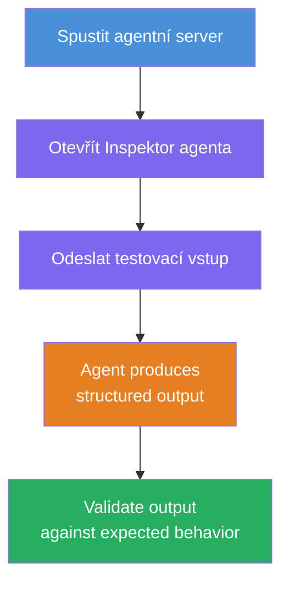
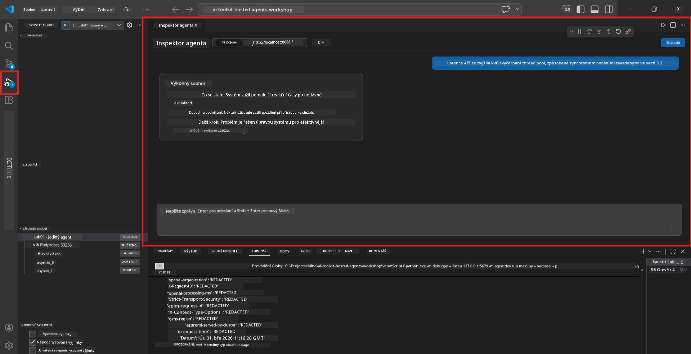
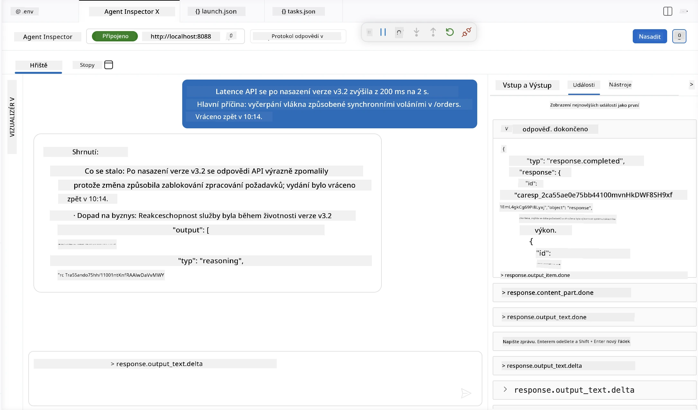

# Modul 4 - Testování lokálně

⏱️ ~10 min

V tomto modulu spustíte svého agenta lokálně a ověříte, že pracuje správně pomocí **funkčních testů podle šťastné cesty**. K potvrzení, že agent generuje strukturované a přesné odpovědi, použijete Agent Inspector (vizuální uživatelské rozhraní) nebo přímé HTTP volání.

### Průběh lokálního testování



---

## Možnost 1: Stiskněte F5 - Debugování s Agent Inspector (doporučeno)

### Spuštění debuggeru

1. Otevřete složku **executive-summary-agent/** přímo ve VS Code (`Soubor → Otevřít složku`).
2. Otevřete panel **Spustit a debugovat** (`Ctrl+Shift+D`).
3. Vyberte v rozbalovacím menu **Debug Local Agent Server**.
4. Stiskněte **F5** (nebo klikněte na ▶ Spustit debugování).

> ⚠️ **Kritické: Vyberte váš Python Interpreter**
> Pokud se objeví chyba "ModuleNotFoundError" nebo se debugger nespustí, musíte VS Code říct, aby používalo vaše virtuální prostředí:
  > 1. Stiskněte `Ctrl+Shift+P` → napište **Python: Select Interpreter**.
  > 2. Vyberte interpret umístěný ve složce `.venv` vašeho projektu (např. `.\.venv\Scripts\python.exe` na Windows).
  > 3. Restartujte debugovací sezení.
> Pokud se stále objevují chyby, upravte ručně váš soubor `tasks.json` následovně:
  > 1. Otevřete soubor `.vscode/tasks.json`
  > 2. Najděte příkaz označený: `Run Agent/Workflow HTTP Server`
  > 3. Aktualizujte hodnotu příkazu na: `"value": "${workspaceFolder}/.venv/bin/python",`

### Co se stane

1. HTTP server se spustí na `http://localhost:8088/responses`.
2. Panel **Agent Inspector** se automaticky otevře – vizuální chatovací rozhraní pro testování.
3. V `main.py` jsou povoleny breakpointy.

Sledujte terminál pro:
```
Starting executive summary hosted agent
Executive agent server running on http://localhost:8088
```

> **Pokud se Agent Inspector neotevře:** Stiskněte `Ctrl+Shift+P` → **Foundry Toolkit: Open Agent Inspector**.



> *Snímek obrazovky může zobrazovat starší označení 'AI TOOLKIT' z předchozí verze rozšíření.*

---

## Možnost 2: Testování přes Terminál (alternativa)

Spusťte agenta v jednom terminálu, odešlete požadavky z jiného:

```bash
# Terminál 1: Spustit agenta
cd executive-summary-agent/
source .venv/bin/activate
python main.py
```

```bash
# Terminál 2: Odeslat test (curl)
curl -sS -X POST http://localhost:8088/responses \
  -H "Content-Type: application/json" \
  -d '{"input": "The API latency increased due to thread pool exhaustion caused by sync calls in v3.2.", "stream": false}'
```

---

## Testy scénářů: Funkční ověření podle šťastné cesty

Spusťte **všechny tři** níže uvedené scénáře. Ověří, že váš agent generuje správný, strukturovaný výstup pro reálné vstupy.



### Scénář 1: IT incident – nárůst latence API

**Vstup:**
```
The API latency increased from 200ms to 2s after deploying v3.2.
Root cause: thread pool starvation from synchronous calls in /orders.
Rolled back at 10:14.
```

**Očekávané chování:**
- ✅ Následuje struktura "Executive Summary" (Co se stalo / Dopad na byznys / Další krok)
- ✅ Žádný technický žargon (žádný "thread pool", žádné "/orders", žádné "v3.2")
- ✅ Jasně uvádí dopad na byznys (např. uživatelé zaznamenali zpoždění)
- ✅ Obsahuje další krok (např. nasazena oprava, monitorování zajištěno)

---

### Scénář 2: Datový kanál – selhání ETL

**Vstup:**
```
The nightly ETL job failed because the upstream schema changed. APAC dashboards show missing data.
```

**Očekávané chování:**
- ✅ Shrnuje selhání obnovy dat jednoduchým jazykem
- ✅ Zmiňuje dopad na dashboard APAC
- ✅ Obsahuje nápravný další krok
- ✅ Nezmiňuje "ETL", "schéma" ani jiné technické termíny

---

### Scénář 3: Bezpečnost – Uvedení vystavených přihlašovacích údajů

**Vstup:**
```
Static analysis flagged a hardcoded secret in the repository.
The secret may have been exposed in commit history.
```

**Očekávané chování:**
- ✅ Popisuje problém s přihlašovacími údaji/bezpečnostní problematiku přátelským jazykem pro management
- ✅ Vyzdvihuje potenciální riziko (neautorizovaný přístup)
- ✅ Uvádí nápravný krok (rotace přihlašovacích údajů, audit)
- ✅ Neobsahuje termíny jako "statická analýza", "historie commitů" nebo "hardcoded"

---

## Kritéria ověření

Pro každý scénář zkontrolujte:

| # | Kritérium | Podmínka úspěchu |
|---|----------|---------------|
| 1 | **Struktura** | Odpověď používá formát "Executive Summary" se všemi třemi odrážkami |
| 2 | **Jasný jazyk** | Žádný technický žargon, kterému by manažer nerozuměl |
| 3 | **Přesnost** | Shrnutí odpovídá vstupu – žádné vymyšlené detaily |
| 4 | **Stručnost** | Odpověď má méně než 100 slov |
| 5 | **Další krok** | Je uvedeno jasné opatření nebo řešení |

---

## Tipy pro ladění

| Problém | Řešení |
|-------|-----|
| Agent se nespustí | Zkontrolujte hodnoty v `.env`, ověřte aktivaci venv, spusťte `pip install -r requirements.txt` |
| Prázdná nebo obecná odpověď | Zkontrolujte instrukce v `main.py` – ujistěte se, že je specifikován výstupní formát |
| Odpověď obsahuje žargon | Posilte pravidla "odstranění technických termínů" v instrukcích |
| Agent Inspector se neotevře | `Ctrl+Shift+P` → **Foundry Toolkit: Open Agent Inspector** |
| Chyby modelu v terminálu | Ověřte, že `AZURE_AI_MODEL_DEPLOYMENT_NAME` přesně odpovídá (rozlišuje velká/malá písmena) |

---

### ✅ Kontrolní bod

- [ ] Agent se spustí lokálně bez chyb
- [ ] Agent Inspector se otevře a zobrazí chatovací rozhraní (při použití F5)
- [ ] **Scénář 1** (IT incident) - strukturované Executive Summary, bez žargonu
- [ ] **Scénář 2** (datový kanál) - relevantní shrnutí s dopadem na byznys
- [ ] **Scénář 3** (bezpečnostní upozornění) - vhodná komunikace rizika
- [ ] Všechny odpovědi odpovídají definované výstupní struktuře

> **Uložte si své odpovědi** (zkopírujte nebo vložte screenshot) – porovnáte je s výsledky z cloudového prostředí v Modulu 06.

---

**Předchozí:** [03 - Nastavit & Kódovat](03-configure-and-code.md) · **Další:** [05 - Nasazení do Foundry →](05-deploy-to-foundry.md)

---

<!-- CO-OP TRANSLATOR DISCLAIMER START -->
**Prohlášení o omezení odpovědnosti**:
Tento dokument byl přeložen pomocí AI překladatelské služby [Co-op Translator](https://github.com/Azure/co-op-translator). Přestože usilujeme o co největší přesnost, mějte prosím na paměti, že automatizované překlady mohou obsahovat chyby nebo nepřesnosti. Originální dokument v jeho mateřském jazyce by měl být považován za autoritativní zdroj. Pro kritické informace se doporučuje profesionální lidský překlad. Nejsme odpovědní za jakékoli nedorozumění nebo nesprávné interpretace vzniklé použitím tohoto překladu.
<!-- CO-OP TRANSLATOR DISCLAIMER END -->