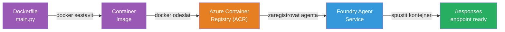
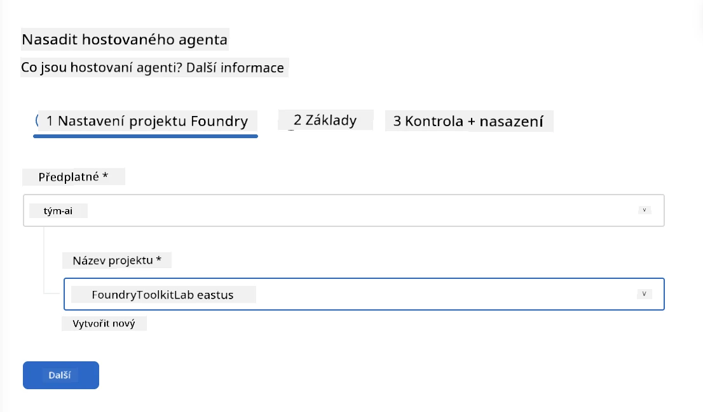
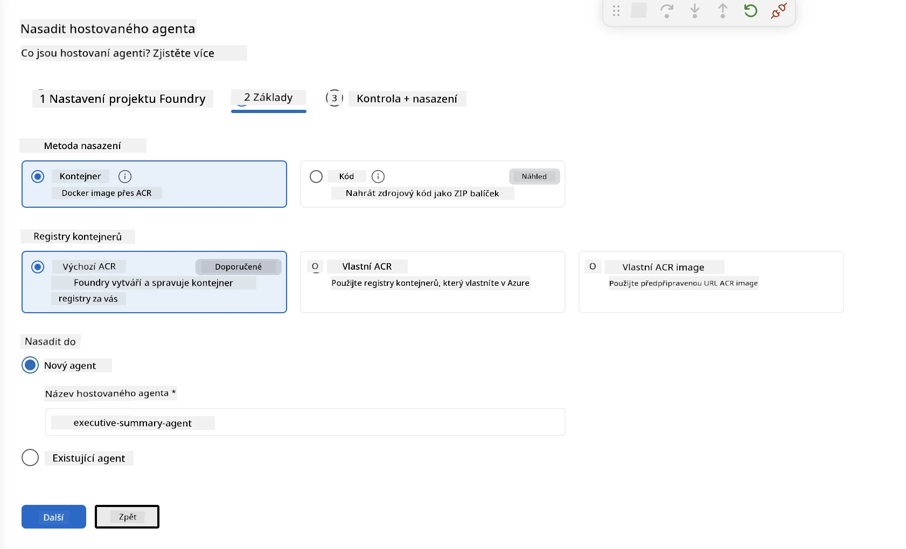
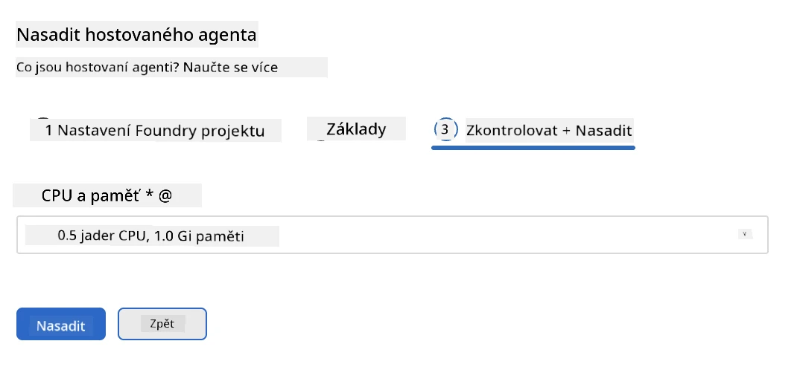
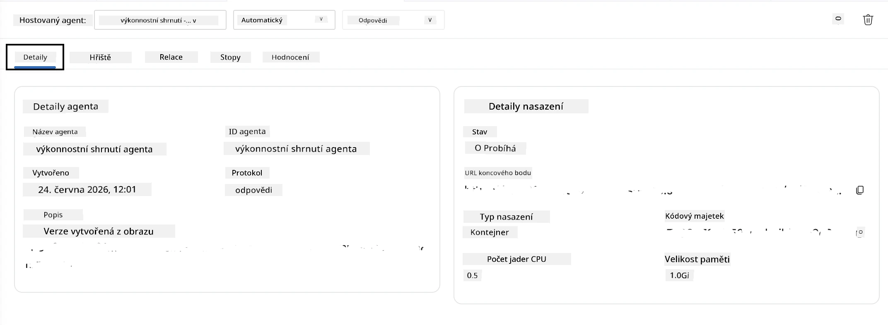

# Modul 5 - Nasazení do služby Foundry Agent

⏱️ ~10 min

> ⚠️ **Uživatelé cesty B:** Tento modul vyžaduje předplatné Foundry. Pokud používáte Foundry Local, přejděte na [Modul 07 - Shrnutí](07-summary.md). Úspěšně jste dokončili lokální vývojový proces!

V tomto modulu nasadíte svého lokálně otestovaného agenta do Microsoft Foundry jako **hostovaného agenta**. Nasazení sestaví obraz kontejneru, nahraje jej do Azure Container Registry a spustí agenta v řízené infrastruktuře Foundry.

### Nasazovací pipeline

---

## Kontrola předpokladů

Před nasazením ověřte:

- [ ] Agent úspěšně projde všemi 3 lokálními scénáři z [Modulu 04](04-test-locally.md)
- [ ] Máte roli **Azure AI User** na úrovni projektu ([Modul 01, Přiřazení RBAC](01-setup.md#deploy-a-model--assign-rbac))
- [ ] Jste přihlášeni do Azure ve VS Code (ikona účtů zobrazuje vaše jméno)

---

## Krok 1: Spusťte nasazení

### Možnost A: Nasazení z Agent Inspectoru (doporučeno)

Pokud je Agent Inspector otevřený (z testování):
1. Klikněte na tlačítko **Deploy** v pravém horním rohu (ikona mraku ↑).

### Možnost B: Nasazení z Command Palette

1. Stiskněte `Ctrl+Shift+P` → **Foundry Toolkit: Deploy Hosted Agent**.

---

## Krok 2: Konfigurace nasazení

Průvodce vás vyzve k zadání:

| Výzva | Výběr |
|--------|-----------|
| **Předplatné** | Vaše Azure předplatné |
| **Cílový projekt** | Váš Foundry projekt (např. `workshop-agents`) |

Klikněte na **další** pro konfiguraci agenta.

| Výzva | Výběr |
|--------|-----------|
| **Metoda nasazení** | Kontejner |
| **Registry kontejnerů** | **Výchozí ACR** (Microsoft Foundry jeden vytvoří a spravuje za vás) |
| **Nasadit do** | Nový Agent (jméno, `executive-summary-agent`) |

Klikněte na **další** pro kontrolu a nasazení agenta.

| Výzva | Výběr |
|--------|-----------|
| **CPU a paměť** | **0,25 CPU jader, 0,5 Gi paměti** (postačuje pro workshop) |

---

## Krok 3: Nasazení a sledování

1. Klikněte na **Deploy**.
2. Sledujte panel **Output** (z rozbalovacího menu vyberte **Microsoft Foundry**).
3. Nasazení probíhá následujícími fázemi:
   - **Docker build** - sestavení kontejneru z vašeho Dockerfile
   - **Docker push** - nahrání obrazu do ACR (1–3 min při prvním nasazení)
   - **Registrace agenta** - vytvoření hostovaného agenta ve Foundry
   - **Start kontejneru** - spuštění s identitou spravovanou systémem

4. Po dokončení se zobrazí oznámení:
   > **my-agent byl úspěšně nasazen.** `Zobrazit protokoly` `Spustit agenta`

5. Klikněte na **Spustit agenta** pro otevření Agent Playground.

### Hodnoty stavu nasazení

| Stav | Význam |
|--------|---------|
| **Running** | Kontejner připraven, agent reaguje |
| **Pending** | Kontejner se spouští - počkejte 30–60 sekund |
| **Failed** | Zkontrolujte protokoly (viz řešení problémů níže) |

---

## Běžné chyby při nasazení

| Chyba | Příčina | Řešení |
|-------|-----------|-----|
| `agents/write` oprávnění odepřeno | Chybí role **Azure AI User** na úrovni projektu | [Modul 01, Přiřazení RBAC](01-setup.md#deploy-a-model--assign-rbac) |
| Docker neběží | Docker Desktop není spuštěný | Spusťte Docker Desktop → ověřte `docker info` |
| Oprávnění k ACR | Spravovaná identita nemůže stáhnout obraz | Viz [Modul 08 - Řešení problémů](08-troubleshooting.md) |

---

### ✅ Kontrolní bod

- [ ] Nasazení proběhlo bez chyb
- [ ] Agent je viditelný pod **Hosted Agents (Preview)** v postranním panelu Foundry
- [ ] Stav kontejneru ukazuje **Running**
- [ ] Otevřená záložka Agent Playground zobrazuje podrobnosti agenta a URL koncového bodu

---

**Předchozí:** [04 - Testování lokálně](04-test-locally.md) · **Další:** [06 - Ověření v Playground →](06-verify-in-playground.md)

---

<!-- CO-OP TRANSLATOR DISCLAIMER START -->
**Prohlášení o omezení odpovědnosti**:
Tento dokument byl přeložen pomocí AI překladatelské služby [Co-op Translator](https://github.com/Azure/co-op-translator). Přestože usilujeme o co největší přesnost, mějte prosím na paměti, že automatizované překlady mohou obsahovat chyby nebo nepřesnosti. Originální dokument v jeho mateřském jazyce by měl být považován za autoritativní zdroj. Pro kritické informace se doporučuje profesionální lidský překlad. Nejsme odpovědní za jakékoli nedorozumění nebo nesprávné interpretace vzniklé použitím tohoto překladu.
<!-- CO-OP TRANSLATOR DISCLAIMER END -->