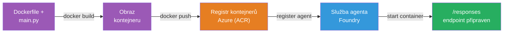
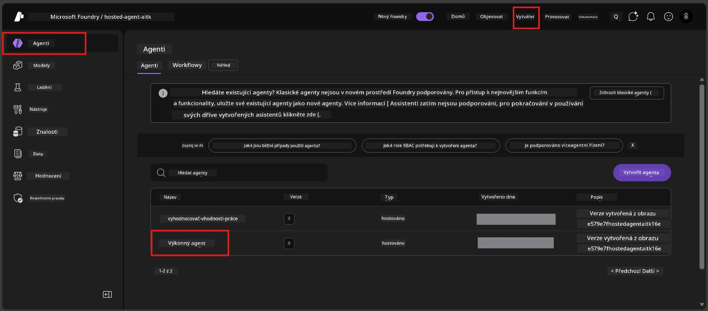

# Module 6 - Nasazení do služby Foundry Agent Service

V tomto modulu nasadíte svého lokálně testovaného agenta do Microsoft Foundry jako [**Hosted Agent**](https://learn.microsoft.com/azure/foundry/agents/concepts/hosted-agents). Proces nasazení vytvoří Docker kontejnerový obraz z vašeho projektu, nahraje ho do [Azure Container Registry (ACR)](https://learn.microsoft.com/azure/container-registry/container-registry-intro) a vytvoří verzi hostovaného agenta ve [Foundry Agent Service](https://learn.microsoft.com/azure/foundry/agents/overview).

### Pipeline nasazení


---

## Kontrola předpokladů

Před nasazením zkontrolujte každý níže uvedený bod. Vynechání těchto kroků je nejčastější příčinou neúspěšného nasazení.

1. **Agent prošel lokálními základními testy:**
   - Dokončili jste všechny 4 testy v [Modulu 5](05-test-locally.md) a agent správně reagoval.

2. **Máte roli [Azure AI User](https://learn.microsoft.com/azure/foundry/concepts/rbac-foundry#built-in-roles):**
   - Tato byla přiřazena v [Modulu 2, kroku 3](02-create-foundry-project.md). Pokud si nejste jisti, ověřte to nyní:
   - Azure Portal → váš Foundry **projekt** → **Access control (IAM)** → záložka **Role assignments** → vyhledejte své jméno → potvrďte, že je uveden **Azure AI User**.

3. **Jste přihlášeni do Azure ve VS Code:**
   - Zkontrolujte ikonu Účtů v levém dolním rohu VS Code. Mělo by být vidět vaše uživatelské jméno.

4. **(Volitelné) Docker Desktop běží:**
   - Docker je potřeba pouze pokud vás rozšíření Foundry vyzve k lokální kompilaci. Ve většině případů rozšíření automaticky zvládá stavbu kontejneru během nasazení.
   - Pokud máte Docker nainstalovaný, ověřte, že běží: `docker info`

---

## Krok 1: Spusťte nasazení

Existují dva způsoby, jak nasadit - oba vedou ke stejnému výsledku.

### Možnost A: Nasazení z Agent Inspectoru (doporučeno)

Pokud spouštíte agenta s debuggerem (F5) a Agent Inspector je otevřený:

1. Podívejte se do **pravého horního rohu** panelu Agent Inspector.
2. Klikněte na tlačítko **Deploy** (ikona cloudu se šipkou nahoru ↑).
3. Otevře se průvodce nasazením.

### Možnost B: Nasazení přes Command Palette

1. Stiskněte `Ctrl+Shift+P` pro otevření **Command Palette**.
2. Napište: **Microsoft Foundry: Deploy Hosted Agent** a vyberte.
3. Otevře se průvodce nasazením.

---

## Krok 2: Konfigurace nasazení

Průvodce nasazením vás provede konfigurací. Vyplňte jednotlivé položky:

### 2.1 Výběr cílového projektu

1. Rozbalovací nabídka zobrazí vaše projekty Foundry.
2. Vyberte projekt, který jste vytvořili v Modulu 2 (např. `workshop-agents`).

### 2.2 Výběr souboru agenta pro kontejner

1. Budete vyzváni k výběru vstupního souboru agenta.
2. Vyberte **`main.py`** (Python) - tento soubor používá průvodce k identifikaci vašeho projektu agenta.

### 2.3 Konfigurace zdrojů

| Nastavení | Doporučená hodnota | Poznámky |
|-----------|--------------------|----------|
| **CPU**   | `0.25`             | Výchozí, dostačující pro workshop. Zvyšte pro produkční zátěže |
| **Paměť** | `0.5Gi`            | Výchozí, dostačující pro workshop |

Tato nastavení odpovídají hodnotám v `agent.yaml`. Můžete přijmout výchozí hodnoty.

---

## Krok 3: Potvrzení a nasazení

1. Průvodce zobrazí souhrn nasazení s:
   - názvem cílového projektu
   - názvem agenta (z `agent.yaml`)
   - souborem kontejneru a zdroji
2. Zkontrolujte souhrn a klikněte na **Confirm and Deploy** (nebo **Deploy**).
3. Sledujte průběh ve VS Code.

### Co se děje během nasazení (krok za krokem)

Nasazení je vícestupňový proces. Sledujte VS Code panel **Output** (z rozbalovací nabídky vyberte "Microsoft Foundry"):

1. **Docker build** - VS Code vytvoří Docker kontejnerový obraz z vašeho `Dockerfile`. Uvidíte zprávy o vrstvách Dockeru:
   ```
   Step 1/6 : FROM python:<version>-slim
   Step 2/6 : WORKDIR /app
   ...
   Successfully built abc123def456
   ```

2. **Docker push** - Obraz je nahrán do **Azure Container Registry (ACR)** přidruženého k vašemu Foundry projektu. První nasazení může trvat 1-3 minuty (základní obraz má více než 100MB).

3. **Registrace agenta** - Foundry Agent Service vytvoří nového hostovaného agenta (nebo novou verzi, pokud agent již existuje). Používají se metadata z `agent.yaml`.

4. **Start kontejneru** - Kontejner se spustí v řízené infrastruktuře Foundry. Platforma přiřadí [spravovanou identitu systému](https://learn.microsoft.com/azure/foundry/agents/concepts/agent-identity) a zpřístupní endpoint `/responses`.

> **První nasazení je pomalejší** (Docker musí nahrát všechny vrstvy). Následující nasazení jsou rychlejší díky cachování vrstev Dockerem.

---

## Krok 4: Ověření stavu nasazení

Po dokončení příkazu nasazení:

1. Otevřete postranní panel **Microsoft Foundry** kliknutím na ikonu Foundry v Activity Bar.
2. Rozbalte sekci **Hosted Agents (Preview)** pod vaším projektem.
3. Měli byste vidět název svého agenta (např. `ExecutiveAgent` nebo jméno z `agent.yaml`).
4. **Klikněte na název agenta** pro jeho rozbalení.
5. Uvidíte jednu či více **verzí** (např. `v1`).
6. Klikněte na verzi pro zobrazení **Container Details**.
7. Zkontrolujte pole **Status**:

   | Stav     | Význam                      |
   |----------|-----------------------------|
   | **Started** nebo **Running** | Kontejner běží a agent je připraven |
   | **Pending**  | Kontejner se spouští (počkejte 30-60 sekund) |
   | **Failed**   | Kontejner se nespustil (zkontrolujte logy - viz řešení problémů níže) |



> **Pokud vidíte "Pending" déle než 2 minuty:** Kontejner může stahovat základní obraz. Počkejte ještě chvíli. Pokud stav setrvává na pending, zkontrolujte logy kontejneru.

---

## Běžné chyby při nasazení a jejich opravy

### Chyba 1: Permission denied - `agents/write`

```
Error: lacks the required data action 
Microsoft.CognitiveServices/accounts/AIServices/agents/write 
to perform POST /api/projects/{projectName}/assistants operation.
```

**Příčina:** Nemáte roli `Azure AI User` na úrovni **projektu**.

**Kroky opravy:**

1. Otevřete [https://portal.azure.com](https://portal.azure.com).
2. Do vyhledávacího pole napište název svého Foundry **projektu** a klikněte na něj.
   - **Důležité:** Ujistěte se, že jste v rámci **projektu** (typ: "Microsoft Foundry project"), NE v nadřazené účetní/hub zdroji.
3. V levém menu klikněte na **Access control (IAM)**.
4. Klikněte na **+ Add** → **Add role assignment**.
5. V záložce **Role** vyhledejte [**Azure AI User**](https://learn.microsoft.com/azure/foundry/concepts/rbac-foundry#built-in-roles) a vyberte ji. Klikněte na **Next**.
6. V záložce **Members** vyberte **User, group, or service principal**.
7. Klikněte na **+ Select members**, vyhledejte své jméno/email, vyberte sami sebe, klikněte na **Select**.
8. Klikněte na **Review + assign** → znovu **Review + assign**.
9. Počkejte 1-2 minuty, než se role přiřadí.
10. **Opakujte nasazení** od Kroku 1.

> Role musí být přiřazena na úrovni **projektu**, ne pouze na úrovni účtu. Toto je nejčastější příčina neúspěšných nasazení.

### Chyba 2: Docker neběží

```
Error: Docker build failed / Cannot connect to Docker daemon
```

**Oprava:**
1. Spusťte Docker Desktop (najdete ho v nabídce Start nebo v systémové liště).
2. Počkejte, až zobrazí "Docker Desktop is running" (30-60 sekund).
3. Ověřte: `docker info` v terminálu.
4. **Specifické pro Windows:** Zkontrolujte, že je v nastavení Docker Desktop → **General** povoleno **Use the WSL 2 based engine**.
5. Opakujte nasazení.

### Chyba 3: ACR autorizace - `AcrPullUnauthorized`

```
Error: AcrPullUnauthorized
```

**Příčina:** Spravovaná identita Foundry projektu nemá právo na pull do kontejnerového registru.

**Oprava:**
1. V Azure Portal přejděte do vašeho **[Container Registry](https://learn.microsoft.com/azure/container-registry/container-registry-intro)** (je ve stejné skupině prostředků jako váš Foundry projekt).
2. Přejděte na **Access control (IAM)** → **Add** → **Add role assignment**.
3. Vyberte roli **[AcrPull](https://learn.microsoft.com/azure/container-registry/container-registry-roles)**.
4. V Members vyberte **Managed identity** → najděte spravovanou identitu Foundry projektu.
5. **Review + assign**.

> Toto obvykle nastavuje automaticky rozšíření Foundry. Pokud tuto chybu vidíte, může to znamenat, že automatické nastavení selhalo.

### Chyba 4: Nesoulad platformy kontejneru (Apple Silicon)

Pokud nasazujete z Apple Silicon Macu (M1/M2/M3), musí být kontejner postaven pro `linux/amd64`:

```bash
docker build --platform linux/amd64 -t myagent:v1 .
```

> Rozšíření Foundry to pro většinu uživatelů automaticky řeší.

---

### Kontrolní seznam

- [ ] Příkaz nasazení bez chyb dokončen ve VS Code
- [ ] Agent se zobrazuje pod **Hosted Agents (Preview)** v postranním panelu Foundry
- [ ] Klikli jste na agenta → vybrali verzi → viděli **Container Details**
- [ ] Stav kontejneru je **Started** nebo **Running**
- [ ] (V případě chyb) Identifikovali jste chybu, aplikovali opravu a úspěšně znovu nasadili

---

**Předchozí:** [05 - Testujte lokálně](05-test-locally.md) · **Další:** [07 - Ověření v Playgroundu →](07-verify-in-playground.md)

---

<!-- CO-OP TRANSLATOR DISCLAIMER START -->
**Prohlášení o vyloučení odpovědnosti**:  
Tento dokument byl přeložen pomocí AI překladatelské služby [Co-op Translator](https://github.com/Azure/co-op-translator). I když usilujeme o přesnost, mějte prosím na paměti, že automatizované překlady mohou obsahovat chyby nebo nepřesnosti. Originální dokument v jeho mateřském jazyce by měl být považován za autoritativní zdroj. Pro kritické informace se doporučuje profesionální lidský překlad. Nejsme odpovědni za jakékoliv nedorozumění nebo mylné výklady vyplývající z použití tohoto překladu.
<!-- CO-OP TRANSLATOR DISCLAIMER END -->