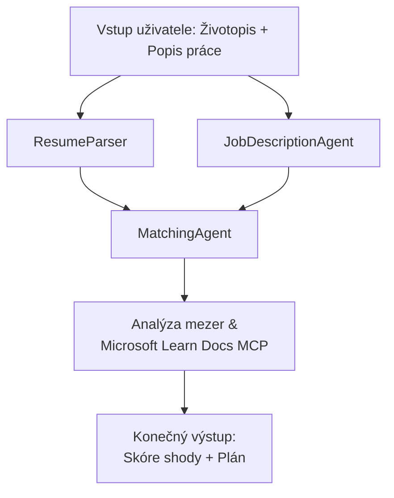

# PersonalCareerCopilot - Hodnocení shody životopisu s pracovním místem

Víceagentní workflow, které hodnotí, jak dobře životopis odpovídá popisu pracovního místa, a poté generuje personalizovanou učební cestu k vyplnění mezer.

---

## Agenti

| Agent | Role | Nástroje |
|-------|------|----------|
| **ResumeParser** | Extrahuje strukturované dovednosti, zkušenosti, certifikace z textu životopisu | - |
| **JobDescriptionAgent** | Extrahuje požadované/preferované dovednosti, zkušenosti, certifikace z popisu práce | - |
| **MatchingAgent** | Porovnává profil s požadavky → skóre shody (0-100) + vyhovující/chybějící dovednosti | - |
| **GapAnalyzer** | Vytváří personalizovanou učební cestu s Microsoft Learn zdroji | `search_microsoft_learn_for_plan` (MCP) |

## Workflow


---

## Rychlý start

### 1. Nastavte prostředí

```powershell
cd workshop\lab02-multi-agent\PersonalCareerCopilot
python -m venv .venv
.\.venv\Scripts\Activate.ps1          # Windows PowerShell
# source .venv/bin/activate            # macOS / Linux
pip install -r requirements.txt
```

### 2. Nakonfigurujte přihlašovací údaje

Zkopírujte ukázkový env soubor a vyplňte údaje o vašem Foundry projektu:

```powershell
cp .env.example .env
```

Upravte `.env`:

```env
PROJECT_ENDPOINT=https://<your-account>.services.ai.azure.com/api/projects/<your-project>
MODEL_DEPLOYMENT_NAME=gpt-4.1-mini
```

| Hodnota | Kde ji najít |
|---------|--------------|
| `PROJECT_ENDPOINT` | Microsoft Foundry postranní panel ve VS Code → klikněte pravým tlačítkem na váš projekt → **Kopírovat koncový bod projektu** |
| `MODEL_DEPLOYMENT_NAME` | Foundry postranní panel → rozbalte projekt → **Modely + koncové body** → název nasazení |

### 3. Spusťte lokálně

```powershell
python -m debugpy --listen 127.0.0.1:5679 -m agentdev run main.py --verbose --port 8088
```

Nebo použijte VS Code task: `Ctrl+Shift+P` → **Úkoly: Spustit úkol** → **Spustit Lab02 HTTP Server**.

### 4. Test s Agent Inspector

Otevřete Agent Inspector: `Ctrl+Shift+P` → **Foundry Toolkit: Otevřít Agent Inspector**.

Vložte tento testovací prompt:

```
Resume:
Jane Doe
Senior Software Engineer with 5 years of experience in Python, Django, and AWS.
Built microservices handling 10K+ requests/second. Led a team of 4 developers.
Certifications: AWS Solutions Architect Associate.
Education: B.S. Computer Science, State University.

Job Description:
Senior Cloud Engineer at Contoso Ltd.
Required: Python, Azure, Kubernetes, Terraform, CI/CD pipelines.
Preferred: Go, monitoring (Prometheus/Grafana), cost optimization.
Experience: 5+ years in cloud infrastructure.
Certifications: Azure Solutions Architect Expert preferred.
```

**Očekáváno:** Skóre shody (0-100), vyhovující/chybějící dovednosti a personalizovaná učební cesta s URL z Microsoft Learn.

### 5. Nasazení do Foundry

`Ctrl+Shift+P` → **Microsoft Foundry: Nasadit hostovaného agenta** → vyberte váš projekt → potvrďte.

---

## Struktura projektu

```
PersonalCareerCopilot/
├── .env.example        ← Template for environment variables
├── .env                ← Your credentials (git-ignored)
├── agent.yaml          ← Hosted agent definition (name, resources, env vars)
├── Dockerfile          ← Container image for Foundry deployment
├── main.py             ← 4-agent workflow (instructions, MCP tool, WorkflowBuilder)
└── requirements.txt    ← Python dependencies
```

## Klíčové soubory

### `agent.yaml`

Definuje hostovaného agenta pro Foundry Agent Service:
- `kind: hosted` - běží jako spravovaný kontejner
- `protocols: [responses v1]` - vystavuje HTTP endpoint `/responses`
- `environment_variables` - `PROJECT_ENDPOINT` a `MODEL_DEPLOYMENT_NAME` jsou injektovány při nasazení

### `main.py`

Obsahuje:
- **Instrukce agenta** - čtyři konstanty `*_INSTRUCTIONS`, jedna pro každého agenta
- **MCP nástroj** - `search_microsoft_learn_for_plan()` volá `https://learn.microsoft.com/api/mcp` přes Streamable HTTP
- **Vytváření agentů** - kontextový manažer `create_agents()` používající `AzureAIAgentClient.as_agent()`
- **Graf workflow** - `create_workflow()` používá `WorkflowBuilder` pro propojení agentů s fan-out/fan-in/sekvenčními vzory
- **Spuštění serveru** - `from_agent_framework(agent).run_async()` na portu 8088

### `requirements.txt`

| Balíček | Verze | Účel |
|---------|-------|------|
| `agent-framework-azure-ai` | `1.0.0rc3` | Integrace Azure AI pro Microsoft Agent Framework |
| `agent-framework-core` | `1.0.0rc3` | Základní runtime (obsahuje WorkflowBuilder) |
| `azure-ai-agentserver-agentframework` | `1.0.0b16` | Runtime serveru hostovaného agenta |
| `azure-ai-agentserver-core` | `1.0.0b16` | Základní abstrakce serveru agenta |
| `debugpy` | nejnovější | Python debugging (F5 ve VS Code) |
| `agent-dev-cli` | `--pre` | Lokální vývojové CLI + backend Agent Inspector |

---

## Řešení problémů

| Problém | Řešení |
|---------|--------|
| `RuntimeError: Missing required environment variable(s)` | Vytvořte `.env` se `PROJECT_ENDPOINT` a `MODEL_DEPLOYMENT_NAME` |
| `ModuleNotFoundError: No module named 'agent_framework'` | Aktivujte venv a spusťte `pip install -r requirements.txt` |
| V výstupu nejsou URL z Microsoft Learn | Zkontrolujte připojení k internetu na `https://learn.microsoft.com/api/mcp` |
| Pouze 1 karta mezery (obrázkování) | Ověřte, že `GAP_ANALYZER_INSTRUCTIONS` obsahuje blok `CRITICAL:` |
| Port 8088 je obsazen | Zastavte jiné servery: `netstat -ano \| findstr :8088` |

Pro podrobné řešení problémů viz [Modul 8 - Řešení problémů](../docs/08-troubleshooting.md).

---

**Plný průvodce:** [Lab 02 Docs](../docs/README.md) · **Zpět na:** [Lab 02 README](../README.md) · [Domů na workshopu](../../../README.md)

---

<!-- CO-OP TRANSLATOR DISCLAIMER START -->
**Upozornění**:  
Tento dokument byl přeložen pomocí AI překladatelské služby [Co-op Translator](https://github.com/Azure/co-op-translator). Přestože usilujeme o přesnost, mějte prosím na paměti, že automatizované překlady mohou obsahovat chyby nebo nepřesnosti. Původní dokument v jeho mateřském jazyce by měl být považován za autoritativní zdroj. Pro zásadní informace se doporučuje profesionální lidský překlad. Nejsme odpovědní za jakékoli nedorozumění nebo chybné interpretace vzniklé použitím tohoto překladu.
<!-- CO-OP TRANSLATOR DISCLAIMER END -->