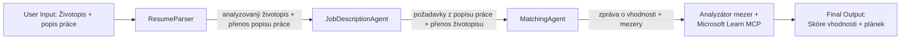

# PersonalCareerCopilot - Hodnotitel shody životopisu s pracovním místem

Víceagentní aplikace založená na workflow, která hodnotí, jak dobře životopis odpovídá popisu pracovní pozice, a poté generuje personalizovanou vzdělávací cestu k doplnění chybějících dovedností.

---

## Agenti

| Agent | Role | Nástroje |
|-------|------|-------|
| **ResumeParser** | Vytahuje strukturované dovednosti, zkušenosti, certifikace z textu životopisu | - |
| **JobDescriptionAgent** | Vytahuje požadované/preferované dovednosti, zkušenosti, certifikace z popisu práce | - |
| **MatchingAgent** | Porovnává profil versus požadavky → skóre shody (0-100) + shodující se/chybějící dovednosti | - |
| **GapAnalyzer** | Vytváří personalizovanou vzdělávací cestu s zdroji Microsoft Learn | `search_microsoft_learn_for_plan` (MCP) |

## Workflow


```mermaid
flowchart LR
    UserInput["User Input: Životopis + popis práce"] --> ResumeParser
    ResumeParser -- "analyzovaný životopis + přenos popisu práce" --> JobDescriptionAgent
    JobDescriptionAgent -- "požadavky z popisu práce + přenos životopisu" --> MatchingAgent
    MatchingAgent -- "zpráva o vhodnosti + mezery" --> GapAnalyzerMCP["Analyzátor mezer +\nMicrosoft Learn MCP"]
    GapAnalyzerMCP --> FinalOutput["Final Output:\nSkóre vhodnosti + plánek"]
```

---

## Rychlý start

### 1. Nastavte prostředí

Tato složka je referenční implementací workflow založené kostry Lab 02. Její `main.py` používá existující bloky promptů plus `WorkflowBuilder` pro propojení čtyř agentů.

```powershell
cd workshop\lab02-multi-agent\PersonalCareerCopilot
python -m venv .venv
.\.venv\Scripts\Activate.ps1          # Windows PowerShell
# source .venv/bin/activate            # macOS / Linux
pip install -r requirements.txt
```

### 2. Nakonfigurujte přihlašovací údaje

Vytvořte v této složce soubor `.env`:

```powershell
copy .env .env.bak 2>$null; echo $null > .env
```

Upravte `.env`:

```env
FOUNDRY_PROJECT_ENDPOINT=https://<your-account>.services.ai.azure.com/api/projects/<your-project>
AZURE_AI_MODEL_DEPLOYMENT_NAME=gpt-4.1-mini
```

| Hodnota | Kde ji najít |
|-------|------------------|
| `FOUNDRY_PROJECT_ENDPOINT` | Foundry Toolkit panel → pravým klikem na projekt → **Kopírovat adresu projektu** |
| `AZURE_AI_MODEL_DEPLOYMENT_NAME` | Foundry panel → rozbalit projekt → **Modely + endpointy** → název nasazení |

### 3. Spuštění lokálně

```powershell
python -m debugpy --listen 127.0.0.1:5679 main.py --port 8088
```

Nebo použijte úlohu ve VS Code: `Ctrl+Shift+P` → **Úlohy: Spustit úlohu** → **Spustit Agent HTTP Server**.

Pro ladění s F5 použijte **Debug Local Agent HTTP Server**.

### 4. Test s Agent Inspector

Otevřete Agent Inspector: `Ctrl+Shift+P` → **Foundry Toolkit: Otevřít Agent Inspector**.

Vložte tento testovací prompt:

```
Resume:
Jane Doe
Senior Software Engineer with 5 years of experience in Python, Django, and AWS.
Built microservices handling 10K+ requests/second. Led a team of 4 developers.
Certifications: AWS Solutions Architect Associate.
Education: B.S. Computer Science, State University.

Job Description:
Senior Cloud Engineer at Contoso Ltd.
Required: Python, Azure, Kubernetes, Terraform, CI/CD pipelines.
Preferred: Go, monitoring (Prometheus/Grafana), cost optimization.
Experience: 5+ years in cloud infrastructure.
Certifications: Azure Solutions Architect Expert preferred.
```

**Očekává se:** Skóre shody (0-100), shodující se/chybějící dovednosti a personalizovaná vzdělávací cesta s odkazy Microsoft Learn.

### 5. Nasazení do Foundry

`Ctrl+Shift+P` → **Foundry Toolkit: Nasadit hostovaného agenta** → vyberte projekt → potvrďte.

---

## Struktura projektu

```
PersonalCareerCopilot/
├── .env                ← Your credentials (git-ignored)
├── agent.yaml          ← Hosted agent definition (name, resources, env vars)
├── Dockerfile          ← Container image for Foundry deployment
├── main.py             ← 4-agent workflow (instructions, MCP tool, WorkflowBuilder)
└── requirements.txt    ← Python dependencies
```

## Klíčové soubory

### `agent.yaml`

Definuje hostovaného agenta pro Foundry Agent Service:
- `kind: hosted` - běží jako spravovaný kontejner
- `protocols` - protokol `responses` s `version: 1.0.0`, vystavující HTTP endpoint `/responses`
- `environment_variables` - zde je deklarováno `AZURE_AI_MODEL_DEPLOYMENT_NAME`; `FOUNDRY_PROJECT_ENDPOINT` je automaticky vloženo při nasazení

### `main.py`

Obsahuje:
- **Instrukce agentů** - čtyři konstanty `*_INSTRUCTIONS`, každá pro jednoho agenta
- **MCP nástroj** - `search_microsoft_learn_for_plan()` volá `https://learn.microsoft.com/api/mcp` přes streamable HTTP
- **Vytvoření agentů** - čtyři instance `Agent()` + `AgentExecutor()` sdílející jeden `FoundryChatClient`
- **Graf workflow** - `WorkflowBuilder` propojuje agenty jako sekvenční pipeline: ResumeParser → JD Agent → MatchingAgent → GapAnalyzer
- **Spuštění serveru** - `ResponsesHostServer` běží na portu 8088

### `requirements.txt`

| Balíček | Účel |
|---------|---------|
| `agent-framework-foundry` | Základ běhového prostředí: `Agent`, `AgentExecutor`, `WorkflowBuilder`, `@tool`, `FoundryChatClient` |
| `agent-framework-foundry-hosting` | `ResponsesHostServer` + integrace hostingu Foundry |
| `mcp<2,>=1.24.0` | MCP klient pro GapAnalyzer (`streamable_http_client`) |
| `debugpy` | Python ladění (F5 ve VS Code) |

---

## Řešení problémů

| Problém | Řešení |
|-------|-----|
| `KeyError: 'FOUNDRY_PROJECT_ENDPOINT'` nebo `KeyError: 'AZURE_AI_MODEL_DEPLOYMENT_NAME'` | Vytvořte `.env` se zadanými `FOUNDRY_PROJECT_ENDPOINT` a `AZURE_AI_MODEL_DEPLOYMENT_NAME` |
| `ModuleNotFoundError: No module named 'agent_framework'` | Aktivujte venv a spusťte `pip install -r requirements.txt` |
| Výstup neobsahuje odkazy Microsoft Learn | Zkontrolujte připojení k internetu na `https://learn.microsoft.com/api/mcp` |
| Pouze 1 karta s mezí (zkrácená) | Zkontrolujte, zda `GAP_ANALYZER_INSTRUCTIONS` obsahují blok `CRITICAL:` |
| Port 8088 je již používán | Zastavte ostatní servery: `netstat -ano \| findstr :8088` |

Pro podrobné řešení problémů viz [Modul 8 - Řešení problémů](../docs/08-troubleshooting.md).

---

**Kompletní průvodce:** [Lab 02 Docs](../docs/README.md) · **Zpět na:** [Lab 02 README](../README.md) · [Domovská stránka workshopu](../../../README.md)

---

<!-- CO-OP TRANSLATOR DISCLAIMER START -->
**Prohlášení o omezení odpovědnosti**:
Tento dokument byl přeložen pomocí AI překladatelské služby [Co-op Translator](https://github.com/Azure/co-op-translator). Přestože usilujeme o co největší přesnost, mějte prosím na paměti, že automatizované překlady mohou obsahovat chyby nebo nepřesnosti. Originální dokument v jeho mateřském jazyce by měl být považován za autoritativní zdroj. Pro kritické informace se doporučuje profesionální lidský překlad. Nejsme odpovědní za jakékoli nedorozumění nebo nesprávné interpretace vzniklé použitím tohoto překladu.
<!-- CO-OP TRANSLATOR DISCLAIMER END -->