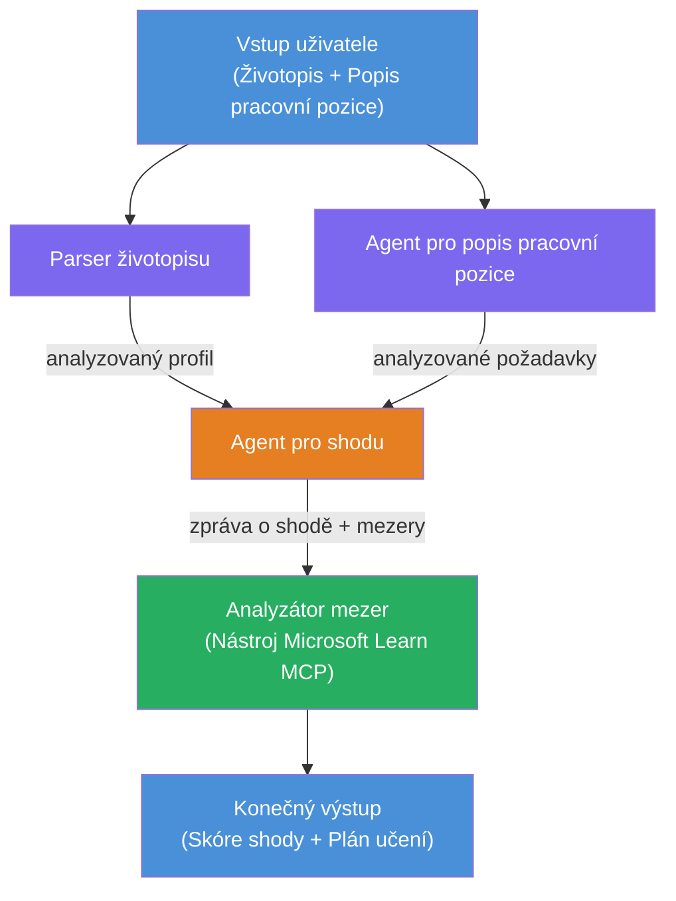

# Lab 02 - Víceagentní pracovní postup: Hodnocení životopisu → vhodnost pro práci

---

## Co vytvoříte

**Hodnotič vhodnosti životopisu → práce** - víceagentní pracovní postup, kde čtyři specializovaní agenti spolupracují na vyhodnocení, jak dobře životopis kandidáta odpovídá popisu práce, a poté vytvoří personalizovanou vzdělávací cestu k odstranění nedostatků.

### Agent i

| Agent | Role |
|-------|------|
| **Parser životopisu** | Extrahuje strukturované dovednosti, zkušenosti, certifikáty z textu životopisu |
| **Agent popisu práce** | Extrahuje požadované/preferované dovednosti, zkušenosti, certifikáty z popisu práce |
| **Agenta pro porovnání** | Porovnává profil vs požadavky → skóre vhodnosti (0-100) + shodné/chybějící dovednosti |
| **Analyzátor mezer** | Vytváří personalizovanou vzdělávací cestu s prostředky, časovými plány a rychlými projekty |

### Ukázkový průběh

Nahrajte **životopis + popis práce** → získejte **skóre vhodnosti + chybějící dovednosti** → obdržíte **personalizovanou vzdělávací cestu**.

### Architektura pracovního postupu

> Fialová = paralelní agenti | Oranžová = bod agregace | Zelená = finální agent s nástroji. Viz [Modul 1 - Porozumění architektuře](docs/01-understand-multi-agent.md) a [Modul 4 - Vzory orchestrace](docs/04-orchestration-patterns.md) pro detailní diagramy a tok dat.

### Pokrytá témata

- Vytváření víceagentního pracovního postupu pomocí **WorkflowBuilder**
- Definování rolí agentů a orchestrátorské logiky (paralelní + sekvenční)
- Vzory komunikace mezi agenty
- Lokální testování pomocí Agent Inspector
- Nasazení víceagentních pracovních postupů do Foundry Agent Service

---

## Předpoklady

Nejprve dokončete Laboratoř 01:

- [Lab 01 - Jediný agent](../lab01-single-agent/README.md)

---

## Začněte

Podrobné instrukce nastavení, průchod kódem a testovací příkazy najdete v:

- [Lab 2 Dokumentace - Předpoklady](docs/00-prerequisites.md)
- [Lab 2 Dokumentace - Kompletní vzdělávací cesta](docs/README.md)
- [PersonalCareerCopilot průvodce spuštěním](PersonalCareerCopilot/README.md)

## Vzory orchestrace (agentní alternativy)

Lab 2 obsahuje výchozí tok **paralelně → agregátor → plánovač**, a dokumentace
také popisuje alternativní vzory pro demonstraci silnější agentní chování:

- **Fan-out/Fan-in s váženým konsenzem**
- **Přezkoumávající/připomínkující průchod před finální vzdělávací cestou**
- **Podmíněný směrovač** (volba cesty na základě skóre vhodnosti a chybějících dovedností)

Viz [docs/04-orchestration-patterns.md](docs/04-orchestration-patterns.md).

---

**Předchozí:** [Lab 01 - Jediný agent](../lab01-single-agent/README.md) · **Zpět na:** [Domovská stránka workshopu](../../README.md)

---

<!-- CO-OP TRANSLATOR DISCLAIMER START -->
**Prohlášení o vyloučení odpovědnosti**:
Tento dokument byl přeložen pomocí AI překladatelské služby [Co-op Translator](https://github.com/Azure/co-op-translator). Přestože usilujeme o přesnost, mějte prosím na paměti, že automatizované překlady mohou obsahovat chyby nebo nepřesnosti. Původní dokument v jeho mateřském jazyce by měl být považován za závazný zdroj. Pro důležité informace se doporučuje profesionální lidský překlad. Nejsme odpovědni za jakákoliv nedorozumění nebo mylné výklady vyplývající z použití tohoto překladu.
<!-- CO-OP TRANSLATOR DISCLAIMER END -->