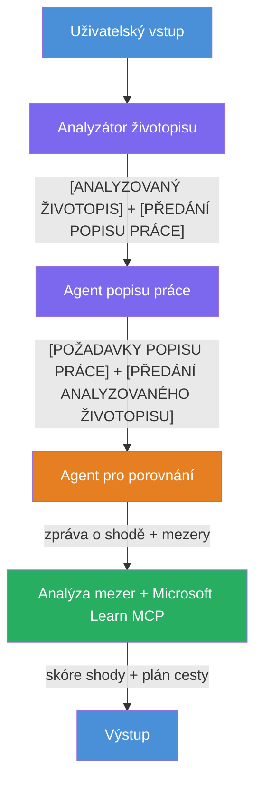

# Lab 02 - Víceagentní pracovní postup: Hodnocení shody životopisu a práce

## Přehled

V tomto praktickém laboratoři vytvoříte **aplikaci více agentů řízenou pracovním postupem** pomocí Foundry Toolkit ve VS Code a nasadíte ji do Microsoft Foundry Agent Service.

**Co vytvoříte:** hodnotič shody životopisu a pracovní pozice, který analyzuje životopis a popis pracovní pozice, ohodnotí shodu a vytvoří personalizovanou vzdělávací cestu pomocí zdrojů Microsoft Learn.

---

## Architektura

```mermaid
flowchart TD
    A["Uživatelský vstup"] --> B["Analyzátor životopisu"]
    B -->|"[ANALYZOVANÝ ŽIVOTOPIS] + [PŘEDÁNÍ POPISU PRÁCE]"| C["Agent popisu práce"]
    C -->|"[POŽADAVKY POPISU PRÁCE] + [PŘEDÁNÍ ANALYZOVANÉHO ŽIVOTOPISU]"| D["Agent pro porovnání"]
    D -->|zpráva o shodě + mezery| E["Analýza mezer + Microsoft Learn MCP"]
    E -->|skóre shody + plán cesty| F["Výstup"]

    style A fill:#4A90D9,color:#fff
    style B fill:#7B68EE,color:#fff
    style C fill:#7B68EE,color:#fff
    style D fill:#E67E22,color:#fff
    style E fill:#27AE60,color:#fff
    style F fill:#4A90D9,color:#fff
```

**Jak to funguje:**
1. Uživatel vloží životopis a popis pracovní pozice.
2. **ResumeParser** analyzuje životopis a přesnou kopii popisu pracovní pozice vloží do sekce `[JOB DESCRIPTION PASS-THROUGH]`.
3. **JD Agent** extrahuje strukturované požadavky z předané části, poté předá `[PARSED RESUME]` dál jako `[PARSED RESUME PASS-THROUGH]`.
4. **MatchingAgent** porovnává `[PARSED RESUME PASS-THROUGH]` a `[JD REQUIREMENTS]` a vypočítá skóre shody.
5. **GapAnalyzer** převede mezery na praktickou cestu a pomocí MCP načte reálné odkazy Microsoft Learn.

---

## Požadavky

Nejprve dokončete Lab 01:

- [Lab 01 - Single Agent](../lab01-single-agent/README.md)

---

## Část 1: Čtěte moduly v pořadí

Kompletní vzdělávací cestu najdete v:

- [Lab 2 Docs - Prerequisites](docs/00-prerequisites.md)
- [Lab 2 Docs - Full Learning Path](docs/README.md)
- [PersonalCareerCopilot run guide](PersonalCareerCopilot/README.md)

---

## Část 2: Vytvořte a otestujte pracovní postup

1. Použijte průvodce Foundry Toolkit k vytvoření projektu založeného na pracovním postupu.
2. Zkopírujte bloky promptů a graf pracovního postupu z `PersonalCareerCopilot/main.py` do svého pracovního prostoru.
3. Spusťte lokálně s Agent Inspector a ověřte všechny čtyři agenty plus nástroj MCP.
4. Nasadíte hostovaného agenta do Foundry, když lokální testování projde.

---

## Vzory orchestrací

Lab 02 zahrnuje výchozí tok **fan-out → fan-in → sekvenční**, a dokumentace také popisuje alternativní vzory orchestrací pro experimentování.

- **Fan-out/Fan-in s váženým konsensem**
- **Průchod recenzenta/kritika před finální cestou**
- **Podmíněný směrovač** založený na skóre shody a chybějících dovednostech

Viz [docs/04-orchestration-patterns.md](docs/04-orchestration-patterns.md).

---

**Předchozí:** [Lab 01 - Single Agent](../lab01-single-agent/README.md) · **Zpět na:** [Workshop Home](../../README.md)

---

<!-- CO-OP TRANSLATOR DISCLAIMER START -->
**Prohlášení o omezení odpovědnosti**:
Tento dokument byl přeložen pomocí AI překladatelské služby [Co-op Translator](https://github.com/Azure/co-op-translator). Přestože usilujeme o co největší přesnost, mějte prosím na paměti, že automatizované překlady mohou obsahovat chyby nebo nepřesnosti. Originální dokument v jeho mateřském jazyce by měl být považován za autoritativní zdroj. Pro kritické informace se doporučuje profesionální lidský překlad. Nejsme odpovědní za jakékoli nedorozumění nebo nesprávné interpretace vzniklé použitím tohoto překladu.
<!-- CO-OP TRANSLATOR DISCLAIMER END -->