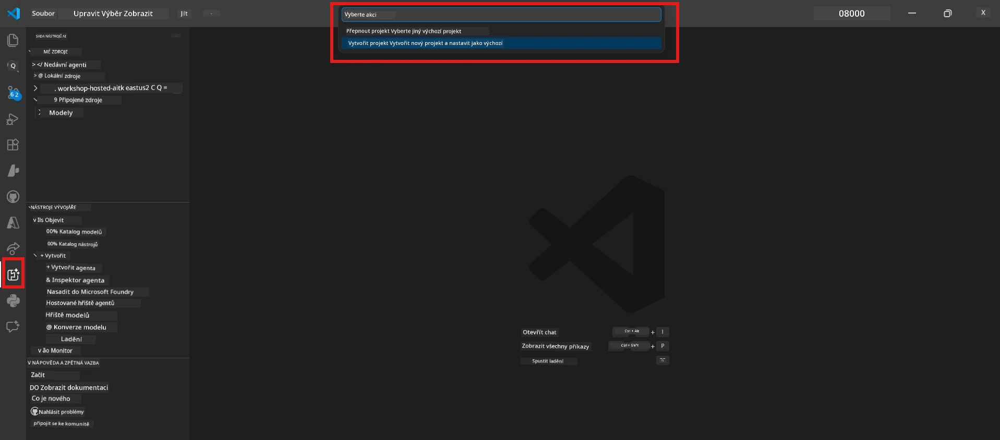

# Modul 0 - Požadavky

Než začnete s Laboratoří 02, ujistěte se, že máte dokončeno následující. Tato laboratoř navazuje přímo na Laboratoř 01 – nevynechávejte ji.

---

## 1. Dokončit Laboratoř 01

Laboratoř 02 předpokládá, že jste již:

- [x] Dokončili všech 8 modulů [Laboratoř 01 - Jednotlivý agent](../../lab01-single-agent/README.md)
- [x] Úspěšně nasadili jednoho agenta do Foundry Agent Service
- [x] Ověřili, že agent funguje jak v lokálním Agent Inspector, tak v Foundry Playground

Pokud jste Laboratoř 01 nedokončili, vraťte se a dokončete ji nyní: [Dokumentace Laboratoře 01](../../lab01-single-agent/docs/00-prerequisites.md)

---

## 2. Ověření stávajícího nastavení

Všechny nástroje z Laboratoře 01 by měly být stále nainstalované a funkční. Proveďte tyto rychlé kontroly:

### 2.1 Azure CLI

```powershell
az account show --query "{name:name, id:id}" --output table
```

Očekává se: Zobrazí se název a ID vašeho předplatného. Pokud to selže, spusťte [`az login`](https://learn.microsoft.com/cli/azure/authenticate-azure-cli-interactively).

### 2.2 Rozšíření VS Code

1. Stiskněte `Ctrl+Shift+P` → napište **"Microsoft Foundry"** → potvrďte, že vidíte příkazy (např. `Microsoft Foundry: Create a New Hosted Agent`).
2. Stiskněte `Ctrl+Shift+P` → napište **"Foundry Toolkit"** → potvrďte, že vidíte příkazy (např. `Foundry Toolkit: Open Agent Inspector`).

### 2.3 Projekt Foundry a model

1. Klikněte na ikonu **Microsoft Foundry** v liště aktivit VS Code.
2. Potvrďte, že je váš projekt zobrazen (např. `workshop-agents`).
3. Rozbalte projekt → ověřte, že existuje nasazený model (např. `gpt-4.1-mini`) se stavem **Succeeded**.

> **Pokud vypršela platnost nasazení modelu:** Některá nasazení ve volné vrstvě se automaticky expirují. Nasadťe znovu z [Modelového katalogu](https://learn.microsoft.com/azure/foundry/foundry-models/concepts/models-sold-directly-by-azure) (`Ctrl+Shift+P` → **Microsoft Foundry: Open Model Catalog**).



### 2.4 RBAC role

Ověřte, že máte roli **Azure AI User** na vašem projektu Foundry:

1. [Azure Portal](https://portal.azure.com) → váš zdroj projektu Foundry → **Řízení přístupu (IAM)** → záložka **[Přiřazení rolí](https://learn.microsoft.com/azure/foundry/concepts/rbac-foundry)**.
2. Vyhledejte své jméno → potvrďte, že je uvedena role **[Azure AI User](https://aka.ms/foundry-ext-project-role)**.

---

## 3. Pochopit koncepty multi-agentů (nové pro Laboratoř 02)

Laboratoř 02 zavádí koncepty, které nebyly pokryty v Laboratoři 01. Přečtěte si je před pokračováním:

### 3.1 Co je multi-agentní workflow?

Místo jednoho agenta, který řeší vše, **multi-agentní workflow** rozděluje práci mezi více specializovaných agentů. Každý agent má:

- své vlastní **pokyny** (systémový prompt)
- svou vlastní **roli** (za co je odpovědný)
- volitelné **nástroje** (funkce, které může volat)

Agenti komunikují prostřednictvím **orchestrace**, která definuje, jak mezi nimi data proudí.

### 3.2 WorkflowBuilder

Třída [`WorkflowBuilder`](https://learn.microsoft.com/agent-framework/workflows/agents-in-workflows) z `agent_framework` je SDK komponenta, která propojuje agenty:

```python
from agent_framework import WorkflowBuilder

workflow = (
    WorkflowBuilder(
        name="MyWorkflow",
        start_executor=agent_a,
        output_executors=[agent_d],
    )
    .add_edge(agent_a, agent_b)
    .add_edge(agent_a, agent_c)
    .add_edge(agent_b, agent_d)
    .add_edge(agent_c, agent_d)
    .build()
)
```

- **`start_executor`** - první agent, který přijímá vstup od uživatele
- **`output_executors`** - agent(i), jehož/v jejichž výstup se stává konečná odpověď
- **`add_edge(source, target)`** - definuje, že `target` přijímá výstup ze `source`

### 3.3 MCP (Model Context Protocol) nástroje

Laboratoř 02 používá **MCP nástroj**, který volá Microsoft Learn API pro získání výukových zdrojů. [MCP (Model Context Protocol)](https://modelcontextprotocol.io/introduction) je standardizovaný protokol pro připojení AI modelů k externím zdrojům dat a nástrojům.

| Termín | Definice |
|--------|----------|
| **MCP server** | Služba, která vystavuje nástroje/zdroje prostřednictvím [MCP protokolu](https://learn.microsoft.com/azure/foundry/agents/how-to/tools/model-context-protocol) |
| **MCP klient** | Váš agentní kód, který se připojuje k MCP serveru a volá jeho nástroje |
| **[Streamable HTTP](https://learn.microsoft.com/agent-framework/agents/tools/hosted-mcp-tools)** | Přenosová metoda používaná pro komunikaci s MCP serverem |

### 3.4 Jak se Laboratoř 02 liší od Laboratoře 01

| Aspekt | Laboratoř 01 (Jednotlivý agent) | Laboratoř 02 (Multi-agent) |
|--------|----------------------|---------------------|
| Agenti | 1 | 4 (specializované role) |
| Orchestrace | Žádná | WorkflowBuilder (paralelní + sekvenční) |
| Nástroje | Nepovinná funkce `@tool` | MCP nástroj (volání externího API) |
| Složitost | Jednoduchý prompt → odpověď | Životopis + JD → skóre shody → plán |
| Tok kontextu | Přímý | Předávání mezi agenty |

---

## 4. Struktura repozitáře workshopu pro Laboratoř 02

Ujistěte se, že víte, kde jsou soubory Laboratoře 02:

```
workshop/
└── lab02-multi-agent/
    ├── README.md                       ← Lab overview
    ├── docs/                           ← You are here
    │   ├── README.md                   ← Learning path index
    │   ├── 00-prerequisites.md         ← This file
    │   ├── 01-understand-multi-agent.md
    │   ├── ...
    │   └── 08-troubleshooting.md
    └── PersonalCareerCopilot/          ← The agent project
        ├── agent.yaml                  ← Agent definition
        ├── main.py                     ← 4-agent workflow code
        ├── Dockerfile                  ← Container configuration
        └── requirements.txt            ← Python dependencies
```

---

### Kontrolní body

- [ ] Laboratoř 01 je plně dokončena (všechny 8 modulů, agent nasazený a ověřený)
- [ ] `az account show` vrací vaše předplatné
- [ ] Rozšíření Microsoft Foundry a Foundry Toolkit jsou nainstalovaná a reagují
- [ ] Projekt Foundry má nasazený model (např. `gpt-4.1-mini`)
- [ ] Máte roli **Azure AI User** na projektu
- [ ] Přečetli jste si výše sekci o multi-agentních konceptech a rozumíte WorkflowBuilder, MCP a orchestraci agentů

---

**Další:** [01 - Porozumět architektuře multi-agentů →](01-understand-multi-agent.md)

---

<!-- CO-OP TRANSLATOR DISCLAIMER START -->
**Prohlášení o vyloučení odpovědnosti**:  
Tento dokument byl přeložen pomocí AI překladatelské služby [Co-op Translator](https://github.com/Azure/co-op-translator). Přestože usilujeme o přesnost, mějte prosím na paměti, že automatické překlady mohou obsahovat chyby nebo nepřesnosti. Původní dokument v jeho mateřském jazyce by měl být považován za závazný zdroj. Pro důležité informace se doporučuje profesionální lidský překlad. Nejsme odpovědní za jakékoli nedorozumění nebo chybné výklady vzniklé použitím tohoto překladu.
<!-- CO-OP TRANSLATOR DISCLAIMER END -->