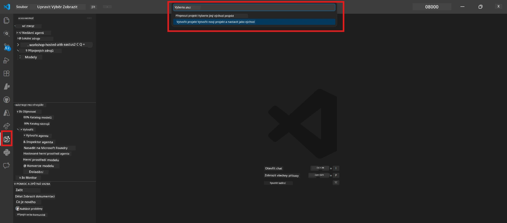

# Modul 0 - Úvod

⏱️ ~10 minut

> [!WARNING]
> **Náhled a omezení:** [Hostovaní agenti](https://learn.microsoft.com/azure/foundry/agents/concepts/hosted-agents) jsou aktuálně ve **veřejném náhledu** – nedoporučuje se pro produkční pracovní zátěže. Některé funkce zobrazené v tomto workshopu se mohou změnit při přechodu služby do GA.

## Co postavíte

V této laboratoři rozšíříte dovednosti jednotného agenta z Laboratoře 01 a vytvoříte **průběh práce s více agenty** – Hodnotitel životopisu → vhodnosti pro práci.

Vložíte **životopis** a **popis práce**. Čtyři specializovaní agenti zpracují vstup sekvenčně a vrátí:
- Skóre vhodnosti (0–100 s rozpisem bodování)
- Seznam nedostatků v dovednostech a certifikacích
- Personalizovanou vzdělávací cestu s reálnými odkazy na Microsoft Learn pro každý nedostatek

**Průběh práce využívá:**
- **Microsoft Agent Framework** – `WorkflowBuilder` pro sekvenční orchestraci pipeline
- **Foundry Toolkit pro VS Code** – scaffolding, lokální testování, nasazení
- **AI model** (např. `gpt-4.1-mini`) – využíván všemi čtyřmi agenty
- **Microsoft Learn MCP server** – poskytuje skutečné odkazy na vzdělávací zdroje pro každý nedostatek ve dovednostech

---

## Zvolte si cestu

> ⚠️ **Pokračujte stejnou cestou, kterou jste použili v Laboratoři 01.**

<details open>
<summary><strong>🅰️ Cesta A – Azure cloud (vyžaduje předplatné Azure)</strong></summary>

| | Podrobnosti |
|---|---|
| **Pro koho je to?** | Dokončili jste Laboratoř 01 s předplatným Azure |
| **Model** | Azure OpenAI přes Foundry (např. `gpt-4.1-mini`) |
| **Moduly pokryté** | Všechny moduly (00–09) |
| **Nasazení do cloudu?** | ✅ Ano – plné end-to-end nasazení |

</details>

<details open>
<summary><strong>🅱️ Cesta B – Foundry Local (není potřeba předplatné Azure)</strong></summary>

| | Podrobnosti |
|---|---|
| **Pro koho je to?** | Dokončili jste Laboratoř 01 s Foundry Local |
| **Model** | Foundry Local (zdarma, běží na vašem počítači) |
| **Moduly pokryté** | Moduly 00–05 (vynechte 06–07 – nasazení a cloudová verifikace) |
| **Nasazení do cloudu?** | ❌ Ne – pouze lokální testování přes Agent Inspector |

</details>

---

## Kontrola Laboratoře 01

Laboratoř 02 staví přímo na Laboratoři 01. Nejprve dokončete Laboratoř 01, než začnete zde.

Ještě jste neprovedli Laboratoř 01? Začněte zde: [Lab 01 - Úvod](../../lab01-single-agent/docs/00-prerequisites.md)

<details open>
<summary><strong>🅰️ Cesta A – Azure cloud</strong></summary>

```powershell
az account show --query "{name:name, id:id}" --output table
```

Pokud to selže, spusťte `az login`. Pak ověřte ve VS Code:

1. `Ctrl+Shift+P` → napište **Foundry Toolkit** → potvrďte, že se příkazy zobrazují.
2. Klikněte na ikonu **Foundry Toolkit** → váš projekt a nasazený model zobrazují **Succeeded**.



> **RBAC:** Přiřadili jste roli **Foundry User** v Laboratoři 01. Pokud ji potřebujete přiřadit znovu, viz [Laboratoř 01, Modul 1](../../lab01-single-agent/docs/01-setup.md#deploy-a-model--assign-rbac). Role byla dříve označena jako **Azure AI User** – stejné oprávnění.

</details>

<details open>
<summary><strong>🅱️ Cesta B – Foundry Local</strong></summary>

```powershell
Invoke-WebRequest -Uri "http://localhost:5273/v1/health" -UseBasicParsing | Select-Object StatusCode
```

Očekávané: `StatusCode: 200`. Pokud ne, restartujte Foundry Local z postranního panelu Foundry Toolkit.

> Veškeré inferenční běhy probíhají na vašem počítači. Jediný odchozí požadavek je na MCP nástroj do `https://learn.microsoft.com/api/mcp`.

</details>

---

## Co je nového v Laboratoři 02

| | Laboratoř 01 | Laboratoř 02 |
|--|--------|--------|
| Agenti | 1 | 4 (řetězeno s WorkflowBuilder) |
| Scaffold šablona | Základní – Agent Framework | Průběhy práce – Agent Framework |
| Nový balíček | - | `mcp` |
| Orchestrace | Jeden konverzační agent | Sekvenční pipeline (WorkflowBuilder) |
| Nový nástroj | - | `search_microsoft_learn_for_plan` (MCP) |

---

**Další:** [01 - Porozumění architektuře →](01-understand-multi-agent.md)

---

<!-- CO-OP TRANSLATOR DISCLAIMER START -->
**Prohlášení o omezení odpovědnosti**:
Tento dokument byl přeložen pomocí AI překladatelské služby [Co-op Translator](https://github.com/Azure/co-op-translator). Přestože usilujeme o co největší přesnost, mějte prosím na paměti, že automatizované překlady mohou obsahovat chyby nebo nepřesnosti. Originální dokument v jeho mateřském jazyce by měl být považován za autoritativní zdroj. Pro kritické informace se doporučuje profesionální lidský překlad. Nejsme odpovědní za jakékoli nedorozumění nebo nesprávné interpretace vzniklé použitím tohoto překladu.
<!-- CO-OP TRANSLATOR DISCLAIMER END -->