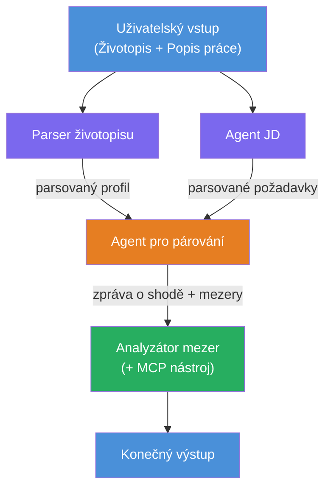
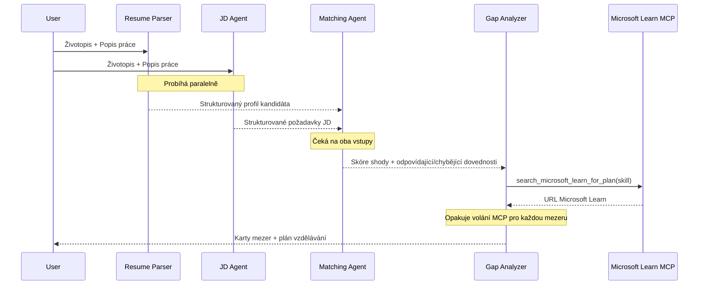
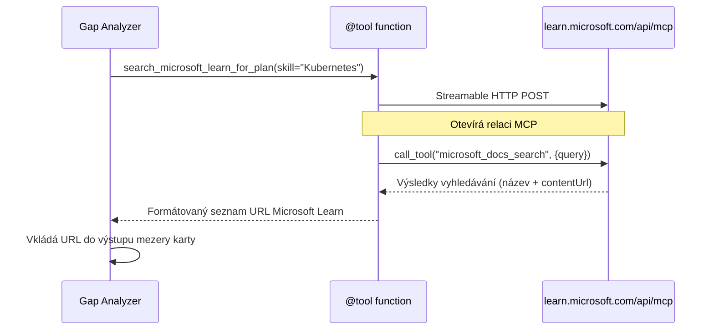

# Modul 1 - Pochopení architektury víceagentního systému

V tomto modulu se naučíte architekturu Resume → Job Fit Evaluator před tím, než začnete psát jakýkoli kód. Pochopení orchestrace grafu, rolí agentů a toku dat je klíčové pro debugování a rozšiřování [workflow více agentů](https://learn.microsoft.com/azure/architecture/ai-ml/idea/multiple-agent-workflow-automation).

---

## Problém, který řeší

Přiřazení životopisu k popisu práce zahrnuje několik odlišných dovedností:

1. **Parsování** - Extrakce strukturovaných dat z nestrukturovaného textu (životopis)
2. **Analýza** - Extrakce požadavků z popisu práce
3. **Porovnání** - Hodnocení shody mezi oběma
4. **Plánování** - Vytvoření učební cesty k vyplnění mezer

Jeden agent, který dělá všechna čtyři úkoly v jednom promptu, často produkuje:
- Neúplnou extrakci (přešvihne parsování, aby se dostal k hodnocení)
- Povrchní hodnocení (bez podrobného rozboru založeného na důkazech)
- Obecné plány (nepřizpůsobené konkrétním mezerám)

Rozdělením do **čtyř specializovaných agentů** se každý agent soustředí na svůj úkol s dedikovanými instrukcemi, což vede k vyšší kvalitě výstupu v každé fázi.

---

## Čtyři agenti

Každý agent je plnohodnotný [Microsoft Foundry](https://learn.microsoft.com/azure/foundry/agents/concepts/hosted-agents) agent vytvořený pomocí `AzureAIAgentClient.as_agent()`. Sdílí stejné deployment modelu, ale mají různé instrukce a (volitelně) různé nástroje.

| # | Název agenta | Role | Vstup | Výstup |
|---|--------------|------|-------|--------|
| 1 | **ResumeParser** | Extrahuje strukturovaný profil z textu životopisu | Surový text životopisu (od uživatele) | Profil kandidáta, Technické dovednosti, Měkké dovednosti, Certifikace, Odborné zkušenosti, Úspěchy |
| 2 | **JobDescriptionAgent** | Extrahuje strukturované požadavky z JD | Surový text JD (od uživatele, předaný přes ResumeParser) | Přehled role, Požadované dovednosti, Preferované dovednosti, Zkušenosti, Certifikace, Vzdělání, Odpovědnosti |
| 3 | **MatchingAgent** | Vypočítá hodnocení shody založené na důkazech | Výstupy z ResumeParser + JobDescriptionAgent | Hodnocení shody (0-100 s rozborem), Shodující se dovednosti, Chybějící dovednosti, Mezery |
| 4 | **GapAnalyzer** | Vytváří personalizovanou učební cestu | Výstup z MatchingAgent | Karty s mezerami (pro každou dovednost), Pořadí učení, Časový plán, Zdroje z Microsoft Learn |

---

## Orkestrační graf

Workflow používá **paralelní rozvětvení** následované **sekvenční agregací**:


> **Legenda:** Fialová = paralelní agenti, Oranžová = bod agregace, Zelená = finální agent s nástroji

### Jak plyne tok dat


1. **Uživatel odešle** zprávu obsahující životopis a popis práce.
2. **ResumeParser** přijme celý uživatelský vstup a extrahuje strukturovaný profil kandidáta.
3. **JobDescriptionAgent** přijme uživatelský vstup paralelně a extrahuje strukturované požadavky.
4. **MatchingAgent** obdrží výstupy od **obou** ResumeParser a JobDescriptionAgent (framework počká, až oba dokončí před spuštěním MatchingAgent).
5. **GapAnalyzer** obdrží výstup z MatchingAgent a zavolá **nástroj Microsoft Learn MCP**, aby získal skutečné učební zdroje pro každou mezeru.
6. **Konečný výstup** je odpověď GapAnalyzer, která obsahuje skóre shody, karty mezer a kompletní učební plán.

### Proč je paralelní rozvětvení důležité

ResumeParser a JobDescriptionAgent běží **paralelně**, protože ani jeden není závislý na druhém. To:
- Snižuje celkovou latenci (oba běží současně místo po sobě)
- Je přirozené rozdělení (parsování životopisu vs. parsování JD jsou nezávislé úkoly)
- Demonstruje běžný víceagentní vzorec: **rozvětvení → agregace → akce**

---

## WorkflowBuilder v kódu

Zde je, jak výše uvedený graf mapuje na volání API [`WorkflowBuilder`](https://learn.microsoft.com/agent-framework/workflows/agents-in-workflows) v souboru `main.py`:

```python
from agent_framework import WorkflowBuilder

workflow = (
    WorkflowBuilder(
        name="ResumeJobFitEvaluator",
        start_executor=resume_parser,       # První agent, který přijímá vstup od uživatele
        output_executors=[gap_analyzer],     # Konečný agent, jehož výstup je vrácen
    )
    .add_edge(resume_parser, jd_agent)      # ResumeParser → JobDescriptionAgent
    .add_edge(resume_parser, matching_agent) # ResumeParser → MatchingAgent
    .add_edge(jd_agent, matching_agent)      # JobDescriptionAgent → MatchingAgent
    .add_edge(matching_agent, gap_analyzer)  # MatchingAgent → GapAnalyzer
    .build()
)
```

**Pochopení hran:**

| Hrana | Význam |
|-------|---------|
| `resume_parser → jd_agent` | JD Agent obdrží výstup z ResumeParser |
| `resume_parser → matching_agent` | MatchingAgent obdrží výstup z ResumeParser |
| `jd_agent → matching_agent` | MatchingAgent obdrží také výstup z JD Agenta (čeká na oba) |
| `matching_agent → gap_analyzer` | GapAnalyzer obdrží výstup z MatchingAgent |

Protože `matching_agent` má **dvě příchozí hrany** (`resume_parser` a `jd_agent`), framework automaticky čeká na dokončení obou před spuštěním MatchingAgenta.

---

## MCP nástroj

Agent GapAnalyzer má jeden nástroj: `search_microsoft_learn_for_plan`. Tento nástroj je **[MCP nástroj](https://learn.microsoft.com/agent-framework/agents/tools/hosted-mcp-tools)**, který volá Microsoft Learn API k získání pečlivě vybraných učebních zdrojů.

### Jak to funguje

```python
@tool
async def search_microsoft_learn_for_plan(
    skill: str, role: str = "", max_results: int = 5
) -> str:
    """Search Microsoft Learn MCP and return curated official links."""
    # Připojuje se k https://learn.microsoft.com/api/mcp přes Streamable HTTP
    # Volá nástroj 'microsoft_docs_search' na serveru MCP
    # Vrací formátovaný seznam URL Microsoft Learn
```

### Průběh volání MCP


1. GapAnalyzer rozhodne, že potřebuje učební zdroje pro dovednost (např. "Kubernetes")
2. Framework zavolá `search_microsoft_learn_for_plan(skill="Kubernetes")`
3. Funkce otevře [Streamable HTTP](https://learn.microsoft.com/agent-framework/agents/tools/hosted-mcp-tools) spojení na `https://learn.microsoft.com/api/mcp`
4. Zavolá nástroj `microsoft_docs_search` na [MCP serveru](https://learn.microsoft.com/azure/foundry/agents/how-to/tools/model-context-protocol)
5. MCP server vrátí výsledky hledání (titul + URL)
6. Funkce naformátuje výsledky a vrátí je jako řetězec
7. GapAnalyzer použije vrácené URL ve svém výstupu karty mezery

### Očekávané MCP logy

Když nástroj běží, uvidíte zápisy v logu jako:

```
GET https://learn.microsoft.com/api/mcp → 405 (Method Not Allowed)
POST https://learn.microsoft.com/api/mcp → 200
DELETE https://learn.microsoft.com/api/mcp → 405 (Method Not Allowed)
```

**Tyto jsou normální.** MCP klient testuje pomocí GET a DELETE během inicializace – návrat 405 je očekávané chování. Samotné volání nástroje používá POST a vrací 200. Obávejte se pouze pokud POST volání selžou.

---

## Vzor tvorby agenta

Každý agent je vytvořen pomocí **[`AzureAIAgentClient.as_agent()`](https://learn.microsoft.com/python/api/overview/azure/ai-agents-readme) asynchronního správce kontextu**. Toto je vzorec Foundry SDK pro tvorbu agentů, kteří se automaticky čistě ukončí:

```python
async with (
    get_credential() as credential,
    AzureAIAgentClient(
        project_endpoint=PROJECT_ENDPOINT,
        model_deployment_name=MODEL_DEPLOYMENT_NAME,
        credential=credential,
    ).as_agent(
        name="ResumeParser",
        instructions=RESUME_PARSER_INSTRUCTIONS,
    ) as resume_parser,
    # ... opakovat pro každého agenta ...
):
    # Zde existují všichni 4 agenti
    workflow = create_workflow(resume_parser, jd_agent, matching_agent, gap_analyzer)
```

**Klíčové body:**
- Každý agent má vlastní instanci `AzureAIAgentClient` (SDK požaduje jméno agenta v rámci klienta)
- Všechny agenti sdílí stejné `credential`, `PROJECT_ENDPOINT` a `MODEL_DEPLOYMENT_NAME`
- Blok `async with` zajistí, že všichni agenti budou vyčištěni při vypnutí serveru
- GapAnalyzer navíc dostává `tools=[search_microsoft_learn_for_plan]`

---

## Spuštění serveru

Po vytvoření agentů a sestavení workflow se server spustí:

```python
from azure.ai.agentserver.agentframework import from_agent_framework

agent = create_workflow(resume_parser, jd_agent, matching_agent, gap_analyzer)
await from_agent_framework(agent).run_async()
```

`from_agent_framework()` zabalí workflow jako HTTP server vystavující endpoint `/responses` na portu 8088. Jedná se o stejný vzorec jako v Lab 01, ale „agent“ je nyní celý [graf workflow](https://learn.microsoft.com/agent-framework/workflows/as-agents).

---

### Kontrolní seznam

- [ ] Rozumíte architektuře se 4 agenty a roli každého agenta
- [ ] Dokážete sledovat tok dat: Uživatel → ResumeParser → (paralelně) JD Agent + MatchingAgent → GapAnalyzer → Výstup
- [ ] Rozumíte, proč MatchingAgent čeká na oba ResumeParser a JD Agenta (dvě příchozí hrany)
- [ ] Rozumíte MCP nástroji: co dělá, jak je volán a že GET 405 logy jsou normální
- [ ] Rozumíte vzorci `AzureAIAgentClient.as_agent()` a proč každý agent má vlastní instanci klienta
- [ ] Dokážete číst kód `WorkflowBuilder` a mapovat ho na vizuální graf

---

**Předchozí:** [00 - Prerekvizity](00-prerequisites.md) · **Další:** [02 - Vytvoření víceagentního projektu →](02-scaffold-multi-agent.md)

---

<!-- CO-OP TRANSLATOR DISCLAIMER START -->
**Prohlášení o vyloučení odpovědnosti**:
Tento dokument byl přeložen pomocí služby automatického překladu [Co-op Translator](https://github.com/Azure/co-op-translator). Přestože usilujeme o přesnost, mějte prosím na paměti, že automatické překlady mohou obsahovat chyby nebo nepřesnosti. Originální dokument v jeho rodném jazyce by měl být považován za autoritativní zdroj. Pro důležité informace se doporučuje profesionální lidský překlad. Nejsme odpovědní za jakékoli nedorozumění nebo mylné výklady vyplývající z použití tohoto překladu.
<!-- CO-OP TRANSLATOR DISCLAIMER END -->