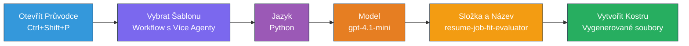
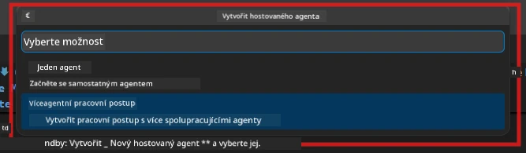

# Modul 2 - Vytvoření projektu Multi-Agenta

V tomto modulu použijete [rozšíření Microsoft Foundry](https://marketplace.visualstudio.com/items?itemName=TeamsDevApp.vscode-ai-foundry) k **vytvoření projektu s více agenty**. Rozšíření vygeneruje celou strukturu projektu - `agent.yaml`, `main.py`, `Dockerfile`, `requirements.txt`, `.env` a konfigurační soubory pro ladění. Tyto soubory si pak přizpůsobíte v Modulech 3 a 4.

> **Poznámka:** Složka `PersonalCareerCopilot/` v tomto cvičení je kompletní, fungující příklad přizpůsobeného multi-agentního projektu. Můžete buď vytvořit nový projekt (doporučeno pro učení), nebo studovat přímo existující kód.

---

## Krok 1: Otevřete průvodce vytvořením hostovaného agenta


1. Stiskněte `Ctrl+Shift+P` pro otevření **Příkazové palety**.
2. Zadejte: **Microsoft Foundry: Create a New Hosted Agent** a vyberte to.
3. Otevře se průvodce vytvořením hostovaného agenta.

> **Alternativa:** Klikněte na ikonu **Microsoft Foundry** v panelu aktivit → klikněte na ikonu **+** vedle **Agents** → **Create New Hosted Agent**.

---

## Krok 2: Vyberte šablonu Multi-Agent Workflow

Průvodce vás požádá o výběr šablony:

| Šablona | Popis | Kdy použít |
|----------|-------------|-------------|
| Single Agent | Jeden agent s instrukcemi a volitelnými nástroji | Lab 01 |
| **Multi-Agent Workflow** | Více agentů spolupracujících pomocí WorkflowBuilderu | **Toto cvičení (Lab 02)** |

1. Vyberte **Multi-Agent Workflow**.
2. Klikněte na **Next**.



---

## Krok 3: Vyberte programovací jazyk

1. Vyberte **Python**.
2. Klikněte na **Next**.

---

## Krok 4: Vyberte model

1. Průvodce zobrazí modely nasazené ve vašem projektu Foundry.
2. Vyberte stejný model, který jste používali v Lab 01 (např. **gpt-4.1-mini**).
3. Klikněte na **Next**.

> **Tip:** [`gpt-4.1-mini`](https://learn.microsoft.com/azure/foundry/foundry-models/concepts/models-sold-directly-by-azure#gpt-41-series) je doporučený pro vývoj - je rychlý, levný a dobře zvládá multi-agentní workflow. Pro konečné produkční nasazení můžete přepnout na `gpt-4.1` pro vyšší kvalitu výstupu.

---

## Krok 5: Vyberte umístění složky a jméno agenta

1. Otevře se dialogové okno pro výběr složky. Vyberte cílovou složku:
   - Pokud pracujete s repozitářem workshopu: přejděte do `workshop/lab02-multi-agent/` a vytvořte novou podsložku
   - Pokud začínáte od začátku: vyberte libovolnou složku
2. Zadejte **jméno** pro hostovaného agenta (např. `resume-job-fit-evaluator`).
3. Klikněte na **Create**.

---

## Krok 6: Počkejte na dokončení scaffoldingu

1. VS Code otevře nové okno (nebo aktualizuje aktuální okno) s vytvořeným projektem.
2. Měli byste vidět tuto strukturu souborů:

```
resume-job-fit-evaluator/
├── .env                ← Environment variables (placeholders)
├── .vscode/
│   └── launch.json     ← Debug configuration
├── agent.yaml          ← Agent definition (kind: hosted)
├── Dockerfile          ← Container configuration
├── main.py             ← Multi-agent workflow code (scaffold)
└── requirements.txt    ← Python dependencies
```

> **Poznámka k workshopu:** V repozitáři workshopu je složka `.vscode/` v **kořeni pracovního prostoru** se sdílenými soubory `launch.json` a `tasks.json`. Konfigurace ladění pro Lab 01 i Lab 02 jsou obě zahrnuty. Při stisku F5 zvolte z rozbalovací nabídky **"Lab02 - Multi-Agent"**.

---

## Krok 7: Pochopte scaffoldované soubory (specifika multi-agenta)

Scaffold pro multi-agenta se liší od jedo-agenta v několika klíčových aspektech:

### 7.1 `agent.yaml` - Definice agenta

```yaml
kind: hosted
name: resume-job-fit-evaluator
description: >
  A multi-agent workflow that evaluates resume-to-job fit.
metadata:
  authors:
    - Microsoft
  tags:
    - Multi-Agent Workflow
    - Resume Evaluator
protocols:
  - protocol: responses
    version: v1
environment_variables:
  - name: PROJECT_ENDPOINT
    value: ${PROJECT_ENDPOINT}
  - name: MODEL_DEPLOYMENT_NAME
    value: ${MODEL_DEPLOYMENT_NAME}
```

**Hlavní rozdíl oproti Lab 01:** Sekce `environment_variables` může obsahovat další proměnné pro MCP endpoints nebo jinou konfiguraci nástrojů. `name` a `description` odrážejí použití multi-agenta.

### 7.2 `main.py` - Kód multi-agentního workflow

Skelet obsahuje:
- **Více instrukčních řetězců pro agenty** (jedna konstanta pro každého agenta)
- **Více [`AzureAIAgentClient.as_agent()`](https://learn.microsoft.com/python/api/overview/azure/ai-agents-readme) kontextových manažerů** (jeden pro každého agenta)
- **[`WorkflowBuilder`](https://learn.microsoft.com/agent-framework/workflows/agents-in-workflows)** k propojení agentů
- **`from_agent_framework()`** k vystavení workflow jako HTTP endpointu

```python
from agent_framework import WorkflowBuilder, tool
from agent_framework.azure import AzureAIAgentClient
from azure.ai.agentserver.agentframework import from_agent_framework
```

Navíc import [`WorkflowBuilder`](https://learn.microsoft.com/agent-framework/workflows/agents-in-workflows) je novinkou oproti Lab 01.

### 7.3 `requirements.txt` - Další závislosti

Multi-agentní projekt používá stejné základní balíčky jako Lab 01, plus balíčky spojené s MCP:

```
agent-framework-azure-ai==1.0.0rc3
agent-framework-core==1.0.0rc3
azure-ai-agentserver-agentframework==1.0.0b16
azure-ai-agentserver-core==1.0.0b16
debugpy
agent-dev-cli --pre
```

> **Důležitá poznámka k verzím:** Balíček `agent-dev-cli` vyžaduje v `requirements.txt` přepínač `--pre` pro instalaci nejnovější preview verze. To je potřeba pro kompatibilitu Agent Inspektora s `agent-framework-core==1.0.0rc3`. Detailní informace viz [Modul 8 - Řešení potíží](08-troubleshooting.md).

| Balíček | Verze | Účel |
|---------|---------|---------|
| [`agent-framework-azure-ai`](https://learn.microsoft.com/agent-framework/overview/) | `1.0.0rc3` | Integrace Azure AI pro [Microsoft Agent Framework](https://github.com/microsoft/agent-framework) |
| [`agent-framework-core`](https://learn.microsoft.com/agent-framework/overview/) | `1.0.0rc3` | Jádro runtime (obsahuje WorkflowBuilder) |
| `azure-ai-agentserver-agentframework` | `1.0.0b16` | Runtime hostovaného agenta serveru |
| `azure-ai-agentserver-core` | `1.0.0b16` | Základní abstrakce agentního serveru |
| `debugpy` | latest | Ladění Pythonu (F5 ve VS Code) |
| `agent-dev-cli` | `--pre` | Lokální vývojové CLI + backend Agent Inspektora |

### 7.4 `Dockerfile` - Stejné jako v Lab 01

Dockerfile je totožný s Lab 01 - kopíruje soubory, instaluje závislosti z `requirements.txt`, vystavuje port 8088 a spouští `python main.py`.

```dockerfile
FROM python:3.14-slim
WORKDIR /app
COPY ./ .
RUN pip install --upgrade pip && \
    if [ -f requirements.txt ]; then \
        pip install -r requirements.txt; \
    else \
      echo "No requirements.txt found" >&2; exit 1; \
    fi
EXPOSE 8088
CMD ["python", "main.py"]
```

---

### Kontrolní bod

- [ ] Průvodce scaffoldingu dokončen → nová struktura projektu je viditelná
- [ ] Vidíte všechny soubory: `agent.yaml`, `main.py`, `Dockerfile`, `requirements.txt`, `.env`
- [ ] `main.py` obsahuje import `WorkflowBuilder` (potvrzuje výběr multi-agentní šablony)
- [ ] `requirements.txt` obsahuje jak `agent-framework-core`, tak `agent-framework-azure-ai`
- [ ] Rozumíte, jak se scaffold multi-agenta liší od jedo-agenta (více agentů, WorkflowBuilder, MCP nástroje)

---

**Předchozí:** [01 - Pochopení multi-agentní architektury](01-understand-multi-agent.md) · **Další:** [03 - Konfigurace agentů a prostředí →](03-configure-agents.md)

---

<!-- CO-OP TRANSLATOR DISCLAIMER START -->
**Upozornění**:  
Tento dokument byl přeložen pomocí AI překladatelské služby [Co-op Translator](https://github.com/Azure/co-op-translator). Ačkoliv usilujeme o přesnost, mějte na paměti, že automatizované překlady mohou obsahovat chyby nebo nepřesnosti. Původní dokument v jeho mateřském jazyce by měl být považován za autoritativní zdroj. Pro důležité informace se doporučuje využít profesionální lidský překlad. Nejsme odpovědní za jakákoliv nedorozumění nebo špatné interpretace vyplývající z použití tohoto překladu.
<!-- CO-OP TRANSLATOR DISCLAIMER END -->