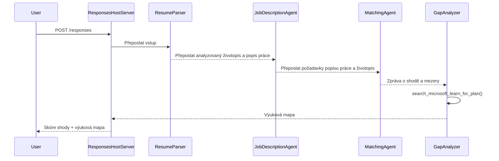

# Modul 3 - Konfigurace instrukcí, prostředí a instalace závislostí

⏱️ ~15 min

V tomto modulu proměníte scaffoldovaný základ do **vašeho** multiagentního pracovního postupu – nastavením proměnných prostředí, napsáním instrukcí pro agenty, přidáním nástroje MCP, propojením grafu pracovního postupu a instalací závislostí.

> **Reference:** Kompletní funkční kód najdete v [`PersonalCareerCopilot/main.py`](../../../../../workshop/lab02-multi-agent/PersonalCareerCopilot/main.py). Použijte jej jako referenci při vytváření vlastního grafu pracovního postupu a bloků promptů.

---

## Jak čtyři agenti spolupracují



---

## Krok 1: Nastavení proměnných prostředí

1. Otevřete soubor **`.env`** ve kořenovém adresáři projektu (vytvořený průvodcem scaffoldu).
2. Nahraďte zástupné hodnoty skutečnými hodnotami z Lab 01.

<details open>
<summary><strong>🅰️ Cesta A - Odběr Foundry</strong></summary>

```env
FOUNDRY_PROJECT_ENDPOINT=https://<your-account>.services.ai.azure.com/api/projects/<your-project>
AZURE_AI_MODEL_DEPLOYMENT_NAME=gpt-4.1-mini
```

> **Kde najít hodnoty:** Viz [Lab 01, Modul 1](../../lab01-single-agent/docs/01-setup.md#deploy-a-model--assign-rbac).

</details>

<details open>
<summary><strong>🅱️ Cesta B - Foundry Local</strong></summary>

```env
FOUNDRY_PROJECT_ENDPOINT=http://localhost:5273/v1
AZURE_AI_MODEL_DEPLOYMENT_NAME=phi-4-mini
```

> Veškerý inference běží na vašem stroji – žádná data neopouští vaše zařízení. Spusťte `foundry model list`, abyste potvrdili přesný alias modelu. Jediný odchozí požadavek je volání nástroje MCP na `https://learn.microsoft.com/api/mcp`.

> **Kde najít hodnoty:** Viz [Lab 01, Modul 1 - lokální cesta](../../lab01-single-agent/docs/01-setup.md#step-2-set-up-based-on-your-access).

</details>

> **Bezpečnost:** Nikdy nepřidávejte `.env` do verzovacího systému. Měl by být již v `.gitignore`.

---

## Krok 2: Napište instrukce agentům

Instrukce definují roli každého agenta, formát výstupu a pravidla. Otevřete `main.py` a definujte (nebo nahraďte) čtyři konstanty instrukcí – kompletní texty jsou v [`PersonalCareerCopilot/main.py`](../../../../../workshop/lab02-multi-agent/PersonalCareerCopilot/main.py).

### 2.1 `RESUME_PARSER_INSTRUCTIONS`
Parsuje životopis do strukturovaného profilu kandidáta **a** doslovně kopíruje popis práce do `[JOB DESCRIPTION PASS-THROUGH]`. Obě označené sekce musí být v tomto výstupu.

> **Proč ten pass-through?** S `context_mode="last_agent"` je ResumeParser **jediný** agent, který vidí původní uživatelskou zprávu. Pokud nepřepošle JD dál, další agenti ji nikdy neuvidí.

### 2.2 `JOB_DESCRIPTION_INSTRUCTIONS`
Čte `[PARSED RESUME]` a `[JOB DESCRIPTION PASS-THROUGH]` z výstupu ResumeParseru. Vytváří `[JD REQUIREMENTS]` (strukturované požadavky) a `[PARSED RESUME PASS-THROUGH]` (doslovnou kopii životopisu pro MatchingAgent).

### 2.3 `MATCHING_AGENT_INSTRUCTIONS`
Čte `[JD REQUIREMENTS]` a `[PARSED RESUME PASS-THROUGH]`. Produkuje report hodnocení shody (0–100) s rozpisem matematiky, odpovídajícími dovednostmi, chybějícími dovednostmi a sladěním zkušeností.

### 2.4 `GAP_ANALYZER_INSTRUCTIONS`
Čte report shody. Pro **každou** chybějící dovednost volá `search_microsoft_learn_for_plan`, aby získal zdroje Microsoft Learn. Produkuje jednu detailní kartu mezery na dovednost plus týdenní plán učení.

---

## Krok 3: Přidejte nástroj MCP

GapAnalyzer volá [Microsoft Learn MCP server](https://learn.microsoft.com/azure/foundry/agents/how-to/tools/model-context-protocol), aby získal skutečné učební zdroje pro každou mezery ve znalostech. Kompletní funkce `search_microsoft_learn_for_plan` je v [`PersonalCareerCopilot/main.py`](../../../../../workshop/lab02-multi-agent/PersonalCareerCopilot/main.py).

Registrujte nástroj na GapAnalyzer při vytváření agenta:

```python
gap_analyzer = Agent(
    client=client,
    instructions=GAP_ANALYZER_INSTRUCTIONS,
    name="GapAnalyzer",
    tools=[search_microsoft_learn_for_plan],
)
```

> Viz [`PersonalCareerCopilot/main.py`](../../../../../workshop/lab02-multi-agent/PersonalCareerCopilot/main.py) pro kompletní graf `WorkflowBuilder` s `FoundryChatClient`, `AgentExecutor` a všemi voláními `add_edge()`.

---

## Krok 4: Vytvořte virtuální prostředí a nainstalujte závislosti

> ⚠️ **Tento krok nevynechávejte.** Bez nainstalovaných závislostí nebude fungovat ladění přes F5.

### 4.1 Vytvoření virtuálního prostředí

```powershell
python -m venv .venv
```

### 4.2 Aktivace

| OS | Příkaz |
|----|---------|
| **Windows (PowerShell)** | `.\.venv\Scripts\Activate.ps1` |
| **Windows (CMD)** | `.venv\Scripts\activate.bat` |
| **macOS / Linux** | `source .venv/bin/activate` |

V terminálu byste měli vidět `(.venv)` v promptu.

### 4.3 Instalace závislostí

```powershell
pip install -r requirements.txt
```

### 4.4 Ověření

```powershell
pip list | Select-String "agent-framework|mcp|debugpy"
```

Očekávané: `agent-framework-foundry`, `agent-framework-foundry-hosting`, `mcp` a `debugpy` jsou uvedeny.

---

## Krok 5: Ověření autentizace

<details open>
<summary><strong>🅰️ Cesta A - Azure přihlašovací údaje</strong></summary>

```powershell
az account show --query "{name:name, id:id}" --output table
```

Pokud selže, spusťte [`az login`](https://learn.microsoft.com/cli/azure/authenticate-azure-cli-interactively).

Všichni čtyři agenti sdílejí jednoho `FoundryChatClient` a jedno `DefaultAzureCredential`. Pokud autentizace funguje pro jednoho, funguje pro všechny.

</details>

<details open>
<summary><strong>🅱️ Cesta B - Foundry Local</strong></summary>

Pro lokální testování není potřeba autentizace.

</details>

---

### ✅ Kontrolní bod

> Nepokračujte do Modulu 04, dokud: **(1)** v promptu nebude vidět `(.venv)` A **(2)** příkaz `pip install -r requirements.txt` neběžel s chybami.

- [ ] `.env` obsahuje platný endpoint a název nasazení modelu (ne zástupné znaky)
- [ ] Všechny 4 konstanty instrukcí agentů definovány v `main.py` (ResumeParser, JD Agent, MatchingAgent, GapAnalyzer)
- [ ] MCP nástroj `search_microsoft_learn_for_plan` definován a registrován na GapAnalyzer
- [ ] `FoundryChatClient` + 4 `Agent` + 4 `AgentExecutor` objekty vytvořeny v `main()`
- [ ] `WorkflowBuilder` sestavuje správný sekvenční graf se všemi 3 voláními `add_edge()`
- [ ] Virtuální prostředí vytvořeno a aktivováno (`(.venv)` viditelné v promptu)
- [ ] `pip install -r requirements.txt` proběhl bez chyb
- [ ] **Cesta A:** příkaz `az account show` proběhl úspěšně NEBO ikona účtů ve VS Code ukazuje přihlášený účet

---

**Předchozí:** [02 - Scaffold Multi-Agent Project](02-scaffold-multi-agent.md) · **Další:** [04 - Orchestration Patterns →](04-orchestration-patterns.md)

---

<!-- CO-OP TRANSLATOR DISCLAIMER START -->
**Prohlášení o omezení odpovědnosti**:
Tento dokument byl přeložen pomocí AI překladatelské služby [Co-op Translator](https://github.com/Azure/co-op-translator). Přestože usilujeme o co největší přesnost, mějte prosím na paměti, že automatizované překlady mohou obsahovat chyby nebo nepřesnosti. Originální dokument v jeho mateřském jazyce by měl být považován za autoritativní zdroj. Pro kritické informace se doporučuje profesionální lidský překlad. Nejsme odpovědní za jakékoli nedorozumění nebo nesprávné interpretace vzniklé použitím tohoto překladu.
<!-- CO-OP TRANSLATOR DISCLAIMER END -->