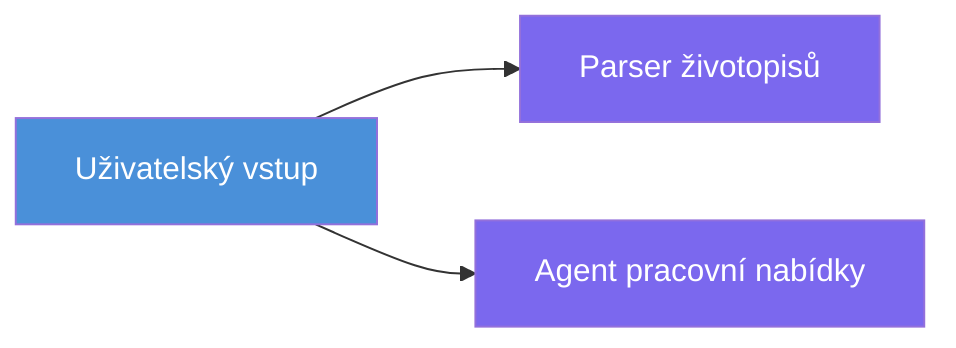
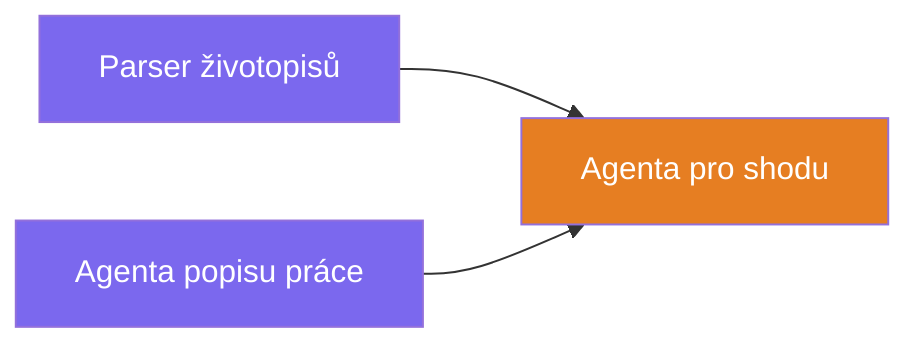
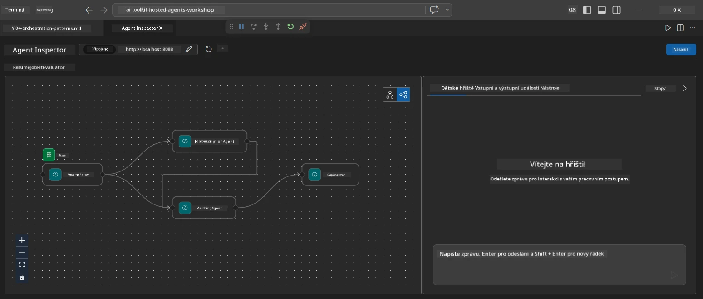
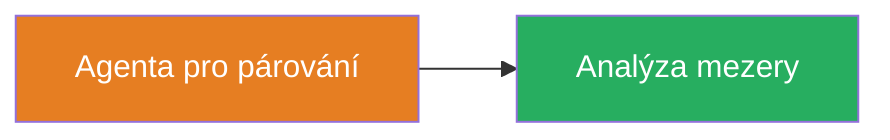
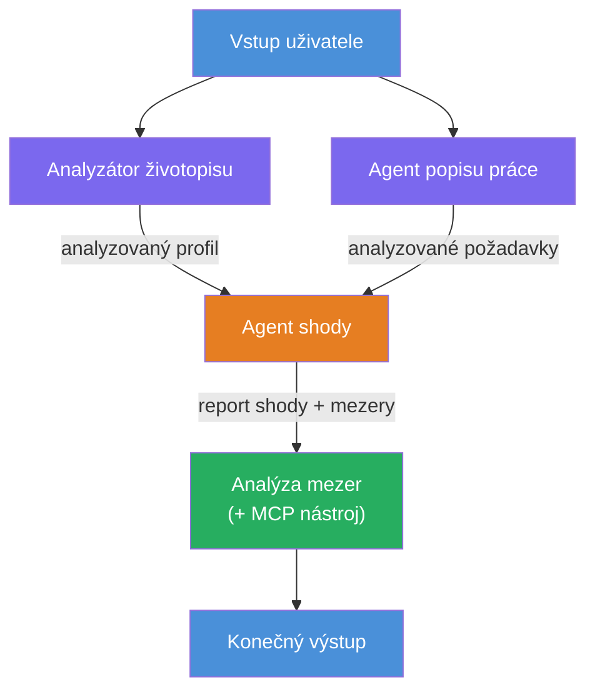
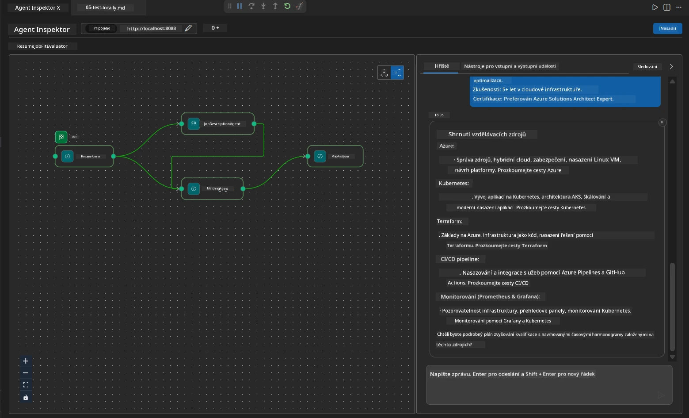

# Modul 4 - Orchestrace vzory

V tomto modulu prozkoumáte vzory orchestrace používané v Resume Job Fit Evaluator a naučíte se, jak číst, upravovat a rozšiřovat graf pracovního postupu. Porozumění těmto vzorům je nezbytné pro ladění problémů s tokem dat a vytváření vašich vlastních [workflow s více agenty](https://learn.microsoft.com/agent-framework/workflows/).

---

## Vzor 1: Fan-out (paralelní rozdělení)

Prvním vzorem v pracovním postupu je **fan-out** - jeden vstup je odeslán současně více agentům.


V kódu se to děje proto, že `resume_parser` je `start_executor` - přijímá uživatelskou zprávu jako první. Protože však mají jak `jd_agent`, tak i `matching_agent` hrany z `resume_parser`, framework směruje výstup z `resume_parser` oběma agentům:

```python
.add_edge(resume_parser, jd_agent)         # Výstup ResumeParser → JD Agent
.add_edge(resume_parser, matching_agent)   # Výstup ResumeParser → MatchingAgent
```

**Proč to funguje:** ResumeParser a JD Agent zpracovávají různé aspekty toho samého vstupu. Spuštění paralelně zkracuje celkovou latenci oproti sekvenčnímu spuštění.

### Kdy použít fan-out

| Použití | Příklad |
|----------|---------|
| Nezávislé podúkoly | Parsování životopisu vs. parsování JD (Job Description) |
| Redundance / hlasování | Dva agenti analyzují stejná data, třetí vybere nejlepší odpověď |
| Výstup v různých formátech | Jeden agent generuje text, druhý generuje strukturovaný JSON |

---

## Vzor 2: Fan-in (agregace)

Druhým vzorem je **fan-in** - výstupy více agentů jsou shromážděny a odeslány jednomu následnému agentu.


V kódu:

```python
.add_edge(resume_parser, matching_agent)   # Výstup ResumeParseru → MatchingAgent
.add_edge(jd_agent, matching_agent)        # Výstup JD Agenta → MatchingAgent
```

**Klíčové chování:** Když má agent **dvě či více příchozích hran**, framework automaticky čeká na **všechny** vyšší agenty, než spustí následujícího agenta. MatchingAgent nezačne, dokud neukončí ResumeParser i JD Agent.

### Co MatchingAgent přijímá

Framework spojí výstupy ze všech nadřazených agentů. Vstup pro MatchingAgent vypadá takto:

```
[ResumeParser output]
---
Candidate Profile:
  Name: Jane Doe
  Technical Skills: Python, Azure, Kubernetes, ...
  ...

[JobDescriptionAgent output]
---
Role Overview: Senior Cloud Engineer
Required Skills: Python, Azure, Terraform, ...
...
```

> **Poznámka:** Přesný formát spojení závisí na verzi frameworku. Instrukce agenta by měly být napsány tak, aby zvládaly jak strukturovaný, tak nestrukturovaný výstup z nadřazených agentů.



---

## Vzor 3: Sekvenční řetězec

Třetím vzorem je **sekvenční řetězení** - výstup jednoho agenta přímo prochází do dalšího.


V kódu:

```python
.add_edge(matching_agent, gap_analyzer)    # Výstup MatchingAgent → GapAnalyzer
```

Toto je nejjednodušší vzor. GapAnalyzer přijímá fit skóre od MatchingAgent, přiřazené/chybějící dovednosti a mezery. Poté volá [MCP nástroj](https://learn.microsoft.com/azure/foundry/agents/how-to/tools/model-context-protocol) pro každou mezeru, aby získal zdroje Microsoft Learn.

---

## Kompletní graf

Kombinace všech tří vzorů vytváří celý pracovní postup:


### Časová osa vykonávání

```mermaid
gantt
    title Časová osa spuštění agenta
    dateFormat X
    axisFormat %s

    section Paralelní
    Resume Parser       :rp, 0, 3
    JD Agent            :jd, 0, 2

    section Sekvenční
    Matching Agent      :ma, 3, 5
    Gap Analyzer        :ga, 5, 9
```


> Celkový čas na hodinách je přibližně `max(ResumeParser, JD Agent) + MatchingAgent + GapAnalyzer`. GapAnalyzer je obvykle nejpomalejší, protože provádí více volání MCP nástroje (jedno na každou mezeru).

---

## Čtení kódu WorkflowBuilder

Zde je kompletní funkce `create_workflow()` z `main.py`, s poznámkami:

```python
def create_workflow(resume_parser, jd_agent, matching_agent, gap_analyzer):
    workflow = (
        WorkflowBuilder(
            name="ResumeJobFitEvaluator",

            # První agent, který obdrží uživatelský vstup
            start_executor=resume_parser,

            # Agent(i), jejichž výstup se stane konečnou odpovědí
            output_executors=[gap_analyzer],
        )
        # Rozvětvení: Výstup ResumeParser jde jak do JD Agenta, tak do MatchingAgenta
        .add_edge(resume_parser, jd_agent)
        .add_edge(resume_parser, matching_agent)

        # Slučování: MatchingAgent čeká na oba, ResumeParser i JD Agenta
        .add_edge(jd_agent, matching_agent)

        # Sekvenční: Výstup MatchingAgenta je vstupem pro GapAnalyzer
        .add_edge(matching_agent, gap_analyzer)

        .build()
    )
    return workflow.as_agent()
```

### Tabulka shrnutí hran

| # | Hrana | Vzor | Efekt |
|---|-------|-------|-------|
| 1 | `resume_parser → jd_agent` | Fan-out | JD Agent přijímá výstup ResumeParseru (plus původní uživatelský vstup) |
| 2 | `resume_parser → matching_agent` | Fan-out | MatchingAgent přijímá výstup ResumeParseru |
| 3 | `jd_agent → matching_agent` | Fan-in | MatchingAgent také přijímá výstup JD Agenta (čeká na oba) |
| 4 | `matching_agent → gap_analyzer` | Sekvenční | GapAnalyzer přijímá fit zprávu + seznam mezer |

---

## Úprava grafu

### Přidání nového agenta

Pro přidání pátého agenta (např. **InterviewPrepAgent**, který generuje otázky k pohovoru na základě analýzy mezer):

```python
# 1. Definujte pokyny
INTERVIEW_PREP_INSTRUCTIONS = """\
You are the Interview Prep Agent.
Given a gap analysis and fit report, generate 10 targeted interview questions
the candidate should prepare for.
"""

# 2. Vytvořte agenta (uvnitř bloku async with)
AzureAIAgentClient(
    project_endpoint=PROJECT_ENDPOINT,
    model_deployment_name=MODEL_DEPLOYMENT_NAME,
    credential=credential,
).as_agent(
    name="InterviewPrepAgent",
    instructions=INTERVIEW_PREP_INSTRUCTIONS,
) as interview_prep,

# 3. Přidejte hrany v create_workflow()
.add_edge(matching_agent, interview_prep)   # přijímá zprávu o přizpůsobení
.add_edge(gap_analyzer, interview_prep)     # také přijímá mezery karet

# 4. Aktualizujte output_executors
output_executors=[interview_prep],  # nyní finální agent
```

### Změna pořadí vykonávání

Pro spuštění JD Agenta **po** ResumeParseru (sekvenčně místo paralelně):

```python
# Odeberte: .add_edge(resume_parser, jd_agent)  ← již existuje, ponechte to
# Odstraňte implicitní paralelismus tak, že jd_agent nebude přímo přijímat vstup od uživatele
# start_executor posílá nejdříve do resume_parser a jd_agent dostává
# výstup resume_parser přes hranu. Tím jsou sekvenční.
```

> **Důležité:** `start_executor` je jediný agent, který přijímá surový uživatelský vstup. Všichni ostatní agenti přijímají výstup ze svých nadřazených hran. Pokud chcete, aby agent také přijímal surový uživatelský vstup, musí mít hranu ze `start_executor`.

---

## Běžné chyby v grafu

| Chyba | Projev | Oprava |
|---------|---------|-----|
| Chybějící hrana k `output_executors` | Agent běží, ale výstup je prázdný | Ujistěte se, že existuje cesta od `start_executor` ke každému agentovi v `output_executors` |
| Cirkulární závislost | Nekonečná smyčka nebo timeout | Zkontrolujte, že žádný agent nevrací data zpět do nadřazeného agenta |
| Agent v `output_executors` bez příchozí hrany | Prázdný výstup | Přidejte alespoň jednu hranu `add_edge(source, ten_agent)` |
| Více `output_executors` bez fan-in | Výstup obsahuje pouze odpověď jednoho agenta | Použijte jednoho agenta jako výstup, který agreguje, nebo přijměte více výstupů |
| Chybějící `start_executor` | `ValueError` při sestavení | Vždy specifikujte `start_executor` v `WorkflowBuilder()` |

---

## Ladění grafu

### Použití Agent Inspector

1. Spusťte agenta lokálně (F5 nebo terminál - viz [Modul 5](05-test-locally.md)).
2. Otevřete Agent Inspector (`Ctrl+Shift+P` → **Foundry Toolkit: Open Agent Inspector**).
3. Pošlete testovací zprávu.
4. V panelu odpovědí Inspectora hledejte **streamovaný výstup** - zobrazuje sekvenční přispění každého agenta.



### Použití logování

Přidejte logování do `main.py` pro sledování toku dat:

```python
import logging
logger = logging.getLogger("resume-job-fit")

# V create_workflow(), po sestavení:
logger.info("Workflow graph built with edges: RP→JD, RP→MA, JD→MA, MA→GA")
```

Serverové logy ukazují pořadí spuštění agentů a volání MCP nástroje:

```
INFO:resume-job-fit:Starting Resume -> Job Fit Evaluator HTTP server...
INFO:resume-job-fit:Server running on http://localhost:8088
INFO:agent_framework:Executing agent: ResumeParser
INFO:agent_framework:Executing agent: JobDescriptionAgent
INFO:agent_framework:Waiting for upstream agents: ResumeParser, JobDescriptionAgent
INFO:agent_framework:Executing agent: MatchingAgent
INFO:agent_framework:Executing agent: GapAnalyzer
INFO:agent_framework:Tool call: search_microsoft_learn_for_plan(skill="Kubernetes")
POST https://learn.microsoft.com/api/mcp → 200
INFO:agent_framework:Tool call: search_microsoft_learn_for_plan(skill="Terraform")
POST https://learn.microsoft.com/api/mcp → 200
```

---

### Kontrolní seznam

- [ ] Dokážete identifikovat tři orchestrace vzory v pracovním postupu: fan-out, fan-in a sekvenční řetězec
- [ ] Rozumíte, že agenti s více příchozími hranami čekají na dokončení všech nadřazených agentů
- [ ] Umíte číst kód `WorkflowBuilder` a přiřadit každý příkaz `add_edge()` k vizuálnímu grafu
- [ ] Rozumíte časové ose vykonávání: nejprve běží paralelní agenti, pak agregace, nakonec sekvenční
- [ ] Víte, jak přidat do grafu nového agenta (definovat instrukce, vytvořit agenta, přidat hrany, aktualizovat výstup)
- [ ] Dokážete identifikovat běžné chyby v grafu a jejich projevy

---

**Předchozí:** [03 - Konfigurace agentů a prostředí](03-configure-agents.md) · **Další:** [05 - Testování lokálně →](05-test-locally.md)

---

<!-- CO-OP TRANSLATOR DISCLAIMER START -->
**Prohlášení o vyloučení odpovědnosti**:  
Tento dokument byl přeložen pomocí AI překladatelské služby [Co-op Translator](https://github.com/Azure/co-op-translator). Přestože usilujeme o přesnost, mějte prosím na paměti, že automatické překlady mohou obsahovat chyby nebo nepřesnosti. Originální dokument v jeho původním jazyce by měl být považován za autoritativní zdroj. Pro kritické informace se doporučuje profesionální lidský překlad. Nejsme odpovědní za žádné nedorozumění nebo mylné výklady vyplývající z použití tohoto překladu.
<!-- CO-OP TRANSLATOR DISCLAIMER END -->