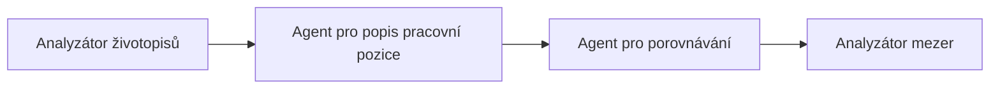
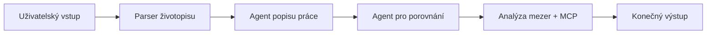

# Modul 4 - Vzory orchestrací

⏱️ ~10 min

V tomto modulu prozkoumáte vzory orchestrací použité v Resume Job Fit Evaluator a naučíte se, jak číst, upravovat a rozšiřovat graf pracovního postupu. Pochopení těchto vzorů je zásadní pro ladění problémů s tokem dat a vytváření vlastních [multi-agentních pracovních postupů](https://learn.microsoft.com/agent-framework/workflows/).

---

## Vzor 1: Sekvenční řetězec

Základním vzorem v pracovním postupu je **sekvenční řetězec** – výstup každého agenta jde přímo do dalšího.


```mermaid
flowchart LR
    RP[Analyzátor životopisů] --> JD[Agent pro popis pracovní pozice]
    JD --> MA[Agent pro porovnávání]
    MA --> GA[Analyzátor mezer]
```

V kódu každý hovor `add_edge()` vytvoří jeden krok v řetězci:

```python
.add_edge(resume_executor, jd_executor)       # Výstup ResumeParser → JD Agent
.add_edge(jd_executor, matching_executor)     # Výstup JD Agent → MatchingAgent
.add_edge(matching_executor, gap_executor)    # Výstup MatchingAgent → GapAnalyzer
```

> **Proč sekvenční, a ne fan-out/fan-in?** `WorkflowBuilder` používá **OR-semantiku** pro příchozí hrany: downstream exekutor se spustí, jakmile **jakýkoliv** předchůdce dokončí úlohu. Kdyby měl `matching_executor` dvě příchozí hrany (od `resume_executor` i `jd_executor`), spustil by se dvakrát – jednou po dokončení ResumeParser a podruhé po dokončení JD Agenta – což by způsobilo, že GapAnalyzer poběží také dvakrát a výstup by se objevil dvakrát. Sekvenční pipeline tomu zcela zabraňuje.

## Vzor 2: Přenos obsahu

Protože `context_mode="last_agent"` znamená, že každý exekutor vidí pouze výstup svého **přímého předchůdce**, agenti v sekvenčním řetězci musí explicitně předávat data, která potřebují agenti dále po proudu.

V tomto pracovním postupu:
- **ResumeParser** kopíruje JD doslova do `[JOB DESCRIPTION PASS-THROUGH]` (aby jej JD Agent našel).
- **JD Agent** kopíruje `[PARSED RESUME]` doslova do `[PARSED RESUME PASS-THROUGH]` (aby MatchingAgent mohl porovnat oba profily).

```
ResumeParser output
└─ [PARSED RESUME]               ← extracted by JD Agent
└─ [JOB DESCRIPTION PASS-THROUGH] ← extracted by JD Agent

JD Agent output
└─ [JD REQUIREMENTS]             ← extracted by MatchingAgent
└─ [PARSED RESUME PASS-THROUGH]  ← extracted by MatchingAgent
```

Každá sekce přenosu musí být zkopírována **doslovně** – shrnutí nebo parafrázování by narušilo downstream agenta, který na tom závisí.

---

## Kompletní graf

Kombinace sekvenčního řetězce a vzoru přenosu obsahu tvoří celý pracovní postup:


```mermaid
flowchart LR
    U[Uživatelský vstup] --> RP[Parser životopisu]
    RP --> JD[Agent popisu práce]
    JD --> MA[Agent pro porovnání]
    MA --> GA[Analýza mezer + MCP]
    GA --> O[Konečný výstup]
```

Agent Inspector ukazuje stejnou strukturu grafu, když agent běží lokálně. Pro snímky obrazovky odkažte na [Modul 5 - Testování lokálně](05-test-locally.md).

---

## Čtení kódu WorkflowBuilder

Celá funkce `create_workflow()` je v [`PersonalCareerCopilot/main.py`](../../../../../workshop/lab02-multi-agent/PersonalCareerCopilot/main.py). Tři volání `add_edge()` vytváří sekvenční pipeline:

| # | Hrana | Efekt |
|---|------|--------|
| 1 | `resume_executor → jd_executor` | JD Agent dostává `[PARSED RESUME]` + `[JOB DESCRIPTION PASS-THROUGH]` |
| 2 | `jd_executor → matching_executor` | MatchingAgent dostává `[JD REQUIREMENTS]` + `[PARSED RESUME PASS-THROUGH]` |
| 3 | `matching_executor → gap_executor` | GapAnalyzer dostává report shody + seznam mezer |

---

## Úprava grafu

### Přidání nového agenta

Chcete-li přidat pátého agenta (například **InterviewPrepAgent** za GapAnalyzerem):

1. Definujte konstantu `INTERVIEW_PREP_INSTRUCTIONS`.
2. Vytvořte objekty `Agent` + `AgentExecutor` (stejný vzor jako u stávajících čtyř).
3. Přidejte `.add_edge(gap_executor, interview_exec)` ve `WorkflowBuilder`.
4. Aktualizujte `output_executors=[interview_exec]`.

> **Důležité:** `start_executor` je jediný agent, který přijímá surový vstup od uživatele. Všechny ostatní agenti dostávají výstupy ze svého upstreamu.

---

## Běžné chyby v grafu

| Chyba | Příznak | Oprava |
|---------|---------|-----|
| Chybějící hrana do `output_executors` | Agent běží, ale výstup je prázdný | Zajistěte, aby byla cesta ze `start_executor` ke každému agentovi v `output_executors` |
| Kruhová závislost | Nekonečná smyčka nebo timeout | Zkontrolujte, že žádný agent nevrací data zpět do upstream agenta |
| Agent v `output_executors` bez příchozí hrany | Prázdný výstup | Přidejte minimálně jednu hranu `add_edge(source, that_agent)` |
| Více `output_executors` bez fan-in | Výstup obsahuje jen odpověď jednoho agenta | Použijte jediného výstupního agenta, který agreguje, nebo akceptujte více výstupů |
| Chybějící `start_executor` | `ValueError` během buildování | Vždy určete `start_executor` ve `WorkflowBuilder()` |

---

## Ladění grafu

### Použití Agent Inspector

1. Spusťte agenta lokálně pomocí F5.
2. Otevřete Agent Inspector (`Ctrl+Shift+P` → **Foundry Toolkit: Open Agent Inspector**).
3. Pošlete testovací zprávu.
4. V inspekčním panelu odpovědí hledejte **streamovaný výstup** – zobrazuje příspěvky každého agenta postupně.


### Použití logování

Přidejte do `main.py` logování pro sledování toku dat:

```python
import logging
logger = logging.getLogger("resume-job-fit")

# V hlavní funkci (), po vytvoření pracovního postupu:
logger.info("Workflow graph built with edges: RP→JD, JD→MA, MA→GA")
```

Serverové logy ukazují pořadí spuštění agentů a volání MCP nástrojů:

```
INFO:agent_framework:Executing agent: ResumeParser
INFO:agent_framework:Executing agent: JobDescriptionAgent
INFO:agent_framework:Executing agent: MatchingAgent
INFO:agent_framework:Executing agent: GapAnalyzer
INFO:agent_framework:Tool call: search_microsoft_learn_for_plan(skill="Kubernetes")
POST https://learn.microsoft.com/api/mcp → 200
INFO:agent_framework:Tool call: search_microsoft_learn_for_plan(skill="Terraform")
POST https://learn.microsoft.com/api/mcp → 200
```

---

### Kontrolní bod

- [ ] Dokážete identifikovat dva vzory orchestrací v pracovním postupu: sekvenční řetězec a přenos obsahu
- [ ] Rozumíte, proč `context_mode="last_agent"` vyžaduje explicitní přenos dat mezi agenty
- [ ] Dokážete číst kód `WorkflowBuilder` a přiřadit každé volání `add_edge()` k vizuálnímu grafu
- [ ] Víme, jak přidat nového agenta na konec pipeline
- [ ] Dokážete identifikovat běžné chyby grafu a jejich příznaky

---

**Předchozí:** [03 - Configure Agents & Environment](03-configure-agents.md) · **Další:** [05 - Test Locally →](05-test-locally.md)

---

<!-- CO-OP TRANSLATOR DISCLAIMER START -->
**Prohlášení o omezení odpovědnosti**:
Tento dokument byl přeložen pomocí AI překladatelské služby [Co-op Translator](https://github.com/Azure/co-op-translator). Přestože usilujeme o co největší přesnost, mějte prosím na paměti, že automatizované překlady mohou obsahovat chyby nebo nepřesnosti. Originální dokument v jeho mateřském jazyce by měl být považován za autoritativní zdroj. Pro kritické informace se doporučuje profesionální lidský překlad. Nejsme odpovědní za jakékoli nedorozumění nebo nesprávné interpretace vzniklé použitím tohoto překladu.
<!-- CO-OP TRANSLATOR DISCLAIMER END -->