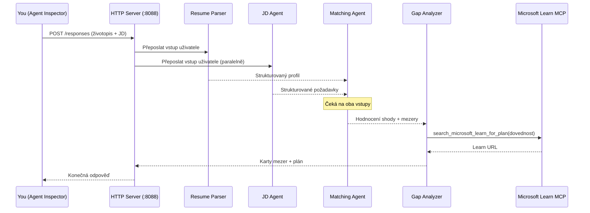
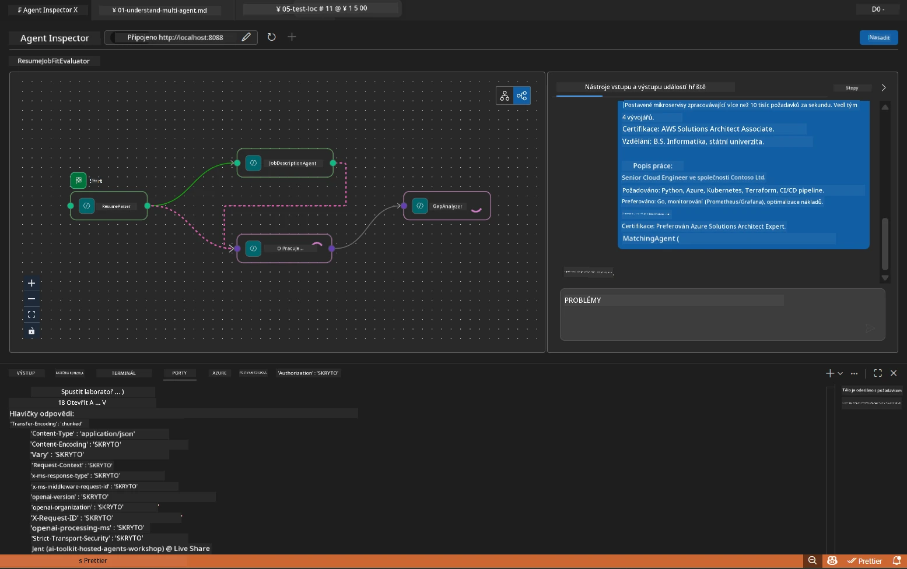

# Modul 5 - Testování lokálně (Multi-Agent)

V tomto modulu spustíte pracovní postup více agentů lokálně, otestujete ho pomocí Agent Inspector a ověříte, že všechny čtyři agenty a nástroj MCP fungují správně, než nasadíte do Foundry.

### Co se děje během lokálního testovacího spuštění


---

## Krok 1: Spuštění agent serveru

### Možnost A: Použití VS Code úlohy (doporučeno)

1. Stiskněte `Ctrl+Shift+P` → napište **Tasks: Run Task** → vyberte **Run Lab02 HTTP Server**.
2. Úloha spustí server s připojeným debugpy na portu `5679` a agenta na portu `8088`.
3. Počkejte na výstup, který zobrazí:

```
INFO:resume-job-fit:Starting Resume -> Job Fit Evaluator HTTP server...
INFO:resume-job-fit:Server running on http://localhost:8088
```

### Možnost B: Manuální použití terminálu

```powershell
cd workshop\lab02-multi-agent\PersonalCareerCopilot
```

Aktivujte virtuální prostředí:

**PowerShell (Windows):**
```powershell
.\.venv\Scripts\Activate.ps1
```

**macOS/Linux:**
```bash
source .venv/bin/activate
```

Spusťte server:

```powershell
python -m debugpy --listen 127.0.0.1:5679 -m agentdev run main.py --verbose --port 8088
```

### Možnost C: Použití F5 (režim ladění)

1. Stiskněte `F5` nebo přejděte do **Run and Debug** (`Ctrl+Shift+D`).
2. Vyberte konfigurační profil spuštění **Lab02 - Multi-Agent** z rozbalovacího seznamu.
3. Server se spustí s plnou podporou breakpointů.

> **Tip:** Režim ladění vám umožňuje nastavovat breakpointy uvnitř `search_microsoft_learn_for_plan()` k inspekci odpovědí MCP, nebo uvnitř instrukčních řetězců agentů, abyste viděli, co každý agent přijímá.

---

## Krok 2: Otevření Agent Inspector

1. Stiskněte `Ctrl+Shift+P` → napište **Foundry Toolkit: Open Agent Inspector**.
2. Agent Inspector se otevře v prohlížeči na adrese `http://localhost:5679`.
3. Měli byste vidět rozhraní agenta připravené přijímat zprávy.

> **Pokud se Agent Inspector neotevře:** Ujistěte se, že server je zcela spuštěný (vidíte v logu "Server running"). Pokud je port 5679 obsazen, podívejte se do [Modul 8 - Řešení problémů](08-troubleshooting.md).

---

## Krok 3: Spuštění základních testů

Proveďte tyto tři testy v pořadí. Každý test ověřuje postupně více z workflow.

### Test 1: Základní životopis + popis práce

Vložte následující do Agent Inspector:

```
Resume:
Jane Doe
Senior Software Engineer with 5 years of experience in Python, Django, and AWS.
Built microservices handling 10K+ requests/second. Led a team of 4 developers.
Certifications: AWS Solutions Architect Associate.
Education: B.S. Computer Science, State University.

Job Description:
Senior Cloud Engineer at Contoso Ltd.
Required: Python, Azure, Kubernetes, Terraform, CI/CD pipelines.
Preferred: Go, monitoring (Prometheus/Grafana), cost optimization.
Experience: 5+ years in cloud infrastructure.
Certifications: Azure Solutions Architect Expert preferred.
```

**Očekávaná struktura výstupu:**

Odpověď by měla obsahovat výstupy ze všech čtyř agentů za sebou:

1. **Výstup Resume Parser** - Strukturovaný profil kandidáta s dovednostmi seskupenými dle kategorií
2. **Výstup JD Agenta** - Strukturované požadavky s oddělením požadovaných a preferovaných dovedností
3. **Výstup Matching Agenta** - Hodnocení shody (0-100) s rozpisem, odpovídající dovednosti, chybějící dovednosti, mezery
4. **Výstup Gap Analyzeru** - Jednotlivé karty mezer pro každou chybějící dovednost, každá s odkazy na Microsoft Learn



### Co ověřit v Testu 1

| Kontrola | Očekávané | Prošel? |
|----------|-----------|---------|
| Odpověď obsahuje hodnocení shody | Číslo mezi 0-100 s rozpisem | |
| Seznam odpovídajících dovedností | Python, CI/CD (částečně), atd. | |
| Seznam chybějících dovedností | Azure, Kubernetes, Terraform, atd. | |
| Karty mezer pro každou chybějící dovednost | Jedna karta na dovednost | |
| Odkazy Microsoft Learn jsou přítomné | Skutečné odkazy na `learn.microsoft.com` | |
| Žádné chybové zprávy v odpovědi | Čistý strukturovaný výstup | |

### Test 2: Ověření spuštění nástroje MCP

Během běhu Testu 1 sledujte **serverový terminál** pro záznamy MCP:

```
GET https://learn.microsoft.com/api/mcp → 405 (Method Not Allowed)
POST https://learn.microsoft.com/api/mcp → 200
DELETE https://learn.microsoft.com/api/mcp → 405 (Method Not Allowed)
```

| Záznam v logu | Význam | Očekávané? |
|---------------|---------|------------|
| `GET ... → 405` | MCP klient prověřuje pomocí GET během inicializace | Ano - normální |
| `POST ... → 200` | Skutečný volání nástroje na Microsoft Learn MCP server | Ano - skutečné volání |
| `DELETE ... → 405` | MCP klient prověřuje pomocí DELETE během úklidu | Ano - normální |
| `POST ... → 4xx/5xx` | Volání nástroje selhalo | Ne - viz [Řešení problémů](08-troubleshooting.md) |

> **Důležitá poznámka:** Řádky `GET 405` a `DELETE 405` jsou **očekávané chování**. Znepokojujte se pouze v případě, že `POST` volání vrací stavové kódy mimo 200.

### Test 3: Okrajový případ - kandidát s vysokou shodou

Vložte životopis, který velmi přesně odpovídá popisu práce, abyste ověřili, že GapAnalyzer řeší situace s vysokou shodou:

```
Resume:
Alex Chen
Senior Cloud Engineer with 7 years of experience.
Skills: Python, Azure (AKS, Functions, DevOps), Kubernetes, Terraform, CI/CD (GitHub Actions, Azure Pipelines), Go, Prometheus, Grafana, cost optimization.
Certifications: Azure Solutions Architect Expert, Azure DevOps Engineer Expert.
Led infrastructure migration to Azure for 3 enterprise clients.
Education: M.S. Computer Science, Tech University.

Job Description:
Senior Cloud Engineer at Contoso Ltd.
Required: Python, Azure, Kubernetes, Terraform, CI/CD pipelines.
Preferred: Go, monitoring (Prometheus/Grafana), cost optimization.
Experience: 5+ years in cloud infrastructure.
Certifications: Azure Solutions Architect Expert preferred.
```

**Očekávané chování:**
- Hodnocení shody by mělo být **80+** (většina dovedností odpovídá)
- Karty mezer by měly být zaměřené spíše na vylepšení a přípravu na pohovor než na základní učení
- Instrukce GapAnalyzeru říkají: „Pokud fit >= 80, zaměřte se na vylepšení/přípravu na pohovor“

---

## Krok 4: Ověření úplnosti výstupu

Po provedení testů ověřte, že výstup splňuje následující kritéria:

### Kontrolní seznam struktury výstupu

| Sekce | Agent | Přítomná? |
|--------|-------|-----------|
| Profil kandidáta | Resume Parser | |
| Technické dovednosti (seskupené) | Resume Parser | |
| Přehled role | JD Agent | |
| Požadované vs. preferované dovednosti | JD Agent | |
| Hodnocení shody s rozpisem | Matching Agent | |
| Odpovídající / chybějící / částečné dovednosti | Matching Agent | |
| Karta mezery na každou chybějící dovednost | Gap Analyzer | |
| Odkazy Microsoft Learn v kartách mezer | Gap Analyzer (MCP) | |
| Pořadí učení (číslované) | Gap Analyzer | |
| Shrnutí časové osy | Gap Analyzer | |

### Běžné problémy v této fázi

| Problém | Příčina | Řešení |
|---------|----------|--------|
| Pouze 1 karta mezery (ostatní oříznuté) | V instrukcích GapAnalyzeru chybí KLÍČOVÁ sekce | Přidejte odstavec `CRITICAL:` do `GAP_ANALYZER_INSTRUCTIONS` - viz [Modul 3](03-configure-agents.md) |
| Chybí odkazy Microsoft Learn | MCP endpoint není dostupný | Zkontrolujte připojení k internetu. Ověřte `MICROSOFT_LEARN_MCP_ENDPOINT` v `.env`, musí být `https://learn.microsoft.com/api/mcp` |
| Prázdná odpověď | `PROJECT_ENDPOINT` nebo `MODEL_DEPLOYMENT_NAME` není nastaveno | Zkontrolujte hodnoty v `.env`. V terminálu spusťte `echo $env:PROJECT_ENDPOINT` |
| Hodnocení shody je 0 nebo chybí | MatchingAgent nedostal žádná data shora | Zkontrolujte, že v `create_workflow()` existují `add_edge(resume_parser, matching_agent)` a `add_edge(jd_agent, matching_agent)` |
| Agent se spustí, ale ihned ukončí | Chyba importu nebo chybějící závislost | Spusťte znovu `pip install -r requirements.txt`. Zkontrolujte výpis chyb v terminálu |
| Chyba `validate_configuration` | Chybí env proměnné | Vytvořte `.env` s `PROJECT_ENDPOINT=<your-endpoint>` a `MODEL_DEPLOYMENT_NAME=<your-model>` |

---

## Krok 5: Testování s vlastními daty (volitelné)

Zkuste vložit svůj vlastní životopis a skutečný popis práce. Pomůže to ověřit:

- Agenti zvládnou různé formáty životopisů (chronologický, funkční, hybridní)
- JD Agent zvládne různé styly popisů práce (odrážky, odstavce, strukturované)
- MCP nástroj vrací relevantní zdroje pro skutečné dovednosti
- Karty mezer jsou personalizované podle vašeho konkrétního pozadí

> **Poznámka k soukromí:** Při lokálním testování vaše data zůstávají na vašem počítači a jsou odesílána pouze do vašeho Azure OpenAI nasazení. Nejsou logována ani ukládána v infrastruktuře workshopu. Pokud chcete, použijte zástupná jména (např. „Jane Doe“ místo skutečného jména).

---

### Kontrolní seznam

- [ ] Server byl úspěšně spuštěn na portu `8088` (v logu je "Server running")
- [ ] Agent Inspector otevřen a připojen k agentovi
- [ ] Test 1: Kompletní odpověď s hodnocením shody, odpovídajícími/chybějícími dovednostmi, kartami mezer a odkazy Microsoft Learn
- [ ] Test 2: MCP logy ukazují `POST ... → 200` (volání nástroje uspěla)
- [ ] Test 3: Kandidát s vysokou shodou dosáhl skóre 80+ s doporučeními zaměřenými na vylepšení
- [ ] Všechny karty mezer přítomné (jedna na každou chybějící dovednost, bez oříznutí)
- [ ] Žádné chyby nebo výpisy chyb v serverovém terminálu

---

**Předchozí:** [04 - Vzory orchestrace](04-orchestration-patterns.md) · **Další:** [06 - Nasazení do Foundry →](06-deploy-to-foundry.md)

---

<!-- CO-OP TRANSLATOR DISCLAIMER START -->
**Prohlášení o vyloučení odpovědnosti**:  
Tento dokument byl přeložen pomocí AI překladatelské služby [Co-op Translator](https://github.com/Azure/co-op-translator). Přestože usilujeme o přesnost, mějte prosím na paměti, že automatické překlady mohou obsahovat chyby nebo nepřesnosti. Původní dokument v jeho rodném jazyce by měl být považován za autoritativní zdroj. Pro kritické informace se doporučuje profesionální lidský překlad. Nejsme odpovědní za jakékoliv nedorozumění nebo chybné interpretace vzniklé použitím tohoto překladu.
<!-- CO-OP TRANSLATOR DISCLAIMER END -->