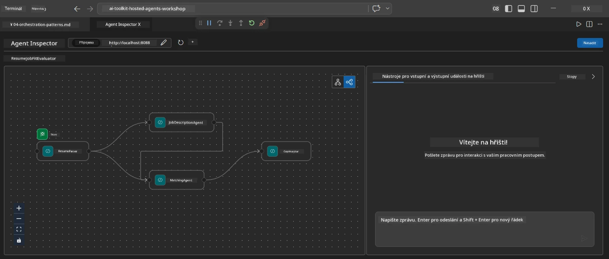
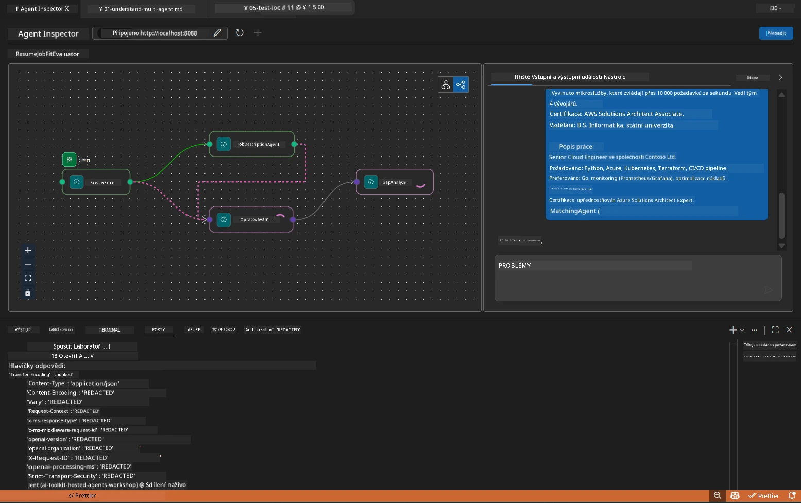
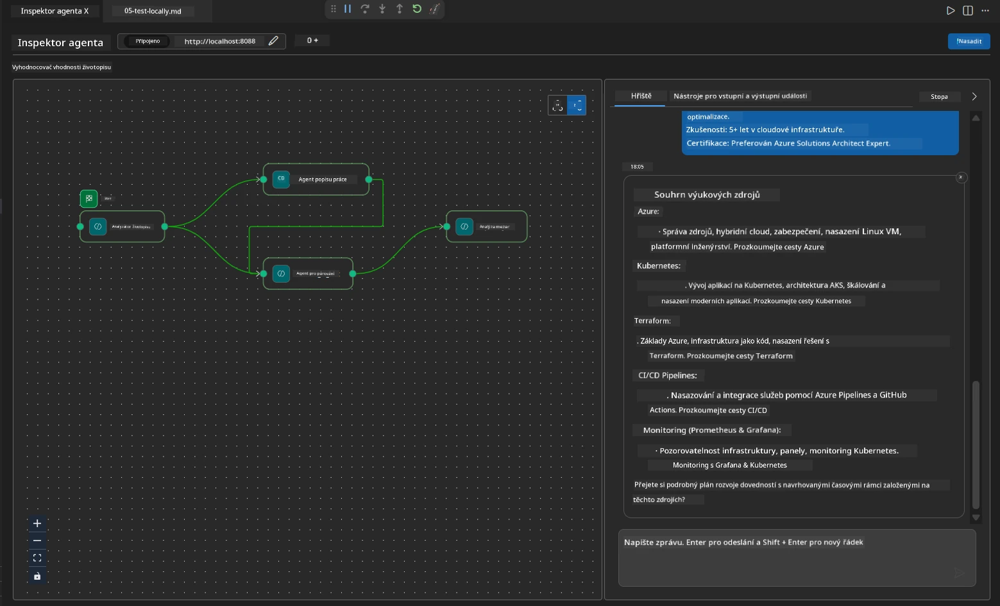

# Modul 5 - Testování lokálně

⏱️ ~15 min

V tomto modulu spustíte multi-agentní pracovní tok lokálně, otestujete ho pomocí Agent Inspector a ověříte, že všechny čtyři agenty a nástroj MCP fungují správně před nasazením.

---

## Krok 1: Spusťte server agenta

### Možnost A: Použití úlohy ve VS Code (doporučeno)

1. Otevřete `workshop/lab02-multi-agent/PersonalCareerCopilot/` jako složku ve VS Code.
2. Stiskněte `Ctrl+Shift+P` → napište **Tasks: Run Task** → vyberte **Run Agent HTTP Server**.
3. Úloha spustí server s připojeným debugpy na portu `5679` a agenta na portu `8088`.
4. Počkejte, až se v výstupu zobrazí:

```
INFO:resume-job-fit:Starting Resume -> Job Fit Evaluator HTTP server...
INFO:resume-job-fit:Server running on http://localhost:8088
```

### Možnost B: Použití F5 (debugovací režim)

1. Stiskněte `F5` → vyberte **Debug Local Agent HTTP Server**.
2. Server se spustí s plnou podporou breakpointů - užitečné pro inspekci odpovědí MCP nebo výstupů agenta.

---

## Krok 2: Otevřete Agent Inspector

1. Stiskněte `Ctrl+Shift+P` → napište **Foundry Toolkit: Open Agent Inspector**.
2. Agent Inspector se otevře jako VS Code panel připojený k `http://localhost:8088`.
3. Měli byste vidět uživatelské rozhraní agenta připravené přijímat zprávy.



> **Pokud se Agent Inspector neotevře:** Ujistěte se, že server je plně spuštěn (vidíte v logu "Server running"). Pokud je port 5679 obsazený, podívejte se do [Modulu 8 - Řešení problémů](08-troubleshooting.md).

---

## Krok 2b: (Nepovinné) Otevřete Workflow Visualizer

Foundry Toolkit obsahuje v reálném čase **Workflow Visualizer**, který zobrazuje, jak agenti spolu interagují během běhu grafu. To je obzvlášť užitečné pro multi-agentní ladění.

1. Stiskněte `Ctrl+Shift+P` → napište **Foundry Toolkit: Open Visualizer for Hosted Agents**.
2. Otevře se nové záložka ve VS Code zobrazující živý vykreslovací graf.
3. Při odesílání zpráv v Agent Inspector se vizualizér automaticky aktualizuje - zelené uzly značí dokončené agenty, animované hrany ukazují tok dat mezi nimi.

> **Konflikt portu:** Pokud je port vizualizéru již používán, změňte ho v nastavení VS Code → **Extensions** → **Microsoft Foundry Configuration** → **Hosted Agents: Visualizer Port**.

---

## Krok 3: Spusťte smoke testy

Spusťte tyto tři testy po sobě. Každý testuje postupně větší část pracovního toku.

### Test 1: Základní životopis + popis práce

Vložte následující do Agent Inspector:

```
Resume:
Jane Doe
Senior Software Engineer with 5 years of experience in Python, Django, and AWS.
Built microservices handling 10K+ requests/second. Led a team of 4 developers.
Certifications: AWS Solutions Architect Associate.
Education: B.S. Computer Science, State University.

Job Description:
Senior Cloud Engineer at Contoso Ltd.
Required: Python, Azure, Kubernetes, Terraform, CI/CD pipelines.
Preferred: Go, monitoring (Prometheus/Grafana), cost optimization.
Experience: 5+ years in cloud infrastructure.
Certifications: Azure Solutions Architect Expert preferred.
```

**Očekávaná struktura výstupu:**

Odpověď by měla obsahovat výstup ze všech čtyř agentů za sebou:

1. **Výstup Resume Parseru** - Dvě označené sekce: `[PARSED RESUME]` (profil kandidáta s seskupenými dovednostmi) a `[JOB DESCRIPTION PASS-THROUGH]` (doslovný text JD, který posílá JD Agentovi)
2. **Výstup JD Agenta** - Strukturované požadavky s oddělenými požadovanými a preferovanými dovednostmi
3. **Výstup Matching Agenta** - Hodnocení fit (0-100) s rozpisem, nalezené dovednosti, chybějící dovednosti, mezery
4. **Výstup Gap Analyzeru** - Jednotlivé karty mezer pro každou chybějící dovednost, každá s URL na Microsoft Learn





### Co ověřit v Testu 1

| Kontrola | Očekávané | Prošlo? |
|---------|-----------|---------|
| Odpověď obsahuje hodnocení fit | Číslo mezi 0-100 s rozpisem | |
| Seznam nalezených dovedností | Python, CI/CD (částečně), atd. | |
| Seznam chybějících dovedností | Azure, Kubernetes, Terraform, atd. | |
| Existují karty mezer pro každou chybějící dovednost | Jedna karta na dovednost | |
| Jsou přítomny URL Microsoft Learn | Odkazy na `learn.microsoft.com` | |
| Žádné chybové zprávy v odpovědi | Čistý strukturovaný výstup | |

### Test 2: Okrajový případ - kandidát s vysokým hodnocením fit

Vložte životopis, který se blízce shoduje s JD, aby se ověřilo, že GapAnalyzer zvládá scénáře s vysokým hodnocením fit:

```
Resume:
Alex Chen
Senior Cloud Engineer with 7 years of experience.
Skills: Python, Azure (AKS, Functions, DevOps), Kubernetes, Terraform, CI/CD (GitHub Actions, Azure Pipelines), Go, Prometheus, Grafana, cost optimization.
Certifications: Azure Solutions Architect Expert, Azure DevOps Engineer Expert.
Led infrastructure migration to Azure for 3 enterprise clients.
Education: M.S. Computer Science, Tech University.

Job Description:
Senior Cloud Engineer at Contoso Ltd.
Required: Python, Azure, Kubernetes, Terraform, CI/CD pipelines.
Preferred: Go, monitoring (Prometheus/Grafana), cost optimization.
Experience: 5+ years in cloud infrastructure.
Certifications: Azure Solutions Architect Expert preferred.
```

**Očekávané chování:**
- Hodnocení fit by mělo být **80+** (většina dovedností odpovídá)
- Karty mezer by měly být zaměřeny na doladění/přípravu na pohovor spíše než na základní učení
- Návod GapAnalyzer uvádí: "Pokud fit >= 80, zaměřte se na doladění/přípravu na pohovor"

---

## Krok 4: Testujte s vlastními daty (volitelné)

Zkuste vložit vlastní životopis a skutečný popis práce. To pomáhá ověřit:

- Agent zvládají různé formáty životopisů (chronologický, funkční, hybridní)
- JD Agent zpracovává různé styly JD (odrážky, odstavce, strukturované)
- Nástroj MCP vrací relevantní zdroje pro reálné dovednosti
- Karty mezer jsou personalizované podle vašeho konkrétního pozadí

> **Soukromí - Cesta A (Foundry cloud):** Texty životopisu a JD jsou odesílány do vašeho Azure OpenAI nasazení pro inferenci. Nejsou logovány ani ukládány infrastrukturou workshopu. Použijte falešná jména (např. "Jan Novák"), pokud chcete.
>
> **Soukromí - Cesta B (Foundry Local):** Všechny čtyři inference agentů běží kompletně na vašem zařízení. Texty životopisu a popisu práce **nikdy neopouštějí váš počítač**. Jediný odchozí dotaz je MCP nástroj, který získává zdroje z `https://learn.microsoft.com/api/mcp`; tento dotaz obsahuje pouze názvy dovedností, nikoli vaše osobní údaje.

---

### Kontrolní bod

- [ ] Server byl úspěšně spuštěn na portu `8088` (v logu je "Server running")
- [ ] Agent Inspector byl otevřen a připojen k agentovi
- [ ] Test 1: Kompletní odpověď s hodnocením fit, nalezenými/chybějícími dovednostmi, kartami mezer a URL Microsoft Learn
- [ ] Test 2: Kandidát s vysokým fit získá skóre 80+ s doporučeními zaměřenými na doladění
- [ ] Všechny karty mezer přítomny (jedna na chybějící dovednost, žádné zkrácení)
- [ ] Žádné chyby ani stack trace v terminálu serveru

---

**Předchozí:** [04 - Orchestration Patterns](04-orchestration-patterns.md) · **Další:** [06 - Deploy to Foundry →](06-deploy-to-foundry.md)

---

<!-- CO-OP TRANSLATOR DISCLAIMER START -->
**Prohlášení o omezení odpovědnosti**:
Tento dokument byl přeložen pomocí AI překladatelské služby [Co-op Translator](https://github.com/Azure/co-op-translator). Přestože usilujeme o co největší přesnost, mějte prosím na paměti, že automatizované překlady mohou obsahovat chyby nebo nepřesnosti. Originální dokument v jeho mateřském jazyce by měl být považován za autoritativní zdroj. Pro kritické informace se doporučuje profesionální lidský překlad. Nejsme odpovědní za jakékoli nedorozumění nebo nesprávné interpretace vzniklé použitím tohoto překladu.
<!-- CO-OP TRANSLATOR DISCLAIMER END -->