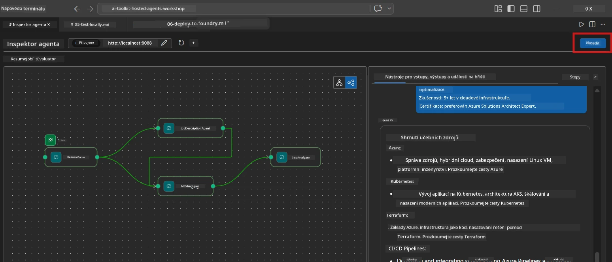
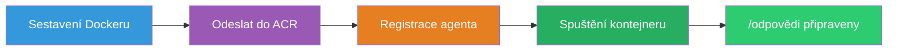
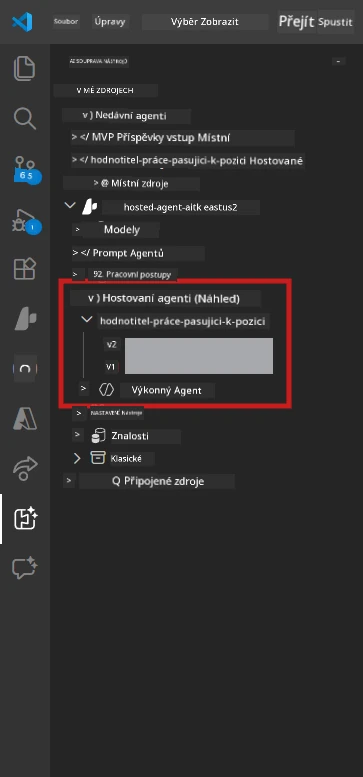

# Modul 6 - Nasazení do Foundry Agent Service

V tomto modulu nasadíte svůj lokálně testovaný multi-agentní workflow do [Microsoft Foundry](https://learn.microsoft.com/azure/foundry/agents/concepts/hosted-agents) jako **Hosted Agent**. Proces nasazení vytvoří Docker kontejnerový obraz, odešle jej do [Azure Container Registry (ACR)](https://learn.microsoft.com/azure/container-registry/container-registry-intro) a vytvoří verzi hostovaného agenta ve [Foundry Agent Service](https://learn.microsoft.com/azure/foundry/agents/how-to/publish-agent).

> **Hlavní rozdíl od Lab 01:** Proces nasazení je identický. Foundry pracuje s vaším multi-agentním workflow jako s jedním hostovaným agentem - složitost je uvnitř kontejneru, ale nasazovací rozhraní je stejné `/responses` endpoint.

---

## Kontrola předpokladů

Před nasazením ověřte každý z následujících bodů:

1. **Agent úspěšně přechází lokální základní testy:**
   - Dokončili jste všechny 3 testy v [Modulu 5](05-test-locally.md) a workflow vytvořil kompletní výstup s gap kartami a URL adresami Microsoft Learn.

2. **Máte přiřazenou roli [Azure AI User](https://learn.microsoft.com/azure/foundry/concepts/rbac-foundry):**
   - Přiřazeno v [Lab 01, Modul 2](../../lab01-single-agent/docs/02-create-foundry-project.md). Ověřte:
   - [Azure Portal](https://portal.azure.com) → váš Foundry **projektový** zdroj → **Řízení přístupu (IAM)** → **Přiřazení rolí** → potvrďte, že **[Azure AI User](https://aka.ms/foundry-ext-project-role)** je uvedena pro váš účet.

3. **Jste přihlášeni do Azure ve VS Code:**
   - Zkontrolujte ikonu účtů v levém dolním rohu VS Code. Mělo by být vidět jméno vašeho účtu.

4. **`agent.yaml` má správné hodnoty:**
   - Otevřete `PersonalCareerCopilot/agent.yaml` a ověřte:
     ```yaml
     environment_variables:
       - name: PROJECT_ENDPOINT
         value: ${PROJECT_ENDPOINT}
       - name: MODEL_DEPLOYMENT_NAME
         value: ${MODEL_DEPLOYMENT_NAME}
     ```
   - Tyto hodnoty musí odpovídat proměnným prostředí, které čte váš `main.py`.

5. **`requirements.txt` má správné verze:**
   ```
   agent-framework-azure-ai==1.0.0rc3
   agent-framework-core==1.0.0rc3
   azure-ai-agentserver-agentframework==1.0.0b16
   azure-ai-agentserver-core==1.0.0b16
   debugpy
   agent-dev-cli --pre
   ```

---

## Krok 1: Zahájení nasazení

### Možnost A: Nasazení z Agent Inspectoru (doporučeno)

Pokud agent běží přes F5 s otevřeným Agent Inspectorem:

1. Podívejte se na **pravý horní roh** panelu Agent Inspector.
2. Klikněte na tlačítko **Deploy** (ikona mraku se šipkou nahoru ↑).
3. Otevře se průvodce nasazením.



### Možnost B: Nasazení z Command Palette

1. Stiskněte `Ctrl+Shift+P` pro otevření **Command Palette**.
2. Napište: **Microsoft Foundry: Deploy Hosted Agent** a vyberte jej.
3. Otevře se průvodce nasazením.

---

## Krok 2: Konfigurace nasazení

### 2.1 Výběr cílového projektu

1. Rozbalovací menu zobrazí vaše Foundry projekty.
2. Vyberte projekt, který jste používali během workshopu (např. `workshop-agents`).

### 2.2 Výběr souboru kontejnerového agenta

1. Budete vyzváni k výběru vstupního bodu agenta.
2. Navigujte do `workshop/lab02-multi-agent/PersonalCareerCopilot/` a vyberte **`main.py`**.

### 2.3 Konfigurace zdrojů

| Nastavení | Doporučená hodnota | Poznámky |
|---------|------------------|-------|
| **CPU** | `0.25` | Výchozí. Multi-agentní workflow nepotřebují více CPU, protože volání modelu jsou I/O-bound |
| **Paměť** | `0.5Gi` | Výchozí. Zvýšte na `1Gi`, pokud přidáte nástroje pro zpracování velkých dat |

---

## Krok 3: Potvrzení a nasazení

1. Průvodce zobrazí souhrn nasazení.
2. Zkontrolujte a klikněte na **Potvrdit a nasadit**.
3. Sledujte průběh ve VS Code.

### Co se děje během nasazení

Sledujte panel **Output** ve VS Code (vyberte rozbalovací menu "Microsoft Foundry"):


1. **Docker build** - Vytváří kontejner z vašeho `Dockerfile`:
   ```
   Step 1/6 : FROM python:3.14-slim
   Step 2/6 : WORKDIR /app
   ...
   Successfully built abc123def456
   ```

2. **Docker push** - Odesílá obraz do ACR (1-3 minuty při prvním nasazení).

3. **Registrace agenta** - Foundry vytvoří hostovaného agenta pomocí metadat z `agent.yaml`. Název agenta je `resume-job-fit-evaluator`.

4. **Start kontejneru** - Kontejner je spuštěn v řízené infrastruktuře Foundry s identitou spravovanou systémem.

> **První nasazení je pomalejší** (Docker odesílá všechny vrstvy). Následující nasazení znovu využívají uložené vrstvy a jsou rychlejší.

### Poznámky specifické pro multi-agentní řešení

- **Všechny čtyři agenti jsou uvnitř jednoho kontejneru.** Foundry vidí jednoho hostovaného agenta. Graf WorkflowBuilderu běží interně.
- **Volání MCP jsou venkovní.** Kontejner potřebuje přístup k internetu pro dosažení `https://learn.microsoft.com/api/mcp`. Spravovaná infrastruktura Foundry to zajišťuje ve výchozím nastavení.
- **[Managed Identity](https://learn.microsoft.com/python/api/overview/azure/identity-readme#managed-identity-support).** V hostovaném prostředí vrací `get_credential()` v `main.py` `ManagedIdentityCredential()` (protože je nastavena proměnná `MSI_ENDPOINT`). Toto probíhá automaticky.

---

## Krok 4: Ověření stavu nasazení

1. Otevřete postranní panel **Microsoft Foundry** (klikněte na ikonu Foundry v Activity Bar).
2. Rozbalte sekci **Hosted Agents (Preview)** pod vaším projektem.
3. Najděte **resume-job-fit-evaluator** (nebo název vašeho agenta).
4. Klikněte na název agenta → rozbalte verze (např. `v1`).
5. Klikněte na verzi → zkontrolujte **Podrobnosti kontejneru** → **Stav**:



| Stav | Význam |
|--------|---------|
| **Started** / **Running** | Kontejner běží, agent je připraven |
| **Pending** | Kontejner se spouští (čekejte 30-60 sekund) |
| **Failed** | Kontejner se nepodařilo spustit (zkontrolujte logy - viz níže) |

> **Spuštění multi-agenta trvá déle** než single-agent, protože kontejner vytvoří 4 instance agentů při startu. "Pending" až po dobu 2 minut je normální.

---

## Běžné chyby při nasazení a jejich opravy

### Chyba 1: Permission denied - `agents/write`

```
Error: lacks the required data action 
Microsoft.CognitiveServices/accounts/AIServices/agents/write
```

**Oprava:** Přiřaďte roli **[Azure AI User](https://learn.microsoft.com/azure/foundry/concepts/rbac-foundry)** na úrovni **projektu**. Postup krok za krokem viz [Modul 8 - Řešení problémů](08-troubleshooting.md).

### Chyba 2: Docker neběží

```
Error: Docker build failed / Cannot connect to Docker daemon
```

**Oprava:**
1. Spusťte Docker Desktop.
2. Počkejte na hlášení "Docker Desktop is running".
3. Ověřte příkazem: `docker info`
4. **Windows:** Ujistěte se, že je v nastavení Docker Desktop povolen backend WSL 2.
5. Zkuste znovu.

### Chyba 3: pip install selže během Docker buildu

```
Error: Could not find a version that satisfies the requirement agent-dev-cli
```

**Oprava:** Flag `--pre` v `requirements.txt` je v Dockeru zpracováván jinak. Zajistěte, aby váš `requirements.txt` obsahoval:
```
agent-dev-cli --pre
```

Pokud Docker stále selhává, vytvořte `pip.conf` nebo předejte `--pre` přes build argument. Více v [Modulu 8](08-troubleshooting.md).

### Chyba 4: MCP nástroj selže v hostovaném agentovi

Pokud Gap Analyzer přestane po nasazení generovat Microsoft Learn URL:

**Příčina:** Síťová politika může blokovat odchozí HTTPS provoz z kontejneru.

**Oprava:**
1. Obvykle to není problém s výchozí konfigurací Foundry.
2. Pokud k tomu dojde, zkontrolujte, zda virtuální síť projektu Foundry nemá NSG blokující odchozí HTTPS.
3. MCP nástroj má zabudované záložní URL, takže agent i tak produkuje výstup (bez živých URL).

---

### Kontrolní bod

- [ ] Příkaz nasazení byl ve VS Code dokončen bez chyb
- [ ] Agent se zobrazuje v **Hosted Agents (Preview)** v postranním panelu Foundry
- [ ] Název agenta je `resume-job-fit-evaluator` (nebo vámi zvolený)
- [ ] Stav kontejneru ukazuje **Started** nebo **Running**
- [ ] (Pokud byly chyby) Identifikovali jste chybu, aplikovali opravu a úspěšně znovu nasadili

---

**Předchozí:** [05 - Testování lokálně](05-test-locally.md) · **Další:** [07 - Ověření v Playground →](07-verify-in-playground.md)

---

<!-- CO-OP TRANSLATOR DISCLAIMER START -->
**Prohlášení o odpovědnosti**:  
Tento dokument byl přeložen pomocí AI překladatelské služby [Co-op Translator](https://github.com/Azure/co-op-translator). Přestože usilujeme o přesnost, mějte prosím na paměti, že automatické překlady mohou obsahovat chyby nebo nepřesnosti. Originální dokument v jeho mateřském jazyce by měl být považován za autoritativní zdroj. Pro kritické informace je doporučen profesionální lidský překlad. Nejsme odpovědní za jakékoliv nedorozumění nebo nesprávné výklady vyplývající z použití tohoto překladu.
<!-- CO-OP TRANSLATOR DISCLAIMER END -->