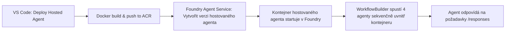
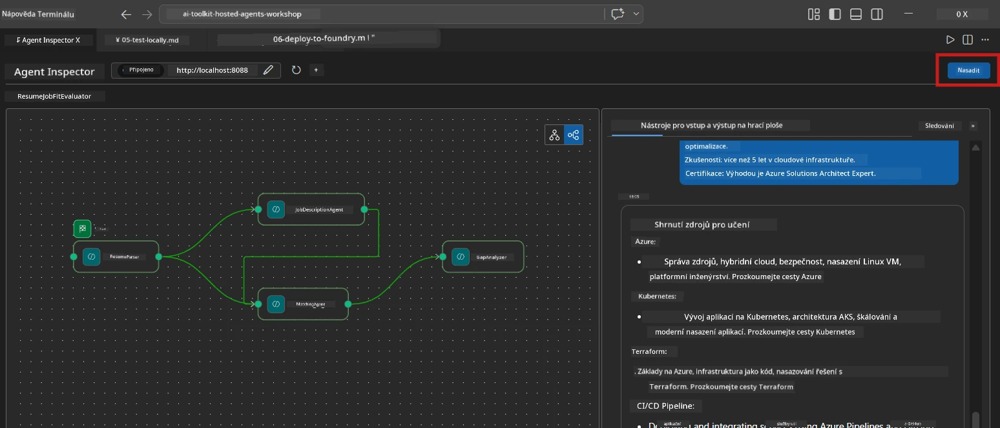
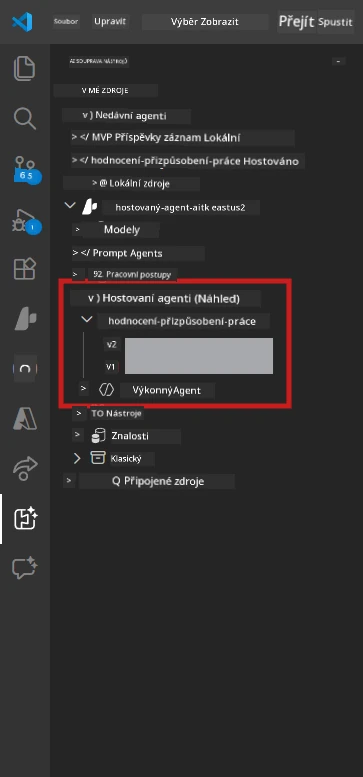

# Modul 6 - Nasazení do služby Foundry Agent

⏱️ ~10 minut

V tomto modulu nasadíte svůj lokálně otestovaný multi-agentní pracovní postup do [Microsoft Foundry](https://learn.microsoft.com/azure/foundry/agents/concepts/hosted-agents) jako **Hosted Agent (hostovaný agent)**. Proces nasazení sestaví obraz Docker kontejneru, odešle jej do [Azure Container Registry (ACR)](https://learn.microsoft.com/azure/container-registry/container-registry-intro) a vytvoří verzi hostovaného agenta ve [Foundry Agent Service](https://learn.microsoft.com/azure/foundry/agents/how-to/publish-agent).

> **Hlavní rozdíl od Lab 01:** Proces nasazení je totožný. Foundry považuje váš multi-agentní pracovní postup jako jednoho hostovaného agenta – složitost je uvnitř kontejneru, ale povrch pro nasazení je stejný endpoint `/responses`.

### Nasazovací pipeline


```mermaid
flowchart LR
    A[VS Code: Deploy Hosted Agent] --> B[Docker build & push to ACR]
    B --> C[Foundry Agent Service: Vytvořit verzi hostovaného agenta]
    C --> D[Kontejner hostovaného agenta startuje v Foundry]
    D --> E[WorkflowBuilder spustí 4 agenty sekvenčně uvnitř kontejneru]
    E --> F[Agent odpovídá na požadavky /responses]
```

---

## Kontrola předpokladů

Před nasazením ověřte všechny níže uvedené položky:

1. **Agent úspěšně prošel lokálními základními testy (smoke tests):**
   - Dokončili jste všechny 3 testy v [Modulu 5](05-test-locally.md) a pracovní postup vytvořil kompletní výstup s chybnými kartami a URL adresami Microsoft Learn.

2. **Máte roli [Foundry User](https://learn.microsoft.com/azure/foundry/concepts/rbac-foundry)** (pro nasazení potřebujete minimálně **Foundry Project Manager** na úrovni projektu):

   > **Poznámka:** Role Foundry RBAC byly nedávno přejmenovány – **Foundry User**, **Foundry Owner** a **Foundry Project Manager** byly dříve pojmenovány jako Azure AI User, Azure AI Owner a Azure AI Project Manager. ID rolí a oprávnění zůstávají nezměněna.

   - Ověřte v [Azure Portálu](https://portal.azure.com) → váš Foundry **projekt** → **Ovládání přístupu (IAM)** → **Přiřazení rolí** → potvrďte, že je váš účet uveden s rolí **Foundry User** (nebo vyšší).

3. **Jste přihlášeni do Azure ve VS Code:**
   - Zkontrolujte ikonu účtů v levém dolním rohu VS Code. Mělo by být vidět jméno vašeho účtu.

4. **`agent.yaml` má správné hodnoty:**
   - Otevřete `PersonalCareerCopilot/agent.yaml` a ověřte:
     ```yaml
     environment_variables:
       - name: AZURE_AI_MODEL_DEPLOYMENT_NAME
         value: ${AZURE_AI_MODEL_DEPLOYMENT_NAME}
     ```
   - `FOUNDRY_PROJECT_ENDPOINT` zde **není** uvedeno – Foundry jej přidá za běhu. Jen `AZURE_AI_MODEL_DEPLOYMENT_NAME` musí být deklarováno.

5. **`requirements.txt` má správné verze:**
   ```
   agent-framework-foundry
   agent-framework-foundry-hosting
   mcp<2,>=1.24.0
   debugpy
   ```

---

## Krok 1: Spuštění nasazení

### Volba A: Nasazení z Agent Inspectoru (doporučeno)

Pokud agent běží přes F5 a Agent Inspector je otevřen:

1. Podívejte se na **pravý horní roh** panelu Agent Inspector.
2. Klikněte na tlačítko **Nasadit** (ikona mraku se šipkou nahoru ↑).
3. Otevře se průvodce nasazením.



### Volba B: Nasazení z Command Palette

1. Stiskněte `Ctrl+Shift+P` pro otevření **Command Palette (Příkazová paleta)**.
2. Napište: **Foundry Toolkit: Deploy Hosted Agent** a vyberte tuto možnost.
3. Otevře se průvodce nasazením.

---

## Krok 2: Konfigurace nasazení

### 2.1 Výběr cílového projektu

1. Zobrazí se rozbalovací seznam vašich Foundry projektů.
2. Vyberte projekt, který jste používali v průběhu workshopu (např. `workshop-agents`).

### 2.2 Výběr agentního kontejnerového souboru

1. Budete vyzváni k výběru vstupního bodu agenta.
2. Projděte do `workshop/lab02-multi-agent/PersonalCareerCopilot/` a vyberte **`main.py`**.

### 2.3 Konfigurace zdrojů

| Nastavení | Doporučená hodnota | Poznámky |
|---------|------------------|----------|
| **Metoda nasazení** | **Container** (doporučeno) nebo **Code** | Container sestavuje Docker image; Code nahraje zdroj jako ZIP (preview) |
| **Container Registry** | **Výchozí ACR** | Foundry vytvoří a spravuje jeden za vás |
| **CPU** | `0.25` | Výchozí. Multi-agentní pracovní postupy nepotřebují více CPU, protože volání modelů jsou I/O-bound |
| **Paměť** | `0.5Gi` | Výchozí. Zvyšte na `1Gi`, pokud přidáte rozsáhlé nástroje pro zpracování dat |

---

## Krok 3: Potvrzení a nasazení

1. Průvodce zobrazí souhrn nasazení.
2. Prohlédněte si a klikněte na **Potvrdit a Nasadit**.
3. Sledujte průběh ve VS Code.

### Co se děje během nasazení

Sledujte panel **Output** ve VS Code (vyberte rozbalovací seznam "Microsoft Foundry"):

1. **Docker build** – Sestaví kontejner z vašeho `Dockerfile`
   ```
   Step 1/6 : FROM python:3.12-slim
   Step 2/6 : WORKDIR /app
   ...
   Successfully built abc123def456
   ```

2. **Docker push** – Odešle image do ACR (1–3 minuty při prvním nasazení).

3. **Registrace agenta** – Foundry vytvoří hostovaného agenta pomocí metadat z `agent.yaml`. Jméno agenta je `resume-job-fit-evaluator`.

4. **Start kontejneru** – Kontejner se spustí v řízené infrastruktuře Foundry s identitou spravovanou systémem.

> **První nasazení je pomalejší** (Docker odesílá všechny vrstvy). Následující nasazení používají cachované vrstvy a jsou rychlejší.

### Specifické poznámky k multi-agentům

- **Všechny čtyři agenti jsou uvnitř jednoho kontejneru.** Foundry vidí jednoho hostovaného agenta. Graf WorkflowBuilder běží interně.
- **Volání MCP jdou ven z kontejneru.** Kontejner potřebuje přístup na internet k `https://learn.microsoft.com/api/mcp`. Řízená infrastruktura Foundry to standardně poskytuje.
- **[Řízená identita](https://learn.microsoft.com/azure/foundry/agents/concepts/agent-identity).** Foundry automaticky vytvoří **dedikovanou entitu Entra na agenta** pro každý hostovaný agent při nasazení. V hostovaném prostředí se `DefaultAzureCredential` automaticky mapuje na tuto identitu agenta – ruční konfigurace spravované identity není potřeba.

---

## Krok 4: Ověření stavu nasazení

1. Otevřete postranní panel **Microsoft Foundry** (klikněte na ikonu Foundry v Activity Bary).
2. Rozbalte **Hosted Agents (Preview)** pod vaším projektem.
3. Najděte **resume-job-fit-evaluator** (nebo jméno vašeho agenta).
4. Klikněte na jméno agenta → rozbalte verze (např. `v1`).
5. Klikněte na verzi → zkontrolujte **Podrobnosti kontejneru** → **Stav**:



| Stav | Význam |
|--------|---------|
| **active** | Agent běží a je připraven přijímat požadavky |
| **creating** | Kontejner se spouští (počkávejte 30–60 sekund) |
| **failed** | Kontejner se nepodařilo spustit (zkontrolujte logy – viz níže) |

> **Poznámka:** VS Code sidebar může zobrazovat popisky jako "Running" nebo "Started", zatímco podkladové API používá `active`/`creating`. Obě zobrazení značí stejný stav.

> **Start více agentů trvá déle** než u jednoho agenta, protože kontejner vytvoří při startu 4 instance agentů. `creating` až 2 minuty je normální.

---

## Běžné chyby při nasazení a jejich opravy

### Chyba 1: Permission denied – `agents/write`

```
Error: lacks the required data action 
Microsoft.CognitiveServices/accounts/AIServices/agents/write
```

**Oprava:** Přiřaďte roli **[Foundry User](https://learn.microsoft.com/azure/foundry/concepts/rbac-foundry)** (dříve **Azure AI User**) na úrovni **projektu**. Podrobný postup najdete v [Modulu 8 - Řešení problémů](08-troubleshooting.md).

### Chyba 2: Docker neběží

```
Error: Docker build failed / Cannot connect to Docker daemon
```

**Oprava:**
1. Spusťte Docker Desktop.
2. Počkejte na hlášení „Docker Desktop is running“.
3. Ověřte: `docker info`
4. **Windows:** Zajistěte, že backend WSL 2 je povolen v nastavení Docker Desktop.
5. Zkuste znovu.

### Chyba 3: Pip install selže během Docker build

```
Error: Could not find a version that satisfies the requirement agent-framework-foundry
```

**Oprava:** Ověřte, že `requirements.txt` odpovídá:
```
agent-framework-foundry
agent-framework-foundry-hosting
mcp<2,>=1.24.0
debugpy
```

Pokud build stále selhává, může váš Docker síť blokovat PyPI. Zkontrolujte nastavení proxy v `docker info`.

### Chyba 4: Nástroj MCP selhává v hostovaném agentovi

Pokud Gap Analyzer po nasazení nepřestane produkovat Microsoft Learn URL:

**Příčina:** Síťová politika může blokovat odchozí HTTPS z kontejneru.

**Oprava:**
1. Toto obvykle není problém v základní konfiguraci Foundry.
2. V případě výskytu zkontrolujte, zda virtuální síť projektu Foundry nemá NSG blokující odchozí HTTPS.
3. Nástroj MCP má vestavěné záložní URL, takže agent bude stále produkovat výstup (bez živých URL).

---

### Kontrolní bod

- [ ] Příkaz pro nasazení v VS Code proběhl bez chyb
- [ ] Agent se zobrazuje pod **Hosted Agents (Preview)** v panelu Foundry
- [ ] Jméno agenta je `resume-job-fit-evaluator` (nebo vámi zvolené)
- [ ] Stav kontejneru ukazuje **Started** nebo **Running**
- [ ] (Pokud došlo k chybám) Identifikovali jste chybu, provedli opravu a úspěšně znovu nasadili

---

**Předchozí:** [05 - Test Lokálně](05-test-locally.md) · **Další:** [07 - Ověření v Playground →](07-verify-in-playground.md)

---

<!-- CO-OP TRANSLATOR DISCLAIMER START -->
**Prohlášení o omezení odpovědnosti**:
Tento dokument byl přeložen pomocí AI překladatelské služby [Co-op Translator](https://github.com/Azure/co-op-translator). Přestože usilujeme o co největší přesnost, mějte prosím na paměti, že automatizované překlady mohou obsahovat chyby nebo nepřesnosti. Originální dokument v jeho mateřském jazyce by měl být považován za autoritativní zdroj. Pro kritické informace se doporučuje profesionální lidský překlad. Nejsme odpovědní za jakékoli nedorozumění nebo nesprávné interpretace vzniklé použitím tohoto překladu.
<!-- CO-OP TRANSLATOR DISCLAIMER END -->