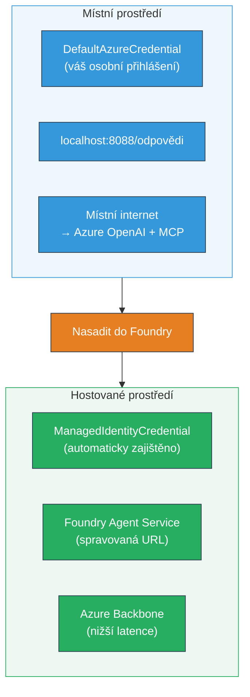

# Modul 7 - Ověření v Playgroundu

V tomto modulu otestujete svůj nasazený multi-agentní workflow jak v **VS Code**, tak v **[Foundry Portalu](https://ai.azure.com)** a potvrdíte, že agent funguje stejně jako při lokálním testování.

---

## Proč ověřovat po nasazení?

Váš multi-agentní workflow běžel lokálně perfektně, tak proč testovat znovu? Hostované prostředí se liší v několika ohledech:


| Rozdíl | Lokálně | Hostováno |
|-----------|-------|--------|
| **Identita** | [`DefaultAzureCredential`](https://learn.microsoft.com/azure/developer/python/sdk/authentication/credential-chains#defaultazurecredential-overview) (váš osobní přihlášení) | [`ManagedIdentityCredential`](https://learn.microsoft.com/python/api/overview/azure/identity-readme#managed-identity-support) (automaticky přiděleno) |
| **Koncepční bod** | `http://localhost:8088/responses` | [Foundry Agent Service](https://learn.microsoft.com/azure/foundry/agents/concepts/hosted-agents) koncový bod (spravované URL) |
| **Síť** | Lokální stroj → Azure OpenAI + MCP outbound | Azure páteřní síť (nižší latence mezi službami) |
| **Připojení MCP** | Lokální internet → `learn.microsoft.com/api/mcp` | Výstup z kontejneru → `learn.microsoft.com/api/mcp` |

Pokud je některá proměnná prostředí špatně nakonfigurovaná, RBAC se liší nebo je blokován MCP outbound, zachytíte to zde.

---

## Možnost A: Test v VS Code Playground (doporučeno jako první)

[Foundry rozšíření](https://marketplace.visualstudio.com/items?itemName=TeamsDevApp.vscode-ai-foundry) obsahuje integrovaný Playground, který vám umožní komunikovat s nasazeným agentem, aniž byste opustili VS Code.

### Krok 1: Přejděte na svého hostovaného agenta

1. Klikněte na ikonu **Microsoft Foundry** v **Activity Bar** VS Code (levý boční panel) pro otevření Foundry panelu.
2. Rozbalte svůj připojený projekt (např. `workshop-agents`).
3. Rozbalte **Hosted Agents (Preview)**.
4. Měli byste vidět jméno svého agenta (např. `resume-job-fit-evaluator`).

### Krok 2: Vyberte verzi

1. Klikněte na jméno agenta, aby se rozbalily verze.
2. Klikněte na verzi, kterou jste nasadili (např. `v1`).
3. Otevře se **detailní panel** s detaily kontejneru.
4. Ověřte, že stav je **Started** nebo **Running**.

### Krok 3: Otevřete Playground

1. V detailním panelu klikněte na tlačítko **Playground** (nebo klikněte pravým tlačítkem na verzi → **Open in Playground**).
2. Otevře se chatové rozhraní v záložce VS Code.

### Krok 4: Proveďte základní testy

Použijte stejné 3 testy z [Modulu 5](05-test-locally.md). Napište každou zprávu do vstupního pole Playgroundu a stiskněte **Send** (nebo **Enter**).

#### Test 1 - Kompletní životopis + JD (standardní průběh)

Vložte kompletní vstup z Modulu 5, Test 1 (Jane Doe + Senior Cloud Engineer ve společnosti Contoso Ltd).

**Očekáváno:**
- Hodnocení fit s rozpisem na 100 bodů
- Sekce shodných dovedností
- Sekce chybějících dovedností
- **Jedna gap karta na chybějící dovednost** s odkazy na Microsoft Learn
- Plán vzdělávání s časovou osou

#### Test 2 - Rychlý krátký test (minimální vstup)

```
RESUME: 3 years Python developer, knows Django and PostgreSQL, no cloud experience.

JOB: Cloud DevOps Engineer requiring AWS, Kubernetes, Terraform, CI/CD. 5 years needed.
```

**Očekáváno:**
- Nižší hodnocení fit (< 40)
- Poctivé hodnocení s krokovanou učební cestou
- Více gap karet (AWS, Kubernetes, Terraform, CI/CD, mezera v zkušenostech)

#### Test 3 - Kandidát s vysokým fit

```
RESUME:
10 years Azure Cloud Architect. AZ-305 certified. Expert in AKS, Terraform, Azure DevOps, 
Azure Functions, Helm, Prometheus, Grafana, Python, Go. Led platform team of 8.

JOB:
Senior Cloud Engineer. Required: AKS, Terraform, Azure DevOps, Python. Preferred: Helm, Go.
5+ years experience. AZ-305 preferred.
```

**Očekáváno:**
- Vysoké hodnocení fit (≥ 80)
- Zaměření na připravenost na pohovor a vylepšení
- Málo nebo žádné gap karty
- Krátká časová osa zaměřená na přípravu

### Krok 5: Porovnejte s lokálními výsledky

Otevřete své poznámky nebo záložku prohlížeče z Modulu 5, kde jste si ukládali lokální odpovědi. Pro každý test:

- Má odpověď **stejnou strukturu** (hodnocení fit, gap karty, plán)?
- Dodržuje **stejnou metodiku hodnocení** (rozdělení 100 bodů)?
- Jsou v gap kartách stále přítomny **Microsoft Learn odkazy**?
- Je **jedna gap karta na každou chybějící dovednost** (neodříznutá)?

> **Menší rozdíly ve formulaci jsou normální** – model není deterministický. Zaměřte se na strukturu, konzistenci hodnocení a používání MCP nástrojů.

---

## Možnost B: Test v Foundry Portalu

[Foundry Portal](https://ai.azure.com) nabízí webové playground, užitečný pro sdílení s kolegy nebo zúčastněnými stranami.

### Krok 1: Otevřete Foundry Portal

1. Otevřete svůj prohlížeč a přejděte na [https://ai.azure.com](https://ai.azure.com).
2. Přihlaste se stejným Azure účtem, který jste používali během workshopu.

### Krok 2: Najděte svůj projekt

1. Na domovské stránce hledejte **Recent projects** v levém bočním panelu.
2. Klikněte na název svého projektu (např. `workshop-agents`).
3. Pokud ho nevidíte, klikněte na **All projects** a vyhledejte ho.

### Krok 3: Najděte svého nasazeného agenta

1. V levé navigaci projektu klikněte na **Build** → **Agents** (nebo hledejte sekci **Agents**).
2. Měli byste vidět seznam agentů. Najděte svého nasazeného agenta (např. `resume-job-fit-evaluator`).
3. Klikněte na jméno agenta pro otevření detailní stránky.

### Krok 4: Otevřete Playground

1. Na detailní stránce agenta se podívejte do horního panelu nástrojů.
2. Klikněte na **Open in playground** (nebo **Try in playground**).
3. Otevře se chatové rozhraní.

### Krok 5: Proveďte stejné základní testy

Opakujte všechny 3 testy z části VS Code Playground výše. Porovnejte každou odpověď s lokálními výsledky (Modul 5) i výsledky z VS Code Playground (Možnost A).

---

## Ověření specifické pro multi-agenty

Kromě základní správnosti ověřte tyto chování specifické pro multi-agenty:

### Provoz MCP nástrojů

| Kontrola | Jak ověřit | Podmínka úspěchu |
|----------|------------|------------------|
| MCP volání proběhla úspěšně | Gap karty obsahují `learn.microsoft.com` URL | Skutečné URL, ne záložní zprávy |
| Více MCP volání | Každá mezera s vysokou/střední prioritou má zdroje | Ne pouze první gap karta |
| Fallback MCP funguje | Pokud URL chybí, zkontrolujte fallback text | Agent stále generuje gap karty (s URL nebo bez) |

### Koordinace agentů

| Kontrola | Jak ověřit | Podmínka úspěchu |
|----------|------------|------------------|
| Spustili se všichni 4 agenti | Výstup obsahuje fit skóre A gap karty | Skóre z MatchingAgent, karty z GapAnalyzer |
| Paralelní rozvětvení | Čas reakce je rozumný (< 2 min) | Pokud > 3 min, paralelní běh může být nefunkční |
| Integrita datového toku | Gap karty odkazují na dovednosti ze zprávy matching | Žádné halucinované dovednosti, které nejsou v JD |

---

## Hodnotící rubrika

Použijte tuto rubriku k vyhodnocení chování vašeho multi-agentního workflow v hostovaném prostředí:

| # | Kritérium | Podmínka splnění | Splněno? |
|---|-----------|------------------|----------|
| 1 | **Funkční správnost** | Agent odpovídá na životopis + JD s hodnocením fit a analýzou mezer | |
| 2 | **Konzistence hodnocení** | Fit skóre používá 100-bodovou škálu s rozpisem | |
| 3 | **Úplnost gap karet** | Jedna karta na chybějící dovednost (nesloučená ani neodříznutá) | |
| 4 | **Integrace MCP nástrojů** | Gap karty obsahují skutečné Microsoft Learn URL | |
| 5 | **Konzistence struktury** | Výstupní struktura odpovídá mezi lokálním a hostovaným během | |
| 6 | **Čas reakce** | Hostovaný agent odpovídá do 2 minut u kompletního hodnocení | |
| 7 | **Bez chyb** | Žádné HTTP 500 chyby, timeouty nebo prázdné odpovědi | |

> „Splněno“ znamená, že všech 7 kritérií platí pro všechny 3 základní testy v alespoň jednom playgroundu (VS Code nebo Portal).

---

## Řešení problémů s playgroundem

| Příznak | Pravděpodobná příčina | Řešení |
|---------|-----------------------|---------|
| Playground se nenačítá | Stav kontejneru není „Started“ | Vraťte se k [Modulu 6](06-deploy-to-foundry.md), ověřte stav nasazení. Počkejte pokud je „Pending“ |
| Agent vrací prázdnou odpověď | Nesoulad názvu nasazení modelu | Zkontrolujte `agent.yaml` → `environment_variables` → `MODEL_DEPLOYMENT_NAME`, že odpovídá nasazenému modelu |
| Agent vrací chybovou zprávu | Chybějící oprávnění [RBAC](https://learn.microsoft.com/azure/foundry/concepts/rbac-foundry) | Přiřaďte **[Azure AI User](https://aka.ms/foundry-ext-project-role)** na úrovni projektu |
| V gap kartách nejsou Microsoft Learn URL | MCP outbound blokován nebo MCP server nedostupný | Zkontrolujte, zda kontejner má přístup k `learn.microsoft.com`. Viz [Modul 8](08-troubleshooting.md) |
| Pouze 1 gap karta (zkrácená) | GapAnalyzer instrukce postrádají blok "CRITICAL" | Projděte [Modul 3, Krok 2.4](03-configure-agents.md) |
| Hodnocení fit výrazně jiné než lokálně | Nasazen odlišný model nebo instrukce | Porovnejte proměnné prostředí v `agent.yaml` s lokálním `.env`. Případně redeployujte |
| „Agent nenalezen“ v Portalu | Nasazení se stále propaguje nebo selhalo | Počkejte 2 minuty, obnovte stránku. Pokud stále chybí, redeployujte z [Modulu 6](06-deploy-to-foundry.md) |

---

### Kontrolní seznam

- [ ] Otestováno v VS Code Playground - všechny 3 základní testy prošly
- [ ] Otestováno v [Foundry Portalu](https://ai.azure.com) Playground - všechny 3 základní testy prošly
- [ ] Odpovědi jsou strukturálně konzistentní s lokálním testováním (fit skóre, gap karty, plán)
- [ ] Microsoft Learn URL jsou přítomny v gap kartách (MCP nástroj funguje v hostovaném prostředí)
- [ ] Jedna gap karta na každou chybějící dovednost (bez odříznutí)
- [ ] Žádné chyby nebo timeouty během testování
- [ ] Dokončena validační rubrika (všech 7 kritérií splněno)

---

**Předchozí:** [06 - Deploy to Foundry](06-deploy-to-foundry.md) · **Další:** [08 - Troubleshooting →](08-troubleshooting.md)

---

<!-- CO-OP TRANSLATOR DISCLAIMER START -->
**Prohlášení o omezení odpovědnosti**:
Tento dokument byl přeložen pomocí AI překladatelské služby [Co-op Translator](https://github.com/Azure/co-op-translator). I když usilujeme o přesnost, mějte prosím na paměti, že automatické překlady mohou obsahovat chyby nebo nepřesnosti. Původní dokument v jeho rodném jazyce by měl být považován za autoritativní zdroj. Pro kritické informace se doporučuje profesionální lidský překlad. Nejsme zodpovědní za jakákoliv nedorozumění nebo nesprávné výklady vyplývající z použití tohoto překladu.
<!-- CO-OP TRANSLATOR DISCLAIMER END -->