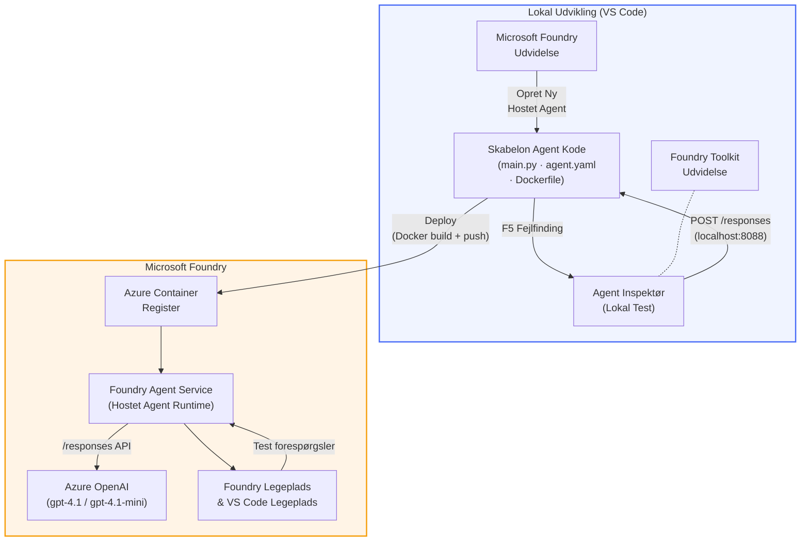

# Foundry Toolkit + Foundry Hosted Agents Workshop

[](https://www.python.org/)
[](https://github.com/microsoft/agents)
[](https://learn.microsoft.com/azure/ai-foundry/agents/concepts/hosted-agents/)
[](https://ai.azure.com/)
[](https://learn.microsoft.com/azure/ai-services/openai/)
[](https://learn.microsoft.com/cli/azure/install-azure-cli)
[](https://learn.microsoft.com/azure/developer/azure-developer-cli/install-azd)
[](https://www.docker.com/)
[](https://marketplace.visualstudio.com/items?itemName=ms-windows-ai-studio.windows-ai-studio)
[](LICENSE)

Byg, test og deploy AI-agenter til **Microsoft Foundry Agent Service** som **Hosted Agents** - helt fra VS Code ved hjælp af **Microsoft Foundry-udvidelsen** og **Foundry Toolkit**.

> **Hosted Agents er i øjeblikket i preview.** Understøttede regioner er begrænsede - se [region tilgængelighed](https://learn.microsoft.com/azure/foundry/agents/concepts/hosted-agents#region-availability).

> Mappen `agent/` inden i hvert lab bliver **automatisk scaffoldet** af Foundry-udvidelsen - du tilpasser derefter koden, tester lokalt og deployer.

### 🌐 Multisprog support

#### Understøttet via GitHub Action (Automatiseret & Altid Opdateret)

<!-- CO-OP TRANSLATOR LANGUAGES TABLE START -->
[Arabic](../ar/README.md) | [Bengali](../bn/README.md) | [Bulgarian](../bg/README.md) | [Burmese (Myanmar)](../my/README.md) | [Chinese (Simplified)](../zh-CN/README.md) | [Chinese (Traditional, Hong Kong)](../zh-HK/README.md) | [Chinese (Traditional, Macau)](../zh-MO/README.md) | [Chinese (Traditional, Taiwan)](../zh-TW/README.md) | [Croatian](../hr/README.md) | [Czech](../cs/README.md) | [Danish](./README.md) | [Dutch](../nl/README.md) | [Estonian](../et/README.md) | [Finnish](../fi/README.md) | [French](../fr/README.md) | [German](../de/README.md) | [Greek](../el/README.md) | [Hebrew](../he/README.md) | [Hindi](../hi/README.md) | [Hungarian](../hu/README.md) | [Indonesian](../id/README.md) | [Italian](../it/README.md) | [Japanese](../ja/README.md) | [Kannada](../kn/README.md) | [Khmer](../km/README.md) | [Korean](../ko/README.md) | [Lithuanian](../lt/README.md) | [Malay](../ms/README.md) | [Malayalam](../ml/README.md) | [Marathi](../mr/README.md) | [Nepali](../ne/README.md) | [Nigerian Pidgin](../pcm/README.md) | [Norwegian](../no/README.md) | [Persian (Farsi)](../fa/README.md) | [Polish](../pl/README.md) | [Portuguese (Brazil)](../pt-BR/README.md) | [Portuguese (Portugal)](../pt-PT/README.md) | [Punjabi (Gurmukhi)](../pa/README.md) | [Romanian](../ro/README.md) | [Russian](../ru/README.md) | [Serbian (Cyrillic)](../sr/README.md) | [Slovak](../sk/README.md) | [Slovenian](../sl/README.md) | [Spanish](../es/README.md) | [Swahili](../sw/README.md) | [Swedish](../sv/README.md) | [Tagalog (Filipino)](../tl/README.md) | [Tamil](../ta/README.md) | [Telugu](../te/README.md) | [Thai](../th/README.md) | [Turkish](../tr/README.md) | [Ukrainian](../uk/README.md) | [Urdu](../ur/README.md) | [Vietnamese](../vi/README.md)

> **Foretrækker du at klone lokalt?**
>
> Dette repository inkluderer 50+ sprogoversættelser, hvilket væsentligt øger downloadstørrelsen. For at klone uden oversættelser, brug sparse checkout:
>
> **Bash / macOS / Linux:**
> ```bash
> git clone --filter=blob:none --sparse https://github.com/microsoft-foundry/Foundry_Toolkit_for_VSCode_Lab.git
> cd Foundry_Toolkit_for_VSCode_Lab
> git sparse-checkout set --no-cone '/*' '!translations' '!translated_images'
> ```
>
> **CMD (Windows):**
> ```cmd
> git clone --filter=blob:none --sparse https://github.com/microsoft-foundry/Foundry_Toolkit_for_VSCode_Lab.git
> cd Foundry_Toolkit_for_VSCode_Lab
> git sparse-checkout set --no-cone "/*" "!translations" "!translated_images"
> ```
>
> Dette giver dig alt, hvad du behøver for at gennemføre kurset med en meget hurtigere download.
<!-- CO-OP TRANSLATOR LANGUAGES TABLE END -->

---

## Arkitektur


**Flow:** Foundry-udvidelsen scaffolder agenten → du tilpasser kode & instruktioner → tester lokalt med Agent Inspector → deployer til Foundry (Docker-image pushes til ACR) → verificerer i Playground.

---

## Hvad du vil bygge

| Lab | Beskrivelse | Status |
|-----|-------------|--------|
| **Lab 01 - Single Agent** | Byg **"Explain Like I'm an Executive" Agent'en**, test den lokalt, og deploy til Foundry | ✅ Tilgængelig |
| **Lab 02 - Multi-Agent Workflow** | Byg **"Resume → Job Fit Evaluator"** - 4 agenter samarbejder om at score CV-pasform og generere en læringsplan | ✅ Tilgængelig |

---

## Mød Executive Agent

I denne workshop bygger du **"Explain Like I'm an Executive" Agent'en** - en AI-agent, der tager komplekst teknisk fagsprog og oversætter det til rolige, bestyrelsesklare opsummeringer. For lad os være ærlige, ingen i C-suiten ønsker at høre om "thread pool exhaustion forårsaget af synkrone kald introduceret i v3.2."

Jeg byggede denne agent efter alt for mange hændelser, hvor min perfekt udarbejdede post-mortem fik svaret: *"Så... er websitet nede eller ej?"*

### Hvordan det virker

Du fodrer den med en teknisk opdatering. Den spytter en ledelsesopsummering tilbage - tre punktformspunkter, ingen jargon, ingen stacktraces, ingen eksistentiel angst. Bare **hvad der skete**, **forretningspåvirkningen**, og **næste skridt**.

### Se den i aktion

**Du siger:**
> "API latencyen steg på grund af trådpool-udtømning forårsaget af synkrone kald introduceret i v3.2."

**Agenten svarer:**

> **Ledelsesopsummering:**
> - **Hvad der skete:** Efter den seneste release gik systemet langsommere.
> - **Forretningspåvirkning:** Nogle brugere oplevede forsinkelser ved brug af servicen.
> - **Næste skridt:** Ændringen er blevet rullet tilbage, og en løsning forberedes før redeployment.

### Hvorfor denne agent?

Det er en død-simple, enkeltformåls-agent - perfekt til at lære hosted agent workflow fra ende til anden uden at blive fanget i komplekse værktøjskæder. Og helt ærligt? Hvert ingeniørteam kunne bruge en af disse.

---

## Workshop struktur

```
📂 Foundry_Toolkit_for_VSCode_Lab/
├── 📄 README.md                      ← You are here
├── 📂 ExecutiveAgent/                ← Standalone hosted agent project
│   ├── agent.yaml
│   ├── Dockerfile
│   ├── main.py
│   └── requirements.txt
└── 📂 workshop/
    ├── 📂 lab01-single-agent/        ← Full lab: docs + agent code
    │   ├── README.md                 ← Hands-on lab instructions
    │   ├── 📂 docs/                  ← Step-by-step tutorial modules
    │   │   ├── 00-prerequisites.md
    │   │   ├── 01-install-foundry-toolkit.md
    │   │   ├── 02-create-foundry-project.md
    │   │   ├── 03-create-hosted-agent.md
    │   │   ├── 04-configure-and-code.md
    │   │   ├── 05-test-locally.md
    │   │   ├── 06-deploy-to-foundry.md
    │   │   ├── 07-verify-in-playground.md
    │   │   └── 08-troubleshooting.md
    │   └── 📂 agent/                 ← Reference solution (auto-scaffolded by Foundry extension)
    │       ├── agent.yaml
    │       ├── Dockerfile
    │       ├── main.py
    │       └── requirements.txt
    └── 📂 lab02-multi-agent/         ← Resume → Job Fit Evaluator
        ├── README.md                 ← Hands-on lab instructions (end-to-end)
        ├── 📂 docs/                  ← Step-by-step tutorial modules
        │   ├── 00-prerequisites.md
        │   ├── 01-understand-multi-agent.md
        │   ├── 02-scaffold-multi-agent.md
        │   ├── 03-configure-agents.md
        │   ├── 04-orchestration-patterns.md
        │   ├── 05-test-locally.md
        │   ├── 06-deploy-to-foundry.md
        │   ├── 07-verify-in-playground.md
        │   └── 08-troubleshooting.md
        └── 📂 PersonalCareerCopilot/ ← Reference solution (multi-agent workflow)
            ├── agent.yaml
            ├── Dockerfile
            ├── main.py
            └── requirements.txt
```

> **Note:** Mappen `agent/` inde i hvert lab er det, som **Microsoft Foundry-udvidelsen** genererer, når du kører `Microsoft Foundry: Create a New Hosted Agent` fra Command Palette. Filene tilpasses så med din agents instruktioner, værktøjer og konfiguration. Lab 01 guider dig gennem at genskabe dette fra bunden.

---

## Kom godt i gang

### 1. Klon repository

```bash
git clone https://github.com/microsoft-foundry/Foundry_Toolkit_for_VSCode_Lab.git
cd Foundry_Toolkit_for_VSCode_Lab
```

### 2. Opsæt et Python virtual environment

```bash
python -m venv venv
```

Aktivér det:

- **Windows (PowerShell):**
  ```powershell
  .\venv\Scripts\Activate.ps1
  ```
- **macOS / Linux:**
  ```bash
  source venv/bin/activate
  ```

### 3. Installer afhængigheder

```bash
pip install -r workshop/lab01-single-agent/agent/requirements.txt
```

### 4. Konfigurer miljøvariable

Kopiér eksempel-`.env`-filen inde i agentmappen og udfyld dine værdier:

```bash
cp workshop/lab01-single-agent/agent/.env.example workshop/lab01-single-agent/agent/.env
```

Rediger `workshop/lab01-single-agent/agent/.env`:

```env
AZURE_AI_PROJECT_ENDPOINT=https://<your-account>.services.ai.azure.com/api/projects/<your-project>
MODEL_DEPLOYMENT_NAME=<your-model-deployment-name>
```

### 5. Følg workshop-labs

Hvert lab er selvstændigt med sine egne moduler. Start med **Lab 01** for at lære det grundlæggende, og fortsæt så til **Lab 02** for multi-agent workflows.

#### Lab 01 - Single Agent ([fulde instruktioner](workshop/lab01-single-agent/README.md))

| # | Modul | Link |
|---|--------|------|
| 1 | Læs forudsætningerne | [00-prerequisites.md](workshop/lab01-single-agent/docs/00-prerequisites.md) |
| 2 | Installer Foundry Toolkit & Foundry extension | [01-install-foundry-toolkit.md](workshop/lab01-single-agent/docs/01-install-foundry-toolkit.md) |
| 3 | Opret et Foundry projekt | [02-create-foundry-project.md](workshop/lab01-single-agent/docs/02-create-foundry-project.md) |
| 4 | Opret en hosted agent | [03-create-hosted-agent.md](workshop/lab01-single-agent/docs/03-create-hosted-agent.md) |
| 5 | Konfigurer instruktioner & miljø | [04-configure-and-code.md](workshop/lab01-single-agent/docs/04-configure-and-code.md) |
| 6 | Test lokalt | [05-test-locally.md](workshop/lab01-single-agent/docs/05-test-locally.md) |
| 7 | Deploy til Foundry | [06-deploy-to-foundry.md](workshop/lab01-single-agent/docs/06-deploy-to-foundry.md) |
| 8 | Verificer i playground | [07-verify-in-playground.md](workshop/lab01-single-agent/docs/07-verify-in-playground.md) |
| 9 | Fejlfinding | [08-troubleshooting.md](workshop/lab01-single-agent/docs/08-troubleshooting.md) |

#### Lab 02 - Multi-Agent Workflow ([fulde instruktioner](workshop/lab02-multi-agent/README.md))

| # | Modul | Link |
|---|--------|------|
| 1 | Forudsætninger (Lab 02) | [00-prerequisites.md](workshop/lab02-multi-agent/docs/00-prerequisites.md) |
| 2 | Forstå multi-agent arkitektur | [01-understand-multi-agent.md](workshop/lab02-multi-agent/docs/01-understand-multi-agent.md) |
| 3 | Scaffold multi-agent projekt | [02-scaffold-multi-agent.md](workshop/lab02-multi-agent/docs/02-scaffold-multi-agent.md) |
| 4 | Konfigurer agenter & miljø | [03-configure-agents.md](workshop/lab02-multi-agent/docs/03-configure-agents.md) |
| 5 | Orkestreringsmønstre | [04-orchestration-patterns.md](workshop/lab02-multi-agent/docs/04-orchestration-patterns.md) |
| 6 | Test lokalt (multi-agent) | [05-test-locally.md](workshop/lab02-multi-agent/docs/05-test-locally.md) |
| 7 | Udrul til Foundry | [06-deploy-to-foundry.md](workshop/lab02-multi-agent/docs/06-deploy-to-foundry.md) |
| 8 | Bekræft i playground | [07-verify-in-playground.md](workshop/lab02-multi-agent/docs/07-verify-in-playground.md) |
| 9 | Fejlfinding (multi-agent) | [08-troubleshooting.md](workshop/lab02-multi-agent/docs/08-troubleshooting.md) |

---

## Vedligeholder

<table>
<tr>
    <td align="center"><a href="https://github.com/ShivamGoyal03">
        <br />
        <sub><b>Shivam Goyal</b></sub>
    </a><br />
    </td>
</tr>
</table>

---

## Nødvendige tilladelser (hurtig reference)

| Scenario | Nødvendige roller |
|----------|-------------------|
| Opret nyt Foundry-projekt | **Azure AI Owner** på Foundry-ressource |
| Udrul til eksisterende projekt (nye ressourcer) | **Azure AI Owner** + **Contributor** på abonnement |
| Udrul til fuldt konfigureret projekt | **Reader** på konto + **Azure AI User** på projekt |

> **Vigtigt:** Azure `Owner` og `Contributor` roller inkluderer kun *administrations* tilladelser, ikke *udviklings* (datahandling) tilladelser. Du behøver **Azure AI User** eller **Azure AI Owner** for at bygge og udrulle agenter.

---

## Referencer

- [Quickstart: Udrul din første hosted agent (VS Code)](https://learn.microsoft.com/azure/foundry/agents/quickstarts/quickstart-hosted-agent)
- [Hvad er hosted agents?](https://learn.microsoft.com/azure/foundry/agents/concepts/hosted-agents)
- [Opret hosted agent workflows i VS Code](https://learn.microsoft.com/azure/foundry/agents/how-to/vs-code-agents-workflow-pro-code)
- [Udrul en hosted agent](https://learn.microsoft.com/azure/foundry/agents/how-to/deploy-hosted-agent)
- [RBAC for Microsoft Foundry](https://learn.microsoft.com/azure/foundry/concepts/rbac-foundry)
- [Architecture Review Agent Sample](https://github.com/Azure-Samples/agent-architecture-review-sample) - Virkelighedsnær hosted agent med MCP-værktøjer, Excalidraw diagrammer og dobbelt udrulning

---


## Licens

[MIT](../../LICENSE)

---

<!-- CO-OP TRANSLATOR DISCLAIMER START -->
**Ansvarsfraskrivelse**:  
Dette dokument er blevet oversat ved hjælp af AI-oversættelsestjenesten [Co-op Translator](https://github.com/Azure/co-op-translator). Selvom vi bestræber os på nøjagtighed, skal du være opmærksom på, at automatiserede oversættelser kan indeholde fejl eller unøjagtigheder. Det oprindelige dokument på dets oprindelige sprog bør betragtes som den autoritative kilde. For kritisk information anbefales professionel menneskelig oversættelse. Vi påtager os intet ansvar for misforståelser eller fejltolkninger, der måtte opstå ved brug af denne oversættelse.
<!-- CO-OP TRANSLATOR DISCLAIMER END -->