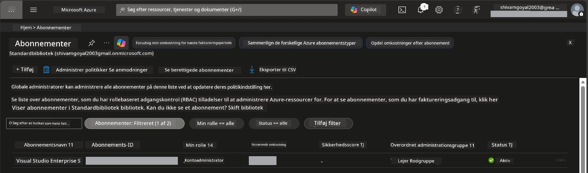

# Module 0 - Forudsætninger

Før du begynder på workshoppen, skal du bekræfte, at du har følgende værktøjer, adgang og miljø klar. Følg hvert trin nedenfor – spring ikke nogen over.

---

## 1. Azure-konto & abonnement

### 1.1 Opret eller bekræft dit Azure-abonnement

1. Åbn en browser og gå til [https://azure.microsoft.com/free/](https://azure.microsoft.com/free/).
2. Hvis du ikke har en Azure-konto, klik på **Start gratis** og følg tilmeldingsprocessen. Du skal bruge en Microsoft-konto (eller oprette en) og et kreditkort til identitetsbekræftelse.
3. Hvis du allerede har en konto, skal du logge ind på [https://portal.azure.com](https://portal.azure.com).
4. Klik i portalen på **Abonnementer** i venstre navigation (eller søg "Abonnementer" i den øverste søgelinje).
5. Bekræft, at du ser mindst ét **Aktivt** abonnement. Noter **Abonnements-ID** – det får du brug for senere.



### 1.2 Forstå de nødvendige RBAC-roller

[Hosted Agent](https://learn.microsoft.com/azure/foundry/agents/concepts/hosted-agents) implementering kræver **data action** tilladelser, som standard Azure `Owner` og `Contributor` roller **ikke** indeholder. Du skal bruge en af disse [rolle-combinationer](https://learn.microsoft.com/azure/foundry/concepts/rbac-foundry#built-in-roles):

| Scenario | Nødvendige roller | Hvor de tildeles |
|----------|-------------------|------------------|
| Opret nyt Foundry-projekt | **Azure AI Owner** på Foundry-ressourcen | Foundry-ressourcen i Azure-portalen |
| Implementer til eksisterende projekt (nye ressourcer) | **Azure AI Owner** + **Contributor** på abonnementet | Abonnement + Foundry-ressourcen |
| Implementer til fuldt konfigureret projekt | **Reader** på kontoen + **Azure AI User** på projektet | Konto + Projekt i Azure-portalen |

> **Vigtigt:** Azure `Owner` og `Contributor` roller dækker kun *administrations* tilladelser (ARM-operationer). Du skal bruge [**Azure AI User**](https://learn.microsoft.com/azure/foundry/concepts/rbac-foundry#built-in-roles) (eller højere) til *data handlinger* som `agents/write`, der er nødvendigt for at oprette og implementere agenter. Du tildeler disse roller i [Module 2](02-create-foundry-project.md).

---

## 2. Installer lokale værktøjer

Installer hvert værktøj nedenfor. Efter installation, bekræft at det virker ved at køre kontrolkommandoen.

### 2.1 Visual Studio Code

1. Gå til [https://code.visualstudio.com/](https://code.visualstudio.com/).
2. Download installationsprogrammet til dit OS (Windows/macOS/Linux).
3. Kør installationsprogrammet med standardindstillinger.
4. Åbn VS Code for at bekræfte, at det starter.

### 2.2 Python 3.10+

1. Gå til [https://www.python.org/downloads/](https://www.python.org/downloads/).
2. Download Python 3.10 eller nyere (3.12+ anbefales).
3. **Windows:** Under installation skal du sætte flueben ved **"Add Python to PATH"** på den første skærm.
4. Åbn en terminal og bekræft:

   ```powershell
   python --version
   ```

   Forventet output: `Python 3.10.x` eller højere.

### 2.3 Azure CLI

1. Gå til [https://learn.microsoft.com/cli/azure/install-azure-cli](https://learn.microsoft.com/cli/azure/install-azure-cli).
2. Følg installationsvejledningen til dit OS.
3. Bekræft:

   ```powershell
   az --version
   ```

   Forventet: `azure-cli 2.80.0` eller højere.

4. Log ind:

   ```powershell
   az login
   ```

### 2.4 Azure Developer CLI (azd)

1. Gå til [https://learn.microsoft.com/azure/developer/azure-developer-cli/install-azd](https://learn.microsoft.com/azure/developer/azure-developer-cli/install-azd).
2. Følg installationsvejledningen for dit OS. På Windows:

   ```powershell
   winget install microsoft.azd
   ```

3. Bekræft:

   ```powershell
   azd version
   ```

   Forventet: `azd version 1.x.x` eller højere.

4. Log ind:

   ```powershell
   azd auth login
   ```

### 2.5 Docker Desktop (valgfrit)

Docker er kun nødvendigt, hvis du vil bygge og teste container-image lokalt før implementering. Foundry-udvidelsen håndterer container builds automatisk under implementering.

1. Gå til [https://docs.docker.com/get-docker/](https://docs.docker.com/get-docker/).
2. Download og installer Docker Desktop til dit OS.
3. **Windows:** Sørg for, at WSL 2 backend er valgt under installation.
4. Start Docker Desktop og vent på, at ikonet i systembakken viser **"Docker Desktop is running"**.
5. Åbn en terminal og bekræft:

   ```powershell
   docker info
   ```

   Dette skulle vise Docker systeminfo uden fejl. Hvis du ser `Cannot connect to the Docker daemon`, vent et par sekunder mere for Docker starter helt op.

---

## 3. Installer VS Code-udvidelser

Du skal bruge tre udvidelser. Installer dem **før** workshoppen begynder.

### 3.1 Microsoft Foundry til VS Code

1. Åbn VS Code.
2. Tryk `Ctrl+Shift+X` for at åbne Udvidelses-panelet.
3. Søg i søgefeltet efter **"Microsoft Foundry"**.
4. Find **Microsoft Foundry for Visual Studio Code** (udgiver: Microsoft, ID: `TeamsDevApp.vscode-ai-foundry`).
5. Klik på **Installer**.
6. Efter installationen skulle du se **Microsoft Foundry** ikonet i aktivitetspanelet (venstre sidebjælke).

### 3.2 Foundry Toolkit

1. I Udvidelses-panelet (`Ctrl+Shift+X`) søg efter **"Foundry Toolkit"**.
2. Find **Foundry Toolkit** (udgiver: Microsoft, ID: `ms-windows-ai-studio.windows-ai-studio`).
3. Klik på **Installer**.
4. **Foundry Toolkit** ikonet skulle dukke op i aktivitetspanelet.

### 3.3 Python

1. I Udvidelses-panelet, søg efter **"Python"**.
2. Find **Python** (udgiver: Microsoft, ID: `ms-python.python`).
3. Klik på **Installer**.

---

## 4. Log ind på Azure fra VS Code

[Microsoft Agent Framework](https://learn.microsoft.com/agent-framework/overview/) bruger [`DefaultAzureCredential`](https://learn.microsoft.com/azure/developer/python/sdk/authentication/credential-chains#defaultazurecredential-overview) til autentificering. Du skal være logget ind på Azure i VS Code.

### 4.1 Log ind via VS Code

1. Se nederst til venstre i VS Code og klik på **Konti** ikonet (person-silhuet).
2. Klik på **Log ind for at bruge Microsoft Foundry** (eller **Log ind med Azure**).
3. Et browservindue åbnes – log ind med den Azure-konto, som har adgang til dit abonnement.
4. Vend tilbage til VS Code. Du burde se dit kontonavn nederst til venstre.

### 4.2 (Valgfrit) Log ind via Azure CLI

Hvis du har installeret Azure CLI og foretrækker CLI-baseret autentificering:

```powershell
az login
```

Dette åbner en browser til login. Efter login, sæt det korrekte abonnement:

```powershell
az account set --subscription "<your-subscription-id>"
```

Bekræft:

```powershell
az account show --query "{name:name, id:id, state:state}" --output table
```

Du burde se dit abonnements navn, ID og status = `Enabled`.

### 4.3 (Alternativ) Service-principal autentificering

For CI/CD eller delte miljøer, sæt i stedet disse miljøvariabler:

```powershell
$env:AZURE_TENANT_ID = "<your-tenant-id>"
$env:AZURE_CLIENT_ID = "<your-client-id>"
$env:AZURE_CLIENT_SECRET = "<your-client-secret>"
```

---

## 5. Begrænsninger i preview

Før du går videre, vær opmærksom på følgende begrænsninger:

- [**Hosted Agents**](https://learn.microsoft.com/azure/foundry/agents/concepts/hosted-agents) er nu i **public preview** – anbefales ikke til produktionsarbejdsbelastninger.
- **Understøttede regioner er begrænsede** – tjek [region-tilgængelighed](https://learn.microsoft.com/azure/foundry/agents/concepts/hosted-agents#region-availability) før oprettelse af ressourcer. Vælger du en uunderstøttet region, mislykkes implementeringen.
- `azure-ai-agentserver-agentframework` pakken er pre-release (`1.0.0b16`) – API'er kan ændre sig.
- Skaleringsgrænser: hosted agenter understøtter 0-5 replikaer (inklusive scale-to-zero).

---

## 6. Forhåndstjekliste

Gå hvert punkt nedenfor igennem. Hvis et trin fejler, gå tilbage og ret det, før du fortsætter.

- [ ] VS Code åbner uden fejl
- [ ] Python 3.10+ er på din PATH (`python --version` viser `3.10.x` eller højere)
- [ ] Azure CLI er installeret (`az --version` viser `2.80.0` eller højere)
- [ ] Azure Developer CLI er installeret (`azd version` viser versionsinformation)
- [ ] Microsoft Foundry-udvidelsen er installeret (ikon synligt i aktivitetspanelet)
- [ ] Foundry Toolkit-udvidelsen er installeret (ikon synligt i aktivitetspanelet)
- [ ] Python-udvidelsen er installeret
- [ ] Du er logget ind på Azure i VS Code (tjek Konti-ikon, nederst til venstre)
- [ ] `az account show` returnerer dit abonnement
- [ ] (Valgfrit) Docker Desktop kører (`docker info` returnerer systeminfo uden fejl)

### Checkpoint

Åbn aktivitetspanelet i VS Code og bekræft, at du kan se både **Foundry Toolkit** og **Microsoft Foundry** sidebjælkevisninger. Klik på hver for at sikre de loader uden fejl.

---

**Næste:** [01 - Installér Foundry Toolkit & Foundry Extension →](01-install-foundry-toolkit.md)

---

<!-- CO-OP TRANSLATOR DISCLAIMER START -->
**Ansvarsfraskrivelse**:  
Dette dokument er oversat ved hjælp af AI-oversættelsestjenesten [Co-op Translator](https://github.com/Azure/co-op-translator). Selvom vi bestræber os på nøjagtighed, bedes du være opmærksom på, at automatiserede oversættelser kan indeholde fejl eller unøjagtigheder. Det originale dokument på dets oprindelige sprog bør betragtes som den autoritative kilde. For kritisk information anbefales professionel menneskelig oversættelse. Vi påtager os intet ansvar for misforståelser eller fejltolkninger, der opstår som følge af brugen af denne oversættelse.
<!-- CO-OP TRANSLATOR DISCLAIMER END -->