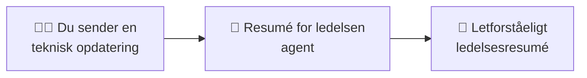

# Modul 0 - Introduktion

⏱️ ~10 min

> [!WARNING]
> **Preview & Begrænsninger:** [Hosted Agents](https://learn.microsoft.com/azure/foundry/agents/concepts/hosted-agents) er i øjeblikket i **offentlig preview** - ikke anbefalet til produktionsarbejdsgange. Vær opmærksom på følgende:
> - **Understøttede regioner er begrænsede** - tjek [regiontilgængelighed](https://learn.microsoft.com/azure/foundry/agents/concepts/hosted-agents#region-availability) inden du opretter ressourcer. Hvis du vælger en ikke-understøttet region, vil implementeringen fejle.
> - `azure-ai-agentserver-agentframework` pakken er pre-release - API’er kan ændre sig mellem versioner.
> - Skaleringsgrænser: hosted agents understøtter 0–5 replikaer (inklusive scale-to-zero).
> - Nogle funktioner vist i denne workshop kan ændre sig, efterhånden som tjenesten bevæger sig mod GA.

## Hvad du skal bygge

I denne workshop bygger du en **"Forklar som om jeg er en direktør"** agent - en hosted AI-agent, der tager komplekse tekniske opdateringer og omskriver dem til enkle, engelske direktøroversigter.

```mermaid
flowchart LR
    A["🧑‍💻 Du sender en\nteknisk opdatering"] --> B["🤖 Resumé for ledelsen\nagent"]
    B --> C["📝 Letforståeligt\nledelsesresumé"]
```

**Agenten bruger:**
- **Microsoft Agent Framework** - til agentlogik og struktur
- **Foundry Toolkit til VS Code** - til at skitsere, teste lokalt og implementere
- **En AI-model** (f.eks. `gpt-4.1-mini/gpt-5-mini`) - til at generere oversigterne

Når du er færdig med dette laboratorium, vil du have en fungerende agent, som du kan teste lokalt via Agent Inspector, og eventuelt implementere til skyen.

---

## Hvad er hosted agents?

En **hosted agent** er en AI-agent, der kører som en managed service i Microsoft Foundry. I stedet for at administrere din egen infrastruktur, pakker du din agentkode i en container, og Foundry håndterer skalering, hosting og eksponering via en standard HTTP-endpoint.

| Begreb | Hvad det betyder |
|---------|--------------|
| **Agent** | Din Python-kode, som modtager en brugermeddelelse, kalder en AI-model og returnerer et struktureret svar |
| **Hosted** | Foundry kører din container for dig - ingen VMs, ingen Kubernetes, ingen infrastruktur at administrere |
| **Responsprotokol** | En standard HTTP API (`POST /responses`), som enhver klient kan kalde for at interagere med din agent |
| **Agent Inspector** | En lokal test-UI (indbygget i Foundry Toolkit), som lader dig chatte med din agent før implementering |

I denne workshop går du fra nul til en fuldt hosted agent - eller stopper ved lokal test, hvis du foretrækker det.

---

## Vælg din vej

> ⚠️ **Vælg en vej før du fortsætter.** Dit valg bestemmer hvilke værktøjer, der skal installeres, og hvilke moduler der gælder. Du kan skifte fra Vej B → Vej A senere, hvis du får et abonnement.

<strong>🅰️ Vej A - Azure cloud (kræver Azure-abonnement)</strong>

| | Detaljer |
|---|---|
| **Hvem er det til?** | Du har et aktivt Azure-abonnement og kan oprette Foundry-ressourcer |
| **Model** | Azure OpenAI via Foundry (f.eks. `gpt-4.1-mini/gpt-5-mini`) |
| **Dækkede moduler** | Alle moduler (00–07) |
| **Implementere til skyen?** | ✅ Ja - fuld ende-til-ende implementering |

<strong>🅱️ Vej B - Lokal / gratis niveau (kræver ikke Azure-abonnement)</strong>

| | Detaljer |
|---|---|
| **Hvem er det til?** | MVP'er, studerende eller enhver uden Azure-adgang |
| **Model** | **Foundry Local** (gratis, kører på din maskine) |
| **Dækkede moduler** | Moduler 00–04 (spring over implementering & skyverifikation) |
| **Implementere til skyen?** | ❌ Nej - kun lokal test via Agent Inspector |

---

## Alle veje: Nødvendige værktøjer

Installer hvert værktøj herunder. Efter installation, bekræft det virker ved at køre kontrolkommandoen.

| # | Værktøj | Version | Installation | Bekræft (Forventet output) |
|---|------|---------|---------|---------------------------|
| 1 | **Visual Studio Code** | Seneste | [code.visualstudio.com](https://code.visualstudio.com/) | Åbner uden fejl |
| 2 | **Python** | 3.12 eller nyere | [python.org/downloads](https://www.python.org/downloads/) | `python --version` $\rightarrow$ `Python 3.12.x` |
| 3 | **Foundry Toolkit til VS Code** | Seneste | Extension ID: `ms-windows-ai-studio.windows-ai-studio` | Foundry-ikon i Aktivitetslinjen |
| 4 | **Python-udvidelse til VS Code** | Seneste | Extension ID: `ms-python.python` | Installeret i Udvidelses-panelet |

> [!TIP]
> **Pro-tips til installation:**
> - **Python PATH (Windows):** Sørg altid for at tjekke **"Add Python to PATH"** i det første skærmbillede i Python-installationsprogrammet. Uden dette genkendes `python` ikke i din terminal.
> - **Flere Python-versioner:** Hvis du har både Python 3.10 og 3.12 installeret, brug `python3.12 -m venv .venv` for at sikre, at den korrekte version bruges til dit virtuelle miljø.
> - **Docker WSL 2 (Windows):** Under installation af Docker Desktop, sørg for at **WSL 2 backend** er valgt. Docker med Hyper-V er langsommere og kan give problemer med Foundry container builds.
> - **Docker starter ikke?** Vent 30–60 sekunder efter lancering af Docker Desktop. Kør `docker info` - hvis du ser "Cannot connect to the Docker daemon," initialiserer Docker stadig.
> - **VS Code-udvidelser loader ikke?** Efter installation af udvidelser, genindlæs vinduet: `Ctrl+Shift+P` → `Developer: Reload Window`.

> **Windows-brugere:** Tjek **"Add Python to PATH"** under Python-installationen.

**Næste:** [01 - Setup →](01-setup.md)

---

<!-- CO-OP TRANSLATOR DISCLAIMER START -->
**Ansvarsfraskrivelse**:
Dette dokument er blevet oversat ved hjælp af AI-oversættelsestjenesten [Co-op Translator](https://github.com/Azure/co-op-translator). Selvom vi bestræber os på nøjagtighed, skal du være opmærksom på, at automatiserede oversættelser kan indeholde fejl eller unøjagtigheder. Det originale dokument på dets oprindelige sprog bør betragtes som den autoritative kilde. For kritisk information anbefales professionel menneskelig oversættelse. Vi påtager os intet ansvar for misforståelser eller fejltolkninger, der opstår som følge af brugen af denne oversættelse.
<!-- CO-OP TRANSLATOR DISCLAIMER END -->