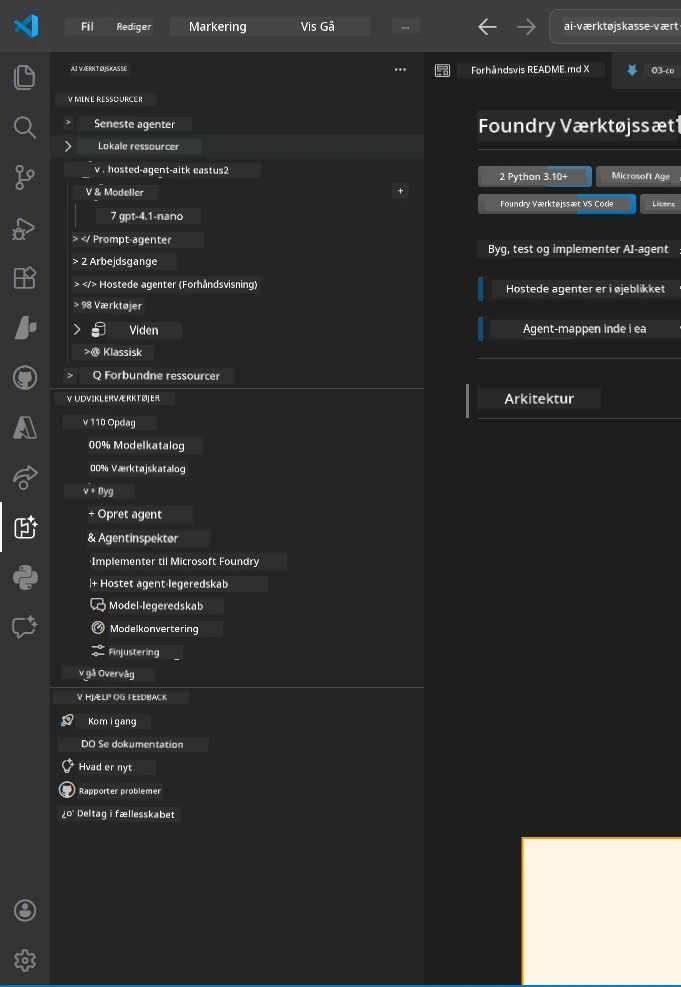
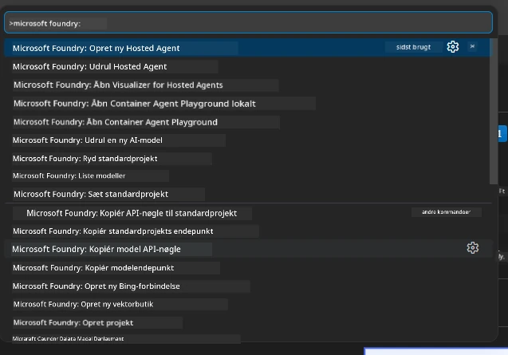

# Modul 1 - Installer Foundry Toolkit & Foundry Extension

Dette modul guider dig gennem installation og verifikation af de to vigtigste VS Code-udvidelser til denne workshop. Hvis du allerede har installeret dem under [Modul 0](00-prerequisites.md), kan du bruge dette modul til at verificere, at de fungerer korrekt.

---

## Trin 1: Installer Microsoft Foundry-udvidelsen

**Microsoft Foundry for VS Code**-udvidelsen er dit hovedværktøj til at oprette Foundry-projekter, implementere modeller, opbygge hosted agents og implementere direkte fra VS Code.

1. Åbn VS Code.
2. Tryk på `Ctrl+Shift+X` for at åbne **Extensions**-panelet.
3. Skriv i søgefeltet øverst: **Microsoft Foundry**
4. Se efter resultatet med titlen **Microsoft Foundry for Visual Studio Code**.
   - Udgiver: **Microsoft**
   - Udvidelses-ID: `TeamsDevApp.vscode-ai-foundry`
5. Klik på **Install**-knappen.
6. Vent på, at installationen fuldføres (du vil se en lille fremdriftsindikator).
7. Efter installationen skal du kigge på **Activity Bar** (den lodrette ikonbjælke på venstre side af VS Code). Du bør se et nyt ikon for **Microsoft Foundry** (ligner et diamant-/AI-ikon).
8. Klik på **Microsoft Foundry**-ikonet for at åbne dens sidebjælkevisning. Du bør se sektioner for:
   - **Resources** (eller Projects)
   - **Agents**
   - **Models**

> **Hvis ikonet ikke vises:** Prøv at genindlæse VS Code (`Ctrl+Shift+P` → `Developer: Reload Window`).

---

## Trin 2: Installer Foundry Toolkit-udvidelsen

**Foundry Toolkit**-udvidelsen tilbyder [**Agent Inspector**](https://learn.microsoft.com/azure/foundry/agents/how-to/vs-code-agents-workflow-pro-code) - en visuel grænseflade til test og fejlfinding af agenter lokalt - plus playground, modeladministration og evalueringsværktøjer.

1. I Extensions-panelet (`Ctrl+Shift+X`) skal du rydde søgefeltet og skrive: **Foundry Toolkit**
2. Find **Foundry Toolkit** i resultaterne.
   - Udgiver: **Microsoft**
   - Udvidelses-ID: `ms-windows-ai-studio.windows-ai-studio`
3. Klik på **Install**.
4. Efter installationen vises **Foundry Toolkit**-ikonet i Activity Bar (ligner et robot-/glimt-ikon).
5. Klik på **Foundry Toolkit**-ikonet for at åbne dens sidebjælkevisning. Du bør se Foundry Toolkits velkomstskærm med muligheder for:
   - **Models**
   - **Playground**
   - **Agents**

---

## Trin 3: Bekræft at begge udvidelser fungerer

### 3.1 Bekræft Microsoft Foundry Extension

1. Klik på **Microsoft Foundry**-ikonet i Activity Bar.
2. Hvis du er logget ind på Azure (fra Modul 0), bør du se dine projekter under **Resources**.
3. Hvis du bliver bedt om at logge ind, klik på **Sign in** og følg autentificeringsforløbet.
4. Bekræft, at du kan se sidebjælken uden fejl.

### 3.2 Bekræft Foundry Toolkit Extension

1. Klik på **Foundry Toolkit**-ikonet i Activity Bar.
2. Bekræft, at velkomstvisningen eller hovedpanelet indlæses uden fejl.
3. Du behøver endnu ikke at konfigurere noget - vi bruger Agent Inspector i [Modul 5](05-test-locally.md).

### 3.3 Bekræft via Command Palette

1. Tryk på `Ctrl+Shift+P` for at åbne Command Palette.
2. Skriv **"Microsoft Foundry"** - du burde se kommandoer som:
   - `Microsoft Foundry: Create a New Hosted Agent`
   - `Microsoft Foundry: Deploy Hosted Agent`
   - `Microsoft Foundry: Open Model Catalog`
3. Tryk på `Escape` for at lukke Command Palette.
4. Åbn Command Palette igen og skriv **"Foundry Toolkit"** - du burde se kommandoer som:
   - `Foundry Toolkit: Open Agent Inspector`

> Hvis du ikke kan se disse kommandoer, er udvidelserne muligvis ikke installeret korrekt. Prøv at afinstallere og geninstallere dem.

---

## Hvad disse udvidelser gør i denne workshop

| Udvidelse | Hvad den gør | Hvornår du bruger den |
|-----------|-------------|-------------------|
| **Microsoft Foundry for VS Code** | Opret Foundry-projekter, implementer modeller, **opbyg [hosted agents](https://learn.microsoft.com/azure/foundry/agents/concepts/hosted-agents)** (auto-genererer `agent.yaml`, `main.py`, `Dockerfile`, `requirements.txt`), implementer til [Foundry Agent Service](https://learn.microsoft.com/azure/foundry/agents/overview) | Modulerne 2, 3, 6, 7 |
| **Foundry Toolkit** | Agent Inspector til lokal test/fejlfinding, playground UI, modeladministration | Modulerne 5, 7 |

> **Foundry-udvidelsen er det mest kritiske værktøj i denne workshop.** Den håndterer hele livscyklussen: opbyg → konfigurer → implementer → bekræft. Foundry Toolkit supplerer ved at give den visuelle Agent Inspector til lokal test.

---

### Tjekliste

- [ ] Microsoft Foundry-ikonet er synligt i Activity Bar
- [ ] Klik på det åbner sidebjælken uden fejl
- [ ] Foundry Toolkit-ikonet er synligt i Activity Bar
- [ ] Klik på det åbner sidebjælken uden fejl
- [ ] `Ctrl+Shift+P` → skrive "Microsoft Foundry" viser tilgængelige kommandoer
- [ ] `Ctrl+Shift+P` → skrive "Foundry Toolkit" viser tilgængelige kommandoer

---

**Forrige:** [00 - Prerequisites](00-prerequisites.md) · **Næste:** [02 - Create Foundry Project →](02-create-foundry-project.md)

---

<!-- CO-OP TRANSLATOR DISCLAIMER START -->
**Ansvarsfraskrivelse**:  
Dette dokument er blevet oversat ved hjælp af AI-oversættelsestjenesten [Co-op Translator](https://github.com/Azure/co-op-translator). Selvom vi bestræber os på nøjagtighed, skal du være opmærksom på, at automatiserede oversættelser kan indeholde fejl eller unøjagtigheder. Det oprindelige dokument på dets modersmål bør betragtes som den autoritative kilde. For kritisk information anbefales professionel menneskelig oversættelse. Vi påtager os intet ansvar for misforståelser eller fejltolkninger, der opstår som følge af brugen af denne oversættelse.
<!-- CO-OP TRANSLATOR DISCLAIMER END -->