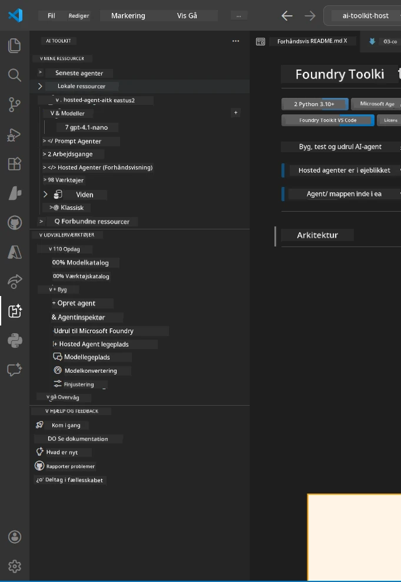
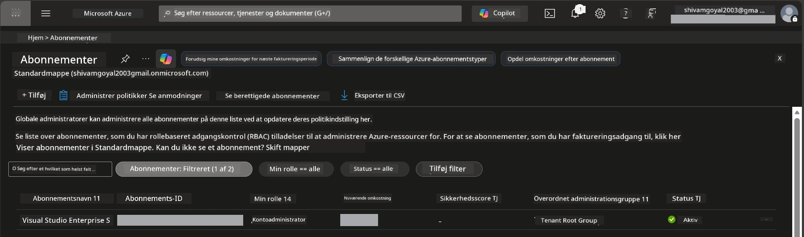
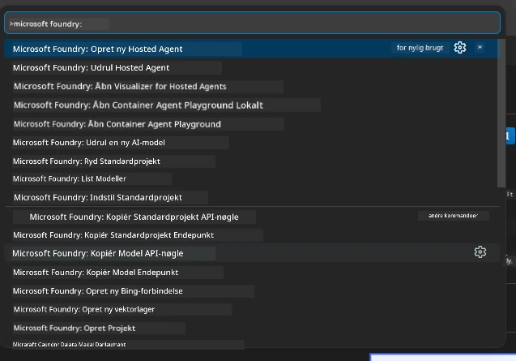
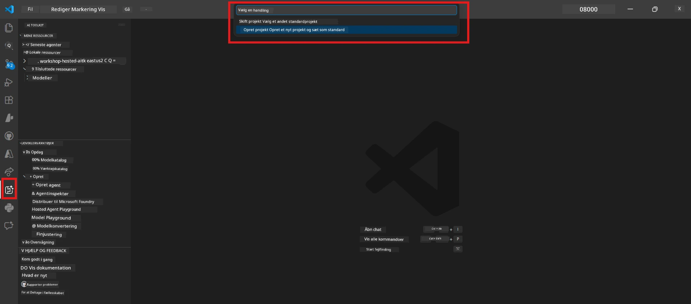
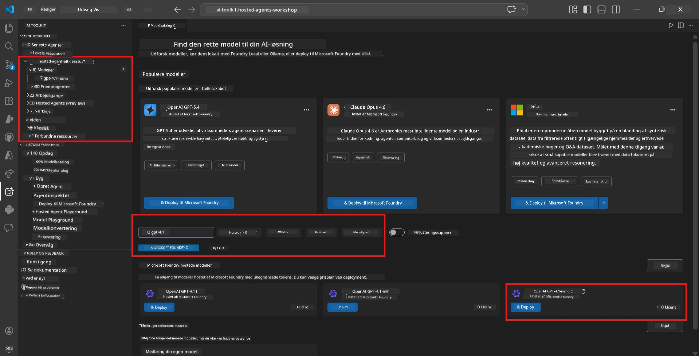
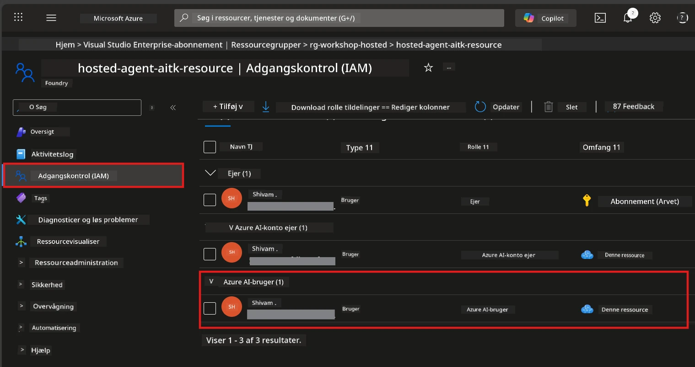

# Opsætning: Udvidelse, Projekt & Model

⏱️ ~15 min

I denne modul installerer og verificerer du Foundry Toolkit-udvidelsen, opretter (eller forbinder til) et Foundry-projekt og implementerer en model, som din agent vil bruge.

## Trin 1: Installer Foundry Toolkit

**Foundry Toolkit til VS Code** er den primære udvidelse til denne workshop. Den tilbyder projektoprettelse, modelimplementering, agentopsætning, lokal testning (Agent Inspector) og cloud-implementering - alt sammen fra VS Code.

1. Åbn VS Code, tryk derefter `Ctrl+Shift+X` for at åbne **Udvidelser**-panelet.
2. Søg efter **Foundry Toolkit**.
3. Installer **Foundry Toolkit for VS Code** (Udgiver: Microsoft, ID: `ms-windows-ai-studio.windows-ai-studio`).
4. Efter installation vises ikonet **Foundry Toolkit** i Aktivitetslinjen (venstre sidebjælke).

> *Bemærk: Aktivitetslinjen kan vise "AI TOOLKIT" i ældre udvidelsesversioner. Funktionaliteten er identisk.*



## Trin 2: Opsætning baseret på din adgang

> **Vælg din vej:** Udvid nedenstående sektion, der matcher din opsætning. Du behøver kun at fuldføre **én** vej.

<details>
<summary><strong>🅰️ Vej A - Azure cloud (kræver Azure-abonnement)</strong></summary>

### Azure CLI

1. Installer fra [learn.microsoft.com/cli/azure/install-azure-cli](https://learn.microsoft.com/cli/azure/install-azure-cli).
2. Verificer: `az --version` (forvent 2.80.0+).
3. Log ind: `az login`

### Autentificeringsmuligheder

[Microsoft Agent Framework](https://learn.microsoft.com/agent-framework/overview/) bruger [`DefaultAzureCredential`](https://learn.microsoft.com/azure/developer/python/sdk/authentication/credential-chains#defaultazurecredential-overview), som forsøger flere autentificeringsmetoder i rækkefølge. Vælg den, der passer til dit miljø:

#### Mulighed 1: VS Code Konti (anbefalet til workshops)
1. Klik på **Konti**-ikonet (person-silhuet) nederst til venstre i VS Code.
2. Vælg **Log ind for at bruge Microsoft Foundry** (eller **Log ind med Azure**).
3. En browser åbnes – log ind med den Azure-konto, der har adgang til dit abonnement.
4. Vend tilbage til VS Code. Du bør se dit kontonavn nederst til venstre.

#### Mulighed 2: Azure CLI
```bash
az login
az account set --subscription "<your-subscription-id>"
```

#### Mulighed 3: Service Principal (Enterprise/CI)
For låste miljøer eller CI/CD pipelines, indstil disse miljøvariabler i din `.env` fil:
```env
AZURE_TENANT_ID=<your-tenant-id>
AZURE_CLIENT_ID=<your-client-id>
AZURE_CLIENT_SECRET=<your-client-secret>
```

> **Hvordan `DefaultAzureCredential` fungerer:** Den prøver først miljøvariabler, derefter managed identity, så VS Code sign-in, derefter Azure CLI – og bruger den metode, der lykkes først. Se [credential chain docs](https://learn.microsoft.com/azure/developer/python/sdk/authentication/credential-chains#defaultazurecredential-overview).

### Azure Developer CLI (azd)

1. Installer: `winget install microsoft.azd` (Windows) eller se [installationsvejledning](https://learn.microsoft.com/azure/developer/azure-developer-cli/install-azd).
2. Verificer: `azd version`
3. Log ind: `azd auth login`

### Docker Desktop (valgfrit)

Docker er kun nødvendigt, hvis du ønsker at bygge containere lokalt. Foundry-udvidelsen håndterer byggerier automatisk under implementering.

1. Installer fra [docs.docker.com/get-docker](https://docs.docker.com/get-docker/).
2. Verificer: `docker info`

### Azure-abonnement & RBAC

1. Log ind på [portal.azure.com](https://portal.azure.com).
2. Naviger til **Abonnementer** og bekræft, at mindst ét er **Aktivt**.
3. Noter dit **Abonnements-ID** – du skal bruge det i Modul 01.



#### RBAC Scenariotabel

[Hosted Agent](https://learn.microsoft.com/azure/foundry/agents/concepts/hosted-agents) implementering kræver **dataaktions** tilladelser, som standard Azure `Owner` og `Contributor` roller **ikke** indeholder. Brug tabellen nedenfor til at afgøre, hvilke roller du behøver:

| Scenario | Krævede roller | Hvor de skal tildeles |
|----------|----------------|----------------------|
| Opret nyt Foundry projekt | **Azure AI Owner** på Foundry-ressource | Foundry-ressource i Azure Portal |
| Implementer til eksisterende projekt (nye ressourcer) | **Azure AI Owner** + **Contributor** på abonnement | Abonnement + Foundry-ressource |
| Implementer til fuldt konfigureret projekt | **Reader** på konto + **Azure AI User** på projekt | Konto + Projekt i Azure Portal |
| Kun lokal testning (ingen implementering) | **Azure AI User** på projekt | Projekt i Azure Portal |

> **Vigtigt punkt:** Azure `Owner` og `Contributor` roller dækker kun *administrations* tilladelser (ARM-operationer). Du skal bruge [**Azure AI User**](https://learn.microsoft.com/azure/foundry/concepts/rbac-foundry#built-in-roles) (eller højere) for *dataaktioner* som `agents/write`, som er nødvendige for at oprette og implementere agenter.

## Forbind eller opret et Foundry-projekt



1. Tryk `Ctrl+Shift+P` → skriv **Foundry Toolkit: Create Project** → vælg det.
2. Vælg dit **Azure-abonnement** fra dropdown-menuen.
3. Vælg eller opret en **ressourcegruppe** (f.eks. `rg-hosted-agents-workshop`).
4. Vælg en **region**, som understøtter hosted agents: `East US`, `West US 2` eller `Sweden Central`. Se [regions tilgængelighed](https://learn.microsoft.com/azure/foundry/agents/concepts/hosted-agents#region-availability).
5. Indtast et projektnavn (f.eks. `workshop-agents`).
6. Vent 2–5 minutter på oprettelse. En fremdriftsnotifikation vises i VS Code.
7. Når færdig, vises dit projekt i **Foundry Toolkit** sidebjælken under **MINE RESSOURCER**.



## Implementer en model & tildel RBAC

Din hosted agent har brug for en AI-model til at generere svar.

#### Modelvalgs-matrix
Afhængigt af dine behov kan du vælge mellem forskellige modellag:

| Model | Bedst til | Pris | Bemærkninger |
|-------|-----------|-------|-------------|
| `gpt-4.1` | Høj kvalitets, nuancerede svar | Højere | Bedste resultater, anbefales til sluttestning |
| `gpt-4.1-mini/gpt-5-mini` | Hurtig iteration, lavere pris | Lavere | God til workshopudvikling og hurtig testning |
| `gpt-4.1-nano` | Letvægtsopgaver | Lavest | Mest omkostningseffektiv, men enklere svar |

1. Tryk `Ctrl+Shift+P` → **Foundry Toolkit: Open Model Catalog** (eller klik **Model Catalog** i sidebjælken under UDVIKLERVÆRKTØJER → Opdag).
2. Søg efter **gpt-4.1** i kataloget.
3. Find **OpenAI GPT-4.1-mini** (eller `gpt-5-mini` for bedre kvalitet) og klik på **Deploy**.



4. I implementeringskonfigurationen:
   - **Implementeringsnavn:** Lad standard være eller indtast et brugerdefineret navn. **Husk dette navn.**
   - **Mål:** Vælg **Deploy to Foundry Toolkit** → vælg dit projekt.
5. Klik på **Deploy** og vent 1–3 minutter.

> **Anbefaling:** Brug `gpt-4.1-mini/gpt-5-mini` til workshoppen - hurtigt, prisvenligt og giver gode resultater.

### Noter dine værdier

Efter implementering, noter disse to værdier (du får brug for dem i Modul 03):

| Værdi | Hvor den findes |
|-------|----------------|
| **Projekt-endpoint** | Klik på dit projekt i sidebjælken → detaljevisning viser URL (f.eks. `https://<account>.services.ai.azure.com/api/projects/<project>`) |
| **Modelimplementeringsnavn** | Udvid projekt → **Modeller** → navnet ved siden af din implementerede model (f.eks. `gpt-4.1-mini/gpt-5-mini`) |

### Tildel RBAC-rolle

> ⚠️ **Dette er det mest glemte trin.** Uden korrekt rolle vil implementering i Modul 05 fejle.

#### Hvilken rolle har jeg brug for?
Afhængigt af dit scenario, skal du bruge følgende rolle-kombinationer:

| Scenario | Krævede roller | Hvor de skal tildeles |
|----------|----------------|----------------------|
| Opret nyt Foundry projekt | **Azure AI Owner** på Foundry-ressource | Foundry-ressource i Azure Portal |
| Implementer til eksisterende projekt (nye ressourcer) | **Azure AI Owner** + **Contributor** på abonnement | Abonnement + Foundry-ressource |
| Implementer til fuldt konfigureret projekt | **Reader** på konto + **Azure AI User** på projekt | Konto + Projekt i Azure Portal |

**Vigtigt punkt:** Azure `Owner` og `Contributor` roller dækker kun *administrations* tilladelser. Du skal bruge **Azure AI User** (eller højere) for *dataaktioner* som `agents/write` nødvendigt for at oprette og implementere agenter.

1. Åbn [portal.azure.com](https://portal.azure.com).
2. Søg efter dit **Foundry projekt** navn → klik på resultatet af typen **"Foundry Toolkit project"** (IKKE den overordnede konto).
3. Klik på **Adgangskontrol (IAM)** i venstre navigation.
4. Klik på **+ Tilføj** → **Tilføj rolle tildeling**.
5. **Rolle-fanen:** Søg efter **Azure AI User**, vælg den, klik **Næste**.
6. **Medlemmer-fanen:** Vælg **Bruger, gruppe eller service principal** → klik **+ Vælg medlemmer** → find og vælg dig selv → klik **Vælg**.
7. Klik på **Gennemse + tildel** → **Gennemse + tildel** igen.
8. **Vent 1–2 minutter** på udbredelse.

> **Hvorfor denne rolle?** Azure `Owner`/`Contributor` giver kun administrationsrettigheder. Rollen **Azure AI User** giver `agents/write` dataaktionen nødvendig for at oprette og implementere agenter. Se [Foundry RBAC-dokumentation](https://learn.microsoft.com/azure/foundry/concepts/rbac-foundry#built-in-roles).



</details>

<details>
<summary><strong>🅱️ Vej B - Lokal / gratis lag (intet Azure-abonnement nødvendigt)</strong></summary>

### Foundry Local

Foundry Local lader dig køre AI-modeller på din egen maskine - ingen cloud-konto nødvendig. Du kan få adgang til Foundry Local modeller via Foundry Toolkit gennem modelkataloget som følger:

1. Gå til Foundry Toolkit udvidelsen.
2. I Foundry Toolkit navigationen gå til **Udviklerværktøjer** > og vælg **Modelkatalog**
3. I det nye vindue, vælg **local** i navigationsbaren.
4. Scroll ned til **Phi 4 Mini,** og klik på **tilføj knappen** en pop op vil vise, at modellen downloades.
5. Når modellen er downloadet, kan du gå videre til næste trin.

</details>

### ✅ Tjekpunkt


- [ ] `Ctrl+Shift+P` → "Foundry Toolkit" viser tilgængelige kommandoer
- [ ] Foundry Toolkit udvidelse installeret og sidebjælken indlæses uden fejl
- [ ] VS Code åbner og kører korrekt
- [ ] `python --version` viser 3.10+
- [ ] Foundry Toolkit ikon synligt i VS Code Aktivitetslinje
- [ ] **Vej A:** `az login` lykkes, abonnement er Aktivt
- [ ] **Vej B:** Foundry Local kører (`foundry local status`)
- [ ] **Vej A:** Foundry-projekt synligt i sidebjælken, model implementeret, Azure AI User rolle tildelt
- [ ] **Vej B:** Foundry Local kører med en model
- [ ] Du har noteret din **endpoint** og **modelimplementeringsnavn**


**Forrige:** [00 - Forudsætninger](00-prerequisites.md) · **Næste:** [02 - Opret Hosted Agent →](02-create-hosted-agent.md)

---

<!-- CO-OP TRANSLATOR DISCLAIMER START -->
**Ansvarsfraskrivelse**:
Dette dokument er blevet oversat ved hjælp af AI-oversættelsestjenesten [Co-op Translator](https://github.com/Azure/co-op-translator). Selvom vi bestræber os på nøjagtighed, skal du være opmærksom på, at automatiserede oversættelser kan indeholde fejl eller unøjagtigheder. Det originale dokument på dets oprindelige sprog bør betragtes som den autoritative kilde. For kritisk information anbefales professionel menneskelig oversættelse. Vi påtager os intet ansvar for misforståelser eller fejltolkninger, der opstår som følge af brugen af denne oversættelse.
<!-- CO-OP TRANSLATOR DISCLAIMER END -->