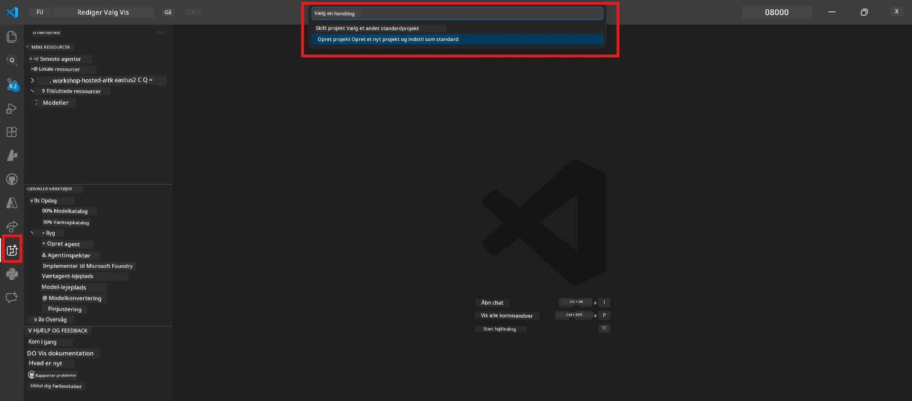
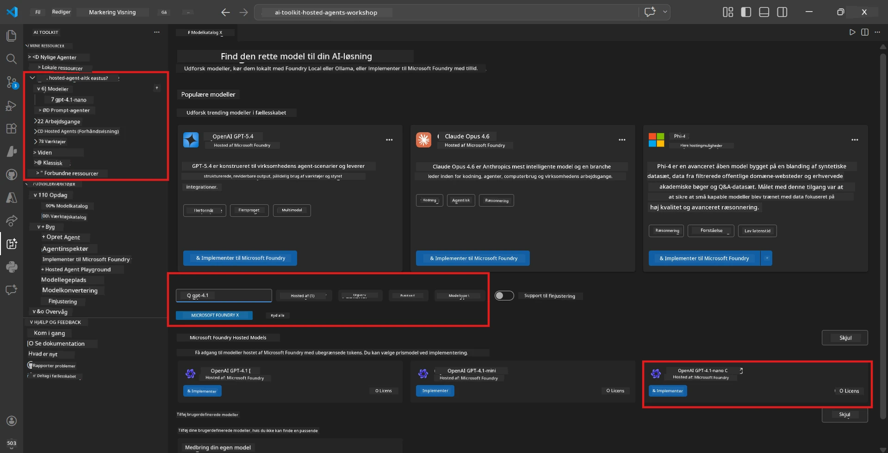
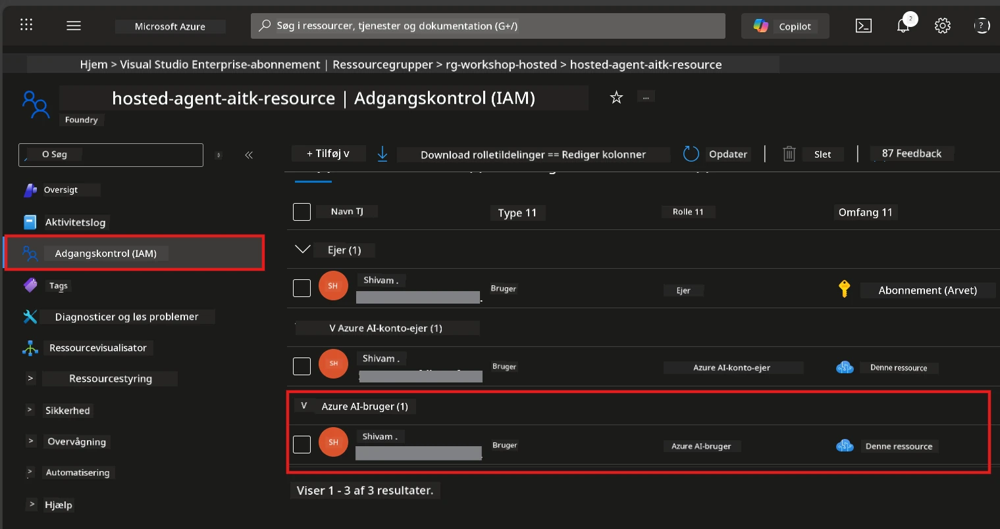

# Modul 2 - Opret et Foundry-projekt og deploy en model

I dette modul opretter du (eller vælger) et Microsoft Foundry-projekt og deployer en model, som din agent vil bruge. Hvert trin er skrevet ud eksplicit - følg dem i rækkefølge.

> Hvis du allerede har et Foundry-projekt med en deployed model, spring til [Modul 3](03-create-hosted-agent.md).

---

## Trin 1: Opret et Foundry-projekt fra VS Code

Du bruger Microsoft Foundry-udvidelsen til at oprette et projekt uden at forlade VS Code.

1. Tryk `Ctrl+Shift+P` for at åbne **Command Palette**.
2. Skriv: **Microsoft Foundry: Create Project** og vælg det.
3. En rullemenu vises - vælg dit **Azure-abonnement** fra listen.
4. Du bliver bedt om at vælge eller oprette en **resource group**:
   - For at oprette en ny: skriv et navn (f.eks. `rg-hosted-agents-workshop`) og tryk Enter.
   - For at bruge en eksisterende: vælg den fra rullemenuen.
5. Vælg en **region**. **Vigtigt:** Vælg en region, der understøtter hosted agents. Se [region tilgængelighed](https://learn.microsoft.com/azure/foundry/agents/concepts/hosted-agents#region-availability) - almindelige valg er `East US`, `West US 2` eller `Sweden Central`.
6. Indtast et **navn** for Foundry-projektet (f.eks. `workshop-agents`).
7. Tryk Enter og vent på, at oprettelsen er færdig.

> **Provisionering tager 2-5 minutter.** Du vil se en statusmeddelelse i nederste højre hjørne af VS Code. Luk ikke VS Code under provisionering.

8. Når det er færdigt, vises dit nye projekt under **Resources** i **Microsoft Foundry** sidepanelet.
9. Klik på projektets navn for at udvide det og bekræfte, at det viser sektioner som **Models + endpoints** og **Agents**.



### Alternativ: Opret via Foundry Portalen

Hvis du foretrækker browseren:

1. Åbn [https://ai.azure.com](https://ai.azure.com) og log ind.
2. Klik på **Create project** på startsiden.
3. Indtast et projektnavn, vælg dit abonnement, ressourcegruppe og region.
4. Klik på **Create** og vent på provisionering.
5. Når det er oprettet, vend tilbage til VS Code - projektet burde vises i Foundry sidepanelet efter en opdatering (klik på opdateringsikonet).

---

## Trin 2: Deploy en model

Din [hostede agent](https://learn.microsoft.com/azure/foundry/agents/concepts/hosted-agents) har brug for en Azure OpenAI-model til at generere svar. Du vil [deploye en nu](https://learn.microsoft.com/azure/ai-foundry/openai/how-to/create-resource#deploy-a-model).

1. Tryk `Ctrl+Shift+P` for at åbne **Command Palette**.
2. Skriv: **Microsoft Foundry: Open [Model Catalog](https://learn.microsoft.com/azure/ai-foundry/openai/concepts/models)** og vælg det.
3. Model Catalog-visningen åbner i VS Code. Gennemse eller brug søgefeltet for at finde **gpt-4.1**.
4. Klik på **gpt-4.1** modelkortet (eller `gpt-4.1-mini`, hvis du foretrækker lavere omkostninger).
5. Klik på **Deploy**.


6. I deployment-konfigurationen:
   - **Deployment name**: Lad standardnavnet stå (f.eks. `gpt-4.1`) eller indtast et brugerdefineret navn. **Husk dette navn** - du skal bruge det i Modul 4.
   - **Target**: Vælg **Deploy to Microsoft Foundry** og vælg det projekt, du lige har oprettet.
7. Klik på **Deploy** og vent på, at deployeringen er færdig (1-3 minutter).

### Valg af model

| Model | Bedst til | Omkostninger | Bemærkninger |
|-------|-----------|--------------|--------------|
| `gpt-4.1` | Høj kvalitet, nuancerede svar | Højere | Bedste resultater, anbefalet til sluttest |
| `gpt-4.1-mini` | Hurtig iteration, lavere omkostninger | Lavere | God til workshop-udvikling og hurtig test |
| `gpt-4.1-nano` | Letvægtsopgaver | Lavest | Mest omkostningseffektivt, men simplere svar |

> **Anbefaling til denne workshop:** Brug `gpt-4.1-mini` til udvikling og test. Det er hurtigt, billigt og giver gode resultater til øvelserne.

### Bekræft modeldeployment

1. Udvid dit projekt i **Microsoft Foundry** sidepanelet.
2. Kig under **Models + endpoints** (eller en lignende sektion).
3. Du bør se din deployed model (f.eks. `gpt-4.1-mini`) med status **Succeeded** eller **Active**.
4. Klik på modeldeployeringen for at se detaljer.
5. **Notér dig** disse to værdier - de skal bruges i Modul 4:

   | Indstilling | Hvor findes den | Eksempelværdi |
   |-------------|-----------------|---------------|
   | **Project endpoint** | Klik på projektets navn i Foundry sidepanelet. Endpoint-URL vises i detaljevisningen. | `https://<account>.services.ai.azure.com/api/projects/<project>` |
   | **Model deployment name** | Navnet vist ved siden af den deployed model. | `gpt-4.1-mini` |

---

## Trin 3: Tildel nødvendige RBAC-roller

Dette er det **mest oversete trin**. Uden de korrekte roller vil deployeringen i Modul 6 fejle med en tilladelsesfejl.

### 3.1 Tildel Azure AI User-rolle til dig selv

1. Åbn en browser og gå til [https://portal.azure.com](https://portal.azure.com).
2. I øverste søgefelt, skriv navnet på dit **Foundry-projekt** og klik på det i resultaterne.
   - **Vigtigt:** Naviger til **projektets** resource (typen: "Microsoft Foundry project"), **ikke** forælder konto/hub resource.
3. Klik på **Access control (IAM)** i projektets venstre navigation.
4. Klik på **+ Add** øverst → vælg **Add role assignment**.
5. I **Role** fanen, søg efter [**Azure AI User**](https://learn.microsoft.com/azure/foundry/concepts/rbac-foundry#built-in-roles) og vælg den. Klik **Next**.
6. På **Members** fanen:
   - Vælg **User, group, or service principal**.
   - Klik på **+ Select members**.
   - Søg efter dit navn eller email, vælg dig selv og klik **Select**.
7. Klik på **Review + assign** → og klik igen på **Review + assign** for at bekræfte.



### 3.2 (Valgfrit) Tildel Azure AI Developer-rolle

Hvis du har brug for at oprette yderligere ressourcer inden for projektet eller administrere deploymenter programmatisk:

1. Gentag ovenstående trin, men vælg i trin 5 **Azure AI Developer** i stedet.
2. Tildel denne rolle på **Foundry resource (konto)** niveau, ikke kun på projekt niveau.

### 3.3 Bekræft dine rolle-tildelinger

1. På projektets **Access control (IAM)** side, klik på fanen **Role assignments**.
2. Søg efter dit navn.
3. Du bør se mindst **Azure AI User** listet for projektscope.

> **Hvorfor dette er vigtigt:** [`Azure AI User`](https://learn.microsoft.com/azure/foundry/concepts/rbac-foundry#built-in-roles) rollen giver `Microsoft.CognitiveServices/accounts/AIServices/agents/write` dataaktion. Uden den vil du se denne fejl under deployering:
>
> ```
> Error: lacks the required data action 
> Microsoft.CognitiveServices/accounts/AIServices/agents/write 
> to perform POST /api/projects/{projectName}/assistants operation.
> ```
>
> Se [Modul 8 - Fejlfinding](08-troubleshooting.md) for flere detaljer.

---

### Checkpoint

- [ ] Foundry-projekt eksisterer og er synligt i Microsoft Foundry sidepanelet i VS Code
- [ ] Mindst en model er deployed (f.eks. `gpt-4.1-mini`) med status **Succeeded**
- [ ] Du har noteret **project endpoint** URL og **model deployment name**
- [ ] Du har fået tildelt **Azure AI User**-rollen på **projekt** niveau (bekræft i Azure Portal → IAM → Role assignments)
- [ ] Projektet er i en [understøttet region](https://learn.microsoft.com/azure/foundry/agents/concepts/hosted-agents#region-availability) for hosted agents

---

**Forrige:** [01 - Installér Foundry Toolkit](01-install-foundry-toolkit.md) · **Næste:** [03 - Opret en Hosted Agent →](03-create-hosted-agent.md)

---

<!-- CO-OP TRANSLATOR DISCLAIMER START -->
**Ansvarsfraskrivelse**:  
Dette dokument er blevet oversat ved hjælp af AI-oversættelsestjenesten [Co-op Translator](https://github.com/Azure/co-op-translator). Selvom vi bestræber os på nøjagtighed, bedes du være opmærksom på, at automatiske oversættelser kan indeholde fejl eller unøjagtigheder. Det oprindelige dokument på dets originale sprog bør betragtes som den autoritative kilde. For kritisk information anbefales professionel menneskelig oversættelse. Vi påtager os intet ansvar for misforståelser eller fejltolkninger, der opstår som følge af brugen af denne oversættelse.
<!-- CO-OP TRANSLATOR DISCLAIMER END -->