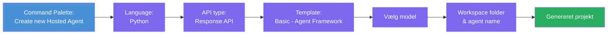
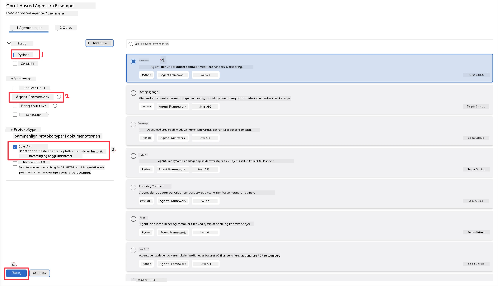
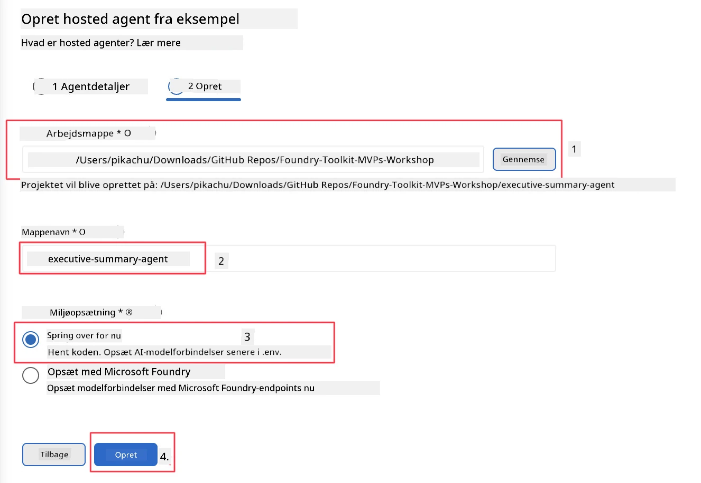

# Modul 2 - Opret en ny Hosted Agent

⏱️ ~5 min

I dette modul bruger du Foundry Toolkit til at **scaffolde et hosted agent-projekt**. Scaffolden genererer den fulde projektstruktur - `agent.yaml`, `main.py`, `Dockerfile`, `requirements.txt` og VS Code debug-konfiguration - så du kan fokusere på at tilpasse agentens adfærd.

> **Nøglekoncept:** `agent/`-mappen i dette laboratorium er et eksempel på, hvad Foundry Toolkit genererer. Du skriver ikke disse filer fra bunden.

### Scaffold-guidens flow



---

## Trin 1: Åbn Create Hosted Agent-guiden

1. Tryk på `Ctrl+Shift+P` for at åbne **Command Palette**.
2. Skriv: **Foundry Toolkit: Create new Hosted Agent** og vælg det.

> **Alternativ: Opret via Foundry Portal**
> Hvis du foretrækker browseren, kan du oprette dit projekt på [https://ai.azure.com](https://ai.azure.com). Når projektet er provisioneret, vender du tilbage til VS Code og bruger **Foundry Toolkit** sidebjælken til at forbinde til det.

> **Alternativ:** Klik på **+** ikonet ved siden af **Hosted Agents (Preview)** i Foundry Toolkit sidebjælken.

## Trin 2: Vælg indstillinger



1. I venstre navigations-/optionssektion vælg følgende:

| Menu | Valg | Noter |
|--------|-----------|-------|
| **Sprog** | Python | C# understøttes også |
| **Framework** | Agent Framework | Simple startpunkt med Agent Framework SDK |
| **API-type** | Response API | `POST /responses` - konversationel, med platform-styret historik |
| **Skabelon** | Basic | Simple startpunkt med Agent Framework SDK |

2. Når det er valgt, klik på **Next**



3. I det næste vindue vælg følgende:

| Menu | Valg | Noter |
|--------|-----------|-------|
| **Arbejdsmappemappe** | Vælg en målmappe | fx `/workspace/Foundry_Toolkit_for_VSCode_Lab/` eller en undermappe i dette repo |
| **Agentnavn** | Indtast et navn | fx `executive-summary-agent` |
| **Miljøopsætning** | spring opsætning over for nu |  |

Klik på **create** for at oprette vores agent. En ny mappe vil blive oprettet med navnet på den hosted agent.

## Trin 3: Undersøg det genererede projekt

Efter scaffoldingen er færdig, bekræft at du kan se disse filer i Explorer (`Ctrl+Shift+E`):

```
📂 my-agent/
├── .env                ← Environment variables (placeholders)
├── .vscode/
│   ├── launch.json     ← Debug config (F5 → run + Agent Inspector)
│   └── tasks.json      ← VS Code task definitions
├── agent.yaml          ← Agent definition (kind: hosted)
├── Dockerfile          ← Container config for deployment
├── main.py             ← Agent entry point (your main code)
└── requirements.txt    ← Python dependencies
```

### Forklaring af nøglefiler

| Fil | Formål |
|------|---------|
| `agent.yaml` | Deklarerer agenten som `kind: hosted`, kortlægger miljøvariable, definerer `/responses`-protokol |
| `main.py` | Opretter en `FoundryChatClient` → pakker den ind i en `Agent` med instruktioner → serverer via `ResponsesHostServer` på port 8088 |
| `Dockerfile` | Bruger `python:3.12-slim`, installerer afhængigheder, åbner port 8088, kører `main.py` |
| `requirements.txt` | `agent-framework-foundry`, `agent-framework-foundry-hosting`, `mcp`, `debugpy` |

> **Vigtigt:** Åbn den scaffoldede agentmappe direkte i VS Code (selve `agent/`-mappen), så `.vscode/launch.json` og `tasks.json` fungerer korrekt til F5-debugging.

---

### ✅ Tjekpunkt

- [ ] Scaffoldet projekt oprettet med alle forventede filer
- [ ] `agent.yaml` viser `kind: hosted` og `protocol: responses`
- [ ] `main.py` importerer `Agent`, `FoundryChatClient`, `ResponsesHostServer`
- [ ] Agentmappen er åben i VS Code som workspace root

---

**Forrige:** [01 - Setup](01-setup.md) · **Næste:** [03 - Configure & Code →](03-configure-and-code.md)

---

<!-- CO-OP TRANSLATOR DISCLAIMER START -->
**Ansvarsfraskrivelse**:
Dette dokument er blevet oversat ved hjælp af AI-oversættelsestjenesten [Co-op Translator](https://github.com/Azure/co-op-translator). Selvom vi bestræber os på nøjagtighed, skal du være opmærksom på, at automatiserede oversættelser kan indeholde fejl eller unøjagtigheder. Det originale dokument på dets oprindelige sprog bør betragtes som den autoritative kilde. For kritisk information anbefales professionel menneskelig oversættelse. Vi påtager os intet ansvar for misforståelser eller fejltolkninger, der opstår som følge af brugen af denne oversættelse.
<!-- CO-OP TRANSLATOR DISCLAIMER END -->