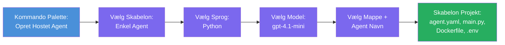

# Modul 3 - Opret en ny Hosted Agent (Automatisk genereret af Foundry-udvidelsen)

I dette modul bruger du Microsoft Foundry-udvidelsen til at **generere et nyt [hosted agent](https://learn.microsoft.com/azure/foundry/agents/concepts/hosted-agents)-projekt**. Udvidelsen genererer hele projektstrukturen for dig - inklusive `agent.yaml`, `main.py`, `Dockerfile`, `requirements.txt`, en `.env`-fil og en VS Code-debugkonfiguration. Efter genereringen tilpasser du disse filer med dine agents instruktioner, værktøjer og konfiguration.

> **Nøglekoncept:** Mappen `agent/` i dette laboratorium er et eksempel på, hvad Foundry-udvidelsen genererer, når du kører denne genereringskommando. Du skriver ikke disse filer fra bunden - udvidelsen skaber dem, og derefter tilpasser du dem.

### Genereringsguidens forløb


---

## Trin 1: Åbn guiden Opret Hosted Agent

1. Tryk `Ctrl+Shift+P` for at åbne **Kommandopaletten**.
2. Skriv: **Microsoft Foundry: Create a New Hosted Agent** og vælg den.
3. Guiden til oprettelse af hosted agent åbnes.

> **Alternativ vej:** Du kan også nå denne guide fra Microsoft Foundry sidelisten → klik på **+**-ikonet ved siden af **Agents** eller højreklik og vælg **Create New Hosted Agent**.

---

## Trin 2: Vælg din skabelon

Guiden beder dig vælge en skabelon. Du vil se muligheder som:

| Skabelon | Beskrivelse | Hvornår bruges den |
|----------|-------------|--------------------|
| **Single Agent** | En enkelt agent med sin egen model, instruktioner og valgfrie værktøjer | Dette workshop (Lab 01) |
| **Multi-Agent Workflow** | Flere agenter, der samarbejder i rækkefølge | Lab 02 |

1. Vælg **Single Agent**.
2. Klik **Næste** (eller valget fortsætter automatisk).

---

## Trin 3: Vælg programmeringssprog

1. Vælg **Python** (anbefalet til dette workshop).
2. Klik **Næste**.

> **C# understøttes også**, hvis du foretrækker .NET. Scaffold-strukturen er lignende (bruger `Program.cs` i stedet for `main.py`).

---

## Trin 4: Vælg din model

1. Guiden viser de modeller, der er implementeret i dit Foundry-projekt (fra Modul 2).
2. Vælg den model, du implementerede - f.eks. **gpt-4.1-mini**.
3. Klik **Næste**.

> Hvis du ikke kan se nogen modeller, gå tilbage til [Modul 2](02-create-foundry-project.md) og implementer en først.

---

## Trin 5: Vælg mappen og agentnavnet

1. En fil-dialog åbnes - vælg en **målmappe**, hvor projektet skal oprettes. For dette workshop:
   - Hvis du starter fra bunden: vælg en hvilken som helst mappe (f.eks. `C:\Projects\my-agent`)
   - Hvis du arbejder inden for workshop-repositoriet: opret en ny undermappe under `workshop/lab01-single-agent/agent/`
2. Indtast et **navn** til din hosted agent (f.eks. `executive-summary-agent` eller `my-first-agent`).
3. Klik **Opret** (eller tryk Enter).

---

## Trin 6: Vent på, at scaffolding færdiggøres

1. VS Code åbner et **nyt vindue** med det genererede projekt.
2. Vent et øjeblik på, at projektet fuldt indlæses.
3. Du bør kunne se følgende filer i Explorer-panelet (`Ctrl+Shift+E`):

```
📂 my-first-agent/
├── .env                ← Environment variables (auto-generated with placeholders)
├── .vscode/
│   └── launch.json     ← Debug configuration (F5 to run + Agent Inspector)
├── agent.yaml          ← Agent definition (kind: hosted)
├── Dockerfile          ← Container configuration for deployment
├── main.py             ← Agent entry point (your main code file)
└── requirements.txt    ← Python dependencies
```

> **Dette er den samme struktur som mappen `agent/`** i dette laboratorium. Foundry-udvidelsen genererer disse filer automatisk - du behøver ikke oprette dem manuelt.

> **Workshop note:** I dette workshop-repository er `.vscode/`-mappen i **roden af arbejdsområdet** (ikke inde i hvert projekt). Den indeholder fælles `launch.json` og `tasks.json` med to debug-konfigurationer - **"Lab01 - Single Agent"** og **"Lab02 - Multi-Agent"** - hver peger på den korrekte labs `cwd`. Når du trykker på F5, vælg den konfiguration, der svarer til det lab, du arbejder på, i dropdown-menuen.

---

## Trin 7: Forstå hver genereret fil

Tag et øjeblik til at gennemgå hver fil, som guiden har oprettet. Det er vigtigt at forstå dem til Modul 4 (tilpasning).

### 7.1 `agent.yaml` - Agentdefinition

Åbn `agent.yaml`. Den ser sådan ud:

```yaml
# yaml-language-server: $schema=https://raw.githubusercontent.com/microsoft/AgentSchema/refs/heads/main/schemas/v1.0/ContainerAgent.yaml

kind: hosted
name: my-first-agent
description: >
  A hosted agent deployed to Microsoft Foundry Agent Service.
metadata:
  authors:
    - Microsoft
  tags:
    - Azure AI AgentServer
    - Microsoft Agent Framework
    - Hosted Agent
protocols:
  - protocol: responses
    version: v1
environment_variables:
  - name: AZURE_AI_PROJECT_ENDPOINT
    value: ${PROJECT_ENDPOINT}
  - name: AZURE_AI_MODEL_DEPLOYMENT_NAME
    value: ${MODEL_DEPLOYMENT_NAME}
dockerfile_path: Dockerfile
resources:
  cpu: '0.25'
  memory: 0.5Gi
```

**Nøglefelter:**

| Felt | Formål |
|-------|--------|
| `kind: hosted` | Angiver, at dette er en hosted agent (container-baseret, implementeret til [Foundry Agent Service](https://learn.microsoft.com/azure/foundry/agents/overview)) |
| `protocols: responses v1` | Agenten eksponerer OpenAI-kompatibel `/responses` HTTP-endpoint |
| `environment_variables` | Mapper `.env`-værdier til containerens miljøvariabler ved deployment |
| `dockerfile_path` | Pegepind til Dockerfile, der bruges til at bygge containerbilledet |
| `resources` | CPU- og hukommelsestildeling til containeren (0,25 CPU, 0,5Gi hukommelse) |

### 7.2 `main.py` - Agentens indgangspunkt

Åbn `main.py`. Dette er hovedfilen i Python, hvor din agentlogik bor. Scaffold inkluderer:

```python
from agent_framework.azure import AzureAIAgentClient
from azure.ai.agentserver.agentframework import from_agent_framework
from azure.identity.aio import DefaultAzureCredential
```

**Vigtige imports:**

| Import | Formål |
|--------|--------|
| `AzureAIAgentClient` | Forbinder til dit Foundry-projekt og opretter agenter via `.as_agent()` |
| [`DefaultAzureCredential`](https://learn.microsoft.com/azure/developer/python/sdk/authentication/credential-chains#defaultazurecredential-overview) | Håndterer godkendelse (Azure CLI, VS Code sign-in, managed identity eller service principal) |
| `from_agent_framework` | Indpakker agenten som en HTTP-server, der eksponerer `/responses` endpoint |

Hovedflowet er:
1. Opret en credential → opret en klient → kald `.as_agent()` for at få en agent (async context manager) → indpak som server → kør

### 7.3 `Dockerfile` - Containerbillede

```dockerfile
FROM python:3.14-slim

WORKDIR /app

COPY ./ .

RUN pip install --upgrade pip && \
    if [ -f requirements.txt ]; then \
        pip install -r requirements.txt; \
    else \
        echo "No requirements.txt found" >&2; exit 1; \
    fi

EXPOSE 8088

CMD ["python", "main.py"]
```

**Vigtige detaljer:**
- Bruger `python:3.14-slim` som basebillede.
- Kopierer alle projektfiler til `/app`.
- Opgraderer `pip`, installerer afhængigheder fra `requirements.txt`, og fejler hurtigt, hvis filen mangler.
- **Eksponerer port 8088** - dette er den krævede port for hosted agents. Skift den ikke.
- Starter agenten med `python main.py`.

### 7.4 `requirements.txt` - Afhængigheder

```
agent-framework-azure-ai==1.0.0rc3
agent-framework-core==1.0.0rc3
azure-ai-agentserver-agentframework==1.0.0b16
azure-ai-agentserver-core==1.0.0b16
debugpy
agent-dev-cli
```

| Pakke | Formål |
|--------|---------|
| `agent-framework-azure-ai` | Azure AI-integration til Microsoft Agent Framework |
| `agent-framework-core` | Kerneruntime til at bygge agenter (inkluderer `python-dotenv`) |
| `azure-ai-agentserver-agentframework` | Hosted agent server runtime til Foundry Agent Service |
| `azure-ai-agentserver-core` | Kernelag for agent serverabstraktioner |
| `debugpy` | Python-debugging support (gør F5-debugging i VS Code muligt) |
| `agent-dev-cli` | Lokalt udviklings-CLI til at teste agenter (brugt af debug/kør konfigurationen) |

---

## Forstå agentprotokollen

Hosted agents kommunikerer via **OpenAI Responses API** protokollen. Når agenten kører (lokalt eller i skyen), eksponerer den et enkelt HTTP-endpoint:

```
POST http://localhost:8088/responses
Content-Type: application/json

{
  "input": "Your prompt here",
  "stream": false
}
```

Foundry Agent Service kalder dette endpoint for at sende brugerprompter og modtage agentsvar. Dette er den samme protokol, som OpenAI API bruger, så din agent er kompatibel med enhver klient, der taler OpenAI Responses-formatet.

---

### Tjekliste

- [ ] Scaffolding-guiden blev gennemført succesfuldt, og et **nyt VS Code-vindue** åbnede
- [ ] Du kan se alle 5 filer: `agent.yaml`, `main.py`, `Dockerfile`, `requirements.txt`, `.env`
- [ ] Filen `.vscode/launch.json` findes (muliggør F5-debugging – i dette workshop er den i workspace-roden med lab-specifikke konfigurationsfiler)
- [ ] Du har læst hver fil igennem og forstår dens formål
- [ ] Du forstår, at port `8088` er påkrævet, og at `/responses` endpointet er protokollen

---

**Forrige:** [02 - Create Foundry Project](02-create-foundry-project.md) · **Næste:** [04 - Configure & Code →](04-configure-and-code.md)

---

<!-- CO-OP TRANSLATOR DISCLAIMER START -->
**Ansvarsfraskrivelse**:  
Dette dokument er blevet oversat ved hjælp af AI-oversættelsestjenesten [Co-op Translator](https://github.com/Azure/co-op-translator). Selvom vi bestræber os på nøjagtighed, bedes du være opmærksom på, at automatiserede oversættelser kan indeholde fejl eller unøjagtigheder. Det originale dokument på dets oprindelige sprog bør betragtes som den autoritative kilde. For kritisk information anbefales professionel menneskelig oversættelse. Vi påtager os intet ansvar for eventuelle misforståelser eller fejltolkninger, der opstår som følge af brugen af denne oversættelse.
<!-- CO-OP TRANSLATOR DISCLAIMER END -->