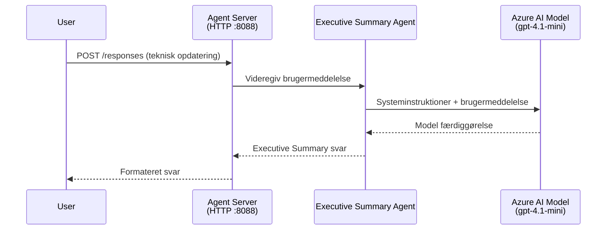
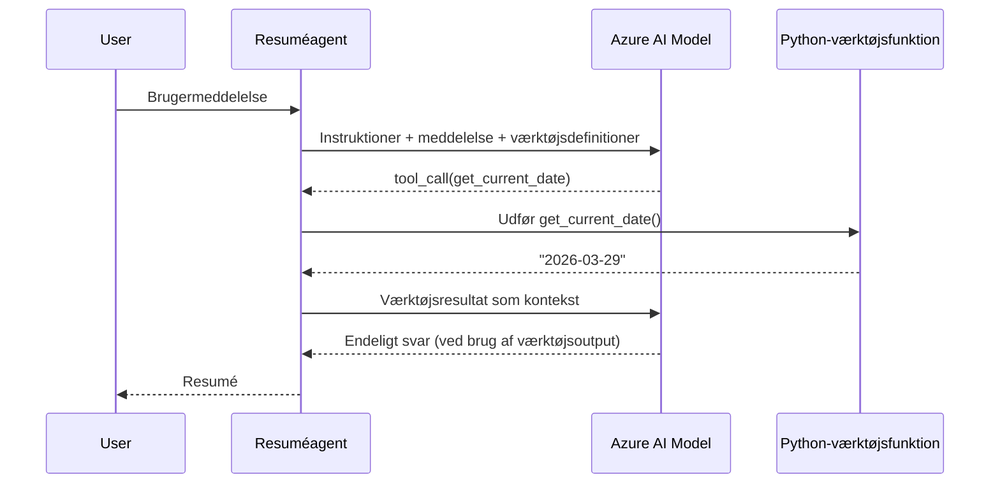

# Modul 4 - Konfigurer instruktioner, miljø & installer afhængigheder

I dette modul tilpasser du de auto-genererede agentfiler fra modul 3. Her forvandler du den generiske skabelon til **din** agent – ved at skrive instruktioner, sætte miljøvariabler, eventuelt tilføje værktøjer og installere afhængigheder.

> **Påmindelse:** Foundry-udvidelsen genererede automatisk dine projektfiler. Nu skal du ændre dem. Se [`agent/`](../../../../../workshop/lab01-single-agent/agent) mappen for et komplet fungerende eksempel på en tilpasset agent.

---

## Hvordan komponenterne passer sammen

### Forespørgselslivscyklus (enkel agent)


> **Med værktøjer:** Hvis agenten har registrerede værktøjer, kan modellen returnere et værktøjskald i stedet for en direkte fuldførelse. Frameworket udfører værktøjet lokalt, sender resultatet tilbage til modellen, og modellen genererer herefter det endelige svar.


---

## Trin 1: Konfigurer miljøvariabler

Skabelonen oprettede en `.env`-fil med pladsholderværdier. Du skal udfylde de rigtige værdier fra modul 2.

1. Åbn **`.env`**-filen i dit skabelonprojekt (den ligger i projektroden).
2. Erstat pladsholderværdierne med dine faktiske Foundry-projektoplysninger:

   ```env
   PROJECT_ENDPOINT=https://<your-account>.services.ai.azure.com/api/projects/<your-project>
   MODEL_DEPLOYMENT_NAME=gpt-4.1-mini
   ```

3. Gem filen.

### Hvor du finder disse værdier

| Værdi | Hvordan du finder den |
|-------|----------------------|
| **Projekt-endpoint** | Åbn **Microsoft Foundry** sidepanelet i VS Code → klik på dit projekt → endpoint-URL'en vises i detaljevisningen. Den ser sådan ud `https://<konto-navn>.services.ai.azure.com/api/projects/<projekt-navn>` |
| **Model-udrulningsnavn** | I Foundry-sidepanelet, udvid dit projekt → kig under **Models + endpoints** → navnet listes ved siden af den udrullede model (f.eks. `gpt-4.1-mini`) |

> **Sikkerhed:** Forpligt dig aldrig `.env`-filen til versionskontrol. Den er som standard inkluderet i `.gitignore`. Hvis den ikke er, tilføj den:
> ```
> .env
> ```

### Hvordan miljøvariabler flyder

Kortlægningen er: `.env` → `main.py` (læser via `os.getenv`) → `agent.yaml` (kortlægger til containerens miljøvariabler ved udrulning).

I `main.py` læser skabelonen disse værdier sådan:

```python
PROJECT_ENDPOINT = os.getenv("AZURE_AI_PROJECT_ENDPOINT") or os.getenv("PROJECT_ENDPOINT")
MODEL_DEPLOYMENT_NAME = os.getenv("AZURE_AI_MODEL_DEPLOYMENT_NAME", os.getenv("MODEL_DEPLOYMENT_NAME", "gpt-4.1-mini"))
```

Både `AZURE_AI_PROJECT_ENDPOINT` og `PROJECT_ENDPOINT` accepteres (i `agent.yaml` bruges præfikset `AZURE_AI_*`).

---

## Trin 2: Skriv agentinstruktioner

Dette er det vigtigste tilpasningstrin. Instruktionerne definerer agentens personlighed, adfærd, outputformat og sikkerhedsbetingelser.

1. Åbn `main.py` i dit projekt.
2. Find instruktionsstrengen (skabelonen indeholder en standard/generisk).
3. Erstat den med detaljerede, strukturerede instruktioner.

### Hvad gode instruktioner indeholder

| Komponent | Formål | Eksempel |
|-----------|--------|----------|
| **Rolle** | Hvad agenten er og gør | "Du er en agent til ledelsesresumé" |
| **Målgruppe** | Hvem svarene er til | "Ledende medarbejdere med begrænset teknisk baggrund" |
| **Inputdefinition** | Hvilke slags prompt den kan håndtere | "Tekniske hændelsesrapporter, driftsopdateringer" |
| **Outputformat** | Præcis struktur for svar | "Ledelsesresumé: - Hvad skete der: ... - Forretningspåvirkning: ... - Næste skridt: ..." |
| **Regler** | Begrænsninger og afvisningsbetingelser | "Tilføj IKKE information ud over det, der er givet" |
| **Sikkerhed** | Forebyg misbrug og hallucination | "Hvis input er uklart, bed om præcisering" |
| **Eksempler** | Input/output-par for at styre adfærd | Inkluder 2-3 eksempler med varierende input |

### Eksempel: Instruktioner for ledelsesresumé-agent

Her er instruktionerne brugt i workshoppen i [`agent/main.py`](../../../../../workshop/lab01-single-agent/agent/main.py):

```python
AGENT_INSTRUCTIONS = """You are an "Explain Like I'm an Executive" agent.

Purpose:
Your job is to translate complex technical or operational information into
clear, concise, and outcome-focused summaries that can be easily understood
by non-technical executives.

Audience:
Senior leaders with limited technical background who care about impact,
risk, and what happens next.

What you must do:
- Rephrase the input so it is understandable to a non-technical audience
- Prioritize clarity, brevity, and outcomes over technical accuracy
- Remove technical jargon, logs, metrics, stack traces, and deep root-cause details
- Translate technical causes into simple cause-and-effect statements
- Explicitly call out business impact
- Always include a clear next step or action
- Maintain a neutral, factual, and calm executive tone
- Do NOT add new facts or speculate beyond the input

Standard Output Structure (always use this wording):

Executive Summary:
- What happened: <plain-language description>
- Business impact: <clear, non-technical impact>
- Next step: <clear action or mitigation>

Rules:
- Keep responses under 100 words
- Do NOT add facts beyond the input
- If input is unclear, ask for clarification
"""
```

4. Erstat den eksisterende instruktionsstreng i `main.py` med dine egne instruktioner.
5. Gem filen.

---

## Trin 3: (Valgfrit) Tilføj brugerdefinerede værktøjer

Hosted agenter kan udføre **lokale Python-funktioner** som [værktøjer](https://learn.microsoft.com/azure/foundry/agents/concepts/tool-catalog). Det er en stor fordel ved kodebaserede hosted agenter frem for kun promptbaserede - din agent kan køre vilkårlig serverlogik.

### 3.1 Definér en værktøjsfunktion

Tilføj en værktøjsfunktion i `main.py`:

```python
from agent_framework import tool

@tool
def get_current_date() -> str:
    """Returns the current date in YYYY-MM-DD format."""
    from datetime import date
    return str(date.today())
```

`@tool` dekoratoren forvandler en standard Python-funktion til et agentværktøj. Docstringen bliver det værktøjsbeskrivelse, som modellen ser.

### 3.2 Registrer værktøjet med agenten

Når du opretter agenten via `.as_agent()` kontekstmanageren, giv værktøjet som `tools` parameter:

```python
async with AzureAIAgentClient(
    project_endpoint=PROJECT_ENDPOINT,
    model_deployment_name=MODEL_DEPLOYMENT_NAME,
    credential=credential,
).as_agent(
    name="my-agent",
    instructions=AGENT_INSTRUCTIONS,
    tools=[get_current_date],
) as agent:
    server = from_agent_framework(agent)
    await server.run_async()
```

### 3.3 Hvordan værktøjskald fungerer

1. Brugeren sender en prompt.
2. Modellen vurderer, om et værktøj er nødvendigt (baseret på prompt, instruktioner og værktøjsbeskrivelser).
3. Hvis værktøj er nødvendigt, kalder frameworket din Python-funktion lokalt (inde i containeren).
4. Værktøjets returværdi sendes tilbage til modellen som kontekst.
5. Modellen genererer det endelige svar.

> **Værktøjerne kører server-side** – de kører inde i din container, ikke i brugerens browser eller i modellen. Det betyder, du kan tilgå databaser, API'er, filsystemer eller enhver Python-bibliotek.

---

## Trin 4: Opret og aktiver et virtuelt miljø

Før du installerer afhængigheder, opret et isoleret Python-miljø.

### 4.1 Opret det virtuelle miljø

Åbn en terminal i VS Code (`` Ctrl+` ``) og kør:

```powershell
python -m venv .venv
```

Dette opretter en `.venv` mappe i dit projektbibliotek.

### 4.2 Aktiver det virtuelle miljø

**PowerShell (Windows):**

```powershell
.\.venv\Scripts\Activate.ps1
```

**Command Prompt (Windows):**

```cmd
.venv\Scripts\activate.bat
```

**macOS/Linux (Bash):**

```bash
source .venv/bin/activate
```

Du skulle gerne se `(.venv)` vises i starten af din terminalprompt, hvilket viser, at det virtuelle miljø er aktivt.

### 4.3 Installer afhængigheder

Med det virtuelle miljø aktivt installeres de nødvendige pakker:

```powershell
pip install -r requirements.txt
```

Dette installerer:

| Pakke | Formål |
|---------|---------|
| `agent-framework-azure-ai==1.0.0rc3` | Azure AI-integration til [Microsoft Agent Framework](https://learn.microsoft.com/agent-framework/overview/) |
| `agent-framework-core==1.0.0rc3` | Core runtime til at bygge agenter (inkluderer `python-dotenv`) |
| `azure-ai-agentserver-agentframework==1.0.0b16` | Hosted agent server runtime til [Foundry Agent Service](https://learn.microsoft.com/azure/foundry/agents/overview) |
| `azure-ai-agentserver-core==1.0.0b16` | Core agent server abstraktioner |
| `debugpy` | Python debugging (aktiverer F5-debugging i VS Code) |
| `agent-dev-cli` | Lokal udviklings-CLI til test af agenter |

### 4.4 Verificer installation

```powershell
pip list | Select-String "agent-framework|agentserver"
```

Forventet output:
```
agent-framework-azure-ai   1.0.0rc3
agent-framework-core       1.0.0rc3
azure-ai-agentserver-agentframework 1.0.0b16
azure-ai-agentserver-core  1.0.0b16
```

---

## Trin 5: Verificer godkendelse

Agenten bruger [`DefaultAzureCredential`](https://learn.microsoft.com/azure/developer/python/sdk/authentication/credential-chains#defaultazurecredential-overview), som forsøger flere autentificeringsmetoder i denne rækkefølge:

1. **Miljøvariabler** - `AZURE_CLIENT_ID`, `AZURE_TENANT_ID`, `AZURE_CLIENT_SECRET` (service principal)
2. **Azure CLI** - bruger din `az login` session
3. **VS Code** - bruger den konto, du er logget ind med i VS Code
4. **Managed Identity** - bruges ved kørsel i Azure (ved udrulning)

### 5.1 Verificer til lokal udvikling

Mindst én af disse skal fungere:

**Mulighed A: Azure CLI (anbefalet)**

```powershell
az account show --query "{name:name, id:id}" --output table
```

Forventet: Viser dit abonnementsnavn og ID.

**Mulighed B: VS Code-login**

1. Kig nederst til venstre i VS Code efter **Accounts**-ikonet.
2. Hvis du ser dit kontonavn, er du godkendt.
3. Hvis ikke, klik på ikonet → **Sign in to use Microsoft Foundry**.

**Mulighed C: Service principal (til CI/CD)**

```powershell
$env:AZURE_TENANT_ID = "<your-tenant-id>"
$env:AZURE_CLIENT_ID = "<your-client-id>"
$env:AZURE_CLIENT_SECRET = "<your-client-secret>"
```

### 5.2 Almindeligt godkendelsesproblem

Hvis du er logget ind i flere Azure-konti, skal du sikre, at det rigtige abonnement er valgt:

```powershell
az account set --subscription "<your-subscription-id>"
```

---

### Checkpoint

- [ ] `.env` filen har gyldige `PROJECT_ENDPOINT` og `MODEL_DEPLOYMENT_NAME` (ikke pladsholdere)
- [ ] Agentinstruktioner er tilpassede i `main.py` - de definerer rolle, målgruppe, outputformat, regler og sikkerhedsbetingelser
- [ ] (Valgfrit) Brugerdefinerede værktøjer er defineret og registreret
- [ ] Det virtuelle miljø er oprettet og aktiveret (`(.venv)` vises i terminalprompt)
- [ ] `pip install -r requirements.txt` fuldføres uden fejl
- [ ] `pip list | Select-String "azure-ai-agentserver"` viser, at pakken er installeret
- [ ] Godkendelsen er gyldig - `az account show` returnerer dit abonnement ELLER du er logget ind i VS Code

---

**Forrige:** [03 - Opret Hosted Agent](03-create-hosted-agent.md) · **Næste:** [05 - Test Lokalt →](05-test-locally.md)

---

<!-- CO-OP TRANSLATOR DISCLAIMER START -->
**Ansvarsfraskrivelse**:  
Dette dokument er oversat ved hjælp af AI-oversættelsestjenesten [Co-op Translator](https://github.com/Azure/co-op-translator). Selvom vi bestræber os på nøjagtighed, skal du være opmærksom på, at automatiserede oversættelser kan indeholde fejl eller unøjagtigheder. Det oprindelige dokument på dets modersmål skal betragtes som den autoritative kilde. For vigtig information anbefales professionel menneskelig oversættelse. Vi påtager os intet ansvar for eventuelle misforståelser eller fejltolkninger, der opstår som følge af brugen af denne oversættelse.
<!-- CO-OP TRANSLATOR DISCLAIMER END -->