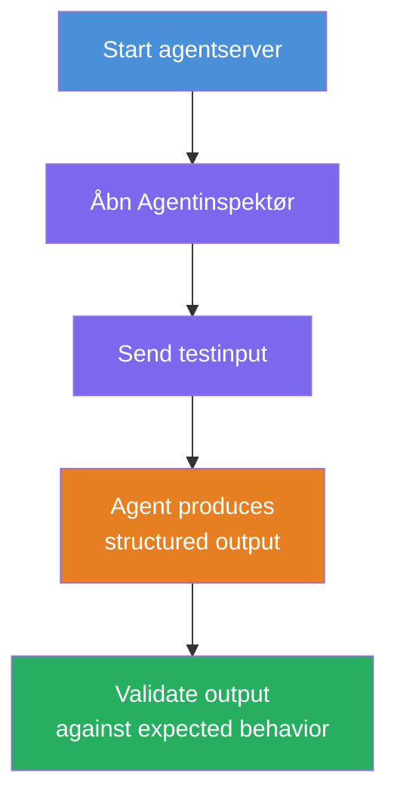
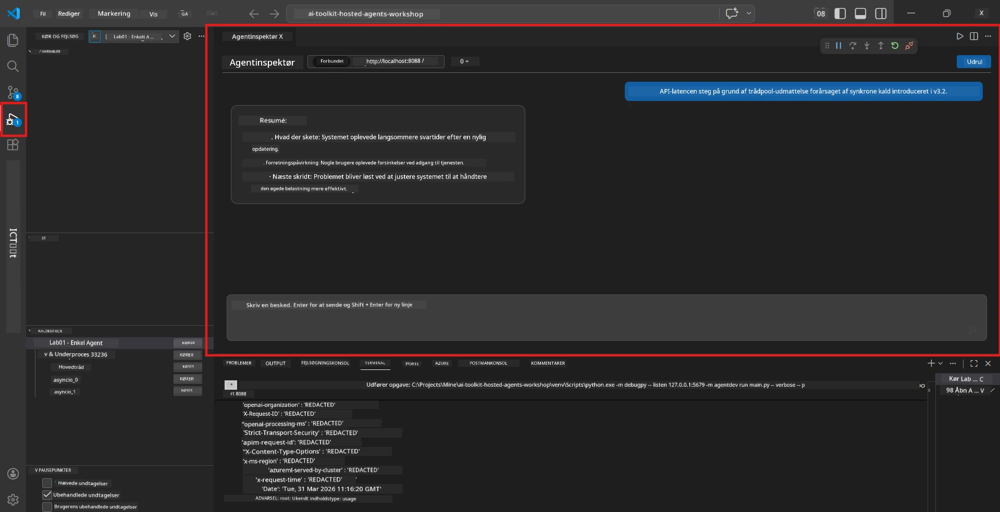
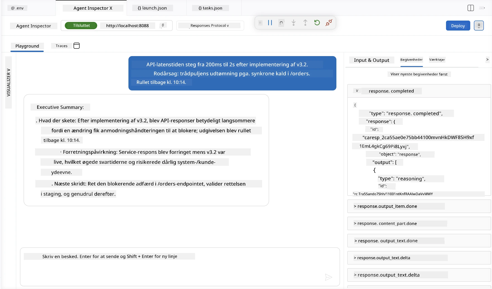

# Modul 4 - Test Lokalt

⏱️ ~10 min

I dette modul kører du din agent lokalt og validerer, at den fungerer korrekt ved hjælp af **happy-path funktionelle tests**. Du vil bruge Agent Inspector (visuelt UI) eller direkte HTTP-kald for at bekræfte, at agenten producerer strukturerede og nøjagtige svar.

### Lokal testflow



---

## Mulighed 1: Tryk F5 - Debug med Agent Inspector (anbefalet)

### Start debuggeren

1. Åbn mappen **executive-summary-agent/** direkte i VS Code (`File → Open Folder`).
2. Åbn panelet **Run and Debug** (`Ctrl+Shift+D`).
3. Vælg **Debug Local Agent Server** i dropdown-menuen.
4. Tryk **F5** (eller klik på ▶ Start Debugging).

> ⚠️ **Kritisk: Vælg din Python Interpreter**
> Hvis du får "ModuleNotFoundError" eller debuggeren ikke starter, skal du fortælle VS Code at bruge dit virtuelle miljø:
  > 1. Tryk `Ctrl+Shift+P` $\rightarrow$ skriv **Python: Select Interpreter**.
  > 2. Vælg den interpreter, der ligger i dit projekts `.venv`-mappe (f.eks. `.\.venv\Scripts\python.exe` på Windows).
  > 3. Genstart debug-sessionen.
> Hvis du stadig får fejl, skal du manuelt opdatere din fil `tasks.json` som følger:
  > 1. Gå til filen `.vscode/tasks.json`
  > 2. Find kommandoen mærket: `Run Agent/Workflow HTTP Server`
  > 3. Opdater kommandoens værdi til: `"value": "${workspaceFolder}/.venv/bin/python",`

### Hvad sker der

1. HTTP-serveren starter på `http://localhost:8088/responses`.
2. Panelet **Agent Inspector** åbnes automatisk - en visuel chatgrænseflade til testning.
3. Breakpoints er aktiveret i `main.py`.

Hold øje med Terminalen for:
```
Starting executive summary hosted agent
Executive agent server running on http://localhost:8088
```

> **Hvis Agent Inspector ikke åbner:** Tryk `Ctrl+Shift+P` → **Foundry Toolkit: Open Agent Inspector**.



> *Skærmbilledet kan vise ældre 'AI TOOLKIT'-branding fra en tidligere udgave af udvidelsen.*

---

## Mulighed 2: Test via Terminal (alternativ)

Start agenten i et terminalvindue, og send forespørgsler fra et andet:

```bash
# Terminal 1: Start agent
cd executive-summary-agent/
source .venv/bin/activate
python main.py
```

```bash
# Terminal 2: Send test (curl)
curl -sS -X POST http://localhost:8088/responses \
  -H "Content-Type: application/json" \
  -d '{"input": "The API latency increased due to thread pool exhaustion caused by sync calls in v3.2.", "stream": false}'
```

---

## Scenariotests: Happy-path funktionel validering

Kør **alle tre** scenarier nedenfor. De validerer, at din agent producerer korrekt, struktureret output for realistiske input.



### Scenario 1: IT-incident - API-latensspids

**Input:**
```
The API latency increased from 200ms to 2s after deploying v3.2.
Root cause: thread pool starvation from synchronous calls in /orders.
Rolled back at 10:14.
```

**Forventet adfærd:**
- ✅ Følger "Executive Summary"-strukturen (Hvad skete der / Forretningsmæssig påvirkning / Næste skridt)
- ✅ Ingen teknisk jargon (ingen "thread pool", ingen "/orders", ingen "v3.2")
- ✅ Angiver klart forretningspåvirkningen (f.eks. brugere oplevede forsinkelser)
- ✅ Indeholder et næste skridt (f.eks. fejlrettelse implementeret, overvågning på plads)

---

### Scenario 2: Datapipeline - ETL-fejl

**Input:**
```
The nightly ETL job failed because the upstream schema changed. APAC dashboards show missing data.
```

**Forventet adfærd:**
- ✅ Opsummerer dataopdateringsfejlen i almindeligt sprog
- ✅ Nævner APAC-dashboardets påvirkning
- ✅ Indeholder et afhjælpningsnæste skridt
- ✅ Nævner IKKE "ETL", "skema" eller andre tekniske termer

---

### Scenario 3: Sikkerhed - Eksponeret legitimationsoplysning

**Input:**
```
Static analysis flagged a hardcoded secret in the repository.
The secret may have been exposed in commit history.
```

**Forventet adfærd:**
- ✅ Beskriver en legitimations-/sikkerhedsfejl i cheflignende sprog
- ✅ Fremhæver potentiel risiko (uautoriseret adgang)
- ✅ Angiver afhjælpende handling (roskifte, revision)
- ✅ Indeholder IKKE termer som "statisk analyse", "commit-historik" eller "hardcoded"

---

## Valideringskriterier

For hvert scenarie, kontroller:

| # | Kriterium | Bestå betingelse |
|---|----------|---------------|
| 1 | **Struktur** | Svaret bruger "Executive Summary"-format med alle tre punkter |
| 2 | **Almindeligt sprog** | Ingen teknisk jargon, som en leder ikke vil forstå |
| 3 | **Nøjagtighed** | Resuméet afspejler input - ingen fabrikerede detaljer |
| 4 | **Kortfattethed** | Svaret er under 100 ord |
| 5 | **Næste skridt** | En klar handling eller afhjælpning er angivet |

---

## Debugging tips

| Problem | Løsning |
|-------|---------|
| Agenten starter ikke | Tjek `.env` værdier, bekræft venv er aktiveret, kør `pip install -r requirements.txt` |
| Tomt eller generisk svar | Gennemgå instruktionerne i `main.py` - sikre outputformat er angivet |
| Svaret inkluderer jargon | Styrk "fjern tekniske termer" regler i instruktionerne |
| Agent Inspector åbner ikke | `Ctrl+Shift+P` → **Foundry Toolkit: Open Agent Inspector** |
| Modelfejl i Terminal | Bekræft at `AZURE_AI_MODEL_DEPLOYMENT_NAME` matcher præcist (casesensitivt) |

---

### ✅ Tjekpunkt

- [ ] Agenten starter lokalt uden fejl
- [ ] Agent Inspector åbner og viser en chatgrænseflade (hvis du bruger F5)
- [ ] **Scenario 1** (IT-incident) - struktureret Executive Summary, ingen jargon
- [ ] **Scenario 2** (datapipeline) - relevant resumé med forretningspåvirkning
- [ ] **Scenario 3** (sikkerhedsalert) - passende risiko-kommunikation
- [ ] Alle svar følger den definerede outputstruktur

> **Gem dine svar** (kopiér eller tag screenshot) - du vil sammenligne dem med cloud-resultater i Modul 06.

---

**Forrige:** [03 - Configure & Code](03-configure-and-code.md) · **Næste:** [05 - Deploy to Foundry →](05-deploy-to-foundry.md)

---

<!-- CO-OP TRANSLATOR DISCLAIMER START -->
**Ansvarsfraskrivelse**:
Dette dokument er blevet oversat ved hjælp af AI-oversættelsestjenesten [Co-op Translator](https://github.com/Azure/co-op-translator). Selvom vi bestræber os på nøjagtighed, skal du være opmærksom på, at automatiserede oversættelser kan indeholde fejl eller unøjagtigheder. Det originale dokument på dets oprindelige sprog bør betragtes som den autoritative kilde. For kritisk information anbefales professionel menneskelig oversættelse. Vi påtager os intet ansvar for misforståelser eller fejltolkninger, der opstår som følge af brugen af denne oversættelse.
<!-- CO-OP TRANSLATOR DISCLAIMER END -->