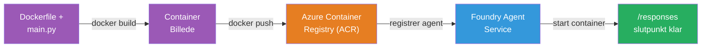
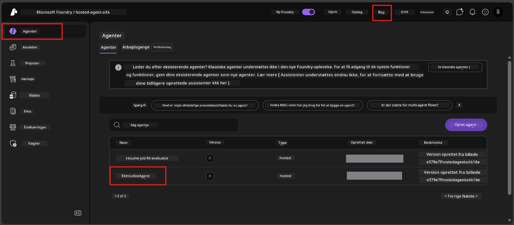

# Modul 6 - Udrul til Foundry Agent Service

I dette modul udruller du din lokalt testede agent til Microsoft Foundry som en [**Hosted Agent**](https://learn.microsoft.com/azure/foundry/agents/concepts/hosted-agents). Udrulningsprocessen bygger et Docker containerbillede fra dit projekt, skubber det til [Azure Container Registry (ACR)](https://learn.microsoft.com/azure/container-registry/container-registry-intro) og opretter en hosted agent-version i [Foundry Agent Service](https://learn.microsoft.com/azure/foundry/agents/overview).

### Udrulningspipeline


---

## Forudsætningscheck

Før udrulning, verificer hvert punkt nedenfor. At springe disse over er den mest almindelige årsag til udrulningsfejl.

1. **Agenten består lokale smoketests:**
   - Du gennemførte alle 4 tests i [Modul 5](05-test-locally.md), og agenten reagerede korrekt.

2. **Du har [Azure AI User](https://learn.microsoft.com/azure/foundry/concepts/rbac-foundry#built-in-roles) rollen:**
   - Denne blev tildelt i [Modul 2, trin 3](02-create-foundry-project.md). Hvis du er usikker, bekræft nu:
   - Azure Portal → din Foundry **projekt** ressource → **Access control (IAM)** → fanen **Role assignments** → søg efter dit navn → bekræft at **Azure AI User** står på listen.

3. **Du er logget ind på Azure i VS Code:**
   - Tjek kontoen-ikonet nederst til venstre i VS Code. Dit kontonavn bør være synligt.

4. **(Valgfrit) Docker Desktop kører:**
   - Docker er kun nødvendigt, hvis Foundry-udvidelsen beder om lokal build. I de fleste tilfælde håndterer udvidelsen container builds automatisk under udrulning.
   - Hvis du har Docker installeret, verificer at det kører: `docker info`

---

## Trin 1: Start udrulningen

Du har to måder at udrulle på - begge fører til samme resultat.

### Mulighed A: Udrul fra Agent Inspector (anbefalet)

Hvis du kører agenten med debuggeren (F5) og Agent Inspector er åben:

1. Kig på **øverste højre hjørne** af Agent Inspector-panelet.
2. Klik på **Deploy** knappen (sky-ikon med en pil op ↑).
3. Udrulningsguiden åbner.

### Mulighed B: Udrul fra Command Palette

1. Tryk `Ctrl+Shift+P` for at åbne **Command Palette**.
2. Skriv: **Microsoft Foundry: Deploy Hosted Agent** og vælg det.
3. Udrulningsguiden åbner.

---

## Trin 2: Konfigurer udrulningen

Udrulningsguiden fører dig igennem konfigurationen. Udfyld hver prompt:

### 2.1 Vælg målprojektet

1. En dropdown viser dine Foundry-projekter.
2. Vælg det projekt, du oprettede i Modul 2 (f.eks. `workshop-agents`).

### 2.2 Vælg container agentfilen

1. Du bliver bedt om at vælge agentens indgangspunkt.
2. Vælg **`main.py`** (Python) - dette er den fil, guiden bruger til at identificere dit agentprojekt.

### 2.3 Konfigurer ressourcer

| Indstilling | Anbefalet værdi | Noter |
|-------------|-----------------|-------|
| **CPU**     | `0.25`          | Standard, tilstrækkeligt til workshop. Forøg til produktionsarbejdsmængder |
| **Memory**  | `0.5Gi`         | Standard, tilstrækkeligt til workshop |

Disse matcher værdierne i `agent.yaml`. Du kan acceptere standardværdierne.

---

## Trin 3: Bekræft og udrul

1. Guiden viser et udrulningsresume med:
   - Målprojektets navn
   - Agentnavn (fra `agent.yaml`)
   - Containerfil og ressourcer
2. Gennemgå resumeet og klik **Confirm and Deploy** (eller **Deploy**).
3. Følg fremskridtet i VS Code.

### Hvad sker der under udrulningen (trin for trin)

Udrulningen er en flertrinsproces. Se VS Code **Output** panelet (vælg "Microsoft Foundry" fra dropdown) for at følge med:

1. **Docker build** - VS Code bygger et Docker containerbillede fra din `Dockerfile`. Du vil se Docker lag-meddelelser:
   ```
   Step 1/6 : FROM python:<version>-slim
   Step 2/6 : WORKDIR /app
   ...
   Successfully built abc123def456
   ```

2. **Docker push** - Billedet skubbes til **Azure Container Registry (ACR)** tilknyttet dit Foundry-projekt. Dette kan tage 1-3 minutter ved første udrulning (basebilledet er >100MB).

3. **Agent-registrering** - Foundry Agent Service opretter en ny hosted agent (eller en ny version, hvis agenten allerede findes). Agentmetadata fra `agent.yaml` anvendes.

4. **Container start** - Containeren startes i Foundrys styrede infrastruktur. Platformen tildeler en [system-administreret identitet](https://learn.microsoft.com/azure/foundry/agents/concepts/agent-identity) og eksponerer `/responses` endpointet.

> **Første udrulning er langsommere** (Docker skal skubbe alle lag). Efterfølgende udrulninger er hurtigere, fordi Docker cacher uændrede lag.

---

## Trin 4: Bekræft udrulningsstatus

Når udrulningskommandoen er færdig:

1. Åbn **Microsoft Foundry** sidepanelet ved at klikke på Foundry-ikonet i aktivitetsbjælken.
2. Udvid sektionen **Hosted Agents (Preview)** under dit projekt.
3. Du bør kunne se dit agentnavn (f.eks. `ExecutiveAgent` eller navnet fra `agent.yaml`).
4. **Klik på agentnavnet** for at udvide det.
5. Du vil se en eller flere **versioner** (f.eks. `v1`).
6. Klik på versionen for at se **Container Details**.
7. Tjek feltet **Status**:

   | Status          | Betydning                                        |
   |-----------------|-------------------------------------------------|
   | **Started** eller **Running** | Containeren kører, og agenten er klar       |
   | **Pending**      | Container starter op (vent 30-60 sekunder)      |
   | **Failed**       | Container kunne ikke starte (tjek logs - se fejlfinding nedenfor) |



> **Hvis du ser "Pending" i mere end 2 minutter:** Containeren henter muligvis basebilledet. Vent lidt længere. Hvis det forbliver pending, tjek containerlogs.

---

## Almindelige udrulningsfejl og rettelser

### Fejl 1: Permission denied - `agents/write`

```
Error: lacks the required data action 
Microsoft.CognitiveServices/accounts/AIServices/agents/write 
to perform POST /api/projects/{projectName}/assistants operation.
```

**Årsag:** Du har ikke `Azure AI User` rollen på **projekt** niveau.

**Rettelse trin for trin:**

1. Åbn [https://portal.azure.com](https://portal.azure.com).
2. Skriv dit Foundry **projekt** navn i søgefeltet og klik på det.
   - **Vigtigt:** Sørg for at du navigerer til **projekt** ressourcen (type: "Microsoft Foundry project"), IKKE til den overordnede konto/hub ressource.
3. Klik i venstre menu på **Access control (IAM)**.
4. Klik **+ Add** → **Add role assignment**.
5. I **Role** fanen, søg efter [**Azure AI User**](https://learn.microsoft.com/azure/foundry/concepts/rbac-foundry#built-in-roles) og vælg den. Klik **Next**.
6. I **Members** fanen, vælg **User, group, or service principal**.
7. Klik **+ Select members**, søg efter dit navn/email, vælg dig selv, klik **Select**.
8. Klik **Review + assign** → **Review + assign** igen.
9. Vent 1-2 minutter på, at rolle-tildelingen træder i kraft.
10. **Prøv udrulningen igen** fra Trin 1.

> Rollen skal være på **projekt** niveau, ikke kun konto-niveau. Dette er den mest almindelige årsag til udrulningsfejl.

### Fejl 2: Docker kører ikke

```
Error: Docker build failed / Cannot connect to Docker daemon
```

**Rettelse:**
1. Start Docker Desktop (find det i din startmenu eller systembakke).
2. Vent til den viser "Docker Desktop is running" (30-60 sekunder).
3. Verificer: `docker info` i en terminal.
4. **Windows specifikt:** Sørg for WSL 2 backend er aktiveret i Docker Desktop indstillinger → **General** → **Use the WSL 2 based engine**.
5. Prøv udrulningen igen.

### Fejl 3: ACR autorisation - `AcrPullUnauthorized`

```
Error: AcrPullUnauthorized
```

**Årsag:** Foundry projektets styrede identitet har ikke pull-adgang til container registry.

**Rettelse:**
1. I Azure Portal, naviger til din **[Container Registry](https://learn.microsoft.com/azure/container-registry/container-registry-intro)** (den er i samme resourcegruppe som dit Foundry projekt).
2. Gå til **Access control (IAM)** → **Tilføj** → **Add role assignment**.
3. Vælg **[AcrPull](https://learn.microsoft.com/azure/container-registry/container-registry-roles)** rollen.
4. Under Medlemmer vælg **Managed identity** → find Foundry projektets styrede identitet.
5. **Review + assign**.

> Dette sættes typisk automatisk op af Foundry-udvidelsen. Hvis du får denne fejl, kan det tyde på, at den automatiske opsætning fejlede.

### Fejl 4: Container platform mismatch (Apple Silicon)

Hvis du udruller fra en Apple Silicon Mac (M1/M2/M3), skal containeren bygges til `linux/amd64`:

```bash
docker build --platform linux/amd64 -t myagent:v1 .
```

> Foundry-udvidelsen håndterer dette automatisk for de fleste brugere.

---

### Checkpoint

- [ ] Udrulningskommanden blev gennemført uden fejl i VS Code
- [ ] Agent vises under **Hosted Agents (Preview)** i Foundry sidebar
- [ ] Du klikkede på agenten → valgte en version → så **Container Details**
- [ ] Containerstatus viser **Started** eller **Running**
- [ ] (Hvis fejl opstod) Du identificerede fejlen, anvendte rettelsen og udrullede igen med succes

---

**Forrige:** [05 - Test Lokalt](05-test-locally.md) · **Næste:** [07 - Verificer i Playground →](07-verify-in-playground.md)

---

<!-- CO-OP TRANSLATOR DISCLAIMER START -->
**Ansvarsfraskrivelse**:  
Dette dokument er oversat ved hjælp af AI-oversættelsestjenesten [Co-op Translator](https://github.com/Azure/co-op-translator). Selvom vi bestræber os på nøjagtighed, skal du være opmærksom på, at automatiserede oversættelser kan indeholde fejl eller unøjagtigheder. Det oprindelige dokument på dets modersmål anses for den autoritative kilde. For vigtig information anbefales professionel menneskelig oversættelse. Vi påtager os intet ansvar for eventuelle misforståelser eller fejltolkninger, der opstår som følge af brugen af denne oversættelse.
<!-- CO-OP TRANSLATOR DISCLAIMER END -->