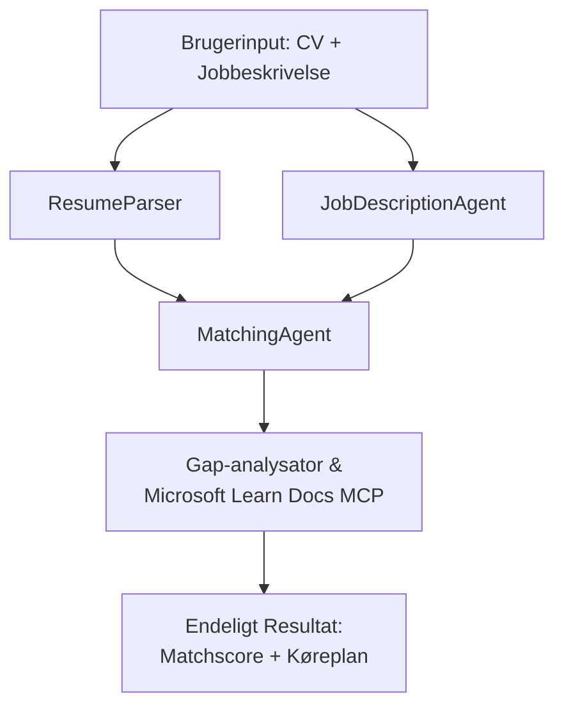

# PersonalCareerCopilot - CV → Jobmatch Evaluator

En multi-agent arbejdsgang, der vurderer, hvor godt et CV matcher en jobbeskrivelse, og derefter genererer en personlig læringsplan for at lukke hullerne.

---

## Agenter

| Agent | Rolle | Værktøjer |
|-------|-------|-----------|
| **ResumeParser** | Ekstraherer strukturerede færdigheder, erfaring, certificeringer fra CV-tekst | - |
| **JobDescriptionAgent** | Ekstraherer nødvendige/foretrukne færdigheder, erfaring, certificeringer fra en jobbeskrivelse | - |
| **MatchingAgent** | Sammenligner profil vs krav → matchscore (0-100) + matchede/manglende færdigheder | - |
| **GapAnalyzer** | Bygger en personlig læringsplan med Microsoft Learn ressourcer | `search_microsoft_learn_for_plan` (MCP) |

## Arbejdsgang


---

## Hurtig start

### 1. Sæt miljø op

```powershell
cd workshop\lab02-multi-agent\PersonalCareerCopilot
python -m venv .venv
.\.venv\Scripts\Activate.ps1          # Windows PowerShell
# source .venv/bin/activate            # macOS / Linux
pip install -r requirements.txt
```

### 2. Konfigurer legitimationsoplysninger

Kopiér eksemplet på env-fil og udfyld dine Foundry projektoplysninger:

```powershell
cp .env.example .env
```

Rediger `.env`:

```env
PROJECT_ENDPOINT=https://<your-account>.services.ai.azure.com/api/projects/<your-project>
MODEL_DEPLOYMENT_NAME=gpt-4.1-mini
```

| Værdi | Hvor findes den |
|-------|-----------------|
| `PROJECT_ENDPOINT` | Microsoft Foundry sidebjælke i VS Code → højreklik på dit projekt → **Kopier projekt endpoint** |
| `MODEL_DEPLOYMENT_NAME` | Foundry sidebjælke → udvid projekt → **Models + endpoints** → deployeringsnavn |

### 3. Kør lokalt

```powershell
python -m debugpy --listen 127.0.0.1:5679 -m agentdev run main.py --verbose --port 8088
```

Eller brug VS Codes opgave: `Ctrl+Shift+P` → **Tasks: Run Task** → **Run Lab02 HTTP Server**.

### 4. Test med Agent Inspector

Åbn Agent Inspector: `Ctrl+Shift+P` → **Foundry Toolkit: Open Agent Inspector**.

Sæt denne test prompt ind:

```
Resume:
Jane Doe
Senior Software Engineer with 5 years of experience in Python, Django, and AWS.
Built microservices handling 10K+ requests/second. Led a team of 4 developers.
Certifications: AWS Solutions Architect Associate.
Education: B.S. Computer Science, State University.

Job Description:
Senior Cloud Engineer at Contoso Ltd.
Required: Python, Azure, Kubernetes, Terraform, CI/CD pipelines.
Preferred: Go, monitoring (Prometheus/Grafana), cost optimization.
Experience: 5+ years in cloud infrastructure.
Certifications: Azure Solutions Architect Expert preferred.
```

**Forventet:** En matchscore (0-100), matchede/manglende færdigheder, og en personlig læringsplan med Microsoft Learn URL'er.

### 5. Deploy til Foundry

`Ctrl+Shift+P` → **Microsoft Foundry: Deploy Hosted Agent** → vælg dit projekt → bekræft.

---

## Projektstruktur

```
PersonalCareerCopilot/
├── .env.example        ← Template for environment variables
├── .env                ← Your credentials (git-ignored)
├── agent.yaml          ← Hosted agent definition (name, resources, env vars)
├── Dockerfile          ← Container image for Foundry deployment
├── main.py             ← 4-agent workflow (instructions, MCP tool, WorkflowBuilder)
└── requirements.txt    ← Python dependencies
```

## Nøglefiler

### `agent.yaml`

Definerer den hostede agent til Foundry Agent Service:
- `kind: hosted` - kører som en administreret container
- `protocols: [responses v1]` - eksponerer `/responses` HTTP endpoint
- `environment_variables` - `PROJECT_ENDPOINT` og `MODEL_DEPLOYMENT_NAME` injiceres ved deployering

### `main.py`

Indeholder:
- **Agent instruktioner** - fire `*_INSTRUCTIONS` konstanter, en per agent
- **MCP værktøj** - `search_microsoft_learn_for_plan()` kalder `https://learn.microsoft.com/api/mcp` via Streamable HTTP
- **Agent oprettelse** - `create_agents()` kontekstmanager med `AzureAIAgentClient.as_agent()`
- **Arbejdsgangsdiagram** - `create_workflow()` bruger `WorkflowBuilder` til at forbinde agenter med fan-out/fan-in/sekventielle mønstre
- **Server start** - `from_agent_framework(agent).run_async()` på port 8088

### `requirements.txt`

| Pakke | Version | Formål |
|--------|---------|--------|
| `agent-framework-azure-ai` | `1.0.0rc3` | Azure AI integration til Microsoft Agent Framework |
| `agent-framework-core` | `1.0.0rc3` | Core runtime (inkluderer WorkflowBuilder) |
| `azure-ai-agentserver-agentframework` | `1.0.0b16` | Hostet agent server runtime |
| `azure-ai-agentserver-core` | `1.0.0b16` | Core agent server abstraktioner |
| `debugpy` | seneste | Python debugging (F5 i VS Code) |
| `agent-dev-cli` | `--pre` | Lokal udviklings CLI + Agent Inspector backend |

---

## Fejlfinding

| Problem | Løsning |
|---------|---------|
| `RuntimeError: Missing required environment variable(s)` | Opret `.env` med `PROJECT_ENDPOINT` og `MODEL_DEPLOYMENT_NAME` |
| `ModuleNotFoundError: No module named 'agent_framework'` | Aktivér venv og kør `pip install -r requirements.txt` |
| Ingen Microsoft Learn URL'er i output | Tjek internetforbindelse til `https://learn.microsoft.com/api/mcp` |
| Kun 1 gap card (afkortet) | Bekræft at `GAP_ANALYZER_INSTRUCTIONS` indeholder `CRITICAL:` blokken |
| Port 8088 i brug | Stop andre servere: `netstat -ano \| findstr :8088` |

For detaljeret fejlfinding, se [Module 8 - Troubleshooting](../docs/08-troubleshooting.md).

---

**Fuld gennemgang:** [Lab 02 Docs](../docs/README.md) · **Tilbage til:** [Lab 02 README](../README.md) · [Workshop hjem](../../../README.md)

---

<!-- CO-OP TRANSLATOR DISCLAIMER START -->
**Ansvarsfraskrivelse**:
Dette dokument er blevet oversat ved hjælp af AI-oversættelsestjenesten [Co-op Translator](https://github.com/Azure/co-op-translator). Selvom vi bestræber os på nøjagtighed, bedes du være opmærksom på, at automatiserede oversættelser kan indeholde fejl eller unøjagtigheder. Det oprindelige dokument på dets modersmål bør betragtes som den autoritative kilde. For kritisk information anbefales professionel menneskelig oversættelse. Vi påtager os intet ansvar for misforståelser eller fejltolkninger, der opstår som følge af brugen af denne oversættelse.
<!-- CO-OP TRANSLATOR DISCLAIMER END -->