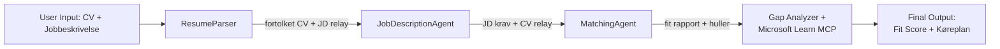

# PersonalCareerCopilot - CV → Job Match Evaluator

En workflow-først multi-agent app, der vurderer, hvor godt et CV matcher en jobbeskrivelse, og derefter genererer en personlig læringsplan for at lukke hullerne.

---

## Agenter

| Agent | Rolle | Værktøjer |
|-------|-------|----------|
| **ResumeParser** | Udtrækker strukturerede færdigheder, erfaring, certificeringer fra CV-tekst | - |
| **JobDescriptionAgent** | Udtrækker krævede/foretrukne færdigheder, erfaring, certificeringer fra en jobbeskrivelse | - |
| **MatchingAgent** | Sammenligner profil vs krav → matchscore (0-100) + matchede/manglende færdigheder | - |
| **GapAnalyzer** | Bygger en personlig læringsplan med Microsoft Learn ressourcer | `search_microsoft_learn_for_plan` (MCP) |

## Workflow


```mermaid
flowchart LR
    UserInput["User Input: CV + Jobbeskrivelse"] --> ResumeParser
    ResumeParser -- "fortolket CV + JD relay" --> JobDescriptionAgent
    JobDescriptionAgent -- "JD krav + CV relay" --> MatchingAgent
    MatchingAgent -- "fit rapport + huller" --> GapAnalyzerMCP["Gap Analyzer +\nMicrosoft Learn MCP"]
    GapAnalyzerMCP --> FinalOutput["Final Output:\nFit Score + Køreplan"]
```

---

## Kom godt i gang

### 1. Opsæt miljø

Denne mappe er referenceimplementeringen for workflow-baserede Lab 02 scaffold. Dens `main.py` bruger de eksisterende promptblokke plus `WorkflowBuilder` til at forbinde de fire agenter.

```powershell
cd workshop\lab02-multi-agent\PersonalCareerCopilot
python -m venv .venv
.\.venv\Scripts\Activate.ps1          # Windows PowerShell
# source .venv/bin/activate            # macOS / Linux
pip install -r requirements.txt
```

### 2. Konfigurer legitimationsoplysninger

Opret en `.env` fil i denne mappe:

```powershell
copy .env .env.bak 2>$null; echo $null > .env
```

Rediger `.env`:

```env
FOUNDRY_PROJECT_ENDPOINT=https://<your-account>.services.ai.azure.com/api/projects/<your-project>
AZURE_AI_MODEL_DEPLOYMENT_NAME=gpt-4.1-mini
```

| Værdi | Hvor findes den |
|-------|------------------|
| `FOUNDRY_PROJECT_ENDPOINT` | Foundry Toolkit sidepanel → højreklik dit projekt → **Kopier projektendepunkt** |
| `AZURE_AI_MODEL_DEPLOYMENT_NAME` | Foundry sidepanel → udvid projekt → **Modeller + endepunkter** → deploymentsnavn |

### 3. Kør lokalt

```powershell
python -m debugpy --listen 127.0.0.1:5679 main.py --port 8088
```

Eller brug VS Code opgaven: `Ctrl+Shift+P` → **Tasks: Run Task** → **Run Agent HTTP Server**.

For F5 debugging, brug **Debug Local Agent HTTP Server**.

### 4. Test med Agent Inspector

Åbn Agent Inspector: `Ctrl+Shift+P` → **Foundry Toolkit: Open Agent Inspector**.

Indsæt denne test prompt:

```
Resume:
Jane Doe
Senior Software Engineer with 5 years of experience in Python, Django, and AWS.
Built microservices handling 10K+ requests/second. Led a team of 4 developers.
Certifications: AWS Solutions Architect Associate.
Education: B.S. Computer Science, State University.

Job Description:
Senior Cloud Engineer at Contoso Ltd.
Required: Python, Azure, Kubernetes, Terraform, CI/CD pipelines.
Preferred: Go, monitoring (Prometheus/Grafana), cost optimization.
Experience: 5+ years in cloud infrastructure.
Certifications: Azure Solutions Architect Expert preferred.
```

**Forventet:** En matchscore (0-100), matchede/manglende færdigheder, og en personlig læringsplan med Microsoft Learn URLs.

### 5. Deploy til Foundry

`Ctrl+Shift+P` → **Foundry Toolkit: Deploy Hosted Agent** → vælg dit projekt → bekræft.

---

## Projektstruktur

```
PersonalCareerCopilot/
├── .env                ← Your credentials (git-ignored)
├── agent.yaml          ← Hosted agent definition (name, resources, env vars)
├── Dockerfile          ← Container image for Foundry deployment
├── main.py             ← 4-agent workflow (instructions, MCP tool, WorkflowBuilder)
└── requirements.txt    ← Python dependencies
```

## Nøglefiler

### `agent.yaml`

Definerer den hostede agent til Foundry Agent Service:
- `kind: hosted` - kører som en administreret container
- `protocols` - `responses` protokol med `version: 1.0.0`, eksponerer `/responses` HTTP-endepunkt
- `environment_variables` - `AZURE_AI_MODEL_DEPLOYMENT_NAME` er deklareret her; `FOUNDRY_PROJECT_ENDPOINT` injiceres automatisk ved deployment

### `main.py`

Indeholder:
- **Agent instruktioner** - fire `*_INSTRUCTIONS` konstanter, én per agent
- **MCP værktøj** - `search_microsoft_learn_for_plan()` kalder `https://learn.microsoft.com/api/mcp` via Streamable HTTP
- **Agent oprettelse** - fire `Agent()` + `AgentExecutor()` instanser der deler en `FoundryChatClient`
- **Workflow graf** - `WorkflowBuilder` forbinder agenter som en sekventiel pipeline: ResumeParser → JD Agent → MatchingAgent → GapAnalyzer
- **Server opstart** - `ResponsesHostServer` kører på port 8088

### `requirements.txt`

| Pakke | Formål |
|---------|---------|
| `agent-framework-foundry` | Kerneruntime: `Agent`, `AgentExecutor`, `WorkflowBuilder`, `@tool`, `FoundryChatClient` |
| `agent-framework-foundry-hosting` | `ResponsesHostServer` + Foundry hosting integration |
| `mcp<2,>=1.24.0` | MCP klient for GapAnalyzer (`streamable_http_client`) |
| `debugpy` | Python debugging (F5 i VS Code) |

---

## Fejlfinding

| Problem | Løsning |
|--------|---------|
| `KeyError: 'FOUNDRY_PROJECT_ENDPOINT'` eller `KeyError: 'AZURE_AI_MODEL_DEPLOYMENT_NAME'` | Opret `.env` med både `FOUNDRY_PROJECT_ENDPOINT` og `AZURE_AI_MODEL_DEPLOYMENT_NAME` sat |
| `ModuleNotFoundError: No module named 'agent_framework'` | Aktivér venv og kør `pip install -r requirements.txt` |
| Ingen Microsoft Learn URLs i output | Tjek internetforbindelse til `https://learn.microsoft.com/api/mcp` |
| Kun 1 gap card (afkortet) | Bekræft at `GAP_ANALYZER_INSTRUCTIONS` inkluderer `CRITICAL:` blokken |
| Port 8088 er i brug | Stop andre servere: `netstat -ano \| findstr :8088` |

For detaljeret fejlfinding, se [Module 8 - Troubleshooting](../docs/08-troubleshooting.md).

---

**Fuld gennemgang:** [Lab 02 Docs](../docs/README.md) · **Tilbage til:** [Lab 02 README](../README.md) · [Workshop Hjem](../../../README.md)

---

<!-- CO-OP TRANSLATOR DISCLAIMER START -->
**Ansvarsfraskrivelse**:
Dette dokument er blevet oversat ved hjælp af AI-oversættelsestjenesten [Co-op Translator](https://github.com/Azure/co-op-translator). Selvom vi bestræber os på nøjagtighed, skal du være opmærksom på, at automatiserede oversættelser kan indeholde fejl eller unøjagtigheder. Det originale dokument på dets oprindelige sprog bør betragtes som den autoritative kilde. For kritisk information anbefales professionel menneskelig oversættelse. Vi påtager os intet ansvar for misforståelser eller fejltolkninger, der opstår som følge af brugen af denne oversættelse.
<!-- CO-OP TRANSLATOR DISCLAIMER END -->