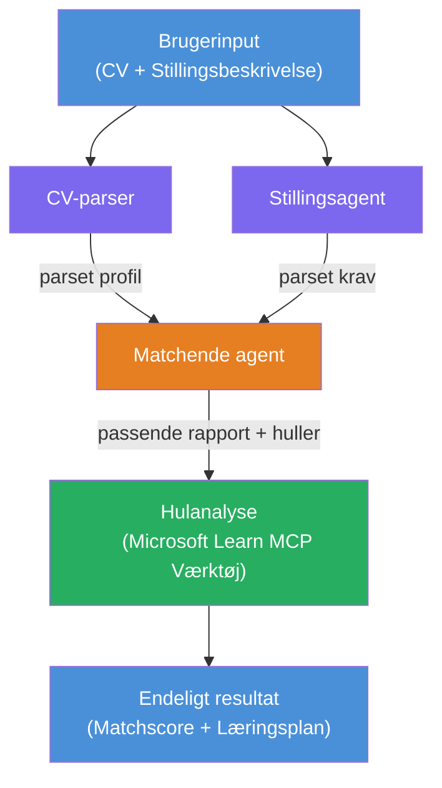

# Lab 02 - Multi-Agent Workflow: CV → Job Fit Evaluator

---

## Hvad du skal bygge

En **CV → Job Fit Evaluator** - en multi-agent workflow, hvor fire specialiserede agenter samarbejder om at evaluere, hvor godt en kandidats CV matcher en jobbeskrivelse, og derefter genererer en personlig læringsplan for at lukke hullerne.

### Agenternes roller

| Agent | Rolle |
|-------|-------|
| **Resume Parser** | Udtrækker strukturerede færdigheder, erfaring, certificeringer fra CV-tekst |
| **Job Description Agent** | Udtrækker krævede/foretrukne færdigheder, erfaring, certificeringer fra en jobbeskrivelse |
| **Matching Agent** | Sammenligner profil vs krav → fit-score (0-100) + matchede/manglende færdigheder |
| **Gap Analyzer** | Bygger en personlig læringsplan med ressourcer, tidslinjer og hurtige projekter |

### Demo flow

Upload et **CV + jobbeskrivelse** → få en **fit-score + manglende færdigheder** → modtag en **personlig læringsplan**.

### Workflow arkitektur

> Lilla = parallelle agenter | Orange = aggregeringspunkt | Grøn = sidste agent med værktøjer. Se [Modul 1 - Forstå Arkitekturen](docs/01-understand-multi-agent.md) og [Modul 4 - Orkestreringsmønstre](docs/04-orchestration-patterns.md) for detaljerede diagrammer og dataflow.

### Emner der dækkes

- Oprettelse af en multi-agent workflow ved brug af **WorkflowBuilder**
- Definering af agentroller og orkestreringsflow (parallel + sekventiel)
- Kommunikationsmønstre mellem agenter
- Lokal testning med Agent Inspector
- Udrulning af multi-agent workflows til Foundry Agent Service

---

## Forudsætninger

Fuldfør først Lab 01:

- [Lab 01 - Enkel Agent](../lab01-single-agent/README.md)

---

## Kom i gang

Se fulde installationsinstruktioner, kodegennemgang og testkommandoer i:

- [Lab 2 Docs - Forudsætninger](docs/00-prerequisites.md)
- [Lab 2 Docs - Fuld Læringsvej](docs/README.md)
- [PersonalCareerCopilot kørselsvejledning](PersonalCareerCopilot/README.md)

## Orkestreringsmønstre (agentiske alternativer)

Lab 2 inkluderer standard **parallel → aggregator → planner** flow, og dokumentationen beskriver også alternative mønstre for at demonstrere stærkere agentisk adfærd:

- **Fan-out/Fan-in med vægtet konsensus**
- **Reviewer/critic gennemgang før endelig plan**
- **Betinget router** (stivalg baseret på fit-score og manglende færdigheder)

Se [docs/04-orchestration-patterns.md](docs/04-orchestration-patterns.md).

---

**Forrige:** [Lab 01 - Enkel Agent](../lab01-single-agent/README.md) · **Tilbage til:** [Workshop Hjem](../../README.md)

---

<!-- CO-OP TRANSLATOR DISCLAIMER START -->
**Ansvarsfraskrivelse**:  
Dette dokument er oversat ved hjælp af AI-oversættelsestjenesten [Co-op Translator](https://github.com/Azure/co-op-translator). Selvom vi bestræber os på nøjagtighed, bedes du være opmærksom på, at automatiserede oversættelser kan indeholde fejl eller unøjagtigheder. Det oprindelige dokument på dets modersmål bør betragtes som den autoritative kilde. For kritisk information anbefales professionel menneskelig oversættelse. Vi påtager os ikke ansvar for eventuelle misforståelser eller fejltolkninger, der opstår som følge af brugen af denne oversættelse.
<!-- CO-OP TRANSLATOR DISCLAIMER END -->