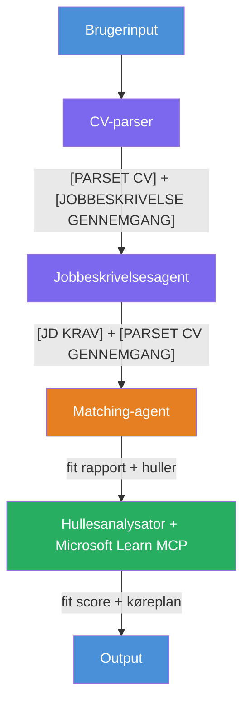

# Lab 02 - Multi-Agent Workflow: CV → Job Fit Evaluator

## Oversigt

I dette praktiske laboratorium bygger du en **workflow-først multi-agent app** ved hjælp af Foundry Toolkit i VS Code og deployer den til Microsoft Foundry Agent Service.

**Hvad du bygger:** en CV → Job Fit Evaluator, der analyserer et CV og en jobbeskrivelse, scorer matchet og producerer en personlig læringsplan ved hjælp af Microsoft Learn ressourcer.

---

## Arkitektur

```mermaid
flowchart TD
    A["Brugerinput"] --> B["CV-parser"]
    B -->|"[PARSET CV] + [JOBBESKRIVELSE GENNEMGANG]"| C["Jobbeskrivelsesagent"]
    C -->|"[JD KRAV] + [PARSET CV GENNEMGANG]"| D["Matching-agent"]
    D -->|fit rapport + huller| E["Hullesanalysator + Microsoft Learn MCP"]
    E -->|fit score + køreplan| F["Output"]

    style A fill:#4A90D9,color:#fff
    style B fill:#7B68EE,color:#fff
    style C fill:#7B68EE,color:#fff
    style D fill:#E67E22,color:#fff
    style E fill:#27AE60,color:#fff
    style F fill:#4A90D9,color:#fff
```

**Sådan fungerer den:**
1. Brugeren indsætter et CV og en jobbeskrivelse.
2. **ResumeParser** analyserer CV’et og kopierer jobbeskrivelsen ordret ind i en `[JOB DESCRIPTION PASS-THROUGH]` sektion.
3. **JD Agent** udtrækker strukturerede krav fra pass-through, og videregiver derefter `[PARSED RESUME]` som `[PARSED RESUME PASS-THROUGH]`.
4. **MatchingAgent** sammenligner `[PARSED RESUME PASS-THROUGH]` med `[JD REQUIREMENTS]` og producerer en fit score.
5. **GapAnalyzer** omsætter hullerne til en praktisk køreplan og henter ægte Microsoft Learn-links via MCP.

---

## Forudsætninger

Fuldfør Lab 01 først:

- [Lab 01 - Single Agent](../lab01-single-agent/README.md)

---

## Del 1: Læs modulerne i rækkefølge

Se den fulde læringssti i:

- [Lab 2 Docs - Forudsætninger](docs/00-prerequisites.md)
- [Lab 2 Docs - Fulde Læringssti](docs/README.md)
- [PersonalCareerCopilot kørselsvejledning](PersonalCareerCopilot/README.md)

---

## Del 2: Byg og test workflowet

1. Brug Foundry Toolkit-guiden til at opbygge workflow-baseret projekt.
2. Kopier prompt-blokkene og workflow-grafen fra `PersonalCareerCopilot/main.py` til dit arbejdsområde.
3. Kør lokalt med Agent Inspector og verificer alle fire agenter plus MCP-værktøjet.
4. Deploy den hostede agent til Foundry, når lokal test godkendes.

---

## Orkestreringsmønstre

Lab 02 inkluderer standard **fan-out → fan-in → sekventiel** flow, og dokumentationen beskriver også alternative orkestreringsmønstre til eksperimentering.

- **Fan-out/Fan-in med vægtet konsensus**
- **Anmelder/kritiker gennemgang før endelig køreplan**
- **Betinget router** baseret på fit score og manglende færdigheder

Se [docs/04-orchestration-patterns.md](docs/04-orchestration-patterns.md).

---

**Forrige:** [Lab 01 - Single Agent](../lab01-single-agent/README.md) · **Tilbage til:** [Workshop Startside](../../README.md)

---

<!-- CO-OP TRANSLATOR DISCLAIMER START -->
**Ansvarsfraskrivelse**:
Dette dokument er blevet oversat ved hjælp af AI-oversættelsestjenesten [Co-op Translator](https://github.com/Azure/co-op-translator). Selvom vi bestræber os på nøjagtighed, skal du være opmærksom på, at automatiserede oversættelser kan indeholde fejl eller unøjagtigheder. Det originale dokument på dets oprindelige sprog bør betragtes som den autoritative kilde. For kritisk information anbefales professionel menneskelig oversættelse. Vi påtager os intet ansvar for misforståelser eller fejltolkninger, der opstår som følge af brugen af denne oversættelse.
<!-- CO-OP TRANSLATOR DISCLAIMER END -->