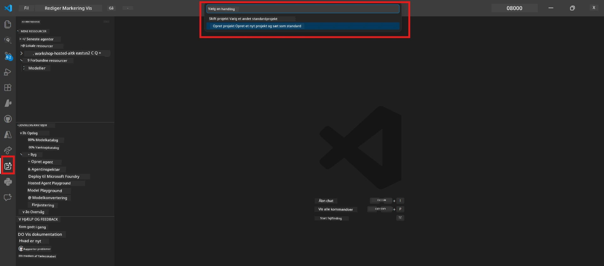

# Modul 0 - Forudsætninger

Før du starter Lab 02, skal du bekræfte, at du har gennemført følgende. Denne lab bygger direkte videre på Lab 01 – spring den ikke over.

---

## 1. Gennemfør Lab 01

Lab 02 forudsætter, at du allerede har:

- [x] Gennemført alle 8 moduler i [Lab 01 - Single Agent](../../lab01-single-agent/README.md)
- [x] Med succes udrullet en enkelt agent til Foundry Agent Service
- [x] Verificeret at agenten fungerer både i lokal Agent Inspector og Foundry Playground

Hvis du ikke har gennemført Lab 01, gå tilbage og færdiggør den nu: [Lab 01 Docs](../../lab01-single-agent/docs/00-prerequisites.md)

---

## 2. Verificer eksisterende opsætning

Alle værktøjer fra Lab 01 skulle stadig være installeret og fungere. Kør disse hurtige kontroller:

### 2.1 Azure CLI

```powershell
az account show --query "{name:name, id:id}" --output table
```

Forventet: Viser dit abonnement navn og ID. Hvis dette fejler, kør [`az login`](https://learn.microsoft.com/cli/azure/authenticate-azure-cli-interactively).

### 2.2 VS Code-udvidelser

1. Tryk på `Ctrl+Shift+P` → skriv **"Microsoft Foundry"** → bekræft, at du ser kommandoer (f.eks. `Microsoft Foundry: Create a New Hosted Agent`).
2. Tryk på `Ctrl+Shift+P` → skriv **"Foundry Toolkit"** → bekræft, at du ser kommandoer (f.eks. `Foundry Toolkit: Open Agent Inspector`).

### 2.3 Foundry projekt og model

1. Klik på **Microsoft Foundry**-ikonet i VS Code Activity Bar.
2. Bekræft, at dit projekt er listet (f.eks. `workshop-agents`).
3. Udvid projektet → verificer, at der findes en udrullet model (f.eks. `gpt-4.1-mini`) med status **Succeeded**.

> **Hvis din modeludrulning er udløbet:** Nogle gratis-tier udrulninger udløber automatisk. Udrul igen fra [Model Catalog](https://learn.microsoft.com/azure/foundry/foundry-models/concepts/models-sold-directly-by-azure) (`Ctrl+Shift+P` → **Microsoft Foundry: Open Model Catalog**).



### 2.4 RBAC-roller

Bekræft, at du har **Azure AI User** på dit Foundry-projekt:

1. [Azure Portal](https://portal.azure.com) → din Foundry **projekt**-ressource → **Access control (IAM)** → fanen **[Role assignments](https://learn.microsoft.com/azure/foundry/concepts/rbac-foundry)**.
2. Søg efter dit navn → bekræft, at **[Azure AI User](https://aka.ms/foundry-ext-project-role)** er listet.

---

## 3. Forstå multi-agent koncepter (nyt for Lab 02)

Lab 02 introducerer begreber, der ikke blev dækket i Lab 01. Læs igennem disse før du fortsætter:

### 3.1 Hvad er en multi-agent arbejdsproces?

I stedet for at én agent håndterer alt, splitter en **multi-agent arbejdsproces** arbejdet ud på flere specialiserede agenter. Hver agent har:

- Sine egne **instruktioner** (systemprompt)
- Sin egen **rolle** (hvad den er ansvarlig for)
- Valgfri **værktøjer** (funktioner den kan kalde)

Agenterne kommunikerer gennem en **orkestreringsgraf**, som definerer, hvordan data flyder mellem dem.

### 3.2 WorkflowBuilder

[`WorkflowBuilder`](https://learn.microsoft.com/agent-framework/workflows/agents-in-workflows)-klassen fra `agent_framework` er SDK-komponenten, der forbinder agenterne:

```python
from agent_framework import WorkflowBuilder

workflow = (
    WorkflowBuilder(
        name="MyWorkflow",
        start_executor=agent_a,
        output_executors=[agent_d],
    )
    .add_edge(agent_a, agent_b)
    .add_edge(agent_a, agent_c)
    .add_edge(agent_b, agent_d)
    .add_edge(agent_c, agent_d)
    .build()
)
```

- **`start_executor`** - Den første agent, der modtager brugerinput
- **`output_executors`** - Agent(en), hvis output bliver det endelige svar
- **`add_edge(source, target)`** - Definerer, at `target` modtager output fra `source`

### 3.3 MCP (Model Context Protocol) værktøjer

Lab 02 bruger et **MCP-værktøj**, der kalder Microsoft Learn API for at hente læringsressourcer. [MCP (Model Context Protocol)](https://modelcontextprotocol.io/introduction) er en standardiseret protokol til at forbinde AI-modeller med eksterne datakilder og værktøjer.

| Term | Definition |
|------|------------|
| **MCP server** | En service, der eksponerer værktøjer/ressourcer via [MCP-protokollen](https://learn.microsoft.com/azure/foundry/agents/how-to/tools/model-context-protocol) |
| **MCP client** | Din agentkode, der forbinder til en MCP-server og kalder dens værktøjer |
| **[Streamable HTTP](https://learn.microsoft.com/agent-framework/agents/tools/hosted-mcp-tools)** | Transportmetoden brugt til at kommunikere med MCP-serveren |

### 3.4 Hvordan Lab 02 adskiller sig fra Lab 01

| Aspekt | Lab 01 (Single Agent) | Lab 02 (Multi-Agent) |
|--------|-----------------------|----------------------|
| Agenter | 1 | 4 (specialiserede roller) |
| Orkestrering | Ingen | WorkflowBuilder (parallel + sekventiel) |
| Værktøjer | Valgfri `@tool` funktion | MCP værktøj (ekstern API-kald) |
| Kompleksitet | Simpel prompt → svar | CV + jobbeskrivelse → fit score → roadmap |
| Kontekst flow | Direkte | Agent-til-agent overlevering |

---

## 4. Workshop repository struktur for Lab 02

Sørg for, at du ved, hvor Lab 02-filerne er:

```
workshop/
└── lab02-multi-agent/
    ├── README.md                       ← Lab overview
    ├── docs/                           ← You are here
    │   ├── README.md                   ← Learning path index
    │   ├── 00-prerequisites.md         ← This file
    │   ├── 01-understand-multi-agent.md
    │   ├── ...
    │   └── 08-troubleshooting.md
    └── PersonalCareerCopilot/          ← The agent project
        ├── agent.yaml                  ← Agent definition
        ├── main.py                     ← 4-agent workflow code
        ├── Dockerfile                  ← Container configuration
        └── requirements.txt            ← Python dependencies
```

---

### Checkpoint

- [ ] Lab 01 er fuldt gennemført (alle 8 moduler, agent udrullet og verificeret)
- [ ] `az account show` returnerer dit abonnement
- [ ] Microsoft Foundry og Foundry Toolkit-udvidelser er installeret og fungerer
- [ ] Foundry-projektet har en udrullet model (f.eks. `gpt-4.1-mini`)
- [ ] Du har **Azure AI User** rolle på projektet
- [ ] Du har læst multi-agent koncepter sektionen ovenfor og forstår WorkflowBuilder, MCP og agentorkestrering

---

**Næste:** [01 - Forstå Multi-Agent Arkitektur →](01-understand-multi-agent.md)

---

<!-- CO-OP TRANSLATOR DISCLAIMER START -->
**Ansvarsfraskrivelse**:  
Dette dokument er blevet oversat ved hjælp af AI-oversættelsestjenesten [Co-op Translator](https://github.com/Azure/co-op-translator). Selvom vi bestræber os på nøjagtighed, bedes du være opmærksom på, at automatiserede oversættelser kan indeholde fejl eller unøjagtigheder. Det originale dokument på dets modersmål bør betragtes som den autoritative kilde. For kritisk information anbefales professionel menneskelig oversættelse. Vi påtager os intet ansvar for misforståelser eller fejltolkninger, der opstår på grund af brugen af denne oversættelse.
<!-- CO-OP TRANSLATOR DISCLAIMER END -->