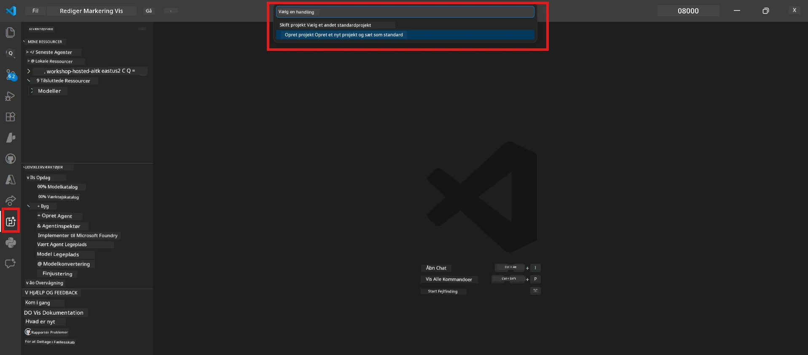

# Modul 0 - Introduktion

⏱️ ~10 min

> [!WARNING]
> **Forhåndsvisning & Begrænsninger:** [Hosted Agents](https://learn.microsoft.com/azure/foundry/agents/concepts/hosted-agents) er i øjeblikket i **public preview** - ikke anbefalet til produktionsarbejdsmængder. Nogle funktioner vist i denne workshop kan ændre sig, efterhånden som tjenesten nærmer sig GA.

## Hvad du vil bygge

I dette laboratorie udvider du færdighederne med en enkelt agent fra Lab 01 til at bygge en **multi-agent arbejdsgang** - Resume → Job Fit Evaluator.

Du indsætter et **CV** og en **jobbeskrivelse**. Fire specialiserede agenter behandler inputtet sekventielt og returnerer derefter:
- En fit-score (0–100 med en scoringsopdeling)
- En liste over færdigheds- og certificeringsmangler
- En personlig læringsvej med reelle Microsoft Learn-links for hver mangel

**Arbejdsgangen bruger:**
- **Microsoft Agent Framework** - `WorkflowBuilder` til sekventiel pipeline-orkestrering
- **Foundry Toolkit for VS Code** - scaffolding, lokal test, udrulning
- **En AI-model** (fx `gpt-4.1-mini`) - brugt af alle fire agenter
- **Microsoft Learn MCP-server** - leverer reelle læringsressourcelinks for hver færdighedsmangel

---

## Vælg din vej

> ⚠️ **Fortsæt med den samme vej, du brugte i Lab 01.**

<details open>
<summary><strong>🅰️ Vej A - Azure cloud (kræver Azure abonnement)</strong></summary>

| | Detaljer |
|---|---|
| **Hvem er det til?** | Du gennemførte Lab 01 ved brug af et Azure abonnement |
| **Model** | Azure OpenAI via Foundry (fx `gpt-4.1-mini`) |
| **Dækkede moduler** | Alle moduler (00–09) |
| **Udrul til cloud?** | ✅ Ja - fuld end-to-end udrulning |

</details>

<details open>
<summary><strong>🅱️ Vej B - Foundry Local (ingen Azure abonnement nødvendig)</strong></summary>

| | Detaljer |
|---|---|
| **Hvem er det til?** | Du gennemførte Lab 01 ved brug af Foundry Local |
| **Model** | Foundry Local (gratis, kører på din maskine) |
| **Dækkede moduler** | Moduler 00–05 (spring 06–07 over - udrul & cloud verifikation) |
| **Udrul til cloud?** | ❌ Nej - kun lokal test via Agent Inspector |

</details>

---

## Tjek Lab 01

Lab 02 bygger direkte videre på Lab 01. Gennemfør Lab 01 først, før du går i gang her.

Har du ikke lavet Lab 01 endnu? Start her: [Lab 01 - Introduktion](../../lab01-single-agent/docs/00-prerequisites.md)

<details open>
<summary><strong>🅰️ Vej A - Azure cloud</strong></summary>

```powershell
az account show --query "{name:name, id:id}" --output table
```

Hvis dette fejler, kør `az login`. Kontroller derefter i VS Code:

1. `Ctrl+Shift+P` → skriv **Foundry Toolkit** → bekræft at kommandoer vises.
2. Klik på **Foundry Toolkit** ikonet → dit projekt og udrullede model vises som **Succeeded**.



> **RBAC:** Du tildelte **Foundry User** i Lab 01. Hvis du skal tildele igen, se [Lab 01, Modul 1](../../lab01-single-agent/docs/01-setup.md#deploy-a-model--assign-rbac). Rollen hed tidligere **Azure AI User** - samme tilladelser.

</details>

<details open>
<summary><strong>🅱️ Vej B - Foundry Local</strong></summary>

```powershell
Invoke-WebRequest -Uri "http://localhost:5273/v1/health" -UseBasicParsing | Select-Object StatusCode
```

Forventet: `StatusCode: 200`. Hvis ikke, genstart Foundry Local fra Foundry Toolkit sidebar.

> Al inferens kører på din maskine. Det eneste udgående kald er MCP-værktøjet til `https://learn.microsoft.com/api/mcp`.

</details>

---

## Hvad er nyt i Lab 02

| | Lab 01 | Lab 02 |
|--|--------|--------|
| Agenter | 1 | 4 (kædet med WorkflowBuilder) |
| Scaffold skabelon | Grundlæggende - Agent Framework | Workflows - Agent Framework |
| Nyt pakke | - | `mcp` |
| Orkestrering | Enkel samtaleagent | Sekventiel pipeline (WorkflowBuilder) |
| Nyt værktøj | - | `search_microsoft_learn_for_plan` (MCP) |

---

**Næste:** [01 - Forstå arkitekturen →](01-understand-multi-agent.md)

---

<!-- CO-OP TRANSLATOR DISCLAIMER START -->
**Ansvarsfraskrivelse**:
Dette dokument er blevet oversat ved hjælp af AI-oversættelsestjenesten [Co-op Translator](https://github.com/Azure/co-op-translator). Selvom vi bestræber os på nøjagtighed, skal du være opmærksom på, at automatiserede oversættelser kan indeholde fejl eller unøjagtigheder. Det originale dokument på dets oprindelige sprog bør betragtes som den autoritative kilde. For kritisk information anbefales professionel menneskelig oversættelse. Vi påtager os intet ansvar for misforståelser eller fejltolkninger, der opstår som følge af brugen af denne oversættelse.
<!-- CO-OP TRANSLATOR DISCLAIMER END -->