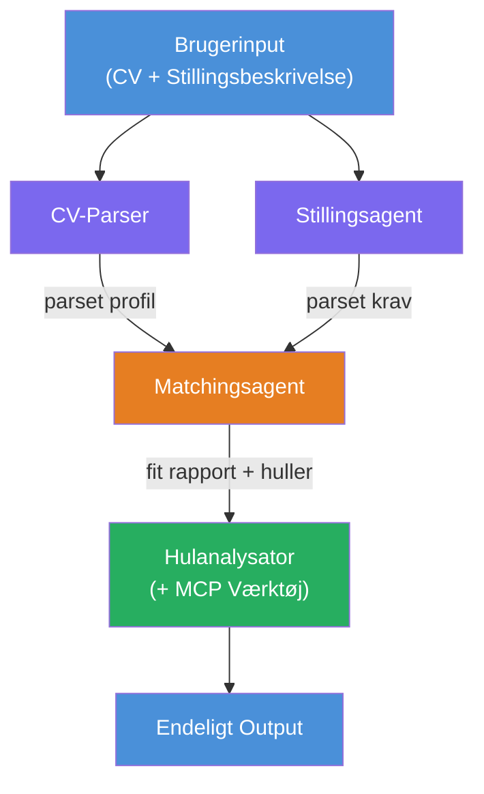
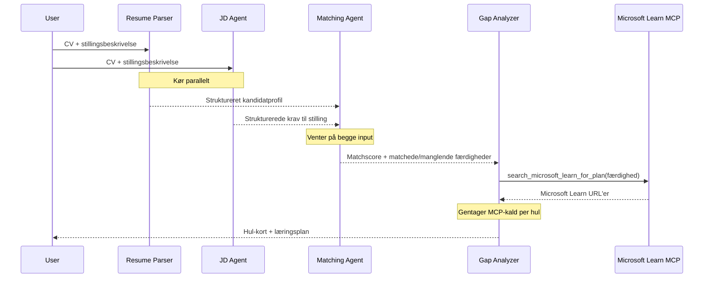
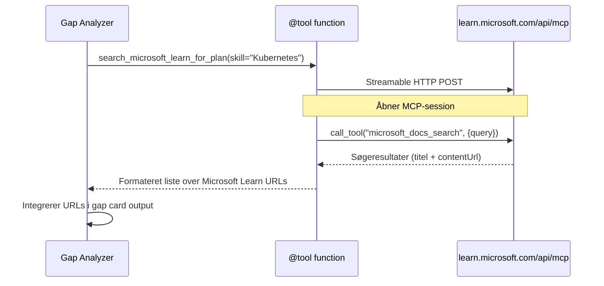

# Modul 1 - Forstå Multi-Agent Arkitekturen

I dette modul lærer du arkitekturen for Resume → Job Fit Evaluator, før du skriver nogen kode. At forstå orkestreringsgrafen, agentroller og dataflow er afgørende for fejlfinding og udvidelse af [multi-agent workflows](https://learn.microsoft.com/azure/architecture/ai-ml/idea/multiple-agent-workflow-automation).

---

## Problemet dette løser

At matche et CV til en jobbeskrivelse involverer flere forskellige færdigheder:

1. **Parsing** - Udtrække strukturerede data fra ustruktureret tekst (CV)
2. **Analyse** - Udtrække krav fra en jobbeskrivelse
3. **Sammenligning** - Vurdere tilpasningen mellem de to
4. **Planlægning** - Opbygge en læringsplan for at lukke huller

En enkelt agent, som udfører alle fire opgaver i én prompt, producerer ofte:
- Ufuldstændig udtrækning (den skynder sig gennem parsing for at nå scoren)
- Overfladisk scoring (ingen evidensbaseret opdeling)
- Generiske læringsplaner (ikke tilpasset de specifikke huller)

Ved at opdele i **fire specialiserede agenter**, fokuserer hver på sin opgave med dedikerede instruktioner og producerer output af højere kvalitet på hvert trin.

---

## De fire agenter

Hver agent er en fuld [Microsoft Foundry](https://learn.microsoft.com/azure/foundry/agents/concepts/hosted-agents) agent oprettet via `AzureAIAgentClient.as_agent()`. De deler samme modeludrulning, men har forskellige instruktioner og (valgfrit) forskellige værktøjer.

| # | Agentnavn | Rolle | Input | Output |
|---|-----------|-------|-------|--------|
| 1 | **ResumeParser** | Udtrækker struktureret profil fra CV-tekst | Rå CV-tekst (fra bruger) | Kandidatprofil, Tekniske færdigheder, Bløde færdigheder, Certificeringer, Domæneerfaring, Præstationer |
| 2 | **JobDescriptionAgent** | Udtrækker strukturerede krav fra en jobbeskrivelse | Rå jobbeskrivelse tekst (fra bruger, videresendt via ResumeParser) | Rollesammendrag, Nødvendige færdigheder, Foretrukne færdigheder, Erfaring, Certificeringer, Uddannelse, Ansvarsområder |
| 3 | **MatchingAgent** | Beregner evidensbaseret fit score | Output fra ResumeParser + JobDescriptionAgent | Fit Score (0-100 med opdeling), Matchede færdigheder, Manglende færdigheder, Huller |
| 4 | **GapAnalyzer** | Bygger personlig læringsplan | Output fra MatchingAgent | Hul-kort (pr. færdighed), Læringsrækkefølge, Tidslinje, Ressourcer fra Microsoft Learn |

---

## Orkestreringsgrafen

Workflowen bruger **parallel fan-out** efterfulgt af **sekventiel aggregering**:


> **Forklaring:** Lilla = parallelle agenter, Orange = aggregeringspunkt, Grøn = endelig agent med værktøjer

### Hvordan data flyder


1. **Bruger sender** en besked, der indeholder et CV og en jobbeskrivelse.
2. **ResumeParser** modtager hele brugerinput og udtrækker en struktureret kandidatprofil.
3. **JobDescriptionAgent** modtager brugerinput parallelt og udtrækker strukturerede krav.
4. **MatchingAgent** modtager output fra **både** ResumeParser og JobDescriptionAgent (frameworket venter på begge for at køre MatchingAgent).
5. **GapAnalyzer** modtager MatchingAgent’s output og kalder **Microsoft Learn MCP-værktøjet** for at hente reelle læringsressourcer for hvert hul.
6. **Det endelige output** er GapAnalyzers svar, som inkluderer fit score, hul-kort og en komplet læringsplan.

### Hvorfor parallel fan-out betyder noget

ResumeParser og JobDescriptionAgent kører **parallelt**, fordi ingen af dem afhænger af den anden. Dette:
- Reducerer samlet ventetid (begge kører samtidigt i stedet for sekventielt)
- Er en naturlig opdeling (parsning af CV vs. parsning af jobbeskrivelse er uafhængige opgaver)
- Demonstrerer et almindeligt multi-agent mønster: **fan-out → aggregér → agér**

---

## WorkflowBuilder i kode

Sådan kortlægges grafen ovenfor til [`WorkflowBuilder`](https://learn.microsoft.com/agent-framework/workflows/agents-in-workflows) API-kald i `main.py`:

```python
from agent_framework import WorkflowBuilder

workflow = (
    WorkflowBuilder(
        name="ResumeJobFitEvaluator",
        start_executor=resume_parser,       # Første agent til at modtage brugerinput
        output_executors=[gap_analyzer],     # Sidste agent hvis output returneres
    )
    .add_edge(resume_parser, jd_agent)      # ResumeParser → JobDescriptionAgent
    .add_edge(resume_parser, matching_agent) # ResumeParser → MatchingAgent
    .add_edge(jd_agent, matching_agent)      # JobDescriptionAgent → MatchingAgent
    .add_edge(matching_agent, gap_analyzer)  # MatchingAgent → GapAnalyzer
    .build()
)
```

**Forstå kanterne:**

| Kant | Hvad det betyder |
|------|------------------|
| `resume_parser → jd_agent` | JD Agent modtager ResumeParser’s output |
| `resume_parser → matching_agent` | MatchingAgent modtager ResumeParser’s output |
| `jd_agent → matching_agent` | MatchingAgent modtager også JD Agent’s output (venter på begge) |
| `matching_agent → gap_analyzer` | GapAnalyzer modtager MatchingAgent’s output |

Da `matching_agent` har **to indgående kanter** (`resume_parser` og `jd_agent`), venter frameworket automatisk på begge, før Matching Agent kører.

---

## MCP-værktøjet

GapAnalyzer-agenten har ét værktøj: `search_microsoft_learn_for_plan`. Dette er et **[MCP-værktøj](https://learn.microsoft.com/agent-framework/agents/tools/hosted-mcp-tools)**, der kalder Microsoft Learn API til at hente udvalgte læringsressourcer.

### Sådan fungerer det

```python
@tool
async def search_microsoft_learn_for_plan(
    skill: str, role: str = "", max_results: int = 5
) -> str:
    """Search Microsoft Learn MCP and return curated official links."""
    # Forbinder til https://learn.microsoft.com/api/mcp via Streamable HTTP
    # Kalder 'microsoft_docs_search' værktøjet på MCP serveren
    # Returnerer formateret liste af Microsoft Learn URL'er
```

### MCP opkaldsflow


1. GapAnalyzer beslutter, at der skal bruges læringsressourcer for en færdighed (fx "Kubernetes")
2. Frameworket kalder `search_microsoft_learn_for_plan(skill="Kubernetes")`
3. Funktionen åbner en [Streamable HTTP](https://learn.microsoft.com/agent-framework/agents/tools/hosted-mcp-tools) forbindelse til `https://learn.microsoft.com/api/mcp`
4. Den kalder `microsoft_docs_search` værktøjet på [MCP-serveren](https://learn.microsoft.com/azure/foundry/agents/how-to/tools/model-context-protocol)
5. MCP-serveren returnerer søgeresultater (titel + URL)
6. Funktionen formatterer resultaterne og returnerer dem som en streng
7. GapAnalyzer bruger de returnerede URL’er i sit hul-kort output

### Forventede MCP logs

Når værktøjet kører, vil du se logindgange som:

```
GET https://learn.microsoft.com/api/mcp → 405 (Method Not Allowed)
POST https://learn.microsoft.com/api/mcp → 200
DELETE https://learn.microsoft.com/api/mcp → 405 (Method Not Allowed)
```

**Disse er normale.** MCP-klienten tester med GET og DELETE under initialisering - at disse returnerer 405 er forventet. Det faktiske værktøjskald bruger POST og returnerer 200. Kun bekymr dig, hvis POST-kald fejler.

---

## Agentoprettelsesmønster

Hver agent oprettes med den **asynkrone kontekstmanager [`AzureAIAgentClient.as_agent()`](https://learn.microsoft.com/python/api/overview/azure/ai-agents-readme)**. Dette er Foundry SDK-mønstret til at oprette agenter, som automatisk bliver ryddet op:

```python
async with (
    get_credential() as credential,
    AzureAIAgentClient(
        project_endpoint=PROJECT_ENDPOINT,
        model_deployment_name=MODEL_DEPLOYMENT_NAME,
        credential=credential,
    ).as_agent(
        name="ResumeParser",
        instructions=RESUME_PARSER_INSTRUCTIONS,
    ) as resume_parser,
    # ... gentag for hver agent ...
):
    # Alle 4 agenter findes her
    workflow = create_workflow(resume_parser, jd_agent, matching_agent, gap_analyzer)
```

**Vigtige punkter:**
- Hver agent får sin egen `AzureAIAgentClient` instans (SDK kræver, at agentnavn er scoped til klienten)
- Alle agenter deler samme `credential`, `PROJECT_ENDPOINT` og `MODEL_DEPLOYMENT_NAME`
- `async with` blokken sikrer, at alle agenter ryddes op, når serveren lukkes ned
- GapAnalyzer modtager desuden `tools=[search_microsoft_learn_for_plan]`

---

## Serverstart

Efter oprettelse af agenter og opbygning af workflow starter serveren:

```python
from azure.ai.agentserver.agentframework import from_agent_framework

agent = create_workflow(resume_parser, jd_agent, matching_agent, gap_analyzer)
await from_agent_framework(agent).run_async()
```

`from_agent_framework()` pakker workflowen som en HTTP-server med `/responses` endpoint på port 8088. Dette er samme mønster som i Lab 01, men "agenten" er nu hele [workflow-grafen](https://learn.microsoft.com/agent-framework/workflows/as-agents).

---

### Checkpoint

- [ ] Du forstår 4-agent arkitekturen og hver agents rolle
- [ ] Du kan spore dataflowet: Bruger → ResumeParser → (parallelt) JD Agent + MatchingAgent → GapAnalyzer → Output
- [ ] Du forstår, hvorfor MatchingAgent venter på både ResumeParser og JD Agent (to indgående kanter)
- [ ] Du forstår MCP-værktøjet: hvad det gør, hvordan det kaldes, og at GET 405 logs er normale
- [ ] Du forstår `AzureAIAgentClient.as_agent()` mønstret og hvorfor hver agent har sin egen klientinstans
- [ ] Du kan læse `WorkflowBuilder` koden og koble den til den visuelle graf

---

**Forrige:** [00 - Forudsætninger](00-prerequisites.md) · **Næste:** [02 - Scaffold Multi-Agent Projekt →](02-scaffold-multi-agent.md)

---

<!-- CO-OP TRANSLATOR DISCLAIMER START -->
**Ansvarsfraskrivelse**:
Dette dokument er oversat ved hjælp af AI-oversættelsestjenesten [Co-op Translator](https://github.com/Azure/co-op-translator). Selvom vi bestræber os på nøjagtighed, skal du være opmærksom på, at automatiserede oversættelser kan indeholde fejl eller unøjagtigheder. Det originale dokument på dets oprindelige sprog bør betragtes som den autoritative kilde. For kritisk information anbefales professionel menneskelig oversættelse. Vi påtager os intet ansvar for misforståelser eller fejltolkninger, der opstår som følge af brugen af denne oversættelse.
<!-- CO-OP TRANSLATOR DISCLAIMER END -->