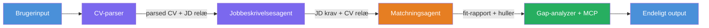

# Modul 1 - Forstå Arkitekturen

⏱️ ~5 min

Før du skriver nogen kode, får du her et hurtigt overblik over, hvad du bygger, og hvordan det fungerer.

---

## Hvad du bygger

Du indsætter et **cv** og en **jobbeskrivelse**. Workflowen returnerer:

- En fit-score (0–100 med en opdeling)
- En liste over færdigheds- og certificeringsmangler
- En personlig læringsplan med Microsoft Learn-links for hver mangel

---

## De fire agenter

En enkelt agent, der prøver at analysere, score og planlægge alt på én gang, har en tendens til at skynde sig og producere overfladisk output. At opdele arbejdet i fire specialiserede agenter giver bedre resultater:

| Agent | Hvad den gør |
|-------|-------------|
| **ResumeParser** | Parser cv’et; kopierer jobbeskrivelsen ordret til `[JOB DESCRIPTION PASS-THROUGH]` til downstream-agenter |
| **JobDescriptionAgent** | Udtrækker krav fra jobbeskrivelsen i pass-through; videresender `[PARSED RESUME]` videre som `[PARSED RESUME PASS-THROUGH]` |
| **MatchingAgent** | Sammenligner begge markerede sektioner; producerer en fit-score fra 0–100 og en liste over mangler |
| **GapAnalyzer** | Bygger en læringsplan; søger på Microsoft Learn for hver mangel |

---

## Orkestreringsgrafen

Workflowen er en **sekventiel pipeline** - hver agent sender sit output videre til den næste:


```mermaid
flowchart LR
    A["Brugerinput"] --> B["CV-parser"]
    B -- "parsed CV + JD relæ" --> C["Jobbeskrivelsesagent"]
    C -- "JD krav + CV relæ" --> D["Matchningsagent"]
    D -- "fit-rapport + huller" --> E["Gap-analyzer + MCP"]
    E --> F["Endeligt output"]

    style A fill:#4A90D9,color:#fff
    style B fill:#7B68EE,color:#fff
    style C fill:#7B68EE,color:#fff
    style D fill:#E67E22,color:#fff
    style E fill:#27AE60,color:#fff
    style F fill:#4A90D9,color:#fff
```

1. **ResumeParser** modtager brugerens input, parser cv'et og kopierer jobbeskrivelsen til `[JOB DESCRIPTION PASS-THROUGH]`.
2. **JD Agent** udtrækker strukturerede krav og videresender `[PARSED RESUME PASS-THROUGH]`.
3. **MatchingAgent** sammenligner begge sektioner og producerer en fit-score og liste over mangler.
4. **GapAnalyzer** bygger læringsplanen og kalder Microsoft Learn MCP-værktøjet for hver mangel.

---

## Hvordan dette kortlægges til kode

I `main.py` beskriver du denne graf med `WorkflowBuilder`:

```python
workflow_agent = (
    WorkflowBuilder(
        start_executor=resume_executor,       # første agent til at modtage brugerinput
        output_executors=[gap_executor],      # sidste agent - dens output er svaret
    )
    .add_edge(resume_executor, jd_executor)       # ResumeParser → JD Agent
    .add_edge(jd_executor, matching_executor)     # JD Agent → MatchingAgent
    .add_edge(matching_executor, gap_executor)    # MatchingAgent → GapAnalyzer
    .build()
    .as_agent()
)
```

Hver `Agent` er pakket ind i en `AgentExecutor`. `add_edge()`-kald definerer en strengt sekventiel pipeline - hver agent modtager kun output fra sin direkte forgænger.

> `context_mode="last_agent"` betyder, at hver executor kun ser sin direkte forgængers output. ResumeParser og JD Agent videresender data i markerede sektioner, så hver downstream-agent har præcis det, den har brug for.

---

## MCP-værktøjet

GapAnalyzer har ét værktøj: `search_microsoft_learn_for_plan`. Det forbinder til `https://learn.microsoft.com/api/mcp` og returnerer reelle Microsoft Learn-links for hver færdighedsmangel.

Når værktøjet kører, ser du disse logs - alt forventet:

```
GET  https://learn.microsoft.com/api/mcp → 405   ← connection probe, normal
POST https://learn.microsoft.com/api/mcp → 200   ← actual tool call
DELETE https://learn.microsoft.com/api/mcp → 405 ← cleanup probe, normal
```

Du skal kun bekymre dig, hvis `POST` returnerer en fejl.

---

**Forrige:** [00 - Forudsætninger](00-prerequisites.md) · **Næste:** [02 - Scaffold projektet →](02-scaffold-multi-agent.md)

---

<!-- CO-OP TRANSLATOR DISCLAIMER START -->
**Ansvarsfraskrivelse**:
Dette dokument er blevet oversat ved hjælp af AI-oversættelsestjenesten [Co-op Translator](https://github.com/Azure/co-op-translator). Selvom vi bestræber os på nøjagtighed, skal du være opmærksom på, at automatiserede oversættelser kan indeholde fejl eller unøjagtigheder. Det originale dokument på dets oprindelige sprog bør betragtes som den autoritative kilde. For kritisk information anbefales professionel menneskelig oversættelse. Vi påtager os intet ansvar for misforståelser eller fejltolkninger, der opstår som følge af brugen af denne oversættelse.
<!-- CO-OP TRANSLATOR DISCLAIMER END -->