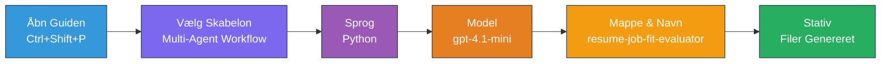
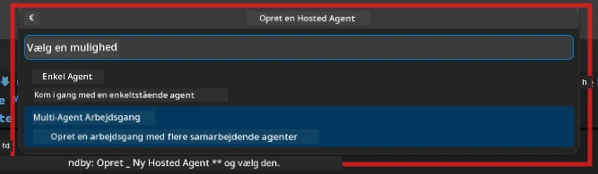

# Modul 2 - Scaffold Multi-Agent Projektet

I dette modul bruger du [Microsoft Foundry-udvidelsen](https://marketplace.visualstudio.com/items?itemName=TeamsDevApp.vscode-ai-foundry) til at **scaffold et multi-agent workflow-projekt**. Udvidelsen genererer hele projektstrukturen - `agent.yaml`, `main.py`, `Dockerfile`, `requirements.txt`, `.env` og debug-konfiguration. Du tilpasser derefter disse filer i Modulerne 3 og 4.

> **Bemærk:** Mappen `PersonalCareerCopilot/` i dette lab er et komplet, fungerende eksempel på et tilpasset multi-agent projekt. Du kan enten scaffold et nyt projekt (anbefalet til læring) eller studere den eksisterende kode direkte.

---

## Trin 1: Åbn Create Hosted Agent-guiden


1. Tryk på `Ctrl+Shift+P` for at åbne **Command Palette**.
2. Skriv: **Microsoft Foundry: Create a New Hosted Agent** og vælg det.
3. Guiden til oprettelse af en hosted agent åbner.

> **Alternativ:** Klik på **Microsoft Foundry**-ikonet i Activity Bar → klik på **+** ikonet ved siden af **Agents** → **Create New Hosted Agent**.

---

## Trin 2: Vælg Multi-Agent Workflow-skabelonen

Guiden beder dig vælge en skabelon:

| Skabelon | Beskrivelse | Hvornår bruges |
|----------|-------------|----------------|
| Single Agent | Én agent med instruktioner og valgfrie værktøjer | Lab 01 |
| **Multi-Agent Workflow** | Flere agenter, der samarbejder via WorkflowBuilder | **Dette lab (Lab 02)** |

1. Vælg **Multi-Agent Workflow**.
2. Klik på **Next**.



---

## Trin 3: Vælg programmeringssprog

1. Vælg **Python**.
2. Klik på **Next**.

---

## Trin 4: Vælg din model

1. Guiden viser modeller udrullet i dit Foundry-projekt.
2. Vælg den samme model, du brugte i Lab 01 (fx **gpt-4.1-mini**).
3. Klik på **Next**.

> **Tip:** [`gpt-4.1-mini`](https://learn.microsoft.com/azure/foundry/foundry-models/concepts/models-sold-directly-by-azure#gpt-41-series) anbefales til udvikling - den er hurtig, billig og håndterer multi-agent workflows godt. Skift til `gpt-4.1` til final produktion, hvis du ønsker højere kvalitet i output.

---

## Trin 5: Vælg mappested og agentnavn

1. En fil-dialog åbner. Vælg en målmappen:
   - Hvis du følger med i workshop-repoet: naviger til `workshop/lab02-multi-agent/` og opret en ny undermappe
   - Hvis du starter nyt: vælg en hvilken som helst mappe
2. Indtast et **navn** for den hosted agent (fx `resume-job-fit-evaluator`).
3. Klik på **Create**.

---

## Trin 6: Vent på, at scaffolding fuldføres

1. VS Code åbner et nyt vindue (eller det nuværende vindue opdateres) med det scaffoldede projekt.
2. Du bør se denne filstruktur:

```
resume-job-fit-evaluator/
├── .env                ← Environment variables (placeholders)
├── .vscode/
│   └── launch.json     ← Debug configuration
├── agent.yaml          ← Agent definition (kind: hosted)
├── Dockerfile          ← Container configuration
├── main.py             ← Multi-agent workflow code (scaffold)
└── requirements.txt    ← Python dependencies
```

> **Workshop note:** I workshop-repositoriet ligger `.vscode/` mappen i **workspace root** med delte `launch.json` og `tasks.json`. Debug-konfigurationerne for Lab 01 og Lab 02 er begge inkluderet. Når du trykker F5, vælg **"Lab02 - Multi-Agent"** fra dropdown-menuen.

---

## Trin 7: Forstå de scaffoldede filer (multi-agent specifikt)

Multi-agent scaffold adskiller sig fra single-agent scaffold på flere vigtige måder:

### 7.1 `agent.yaml` - Agentdefinition

```yaml
kind: hosted
name: resume-job-fit-evaluator
description: >
  A multi-agent workflow that evaluates resume-to-job fit.
metadata:
  authors:
    - Microsoft
  tags:
    - Multi-Agent Workflow
    - Resume Evaluator
protocols:
  - protocol: responses
    version: v1
environment_variables:
  - name: PROJECT_ENDPOINT
    value: ${PROJECT_ENDPOINT}
  - name: MODEL_DEPLOYMENT_NAME
    value: ${MODEL_DEPLOYMENT_NAME}
```

**Nøgleforskel fra Lab 01:** Sektionen `environment_variables` kan inkludere yderligere variabler til MCP-endpoints eller anden værktøjskonfiguration. `name` og `description` reflekterer multi-agent brugssagen.

### 7.2 `main.py` - Multi-agent workflow kode

Scaffolden indeholder:
- **Flere agent-instruktions-strenge** (én konstant per agent)
- **Flere [`AzureAIAgentClient.as_agent()`](https://learn.microsoft.com/python/api/overview/azure/ai-agents-readme) context managers** (én per agent)
- **[`WorkflowBuilder`](https://learn.microsoft.com/agent-framework/workflows/agents-in-workflows)** til at forbinde agenterne
- **`from_agent_framework()`** til at eksponere workflowet som en HTTP-endpoint

```python
from agent_framework import WorkflowBuilder, tool
from agent_framework.azure import AzureAIAgentClient
from azure.ai.agentserver.agentframework import from_agent_framework
```

Den ekstra import [`WorkflowBuilder`](https://learn.microsoft.com/agent-framework/workflows/agents-in-workflows) er ny sammenlignet med Lab 01.

### 7.3 `requirements.txt` - Yderligere afhængigheder

Multi-agent projektet bruger samme basepakker som Lab 01, plus eventuelle MCP-relaterede pakker:

```
agent-framework-azure-ai==1.0.0rc3
agent-framework-core==1.0.0rc3
azure-ai-agentserver-agentframework==1.0.0b16
azure-ai-agentserver-core==1.0.0b16
debugpy
agent-dev-cli --pre
```

> **Vigtig versionsnote:** `agent-dev-cli` pakken kræver `--pre` flaget i `requirements.txt` for at installere den seneste preview-version. Dette er påkrævet for Agent Inspector-kompatibilitet med `agent-framework-core==1.0.0rc3`. Se [Modul 8 - Fejlfinding](08-troubleshooting.md) for versionsdetaljer.

| Pakke | Version | Formål |
|---------|---------|---------|
| [`agent-framework-azure-ai`](https://learn.microsoft.com/agent-framework/overview/) | `1.0.0rc3` | Azure AI integration til [Microsoft Agent Framework](https://github.com/microsoft/agent-framework) |
| [`agent-framework-core`](https://learn.microsoft.com/agent-framework/overview/) | `1.0.0rc3` | Core runtime (inkluderer WorkflowBuilder) |
| `azure-ai-agentserver-agentframework` | `1.0.0b16` | Hosted agent server runtime |
| `azure-ai-agentserver-core` | `1.0.0b16` | Core agent server abstractions |
| `debugpy` | seneste | Python debugging (F5 i VS Code) |
| `agent-dev-cli` | `--pre` | Lokal udviklings-CLI + Agent Inspector backend |

### 7.4 `Dockerfile` - Samme som Lab 01

Dockerfilen er identisk med Lab 01's - den kopierer filer, installerer afhængigheder fra `requirements.txt`, åbner port 8088 og kører `python main.py`.

```dockerfile
FROM python:3.14-slim
WORKDIR /app
COPY ./ .
RUN pip install --upgrade pip && \
    if [ -f requirements.txt ]; then \
        pip install -r requirements.txt; \
    else \
      echo "No requirements.txt found" >&2; exit 1; \
    fi
EXPOSE 8088
CMD ["python", "main.py"]
```

---

### Checkpoint

- [ ] Scaffold-guiden fuldført → ny projektstruktur er synlig
- [ ] Du kan se alle filer: `agent.yaml`, `main.py`, `Dockerfile`, `requirements.txt`, `.env`
- [ ] `main.py` indeholder `WorkflowBuilder` import (bekræfter multi-agent skabelon blev valgt)
- [ ] `requirements.txt` indeholder både `agent-framework-core` og `agent-framework-azure-ai`
- [ ] Du forstår, hvordan multi-agent scaffold adskiller sig fra single-agent scaffold (flere agenter, WorkflowBuilder, MCP-værktøjer)

---

**Forrige:** [01 - Forstå Multi-Agent Arkitekturen](01-understand-multi-agent.md) · **Næste:** [03 - Konfigurer Agenter & Miljø →](03-configure-agents.md)

---

<!-- CO-OP TRANSLATOR DISCLAIMER START -->
**Ansvarsfraskrivelse**:  
Dette dokument er blevet oversat ved hjælp af AI-oversættelsestjenesten [Co-op Translator](https://github.com/Azure/co-op-translator). Selvom vi bestræber os på nøjagtighed, bedes du være opmærksom på, at automatiserede oversættelser kan indeholde fejl eller unøjagtigheder. Det oprindelige dokument på dets modersmål bør betragtes som den autoritative kilde. For kritisk information anbefales professionel menneskelig oversættelse. Vi påtager os intet ansvar for misforståelser eller fejltolkninger, der opstår som følge af brugen af denne oversættelse.
<!-- CO-OP TRANSLATOR DISCLAIMER END -->