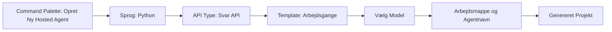
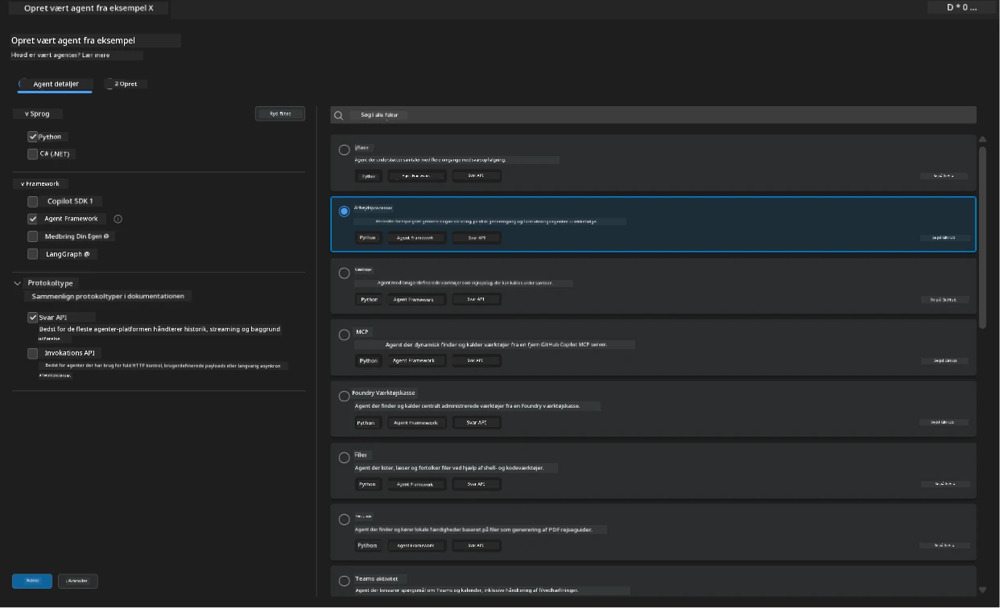
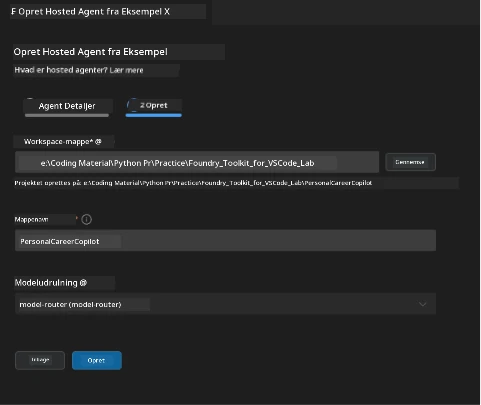

# Modul 2 - Scaffold multi-agent projektet

⏱️ ~5 min

I dette modul bruger du [Foundry Toolkit for VS Code](https://aka.ms/foundrytk) til at **scaffold'e et multi-agent projekt**. Guiden genererer `agent.yaml`, `main.py`, `Dockerfile`, `requirements.txt`, `.env` og VS Code debug-konfiguration - så du kan fokusere på at koble 4-agent workflowet i Modul 3.

> **Hovedkoncept:** Scaffolden er en fungerende stub med én agent. Du erstatter standardlogikken med `WorkflowBuilder` grafen i Modul 3. Du skal ikke skrive standardkode fra bunden.

> **Referenceimplementering:** [`PersonalCareerCopilot/`](../../../../../workshop/lab02-multi-agent/PersonalCareerCopilot) er et komplet fungerende eksempel. Brug det til at sammenligne dit arbejde undervejs.

### Scaffold-guide flow


```mermaid
flowchart LR
    A[Command Palette: Opret Ny Hosted Agent] --> B[Sprog: Python]
    B --> C[API Type: Svar API]
    C --> D[Template: Arbejdsgange]
    D --> E[Vælg Model]
    E --> F[Arbejdsmappe og Agentnavn]
    F --> G[Genereret Projekt]
```

---

## Trin 1: Åbn Create Hosted Agent guiden

1. Tryk `Ctrl+Shift+P` for at åbne **Command Palette**.
2. Skriv: **Foundry Toolkit: Create a New Hosted Agent** og vælg den.
3. Guiden åbner på fanen **Agent Details**.

> **Alternativ:** Klik på **Foundry Toolkit**-ikonet i Aktivitetslinjen → klik på **+** ikonet ved siden af **Hosted Agents** → **Create New Hosted Agent**.

---

## Trin 2: Vælg indstillinger



1. I venstre navigation/indstillingssektion vælg følgende:

| Menu | Valg | Noter |
|--------|-----------|-------|
| **Sprog** | Python | C# (.NET) understøttes også |
| **Framework** | Agent Framework | Leverer `Agent`, `AgentExecutor`, `WorkflowBuilder` |
| **API-type** | Response API | `POST /responses` - platform-styret historik, streaming support |
| **Skabelon** | **Workflows** | Behandler forespørgsler gennem flere agenter i rækkefølge |

2. Når valgt, klik **Next**



3. I det næste vindue, vælg følgende:

| Menu | Valg | Noter |
|--------|-----------|-------|
| **Arbejdsmappe** | Gennemse til målmappe | fx `workshop/lab02-multi-agent/` i dette repo |
| **Agent navn** | `PersonalCareerCopilot` | Bliver projektets mappenavn |
| **Model Deployment** | Vælg din deployerede model | fx `gpt-4.1-mini` fra Lab 01 |

4. Klik **Create** for at scaffold'e projektet. VS Code genererer filerne og åbner mappen.

> **Tip:** [`gpt-4.1-mini`](https://learn.microsoft.com/azure/foundry/foundry-models/concepts/models-sold-directly-by-azure#gpt-41-series) balancerer hastighed og kvalitet godt til multi-agent udvikling.

---

## Trin 3: Inspicer det genererede projekt

Efter scaffold er færdig, bekræft at du ser disse filer i Explorer (`Ctrl+Shift+E`):

```
📂 <your-agent-name>/
├── .azdignore          ← Files excluded from Azure Developer CLI deployments
├── .dockerignore       ← Files excluded from Docker builds
├── .env                ← Environment variables (placeholders - fill in Module 3)
├── .vscode/
│   ├── launch.json     ← Debug config (F5 → run + Agent Inspector)
│   └── tasks.json      ← VS Code task definitions
├── agent.yaml          ← Agent definition (kind: hosted, protocol: responses)
├── Dockerfile          ← Container config for deployment
├── main.py             ← Stub agent entry point (replace with WorkflowBuilder in Module 3)
└── requirements.txt    ← Python dependencies
```

> **Vigtigt:** Åbn denne scaffoldede mappe direkte i VS Code så `.vscode/launch.json` og `tasks.json` anvendes korrekt til F5 debugging.

### Forklaring af nøglefiler

| Fil | Formål |
|------|---------|
| `agent.yaml` | Angiver `kind: hosted`, kortlægger miljøvariabler, definerer `/responses` protokol |
| `main.py` | Stub: en `FoundryChatClient` → `Agent` → `ResponsesHostServer`. Du erstatter denne med 4 agenter + `WorkflowBuilder` i Modul 3 |
| `Dockerfile` | `python:3.12-slim`, installerer `requirements.txt`, eksponerer port 8088, kører `python main.py` |
| `requirements.txt` | `agent-framework-foundry`, `agent-framework-foundry-hosting`, `mcp<2,>=1.24.0`, `debugpy` |

> **Reference:** Se [`PersonalCareerCopilot/agent.yaml`](../../../../../workshop/lab02-multi-agent/PersonalCareerCopilot/agent.yaml) og [`PersonalCareerCopilot/requirements.txt`](../../../../../workshop/lab02-multi-agent/PersonalCareerCopilot/requirements.txt) for det komplette genererede indhold.

---

### ✅ Tjekliste

- [ ] Guiden til scaffold er gennemført - ny projektmappe er synlig i Explorer
- [ ] Alle forventede filer til stede: `agent.yaml`, `main.py`, `Dockerfile`, `requirements.txt`, `.env`
- [ ] `agent.yaml` viser `kind: hosted` og `protocol: responses`
- [ ] `main.py` importerer `Agent`, `FoundryChatClient`, `ResponsesHostServer`
- [ ] Scaffoldet mappe er åben som VS Code arbejdsroden
- [ ] Du forstår at `main.py` er en stub - `WorkflowBuilder` tilføjes i Modul 3

---

**Forrige:** [01 - Forstå Multi-Agent Arkitektur](01-understand-multi-agent.md) · **Næste:** [03 - Konfigurer Agenter & Miljø →](03-configure-agents.md)

---

<!-- CO-OP TRANSLATOR DISCLAIMER START -->
**Ansvarsfraskrivelse**:
Dette dokument er blevet oversat ved hjælp af AI-oversættelsestjenesten [Co-op Translator](https://github.com/Azure/co-op-translator). Selvom vi bestræber os på nøjagtighed, skal du være opmærksom på, at automatiserede oversættelser kan indeholde fejl eller unøjagtigheder. Det originale dokument på dets oprindelige sprog bør betragtes som den autoritative kilde. For kritisk information anbefales professionel menneskelig oversættelse. Vi påtager os intet ansvar for misforståelser eller fejltolkninger, der opstår som følge af brugen af denne oversættelse.
<!-- CO-OP TRANSLATOR DISCLAIMER END -->