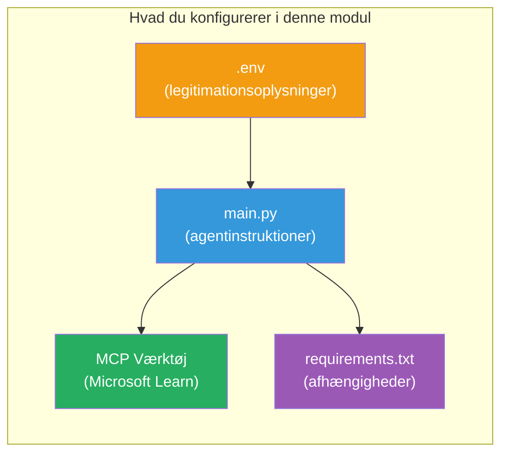

# Modul 3 - Konfigurer agenter, MCP-værktøj og miljø

I dette modul tilpasser du det skitserede multi-agent-projekt. Du skriver instruktioner til alle fire agenter, opsætter MCP-værktøjet til Microsoft Learn, konfigurerer miljøvariabler og installerer afhængigheder.


> **Reference:** Den komplette fungerende kode findes i [`PersonalCareerCopilot/main.py`](../../../../../workshop/lab02-multi-agent/PersonalCareerCopilot/main.py). Brug den som reference, mens du bygger dit eget.

---

## Trin 1: Konfigurer miljøvariabler

1. Åbn filen **`.env`** i dit projektrod.
2. Udfyld dine Foundry-projektdetaljer:

   ```env
   PROJECT_ENDPOINT=https://<your-account>.services.ai.azure.com/api/projects/<your-project>
   MODEL_DEPLOYMENT_NAME=gpt-4.1-mini
   ```

3. Gem filen.

### Hvor finder du disse værdier

| Værdi | Hvordan man finder den |
|-------|------------------------|
| **Projekt-endpoint** | Microsoft Foundry sidebjælke → klik på dit projekt → endpoint-URL i detaljevisningen |
| **Modeldeploymentsnavn** | Foundry sidebjælke → udvid projektet → **Modeller + endpoints** → navn ved siden af deployet model |

> **Sikkerhed:** Committ aldrig `.env` til versionskontrol. Tilføj det til `.gitignore`, hvis det ikke allerede er der.

### Kortlægning af miljøvariabler

Multi-agent `main.py` læser både standard og workshop-specifikke miljøvariabelnavne:

```python
PROJECT_ENDPOINT = os.getenv("AZURE_AI_PROJECT_ENDPOINT") or os.getenv("PROJECT_ENDPOINT")
MODEL_DEPLOYMENT_NAME = os.getenv(
    "AZURE_AI_MODEL_DEPLOYMENT_NAME",
    os.getenv("MODEL_DEPLOYMENT_NAME", "gpt-4.1-mini"),
)
MICROSOFT_LEARN_MCP_ENDPOINT = os.getenv(
    "MICROSOFT_LEARN_MCP_ENDPOINT", "https://learn.microsoft.com/api/mcp"
)
```

MCP-endpointet har en fornuftig standard - du behøver ikke sætte det i `.env`, medmindre du vil tilsidesætte det.

---

## Trin 2: Skriv agentinstruktioner

Dette er det mest kritiske trin. Hver agent har brug for omhyggeligt udformede instruktioner, der definerer dens rolle, outputformat og regler. Åbn `main.py` og opret (eller rediger) instruktionskonstanterne.

### 2.1 Resume Parser Agent

```python
RESUME_PARSER_INSTRUCTIONS = """\
You are the Resume Parser.
Extract resume text into a compact, structured profile for downstream matching.

Output exactly these sections:
1) Candidate Profile
2) Technical Skills (grouped categories)
3) Soft Skills
4) Certifications & Awards
5) Domain Experience
6) Notable Achievements

Rules:
- Use only explicit or strongly implied evidence.
- Do not invent skills, titles, or experience.
- Keep concise bullets; no long paragraphs.
- If input is not a resume, return a short warning and request resume text.
"""
```

**Hvorfor disse afsnit?** MatchingAgent har brug for strukturerede data til at score på. Konsistente afsnit gør overlevering mellem agenter pålidelig.

### 2.2 Job Description Agent

```python
JOB_DESCRIPTION_INSTRUCTIONS = """\
You are the Job Description Analyst.
Extract a structured requirement profile from a JD.

Output exactly these sections:
1) Role Overview
2) Required Skills
3) Preferred Skills
4) Experience Required
5) Certifications Required
6) Education
7) Domain / Industry
8) Key Responsibilities

Rules:
- Keep required vs preferred clearly separated.
- Only use what the JD states; do not invent hidden requirements.
- Flag vague requirements briefly.
- If input is not a JD, return a short warning and request JD text.
"""
```

**Hvorfor separat krav vs. foretrukne?** MatchingAgent bruger forskellig vægtning for hver (Kravfærdigheder = 40 point, Foretrukne færdigheder = 10 point).

### 2.3 Matching Agent

```python
MATCHING_AGENT_INSTRUCTIONS = """\
You are the Matching Agent.
Compare parsed resume output vs JD output and produce an evidence-based fit report.

Scoring (100 total):
- Required Skills 40
- Experience 25
- Certifications 15
- Preferred Skills 10
- Domain Alignment 10

Output exactly these sections:
1) Fit Score (with breakdown math)
2) Matched Skills
3) Missing Skills
4) Partially Matched
5) Experience Alignment
6) Certification Gaps
7) Overall Assessment

Rules:
- Be objective and evidence-only.
- Keep partial vs missing separate.
- Keep Missing Skills precise; it feeds roadmap planning.
"""
```

**Hvorfor eksplicit score?** Reproducerbar scoring gør det muligt at sammenligne køringer og fejlsøge problemer. 100-pointsskalaen er nem for slutbrugere at forstå.

### 2.4 Gap Analyzer Agent

```python
GAP_ANALYZER_INSTRUCTIONS = """\
You are the Gap Analyzer and Roadmap Planner.
Create a practical upskilling plan from the matching report.

Microsoft Learn MCP usage (required):
- For EVERY High and Medium priority gap, call tool `search_microsoft_learn_for_plan`.
- Use returned Learn links in Suggested Resources.
- Prefer Microsoft Learn for free resources.

CRITICAL: You MUST produce a SEPARATE detailed gap card for EVERY skill listed in
the Missing Skills and Certification Gaps sections of the matching report. Do NOT
skip or combine gaps. Do NOT summarize multiple gaps into one card.

Output format:
1) Personalized Learning Roadmap for [Role Title]
2) One DETAILED card per gap (produce ALL cards, not just the first):
   - Skill
   - Priority (High/Medium/Low)
   - Current Level
   - Target Level
   - Suggested Resources (include Learn URL from tool results)
   - Estimated Time
   - Quick Win Project
3) Recommended Learning Order (numbered list)
4) Timeline Summary (week-by-week)
5) Motivational Note

Rules:
- Produce every gap card before writing the summary sections.
- Keep it specific, realistic, and actionable.
- Tailor to candidate's existing stack.
- If fit >= 80, focus on polish/interview readiness.
- If fit < 40, be honest and provide a staged path.
"""
```

**Hvorfor "KRISE"-betoning?** Uden eksplicit instruktion om at producere ALLE gap-kort har modellen en tendens til kun at generere 1-2 kort og opsummere resten. "KRISE"-blokken forhindrer denne afkortning.

---

## Trin 3: Definer MCP-værktøjet

GapAnalyzer bruger et værktøj, der kalder [Microsoft Learn MCP-serveren](https://learn.microsoft.com/azure/foundry/agents/how-to/tools/model-context-protocol). Tilføj dette til `main.py`:

```python
import json
from agent_framework import tool
from mcp.client.session import ClientSession
from mcp.client.streamable_http import streamable_http_client

@tool
async def search_microsoft_learn_for_plan(
    skill: str, role: str = "", max_results: int = 5
) -> str:
    """Search Microsoft Learn MCP and return curated official links for roadmap planning."""
    query = " ".join(part for part in [skill, role, "learning path module"] if part).strip()
    query = query or "job skills learning path"

    try:
        async with streamable_http_client(MICROSOFT_LEARN_MCP_ENDPOINT) as (
            read_stream, write_stream, _,
        ):
            async with ClientSession(read_stream, write_stream) as session:
                await session.initialize()
                result = await session.call_tool(
                    "microsoft_docs_search", {"query": query}
                )

        if not result.content:
            return (
                "No results returned from Microsoft Learn MCP. "
                "Fallback: https://learn.microsoft.com/training/support/catalog-api"
            )

        payload_text = getattr(result.content[0], "text", "")
        data = json.loads(payload_text) if payload_text else {}
        items = data.get("results", [])[:max(1, min(max_results, 10))]

        if not items:
            return f"No direct Microsoft Learn results found for '{skill}'."

        lines = [f"Microsoft Learn resources for '{skill}':"]
        for i, item in enumerate(items, start=1):
            title = item.get("title") or item.get("url") or "Microsoft Learn Resource"
            url = item.get("url") or item.get("link") or ""
            lines.append(f"{i}. {title} - {url}".rstrip(" -"))
        return "\n".join(lines)
    except Exception as ex:
        return (
            f"Microsoft Learn MCP lookup unavailable. Reason: {ex}. "
            "Fallbacks: https://learn.microsoft.com/api/mcp"
        )
```

### Sådan fungerer værktøjet

| Trin | Hvad sker der |
|------|--------------|
| 1 | GapAnalyzer beslutter at den har brug for ressourcer til en færdighed (f.eks. "Kubernetes") |
| 2 | Frameworket kalder `search_microsoft_learn_for_plan(skill="Kubernetes")` |
| 3 | Funktionen åbner [Streamable HTTP](https://learn.microsoft.com/agent-framework/agents/tools/hosted-mcp-tools) forbindelse til `https://learn.microsoft.com/api/mcp` |
| 4 | Kalder `microsoft_docs_search` på [MCP-serveren](https://learn.microsoft.com/azure/foundry/agents/how-to/tools/model-context-protocol) |
| 5 | MCP-server returnerer søgeresultater (titel + URL) |
| 6 | Funktionen formaterer resultater som en nummereret liste |
| 7 | GapAnalyzer integrerer URL’erne i gap-kortet |

### MCP-afhængigheder

MCP-klientbibliotekerne er inkluderet transitivt via [`agent-framework-core`](https://learn.microsoft.com/agent-framework/overview/). Du behøver **ikke** at tilføje dem separat i `requirements.txt`. Hvis du får importfejl, tjek følgende:

```powershell
pip list | Select-String "mcp"
```

Forventet: `mcp`-pakken er installeret (version 1.x eller nyere).

---

## Trin 4: Kobl agenter og workflow sammen

### 4.1 Opret agenter med context managers

```python
from contextlib import asynccontextmanager

@asynccontextmanager
async def create_agents():
    async with (
        get_credential() as credential,
        AzureAIAgentClient(
            project_endpoint=PROJECT_ENDPOINT,
            model_deployment_name=MODEL_DEPLOYMENT_NAME,
            credential=credential,
        ).as_agent(
            name="ResumeParser",
            instructions=RESUME_PARSER_INSTRUCTIONS,
        ) as resume_parser,
        AzureAIAgentClient(
            project_endpoint=PROJECT_ENDPOINT,
            model_deployment_name=MODEL_DEPLOYMENT_NAME,
            credential=credential,
        ).as_agent(
            name="JobDescriptionAgent",
            instructions=JOB_DESCRIPTION_INSTRUCTIONS,
        ) as jd_agent,
        AzureAIAgentClient(
            project_endpoint=PROJECT_ENDPOINT,
            model_deployment_name=MODEL_DEPLOYMENT_NAME,
            credential=credential,
        ).as_agent(
            name="MatchingAgent",
            instructions=MATCHING_AGENT_INSTRUCTIONS,
        ) as matching_agent,
        AzureAIAgentClient(
            project_endpoint=PROJECT_ENDPOINT,
            model_deployment_name=MODEL_DEPLOYMENT_NAME,
            credential=credential,
        ).as_agent(
            name="GapAnalyzer",
            instructions=GAP_ANALYZER_INSTRUCTIONS,
            tools=[search_microsoft_learn_for_plan],
        ) as gap_analyzer,
    ):
        yield resume_parser, jd_agent, matching_agent, gap_analyzer
```

**Vigtige punkter:**
- Hver agent har sin **egen** `AzureAIAgentClient`-instans
- Kun GapAnalyzer får `tools=[search_microsoft_learn_for_plan]`
- `get_credential()` returnerer [`ManagedIdentityCredential`](https://learn.microsoft.com/python/api/overview/azure/identity-readme#managed-identity-support) i Azure, [`DefaultAzureCredential`](https://learn.microsoft.com/azure/developer/python/sdk/authentication/credential-chains#defaultazurecredential-overview) lokalt

### 4.2 Byg workflow-grafen

```python
def create_workflow(resume_parser, jd_agent, matching_agent, gap_analyzer):
    workflow = (
        WorkflowBuilder(
            name="ResumeJobFitEvaluator",
            start_executor=resume_parser,
            output_executors=[gap_analyzer],
        )
        .add_edge(resume_parser, jd_agent)
        .add_edge(resume_parser, matching_agent)
        .add_edge(jd_agent, matching_agent)
        .add_edge(matching_agent, gap_analyzer)
        .build()
    )
    return workflow.as_agent()
```

> Se [Workflows as Agents](https://learn.microsoft.com/agent-framework/workflows/as-agents) for at forstå `.as_agent()`-mønstret.

### 4.3 Start serveren

```python
async def main() -> None:
    validate_configuration()
    async with create_agents() as (resume_parser, jd_agent, matching_agent, gap_analyzer):
        agent = create_workflow(resume_parser, jd_agent, matching_agent, gap_analyzer)
        from azure.ai.agentserver.agentframework import from_agent_framework
        await from_agent_framework(agent).run_async()

if __name__ == "__main__":
    asyncio.run(main())
```

---

## Trin 5: Opret og aktiver det virtuelle miljø

### 5.1 Opret miljøet

```powershell
cd workshop\lab02-multi-agent\PersonalCareerCopilot
python -m venv .venv
```

### 5.2 Aktivér det

**PowerShell (Windows):**
```powershell
.\.venv\Scripts\Activate.ps1
```

**macOS/Linux:**
```bash
source .venv/bin/activate
```

### 5.3 Installer afhængigheder

```powershell
pip install -r requirements.txt
```

> **Note:** Linjen `agent-dev-cli --pre` i `requirements.txt` sikrer, at den nyeste preview-version installeres. Dette er påkrævet for kompatibilitet med `agent-framework-core==1.0.0rc3`.

### 5.4 Verify installation

```powershell
pip list | Select-String "agent-framework|agentserver|agent-dev"
```

Forventet output:
```
agent-dev-cli                  0.0.1b260316
agent-framework-azure-ai       1.0.0rc3
agent-framework-core            1.0.0rc3
azure-ai-agentserver-agentframework 1.0.0b16
azure-ai-agentserver-core      1.0.0b16
```

> **Hvis `agent-dev-cli` viser en ældre version** (f.eks. `0.0.1b260119`), vil Agent Inspector fejle med 403/404 fejl. Opgrader: `pip install agent-dev-cli --pre --upgrade`

---

## Trin 6: Verificer godkendelse

Kør den samme autorisationstest som i Lab 01:

```powershell
az account show --query "{name:name, id:id}" --output table
```

Hvis denne fejler, kør [`az login`](https://learn.microsoft.com/cli/azure/authenticate-azure-cli-interactively).

For multi-agent workflows deler alle fire agenter samme legitimation. Hvis godkendelse virker for én, virker det for alle.

---

### Checkpoint

- [ ] `.env` har gyldige værdier for `PROJECT_ENDPOINT` og `MODEL_DEPLOYMENT_NAME`
- [ ] Alle 4 agentinstruktionskonstanter er defineret i `main.py` (ResumeParser, JD Agent, MatchingAgent, GapAnalyzer)
- [ ] MCP-værktøjet `search_microsoft_learn_for_plan` er defineret og registreret hos GapAnalyzer
- [ ] `create_agents()` opretter alle 4 agenter med individuelle `AzureAIAgentClient`-instanser
- [ ] `create_workflow()` bygger det korrekte graf med `WorkflowBuilder`
- [ ] Det virtuelle miljø er oprettet og aktiveret (`(.venv)` synligt)
- [ ] `pip install -r requirements.txt` gennemføres uden fejl
- [ ] `pip list` viser alle forventede pakker i de korrekte versioner (rc3 / b16)
- [ ] `az account show` returnerer dit abonnement

---

**Forrige:** [02 - Scaffold Multi-Agent Project](02-scaffold-multi-agent.md) · **Næste:** [04 - Orchestration Patterns →](04-orchestration-patterns.md)

---

<!-- CO-OP TRANSLATOR DISCLAIMER START -->
**Ansvarsfraskrivelse**:
Dette dokument er blevet oversat ved hjælp af AI-oversættelsestjenesten [Co-op Translator](https://github.com/Azure/co-op-translator). Selvom vi bestræber os på nøjagtighed, bedes du være opmærksom på, at automatiske oversættelser kan indeholde fejl eller unøjagtigheder. Det oprindelige dokument på dets oprindelige sprog bør betragtes som den autoritative kilde. For vigtig information anbefales professionel menneskelig oversættelse. Vi påtager os intet ansvar for misforståelser eller fejltolkninger, der måtte opstå som følge af brugen af denne oversættelse.
<!-- CO-OP TRANSLATOR DISCLAIMER END -->