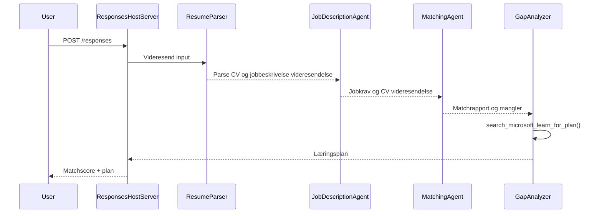

# Modul 3 - Konfigurer instruktioner, miljø & installer afhængigheder

⏱️ ~15 min

I dette modul omdanner du den scaffoldede stub til **din** multi-agent workflow - ved at sætte miljøvariabler, skrive agentinstruktioner, tilføje MCP-værktøjet, forbinde workflow-grafen og installere afhængigheder.

> **Reference:** Den komplette fungerende kode er i [`PersonalCareerCopilot/main.py`](../../../../../workshop/lab02-multi-agent/PersonalCareerCopilot/main.py). Brug den som reference, mens du bygger din egen workflow-graf og promptblokke.

---

## Hvordan de fire agenter passer sammen


```mermaid
sequenceDiagram
    participant User
    participant Server as ResponsesHostServer
    participant RP as ResumeParser
    participant JD as JobDescriptionAgent
    participant MA as MatchingAgent
    participant GA as GapAnalyzer

    User->>Server: POST /responses
    Server->>RP: Videresend input
    RP-->>JD: Parse CV og jobbeskrivelse videresendelse
    JD-->>MA: Jobkrav og CV videresendelse
    MA-->>GA: Matchrapport og mangler
    GA->>GA: search_microsoft_learn_for_plan()
    GA-->>Server: Læringsplan
    Server-->>User: Matchscore + plan
```

---

## Trin 1: Konfigurer miljøvariabler

1. Åbn **`.env`**-filen i dit projekt rod (oprettet af scaffold-guiden).
2. Erstat pladsmarkørerne med dine faktiske værdier fra Lab 01.

<details open>
<summary><strong>🅰️ Vej A - Foundry abonnement</strong></summary>

```env
FOUNDRY_PROJECT_ENDPOINT=https://<your-account>.services.ai.azure.com/api/projects/<your-project>
AZURE_AI_MODEL_DEPLOYMENT_NAME=gpt-4.1-mini
```

> **Hvor findes værdierne:** Se [Lab 01, Modul 1](../../lab01-single-agent/docs/01-setup.md#deploy-a-model--assign-rbac).

</details>

<details open>
<summary><strong>🅱️ Vej B - Foundry Local</strong></summary>

```env
FOUNDRY_PROJECT_ENDPOINT=http://localhost:5273/v1
AZURE_AI_MODEL_DEPLOYMENT_NAME=phi-4-mini
```

> Al inferens foregår på din maskine - ingen data forlader din enhed. Kør `foundry model list` for at bekræfte den præcise modelalias. Den eneste udgående forespørgsel er MCP-værktøjskaldet til `https://learn.microsoft.com/api/mcp`.

> **Hvor findes værdierne:** Se [Lab 01, Modul 1 - lokal vej](../../lab01-single-agent/docs/01-setup.md#step-2-set-up-based-on-your-access).

</details>

> **Sikkerhed:** Begå aldrig `.env` til versionskontrol. Det bør allerede være i `.gitignore`.

---

## Trin 2: Skriv agentinstruktioner

Instruktioner definerer hver agents rolle, outputformat og regler. Åbn `main.py` og definer (eller erstat) de fire instruktionskonstanter - de komplette strenge er i [`PersonalCareerCopilot/main.py`](../../../../../workshop/lab02-multi-agent/PersonalCareerCopilot/main.py).

### 2.1 `RESUME_PARSER_INSTRUCTIONS`
Parser CV'et til en struktureret kandidatprofil **og** kopierer jobbeskrivelsen ordret ind i `[JOB DESCRIPTION PASS-THROUGH]`. Begge mærkede sektioner skal vises i outputtet.

> **Hvorfor pass-through?** Med `context_mode="last_agent"` er ResumeParser den **eneste** agent, der ser den oprindelige brugermeddelelse. Hvis den ikke kopierer jobbeskrivelsen videre, ser de efterfølgende agenter den aldrig.

### 2.2 `JOB_DESCRIPTION_INSTRUCTIONS`
Læser `[PARSED RESUME]` og `[JOB DESCRIPTION PASS-THROUGH]` fra ResumeParser output. Outputter `[JD REQUIREMENTS]` (strukturerede krav) og `[PARSED RESUME PASS-THROUGH]` (ordret CV-kopi til MatchingAgent).

### 2.3 `MATCHING_AGENT_INSTRUCTIONS`
Læser `[JD REQUIREMENTS]` og `[PARSED RESUME PASS-THROUGH]`. Producerer en scoret fit-rapport (0–100) med opdelingsberegning, matchede færdigheder, manglende færdigheder og erfaringsjustering.

### 2.4 `GAP_ANALYZER_INSTRUCTIONS`
Læser fit-rapporten. For **hver** manglende færdighed kalder den `search_microsoft_learn_for_plan` for at hente Microsoft Learn ressourcer. Producerer ét detaljeret gap-kort pr. færdighed plus en uge-for-uge læringsplan.

---

## Trin 3: Tilføj MCP-værktøjet

GapAnalyzer kalder [Microsoft Learn MCP-serveren](https://learn.microsoft.com/azure/foundry/agents/how-to/tools/model-context-protocol) for at hente reelle læringsressourcer for hvert færdighedsgab. Den fulde `search_microsoft_learn_for_plan` funktion er i [`PersonalCareerCopilot/main.py`](../../../../../workshop/lab02-multi-agent/PersonalCareerCopilot/main.py).

Registrer værktøjet på GapAnalyzer, når agenten oprettes:

```python
gap_analyzer = Agent(
    client=client,
    instructions=GAP_ANALYZER_INSTRUCTIONS,
    name="GapAnalyzer",
    tools=[search_microsoft_learn_for_plan],
)
```

> Se [`PersonalCareerCopilot/main.py`](../../../../../workshop/lab02-multi-agent/PersonalCareerCopilot/main.py) for den komplette `WorkflowBuilder` graf med `FoundryChatClient`, `AgentExecutor` og alle `add_edge()` kald.

---

## Trin 4: Opret virtuelt miljø & installer afhængigheder

> ⚠️ **Spring ikke dette trin over.** Uden installerede afhængigheder mislykkes F5-fejlsøgning.

### 4.1 Opret det virtuelle miljø

```powershell
python -m venv .venv
```

### 4.2 Aktivér det

| OS | Kommando |
|----|----------|
| **Windows (PowerShell)** | `.\.venv\Scripts\Activate.ps1` |
| **Windows (CMD)** | `.venv\Scripts\activate.bat` |
| **macOS / Linux** | `source .venv/bin/activate` |

Du bør se `(.venv)` i din terminalprompt.

### 4.3 Installer afhængigheder

```powershell
pip install -r requirements.txt
```

### 4.4 Verificér

```powershell
pip list | Select-String "agent-framework|mcp|debugpy"
```

Forventet: `agent-framework-foundry`, `agent-framework-foundry-hosting`, `mcp`, og `debugpy` er listet.

---

## Trin 5: Verificér autentificering

<details open>
<summary><strong>🅰️ Vej A - Azure legitiationsoplysninger</strong></summary>

```powershell
az account show --query "{name:name, id:id}" --output table
```

Hvis dette fejler, kør [`az login`](https://learn.microsoft.com/cli/azure/authenticate-azure-cli-interactively).

Alle fire agenter deler én `FoundryChatClient` og én `DefaultAzureCredential`. Hvis autentificering virker for én, virker den for alle.

</details>

<details open>
<summary><strong>🅱️ Vej B - Foundry Local</strong></summary>

Ingen autentificering kræves til lokal testning.

</details>

---

### ✅ Tjekpunkt

> Gå **ikke** videre til Modul 04 før: **(1)** `(.venv)` er synlig i din prompt OG **(2)** `pip install -r requirements.txt` er fuldført uden fejl.

- [ ] `.env` har gyldigt endpoint og model deployment navn (ikke pladsmarkører)
- [ ] Alle 4 agentinstruktionskonstanter defineret i `main.py` (ResumeParser, JD Agent, MatchingAgent, GapAnalyzer)
- [ ] `search_microsoft_learn_for_plan` MCP-værktøj defineret og registreret på GapAnalyzer
- [ ] `FoundryChatClient` + 4 `Agent` + 4 `AgentExecutor` objekter oprettet i `main()`
- [ ] `WorkflowBuilder` bygger den korrekte sekventielle graf med alle 3 `add_edge()` kald
- [ ] Virtuelt miljø oprettet og aktiveret (`(.venv)` synlig i prompt)
- [ ] `pip install -r requirements.txt` gennemført uden fejl
- [ ] **Vej A:** `az account show` lykkes ELLER VS Code Kontoikon viser indlogget konto

---

**Forrige:** [02 - Scaffold Multi-Agent Project](02-scaffold-multi-agent.md) · **Næste:** [04 - Orchestreringsmønstre →](04-orchestration-patterns.md)

---

<!-- CO-OP TRANSLATOR DISCLAIMER START -->
**Ansvarsfraskrivelse**:
Dette dokument er blevet oversat ved hjælp af AI-oversættelsestjenesten [Co-op Translator](https://github.com/Azure/co-op-translator). Selvom vi bestræber os på nøjagtighed, skal du være opmærksom på, at automatiserede oversættelser kan indeholde fejl eller unøjagtigheder. Det originale dokument på dets oprindelige sprog bør betragtes som den autoritative kilde. For kritisk information anbefales professionel menneskelig oversættelse. Vi påtager os intet ansvar for misforståelser eller fejltolkninger, der opstår som følge af brugen af denne oversættelse.
<!-- CO-OP TRANSLATOR DISCLAIMER END -->