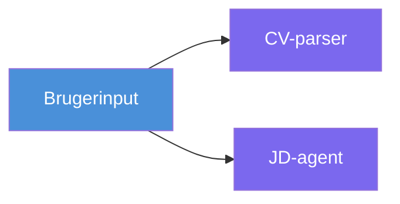
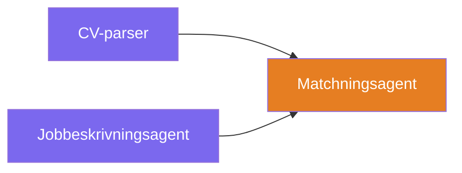
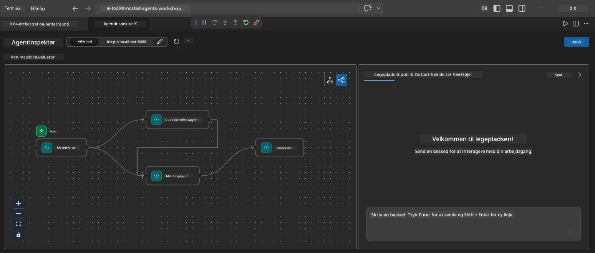
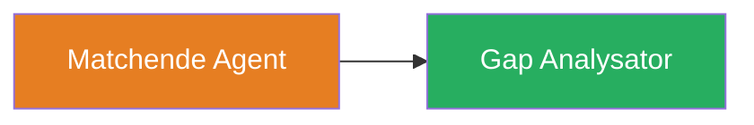
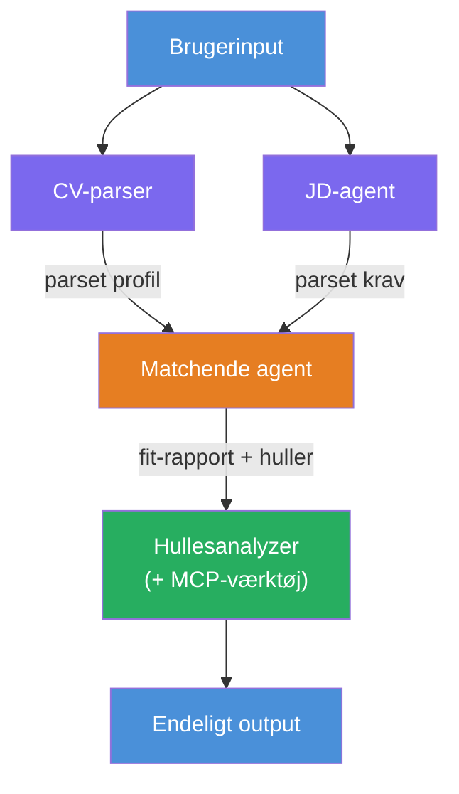
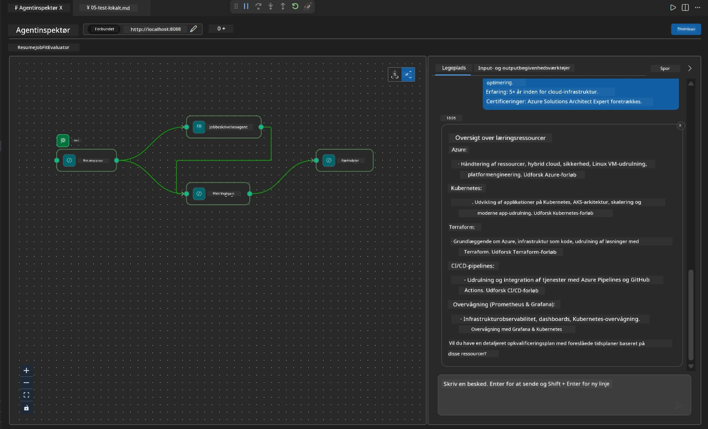

# Module 4 - Orkestreringsmønstre

I denne modul udforsker du orkestreringsmønstrene, der bruges i Resume Job Fit Evaluator, og lærer, hvordan du læser, ændrer og udvider workflow-grafen. Forståelse af disse mønstre er afgørende for at fejlfinde dataflowproblemer og bygge dine egne [multi-agent workflows](https://learn.microsoft.com/agent-framework/workflows/).

---

## Mønster 1: Fan-out (parallel opdeling)

Det første mønster i workflowet er **fan-out** - en enkelt input sendes til flere agenter samtidig.


I kode sker dette, fordi `resume_parser` er `start_executor` - det modtager brugermeddelelsen først. Derefter, fordi både `jd_agent` og `matching_agent` har kanter fra `resume_parser`, ruter frameworket `resume_parser`'s output til begge agenter:

```python
.add_edge(resume_parser, jd_agent)         # ResumeParser output → JD Agent
.add_edge(resume_parser, matching_agent)   # ResumeParser output → MatchingAgent
```

**Hvorfor dette virker:** ResumeParser og JD Agent behandler forskellige aspekter af samme input. At køre dem parallelt reducerer den samlede latenstid sammenlignet med at køre dem sekventielt.

### Hvornår man bruger fan-out

| Anvendelsestilfælde | Eksempel |
|---------------------|----------|
| Uafhængige undertasker | Parsing af CV vs. parsing af JD |
| Redundans / afstemning | To agenter analyserer de samme data, en tredje vælger det bedste svar |
| Multi-format output | En agent genererer tekst, en anden genererer struktureret JSON |

---

## Mønster 2: Fan-in (aggregering)

Det andet mønster er **fan-in** - flere agent-output samles og sendes til en enkelt downstream-agent.


I kode:

```python
.add_edge(resume_parser, matching_agent)   # ResumeParser output → MatchingAgent
.add_edge(jd_agent, matching_agent)        # JD Agent output → MatchingAgent
```

**Nøgleadfærd:** Når en agent har **to eller flere indkommende kanter**, venter frameworket automatisk på, at **alle** upstream-agenter er færdige, før downstream-agenten køres. MatchingAgent starter ikke, før både ResumeParser og JD Agent er færdige.

### Hvad MatchingAgent modtager

Frameworket sammenkæder output fra alle upstream-agenter. MatchingAgents input ser således ud:

```
[ResumeParser output]
---
Candidate Profile:
  Name: Jane Doe
  Technical Skills: Python, Azure, Kubernetes, ...
  ...

[JobDescriptionAgent output]
---
Role Overview: Senior Cloud Engineer
Required Skills: Python, Azure, Terraform, ...
...
```

> **Note:** Det præcise sammenkædningsformat afhænger af frameworkets version. Agentens instruktioner bør skrives til at håndtere både struktureret og ustruktureret upstream-output.



---

## Mønster 3: Sekventiel kæde

Det tredje mønster er **sekventiel kædning** - én agents output fødes direkte til den næste.


I kode:

```python
.add_edge(matching_agent, gap_analyzer)    # MatchingAgent output → GapAnalyzer
```

Dette er det simpleste mønster. GapAnalyzer modtager MatchingAgents fit-score, matchede/manglende færdigheder og mangler. Den kalder derefter [MCP værktøjet](https://learn.microsoft.com/azure/foundry/agents/how-to/tools/model-context-protocol) for hver mangel for at hente Microsoft Learn-ressourcer.

---

## Det komplette graf

Kombinationen af alle tre mønstre producerer det fulde workflow:


### Udførelsestidslinje

```mermaid
gantt
    title Agent Udførelsestidslinje
    dateFormat X
    axisFormat %s

    section Parallel
    Resume Parser       :rp, 0, 3
    JD Agent            :jd, 0, 2

    section Sekventiel
    Matching Agent      :ma, 3, 5
    Gap Analyzer        :ga, 5, 9
```


> Den samlede væg-ur tid er omtrent `max(ResumeParser, JD Agent) + MatchingAgent + GapAnalyzer`. GapAnalyzer er typisk den langsomste, fordi den foretager flere MCP værktøj-kald (et per mangel).

---

## Læsning af WorkflowBuilder-koden

Her er den komplette `create_workflow()` funktion fra `main.py` med annotationer:

```python
def create_workflow(resume_parser, jd_agent, matching_agent, gap_analyzer):
    workflow = (
        WorkflowBuilder(
            name="ResumeJobFitEvaluator",

            # Den første agent til at modtage brugerinput
            start_executor=resume_parser,

            # Agenten/agenternes output bliver det endelige svar
            output_executors=[gap_analyzer],
        )
        # Fan-ud: ResumeParser-output går til både JD Agent og MatchingAgent
        .add_edge(resume_parser, jd_agent)
        .add_edge(resume_parser, matching_agent)

        # Fan-ind: MatchingAgent venter på både ResumeParser og JD Agent
        .add_edge(jd_agent, matching_agent)

        # Sekventiel: MatchingAgent-output fodrer GapAnalyzer
        .add_edge(matching_agent, gap_analyzer)

        .build()
    )
    return workflow.as_agent()
```

### Kantsammenfatningstabel

| # | Kant | Mønster | Effekt |
|---|------|---------|--------|
| 1 | `resume_parser → jd_agent` | Fan-out | JD Agent modtager ResumeParsers output (plus den originale brugerinput) |
| 2 | `resume_parser → matching_agent` | Fan-out | MatchingAgent modtager ResumeParsers output |
| 3 | `jd_agent → matching_agent` | Fan-in | MatchingAgent modtager også JD Agents output (venter på begge) |
| 4 | `matching_agent → gap_analyzer` | Sekventiel | GapAnalyzer modtager fit-rapport + mangelliste |

---

## Ændring af graf

### Tilføjelse af en ny agent

For at tilføje en femte agent (f.eks. en **InterviewPrepAgent**, der genererer interviewspørgsmål baseret på mangelanalyse):

```python
# 1. Definer instruktioner
INTERVIEW_PREP_INSTRUCTIONS = """\
You are the Interview Prep Agent.
Given a gap analysis and fit report, generate 10 targeted interview questions
the candidate should prepare for.
"""

# 2. Opret agenten (inden i async with-blokken)
AzureAIAgentClient(
    project_endpoint=PROJECT_ENDPOINT,
    model_deployment_name=MODEL_DEPLOYMENT_NAME,
    credential=credential,
).as_agent(
    name="InterviewPrepAgent",
    instructions=INTERVIEW_PREP_INSTRUCTIONS,
) as interview_prep,

# 3. Tilføj kanter i create_workflow()
.add_edge(matching_agent, interview_prep)   # modtager fit rapport
.add_edge(gap_analyzer, interview_prep)     # modtager også gap kort

# 4. Opdater output_executors
output_executors=[interview_prep],  # nu den endelige agent
```

### Ændring af udførelsesrækkefølge

For at få JD Agent til at køre **efter** ResumeParser (sekventielt i stedet for parallelt):

```python
# Fjern: .add_edge(resume_parser, jd_agent)  ← eksisterer allerede, behold det
# Fjern den implicitte parallelitet ved IKKE at lade jd_agent modtage brugerinput direkte
# start_executor sender til resume_parser først, og jd_agent modtager kun
# resume_parser's output via forbindelsen. Dette gør dem sekventielle.
```

> **Vigtigt:** `start_executor` er den eneste agent, der modtager den rå brugerinput. Alle andre agenter modtager output fra deres upstream-kanter. Hvis du ønsker, at en agent også modtager rå brugerinput, skal den have en kant fra `start_executor`.

---

## Almindelige graf-fejl

| Fejl | Symptom | Løsning |
|-------|---------|---------|
| Manglende kant til `output_executors` | Agent kører, men output er tomt | Sørg for, at der er en sti fra `start_executor` til hver agent i `output_executors` |
| Cirkulært afhængighed | Uendelig løkke eller timeout | Tjek at ingen agent fodrer tilbage til en upstream-agent |
| Agent i `output_executors` uden indkommende kant | Tomt output | Tilføj mindst én `add_edge(source, that_agent)` |
| Flere `output_executors` uden fan-in | Output indeholder kun én agents svar | Brug en enkelt output-agent, der aggregerer, eller accepter flere output |
| Manglende `start_executor` | `ValueError` ved byggetid | Angiv altid `start_executor` i `WorkflowBuilder()` |

---

## Fejlretning af grafen

### Brug af Agent Inspector

1. Start agenten lokalt (F5 eller terminal - se [Module 5](05-test-locally.md)).
2. Åbn Agent Inspector (`Ctrl+Shift+P` → **Foundry Toolkit: Open Agent Inspector**).
3. Send en testbesked.
4. I Inspectors svarpanel, se efter **streaming output** - den viser hver agents bidrag i rækkefølge.



### Brug af logging

Tilføj logging til `main.py` for at spore dataflow:

```python
import logging
logger = logging.getLogger("resume-job-fit")

# I create_workflow(), efter opbygning:
logger.info("Workflow graph built with edges: RP→JD, RP→MA, JD→MA, MA→GA")
```

Server-loggene viser agentkørselsrækkefølge og MCP værktøj-kald:

```
INFO:resume-job-fit:Starting Resume -> Job Fit Evaluator HTTP server...
INFO:resume-job-fit:Server running on http://localhost:8088
INFO:agent_framework:Executing agent: ResumeParser
INFO:agent_framework:Executing agent: JobDescriptionAgent
INFO:agent_framework:Waiting for upstream agents: ResumeParser, JobDescriptionAgent
INFO:agent_framework:Executing agent: MatchingAgent
INFO:agent_framework:Executing agent: GapAnalyzer
INFO:agent_framework:Tool call: search_microsoft_learn_for_plan(skill="Kubernetes")
POST https://learn.microsoft.com/api/mcp → 200
INFO:agent_framework:Tool call: search_microsoft_learn_for_plan(skill="Terraform")
POST https://learn.microsoft.com/api/mcp → 200
```

---

### Tjekliste

- [ ] Du kan identificere de tre orkestreringsmønstre i workflowet: fan-out, fan-in og sekventiel kæde
- [ ] Du forstår, at agenter med multiple indkommende kanter venter på, at alle upstream-agenter er færdige
- [ ] Du kan læse `WorkflowBuilder`-koden og mappe hvert `add_edge()`-kald til den visuelle graf
- [ ] Du forstår udførelsestidslinjen: parallelle agenter kører først, så aggregering, dernæst sekventielt
- [ ] Du ved, hvordan man tilføjer en ny agent til grafen (definer instruktioner, opret agent, tilføj kanter, opdater output)
- [ ] Du kan identificere almindelige graf-fejl og deres symptomer

---

**Forrige:** [03 - Configure Agents & Environment](03-configure-agents.md) · **Næste:** [05 - Test Locally →](05-test-locally.md)

---

<!-- CO-OP TRANSLATOR DISCLAIMER START -->
**Ansvarsfraskrivelse**:  
Dette dokument er blevet oversat ved hjælp af AI-oversættelsesservicen [Co-op Translator](https://github.com/Azure/co-op-translator). Selvom vi bestræber os på nøjagtighed, bedes du være opmærksom på, at automatiserede oversættelser kan indeholde fejl eller unøjagtigheder. Det oprindelige dokument på dets oprindelige sprog bør betragtes som den autoritative kilde. For kritisk information anbefales professionel menneskelig oversættelse. Vi påtager os intet ansvar for misforståelser eller fejltolkninger, der måtte opstå ved brug af denne oversættelse.
<!-- CO-OP TRANSLATOR DISCLAIMER END -->