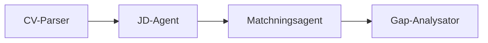
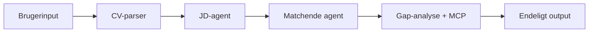

# Modul 4 - Orkestreringsmønstre

⏱️ ~10 min

I dette modul udforsker du orkestreringsmønstrene brugt i Resume Job Fit Evaluator og lærer, hvordan du læser, ændrer og udvider workflow-grafen. Forståelse af disse mønstre er essentielt for fejlretning af dataflowproblemer og opbygning af dine egne [multi-agent workflows](https://learn.microsoft.com/agent-framework/workflows/).

---

## Mønster 1: Sekventiel kæde

Det grundlæggende mønster i workflowet er en **sekventiel kæde** - hver agents output føres direkte videre til den næste.


```mermaid
flowchart LR
    RP[CV-Parser] --> JD[JD-Agent]
    JD --> MA[Matchningsagent]
    MA --> GA[Gap-Analysator]
```

I kode skaber hvert `add_edge()` kald et trin i kæden:

```python
.add_edge(resume_executor, jd_executor)       # ResumeParser output → JD Agent
.add_edge(jd_executor, matching_executor)     # JD Agent output → MatchingAgent
.add_edge(matching_executor, gap_executor)    # MatchingAgent output → GapAnalyzer
```

> **Hvorfor sekventiel og ikke fan-out/fan-in?** `WorkflowBuilder` bruger **OR-semantik** for indkommende kanter: en downstream executor aktiveres så snart **en som helst** forgænger er færdig. Hvis `matching_executor` havde to indkommende kanter (fra både `resume_executor` og `jd_executor`), ville den udløses to gange - én gang når ResumeParser afslutter og igen når JD Agent afslutter - hvilket ville få GapAnalyzer til at køre to gange og outputtet til at blive vist to gange. Den sekventielle pipeline undgår dette helt.

## Mønster 2: Indholdsrelay

Da `context_mode="last_agent"` betyder, at hver executor kun ser sin **direkte forgængers output**, skal agenter i en sekventiel kæde eksplicit videresende alle data, som downstream agenter har brug for.

I dette workflow:
- **ResumeParser** kopierer JD ordret til `[JOB DESCRIPTION PASS-THROUGH]` (så JD Agent kan finde det).
- **JD Agent** kopierer `[PARSED RESUME]` ordret til `[PARSED RESUME PASS-THROUGH]` (så MatchingAgent kan sammenligne begge profiler).

```
ResumeParser output
└─ [PARSED RESUME]               ← extracted by JD Agent
└─ [JOB DESCRIPTION PASS-THROUGH] ← extracted by JD Agent

JD Agent output
└─ [JD REQUIREMENTS]             ← extracted by MatchingAgent
└─ [PARSED RESUME PASS-THROUGH]  ← extracted by MatchingAgent
```

Hver relay-sektion skal kopieres **ordret** - at opsummere eller omformulere den bryder den downstream agent, der er afhængig af den.

---

## Den komplette graf

Kombinationen af den sekventielle kæde og indholdsrelay mønstrene producerer det fulde workflow:


```mermaid
flowchart LR
    U[Brugerinput] --> RP[CV-parser]
    RP --> JD[JD-agent]
    JD --> MA[Matchende agent]
    MA --> GA[Gap-analyse + MCP]
    GA --> O[Endeligt output]
```

Agent Inspector viser den samme grafstruktur, når agenten kører lokalt. Se [Modul 5 - Test Lokalt](05-test-locally.md) for skærmbilleder.

---

## Læsning af WorkflowBuilder-koden

Den fulde `create_workflow()` funktion findes i [`PersonalCareerCopilot/main.py`](../../../../../workshop/lab02-multi-agent/PersonalCareerCopilot/main.py). De tre `add_edge()` kald bygger den sekventielle pipeline:

| # | Kant | Effekt |
|---|------|--------|
| 1 | `resume_executor → jd_executor` | JD Agent modtager `[PARSED RESUME]` + `[JOB DESCRIPTION PASS-THROUGH]` |
| 2 | `jd_executor → matching_executor` | MatchingAgent modtager `[JD REQUIREMENTS]` + `[PARSED RESUME PASS-THROUGH]` |
| 3 | `matching_executor → gap_executor` | GapAnalyzer modtager fit-rapport + mangelliste |

---

## Ændring af grafen

### Tilføjelse af en ny agent

For at tilføje en femte agent (f.eks. en **InterviewPrepAgent** efter GapAnalyzer):

1. Definer en konstant `INTERVIEW_PREP_INSTRUCTIONS`.
2. Opret `Agent` + `AgentExecutor` objekter (samme mønster som de eksisterende fire).
3. Tilføj `.add_edge(gap_executor, interview_exec)` i `WorkflowBuilder`.
4. Opdater `output_executors=[interview_exec]`.

> **Vigtigt:** `start_executor` er den eneste agent, der modtager rå brugerinput. Alle andre agenter modtager output fra deres upstream-kant.

---

## Almindelige graf-fejl

| Fejl | Symptom | Løsning |
|---------|---------|-----|
| Manglende kant til `output_executors` | Agent kører, men output er tomt | Sørg for, at der er en sti fra `start_executor` til hver agent i `output_executors` |
| Cirkulær afhængighed | Uendelig løkke eller timeout | Tjek at ingen agent giver feedback til en upstream agent |
| Agent i `output_executors` uden indkommende kant | Tomt output | Tilføj mindst én `add_edge(source, that_agent)` |
| Flere `output_executors` uden fan-in | Output indeholder kun én agents svar | Brug en enkelt output-agent, der aggregerer, eller accepter flere outputs |
| Manglende `start_executor` | `ValueError` ved byggetid | Angiv altid `start_executor` i `WorkflowBuilder()` |

---

## Fejlfinding i grafen

### Brug af Agent Inspector

1. Start agenten lokalt med F5.
2. Åbn Agent Inspector (`Ctrl+Shift+P` → **Foundry Toolkit: Open Agent Inspector**).
3. Send en testbesked.
4. I Inspectors respons-panel, kig efter **streaming output** - det viser hver agents bidrag i rækkefølge.


### Brug af logning

Tilføj logning til `main.py` for at spore dataflow:

```python
import logging
logger = logging.getLogger("resume-job-fit")

# I main(), efter opbygning af arbejdsflowet:
logger.info("Workflow graph built with edges: RP→JD, JD→MA, MA→GA")
```

Serverens logs viser rækkefølgen af agentudførelse og MCP-værktøjskald:

```
INFO:agent_framework:Executing agent: ResumeParser
INFO:agent_framework:Executing agent: JobDescriptionAgent
INFO:agent_framework:Executing agent: MatchingAgent
INFO:agent_framework:Executing agent: GapAnalyzer
INFO:agent_framework:Tool call: search_microsoft_learn_for_plan(skill="Kubernetes")
POST https://learn.microsoft.com/api/mcp → 200
INFO:agent_framework:Tool call: search_microsoft_learn_for_plan(skill="Terraform")
POST https://learn.microsoft.com/api/mcp → 200
```

---

### Tjekpunkt

- [ ] Du kan identificere de to orkestreringsmønstre i workflowet: sekventiel kæde og indholdsrelay
- [ ] Du forstår, hvorfor `context_mode="last_agent"` kræver eksplicit datarelay mellem agenter
- [ ] Du kan læse `WorkflowBuilder`-koden og tegne forbindelsen mellem hvert `add_edge()` kald og den visuelle graf
- [ ] Du ved, hvordan man tilføjer en ny agent til slutningen af pipelinen
- [ ] Du kan identificere almindelige graffejl og deres symptomer

---

**Forrige:** [03 - Konfigurer Agenter & Miljø](03-configure-agents.md) · **Næste:** [05 - Test Lokalt →](05-test-locally.md)

---

<!-- CO-OP TRANSLATOR DISCLAIMER START -->
**Ansvarsfraskrivelse**:
Dette dokument er blevet oversat ved hjælp af AI-oversættelsestjenesten [Co-op Translator](https://github.com/Azure/co-op-translator). Selvom vi bestræber os på nøjagtighed, skal du være opmærksom på, at automatiserede oversættelser kan indeholde fejl eller unøjagtigheder. Det originale dokument på dets oprindelige sprog bør betragtes som den autoritative kilde. For kritisk information anbefales professionel menneskelig oversættelse. Vi påtager os intet ansvar for misforståelser eller fejltolkninger, der opstår som følge af brugen af denne oversættelse.
<!-- CO-OP TRANSLATOR DISCLAIMER END -->