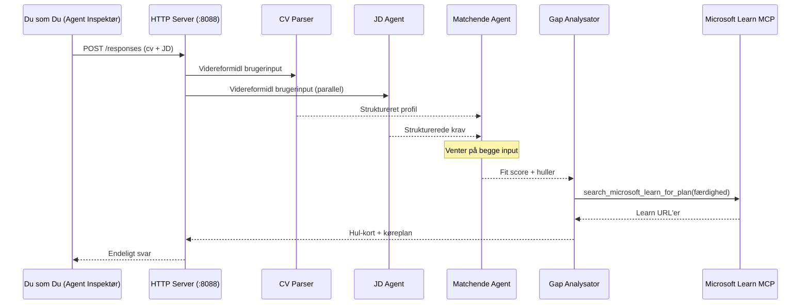
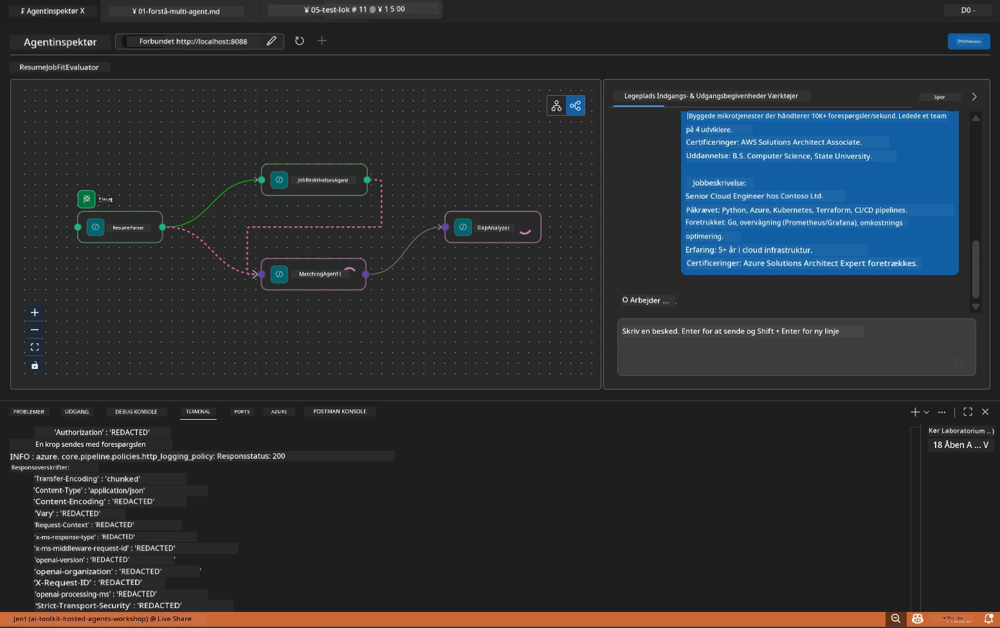

# Modul 5 - Test Lokalt (Multi-Agent)

I dette modul kører du multi-agent workflowet lokalt, tester det med Agent Inspector og verificerer, at alle fire agenter og MCP-værktøjet fungerer korrekt, inden du deployer til Foundry.

### Hvad sker der under en lokal testrun


---

## Trin 1: Start agentserveren

### Mulighed A: Brug af VS Code-opgaven (anbefalet)

1. Tryk på `Ctrl+Shift+P` → skriv **Tasks: Run Task** → vælg **Run Lab02 HTTP Server**.
2. Opgaven starter serveren med debugpy tilknyttet på port `5679` og agenten på port `8088`.
3. Vent på, at output viser:

```
INFO:resume-job-fit:Starting Resume -> Job Fit Evaluator HTTP server...
INFO:resume-job-fit:Server running on http://localhost:8088
```

### Mulighed B: Brug terminalen manuelt

```powershell
cd workshop\lab02-multi-agent\PersonalCareerCopilot
```

Aktivér det virtuelle miljø:

**PowerShell (Windows):**
```powershell
.\.venv\Scripts\Activate.ps1
```

**macOS/Linux:**
```bash
source .venv/bin/activate
```

Start serveren:

```powershell
python -m debugpy --listen 127.0.0.1:5679 -m agentdev run main.py --verbose --port 8088
```

### Mulighed C: Brug F5 (debug-tilstand)

1. Tryk på `F5` eller gå til **Run and Debug** (`Ctrl+Shift+D`).
2. Vælg **Lab02 - Multi-Agent** lanceringskonfigurationen i dropdown-menuen.
3. Serveren starter med fuld breakpoint-understøttelse.

> **Tip:** Debug-tilstand lader dig sætte breakpoints inde i `search_microsoft_learn_for_plan()` for at inspicere MCP-svar eller inde i agentinstruktionsstrenge for at se, hvad hver agent modtager.

---

## Trin 2: Åbn Agent Inspector

1. Tryk på `Ctrl+Shift+P` → skriv **Foundry Toolkit: Open Agent Inspector**.
2. Agent Inspector åbnes i en browserfane på `http://localhost:5679`.
3. Du burde kunne se agentgrænsefladen klar til at modtage beskeder.

> **Hvis Agent Inspector ikke åbner:** Sørg for, at serveren er fuldt startet (du ser "Server running" i loggen). Hvis port 5679 er optaget, se [Modul 8 - Fejlfinding](08-troubleshooting.md).

---

## Trin 3: Kør smoke tests

Kør disse tre tests i rækkefølge. Hver tester gradvist mere af workflowet.

### Test 1: Basis CV + jobbeskrivelse

Indsæt følgende i Agent Inspector:

```
Resume:
Jane Doe
Senior Software Engineer with 5 years of experience in Python, Django, and AWS.
Built microservices handling 10K+ requests/second. Led a team of 4 developers.
Certifications: AWS Solutions Architect Associate.
Education: B.S. Computer Science, State University.

Job Description:
Senior Cloud Engineer at Contoso Ltd.
Required: Python, Azure, Kubernetes, Terraform, CI/CD pipelines.
Preferred: Go, monitoring (Prometheus/Grafana), cost optimization.
Experience: 5+ years in cloud infrastructure.
Certifications: Azure Solutions Architect Expert preferred.
```

**Forventet outputstruktur:**

Svaret bør indeholde output fra alle fire agenter i rækkefølge:

1. **Resume Parser output** - Struktureret kandidatprofil med færdigheder grupperet efter kategori
2. **JD Agent output** - Strukturerede krav med skelnen mellem påkrævede og foretrukne færdigheder
3. **Matching Agent output** - Fit-score (0-100) med opdeling, matchede færdigheder, manglende færdigheder, huller
4. **Gap Analyzer output** - Individuelle gap-kort for hver manglende færdighed, hver med Microsoft Learn URLs



### Hvad skal verificeres i Test 1

| Check | Forventet | Bestået? |
|-------|-----------|----------|
| Svaret indeholder en fit-score | Nummer mellem 0-100 med opdeling | |
| Matchede færdigheder er listet | Python, CI/CD (delvist), osv. | |
| Manglende færdigheder er listet | Azure, Kubernetes, Terraform, osv. | |
| Gap-kort findes for hver manglende færdighed | Ét kort per færdighed | |
| Microsoft Learn URLs er til stede | Rigtige `learn.microsoft.com` links | |
| Ingen fejlmeddelelser i svaret | Rent struktureret output | |

### Test 2: Verificer MCP-værktøjets eksekvering

Mens Test 1 kører, tjek **serverterminalen** for MCP-logindgange:

```
GET https://learn.microsoft.com/api/mcp → 405 (Method Not Allowed)
POST https://learn.microsoft.com/api/mcp → 200
DELETE https://learn.microsoft.com/api/mcp → 405 (Method Not Allowed)
```

| Logindgang | Betydning | Forventet? |
|------------|-----------|------------|
| `GET ... → 405` | MCP-klienten prøver med GET under initialisering | Ja - normal |
| `POST ... → 200` | Faktisk kald til Microsoft Learn MCP-server | Ja - det rigtige kald |
| `DELETE ... → 405` | MCP-klienten prøver med DELETE under oprydning | Ja - normal |
| `POST ... → 4xx/5xx` | Værktøjskald fejlede | Nej - se [Fejlfinding](08-troubleshooting.md) |

> **Nøglepunkt:** Linjerne `GET 405` og `DELETE 405` er **forventet adfærd**. Bekymr dig kun, hvis `POST` kald returnerer andre statuskoder end 200.

### Test 3: Kanttilfælde - kandidat med høj fit-score

Indsæt et CV, der matcher jobbeskrivelsen tæt, for at verificere at GapAnalyzer håndterer høj-fit scenarier:

```
Resume:
Alex Chen
Senior Cloud Engineer with 7 years of experience.
Skills: Python, Azure (AKS, Functions, DevOps), Kubernetes, Terraform, CI/CD (GitHub Actions, Azure Pipelines), Go, Prometheus, Grafana, cost optimization.
Certifications: Azure Solutions Architect Expert, Azure DevOps Engineer Expert.
Led infrastructure migration to Azure for 3 enterprise clients.
Education: M.S. Computer Science, Tech University.

Job Description:
Senior Cloud Engineer at Contoso Ltd.
Required: Python, Azure, Kubernetes, Terraform, CI/CD pipelines.
Preferred: Go, monitoring (Prometheus/Grafana), cost optimization.
Experience: 5+ years in cloud infrastructure.
Certifications: Azure Solutions Architect Expert preferred.
```

**Forventet adfærd:**
- Fit-score bør være **80+** (de fleste færdigheder matcher)
- Gap-kort bør fokusere på polering/interviewforberedelse fremfor grundlæggende læring
- GapAnalyzer-instruktionerne siger: "Hvis fit >= 80, fokusér på polering/interviewforberedelse"

---

## Trin 4: Verificer outputkomplethed

Efter tests, verificer at output opfylder disse kriterier:

### Outputstruktur-tjekliste

| Sektion | Agent | Til stede? |
|---------|-------|------------|
| Kandidatprofil | Resume Parser | |
| Tekniske færdigheder (grupperet) | Resume Parser | |
| Rolleoversigt | JD Agent | |
| Påkrævede vs. foretrukne færdigheder | JD Agent | |
| Fit-score med opdeling | Matching Agent | |
| Matchede / Manglende / Delvise færdigheder | Matching Agent | |
| Gap-kort pr. manglende færdighed | Gap Analyzer | |
| Microsoft Learn URLs i gap-kort | Gap Analyzer (MCP) | |
| Læringsrækkefølge (numreret) | Gap Analyzer | |
| Tidslinjeoversigt | Gap Analyzer | |

### Almindelige problemer på dette trin

| Problem | Årsag | Løsning |
|---------|-------|---------|
| Kun 1 gap-kort (resten afskåret) | GapAnalyzer-instruktioner mangler CRITICAL-afsnit | Tilføj `CRITICAL:`-afsnittet til `GAP_ANALYZER_INSTRUCTIONS` - se [Modul 3](03-configure-agents.md) |
| Ingen Microsoft Learn URLs | MCP-endpoint ikke tilgængeligt | Tjek internetforbindelse. Verificér `MICROSOFT_LEARN_MCP_ENDPOINT` i `.env` er `https://learn.microsoft.com/api/mcp` |
| Tomt svar | `PROJECT_ENDPOINT` eller `MODEL_DEPLOYMENT_NAME` ikke sat | Tjek værdier i `.env` fil. Kør `echo $env:PROJECT_ENDPOINT` i terminal |
| Fit-score er 0 eller mangler | MatchingAgent modtog ingen upstream data | Tjek at `add_edge(resume_parser, matching_agent)` og `add_edge(jd_agent, matching_agent)` er tilføjet i `create_workflow()` |
| Agent starter men lukker med det samme | Importfejl eller manglende dependency | Kør `pip install -r requirements.txt` igen. Tjek terminal for stack traces |
| `validate_configuration` fejl | Manglende miljøvariabler | Opret `.env` med `PROJECT_ENDPOINT=<din-endpoint>` og `MODEL_DEPLOYMENT_NAME=<din-model>` |

---

## Trin 5: Test med dine egne data (valgfrit)

Prøv at indsætte dit eget CV og en rigtig jobbeskrivelse. Det hjælper med at verificere:

- At agenterne håndterer forskellige CV-formater (kronologisk, funktionelt, hybrid)
- At JD Agent håndterer forskellige JD-stilarter (punktform, afsnit, struktureret)
- At MCP-værktøjet returnerer relevante ressourcer for rigtige færdigheder
- At gap-kortene er personligt tilpasset din specifikke baggrund

> **Privatlivsnote:** Når du tester lokalt, forbliver dine data på din maskine og sendes kun til din Azure OpenAI deployment. De logges eller lagres ikke af workshop-infrastrukturen. Brug evt. pladsholdernavne (f.eks. "Jane Doe" i stedet for dit rigtige navn).

---

### Checkpoint

- [ ] Server startet succesfuldt på port `8088` (log viser "Server running")
- [ ] Agent Inspector åbnede og er forbundet til agenten
- [ ] Test 1: Komplet svar med fit-score, matchede/manglende færdigheder, gap-kort og Microsoft Learn URLs
- [ ] Test 2: MCP-logs viser `POST ... → 200` (værktøjskald lykkedes)
- [ ] Test 3: Kandidat med høj fit-score får score 80+ med poleringsfokuserede anbefalinger
- [ ] Alle gap-kort til stede (et per manglende færdighed, ingen afkortning)
- [ ] Ingen fejl eller stack traces i serverterminalen

---

**Forrige:** [04 - Orchestration Patterns](04-orchestration-patterns.md) · **Næste:** [06 - Deploy til Foundry →](06-deploy-to-foundry.md)

---

<!-- CO-OP TRANSLATOR DISCLAIMER START -->
**Ansvarsfraskrivelse**:
Dette dokument er blevet oversat ved hjælp af AI-oversættelsestjenesten [Co-op Translator](https://github.com/Azure/co-op-translator). Selvom vi bestræber os på nøjagtighed, skal du være opmærksom på, at automatiske oversættelser kan indeholde fejl eller unøjagtigheder. Det oprindelige dokument på dets modersmål bør betragtes som den autoritative kilde. For kritiske oplysninger anbefales professionel menneskelig oversættelse. Vi påtager os intet ansvar for eventuelle misforståelser eller fejltolkninger, der opstår som følge af brugen af denne oversættelse.
<!-- CO-OP TRANSLATOR DISCLAIMER END -->