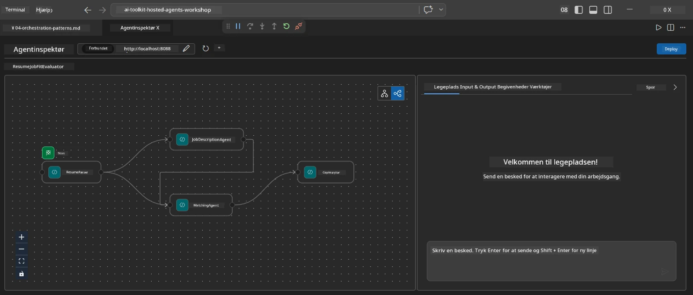
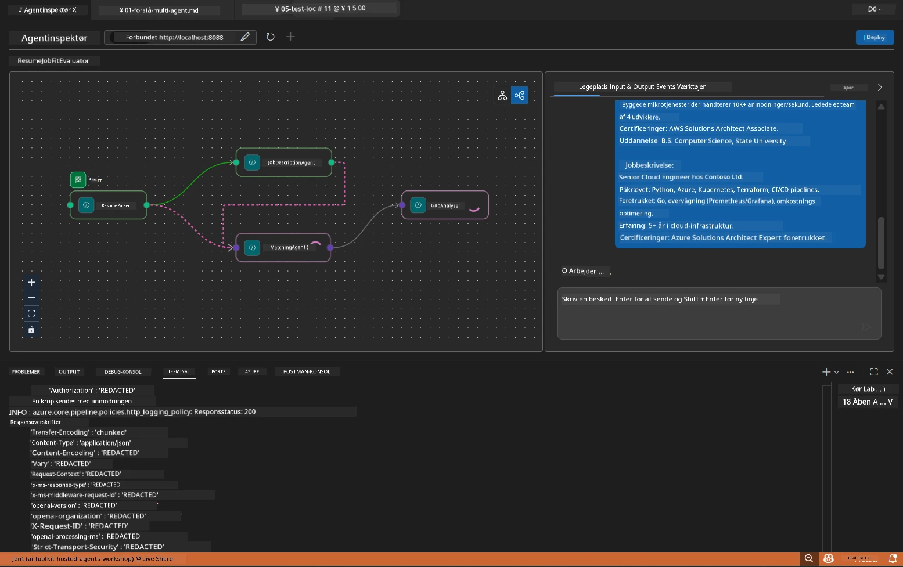
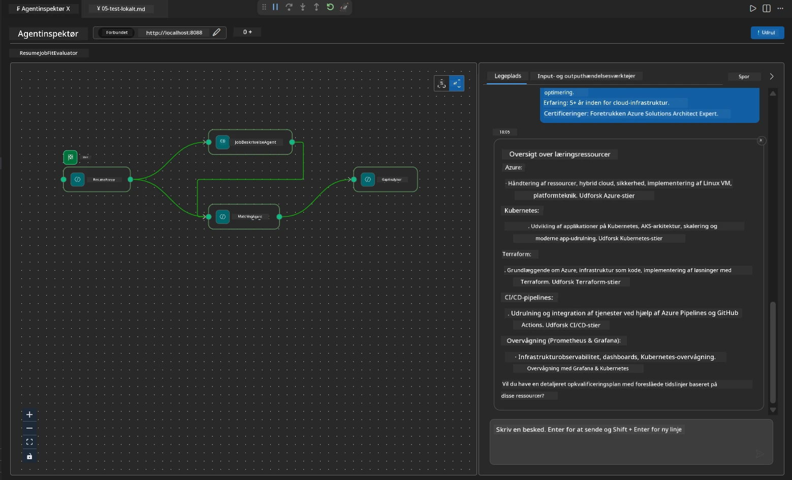

# Modul 5 - Test Lokalt

⏱️ ~15 min

I dette modul kører du multi-agent workflowet lokalt, tester det med Agent Inspector og verificerer, at alle fire agenter og MCP-værktøjet fungerer korrekt, før du deployerer.

---

## Trin 1: Start agentserveren

### Mulighed A: Brug af VS Code-opgave (anbefalet)

1. Åbn `workshop/lab02-multi-agent/PersonalCareerCopilot/` som din VS Code-mappe.
2. Tryk på `Ctrl+Shift+P` → skriv **Tasks: Run Task** → vælg **Run Agent HTTP Server**.
3. Opgaven starter serveren med debugpy tilknyttet på port `5679` og agenten på port `8088`.
4. Vent på outputtet, der viser:

```
INFO:resume-job-fit:Starting Resume -> Job Fit Evaluator HTTP server...
INFO:resume-job-fit:Server running on http://localhost:8088
```

### Mulighed B: Brug af F5 (debug-tilstand)

1. Tryk på `F5` → vælg **Debug Local Agent HTTP Server**.
2. Serveren starter med fuld breakpoint-understøttelse - nyttigt til at inspicere MCP-responser eller agentoutput.

---

## Trin 2: Åbn Agent Inspector

1. Tryk på `Ctrl+Shift+P` → skriv **Foundry Toolkit: Open Agent Inspector**.
2. Agent Inspector åbnes som et VS Code-panel forbundet til `http://localhost:8088`.
3. Du bør se agentgrænsefladen klar til at modtage beskeder.



> **Hvis Agent Inspector ikke åbner:** Sørg for, at serveren er fuldt startet (du ser loggen "Server running"). Hvis port 5679 er optaget, se [Modul 8 - Fejlfinding](08-troubleshooting.md).

---

## Trin 2b: (Valgfrit) Åbn Workflow Visualizer

Foundry Toolkit inkluderer en realtids **Workflow Visualizer**, der viser, hvordan agenter interagerer, mens grafen kører. Dette er særligt nyttigt til multi-agent fejlsøgning.

1. Tryk på `Ctrl+Shift+P` → skriv **Foundry Toolkit: Open Visualizer for Hosted Agents**.
2. En ny VS Code-fane åbnes, der viser den live udførelsesgraf.
3. Når du sender beskeder i Agent Inspector, opdaterer visualizeren automatisk - grønne noder indikerer færdiggjorte agenter, og animerede kanter viser dataflow mellem dem.

> **Portkonflikt:** Hvis visualizer-porten allerede er i brug, ændr den i VS Code-indstillinger → **Extensions** → **Microsoft Foundry Configuration** → **Hosted Agents: Visualizer Port**.

---

## Trin 3: Kør smoke tests

Kør disse tre tests i rækkefølge. Hver tester successivt mere af workflowet.

### Test 1: Grundlæggende CV + jobbeskrivelse

Indsæt følgende i Agent Inspector:

```
Resume:
Jane Doe
Senior Software Engineer with 5 years of experience in Python, Django, and AWS.
Built microservices handling 10K+ requests/second. Led a team of 4 developers.
Certifications: AWS Solutions Architect Associate.
Education: B.S. Computer Science, State University.

Job Description:
Senior Cloud Engineer at Contoso Ltd.
Required: Python, Azure, Kubernetes, Terraform, CI/CD pipelines.
Preferred: Go, monitoring (Prometheus/Grafana), cost optimization.
Experience: 5+ years in cloud infrastructure.
Certifications: Azure Solutions Architect Expert preferred.
```

**Forventet outputstruktur:**

Responsen bør indeholde output fra alle fire agenter i rækkefølge:

1. **Resume Parser output** - To mærkede afsnit: `[PARSED RESUME]` (kandidatprofil med grupperede færdigheder) og `[JOB DESCRIPTION PASS-THROUGH]` (ordret JD-tekst, der føder JD-Agenten)
2. **JD Agent output** - Strukturerede krav med adskillelse af påkrævede vs. foretrukne færdigheder
3. **Matching Agent output** - Matchscore (0-100) med opdeling, matchede færdigheder, manglende færdigheder, huller
4. **Gap Analyzer output** - Individuelle hul-kort for hver manglende færdighed, hver med Microsoft Learn URL'er





### Hvad skal verificeres i Test 1

| Tjek | Forventet | Godkendt? |
|-------|----------|-----------|
| Respons indeholder en matchscore | Tal mellem 0-100 med opdeling | |
| Matchede færdigheder er listet | Python, CI/CD (delvist), osv. | |
| Manglende færdigheder er listet | Azure, Kubernetes, Terraform, osv. | |
| Hulkort findes for hver manglende færdighed | Ét kort per færdighed | |
| Microsoft Learn URL'er er til stede | Ægte `learn.microsoft.com` links | |
| Ingen fejlbeskeder i responsen | Rent struktureret output | |

### Test 2: Grænsetilfælde - kandidat med højt match

Indsæt et CV, der matcher JD tæt for at verificere, at GapAnalyzer håndterer scenarier med højt match:

```
Resume:
Alex Chen
Senior Cloud Engineer with 7 years of experience.
Skills: Python, Azure (AKS, Functions, DevOps), Kubernetes, Terraform, CI/CD (GitHub Actions, Azure Pipelines), Go, Prometheus, Grafana, cost optimization.
Certifications: Azure Solutions Architect Expert, Azure DevOps Engineer Expert.
Led infrastructure migration to Azure for 3 enterprise clients.
Education: M.S. Computer Science, Tech University.

Job Description:
Senior Cloud Engineer at Contoso Ltd.
Required: Python, Azure, Kubernetes, Terraform, CI/CD pipelines.
Preferred: Go, monitoring (Prometheus/Grafana), cost optimization.
Experience: 5+ years in cloud infrastructure.
Certifications: Azure Solutions Architect Expert preferred.
```

**Forventet adfærd:**
- Matchscore bør være **80+** (flertallet af færdigheder matcher)
- Hulkort bør fokusere på polering/interviewforberedelse fremfor grundlæggende læring
- GapAnalyzer-vejledningen siger: "Hvis match >= 80, fokus på polering/interviewforberedelse"

---

## Trin 4: Test med egne data (valgfrit)

Prøv at indsætte dit eget CV og en reel jobbeskrivelse. Dette hjælper med at verificere:

- Agenterne håndterer forskellige CV-formater (kronologisk, funktionelt, hybrid)
- JD Agent håndterer forskellige JD-stilarter (punktform, afsnit, struktureret)
- MCP-værktøjet returnerer relevante ressourcer for reelle færdigheder
- Hulkortene er personaliserede til din specifikke baggrund

> **Privatliv - Sti A (Foundry cloud):** CV og JD-tekst sendes til din Azure OpenAI deployment til inferens. Det logges eller gemmes ikke af workshopinfrastrukturen. Brug pladsholdernavne (f.eks. "Jane Doe"), hvis du foretrækker det.
>
> **Privatliv - Sti B (Foundry Local):** Alle fire agentinferenser kører udelukkende på din enhed. Dit CV- og jobbeskrivelsestekst **forlader aldrig din maskine**. Det eneste udgående kald er MCP-værktøjet, der henter ressourcer fra `https://learn.microsoft.com/api/mcp`; den forespørgsel indeholder kun færdighedens navn, ikke dine personlige oplysninger.

---

### Tjekliste

- [ ] Serveren er startet succesfuldt på port `8088` (log viser "Server running")
- [ ] Agent Inspector er åbnet og forbundet til agenten
- [ ] Test 1: Fuld respons med matchscore, matchede/manglende færdigheder, hulkort og Microsoft Learn URL'er
- [ ] Test 2: Kandidat med højt match får score 80+ med polerede anbefalinger
- [ ] Alle hulkort er til stede (ét per manglende færdighed, intet afkortet)
- [ ] Ingen fejl eller stacktraces i serverterminalen

---

**Forrige:** [04 - Orchestreringsmønstre](04-orchestration-patterns.md) · **Næste:** [06 - Deploy til Foundry →](06-deploy-to-foundry.md)

---

<!-- CO-OP TRANSLATOR DISCLAIMER START -->
**Ansvarsfraskrivelse**:
Dette dokument er blevet oversat ved hjælp af AI-oversættelsestjenesten [Co-op Translator](https://github.com/Azure/co-op-translator). Selvom vi bestræber os på nøjagtighed, skal du være opmærksom på, at automatiserede oversættelser kan indeholde fejl eller unøjagtigheder. Det originale dokument på dets oprindelige sprog bør betragtes som den autoritative kilde. For kritisk information anbefales professionel menneskelig oversættelse. Vi påtager os intet ansvar for misforståelser eller fejltolkninger, der opstår som følge af brugen af denne oversættelse.
<!-- CO-OP TRANSLATOR DISCLAIMER END -->